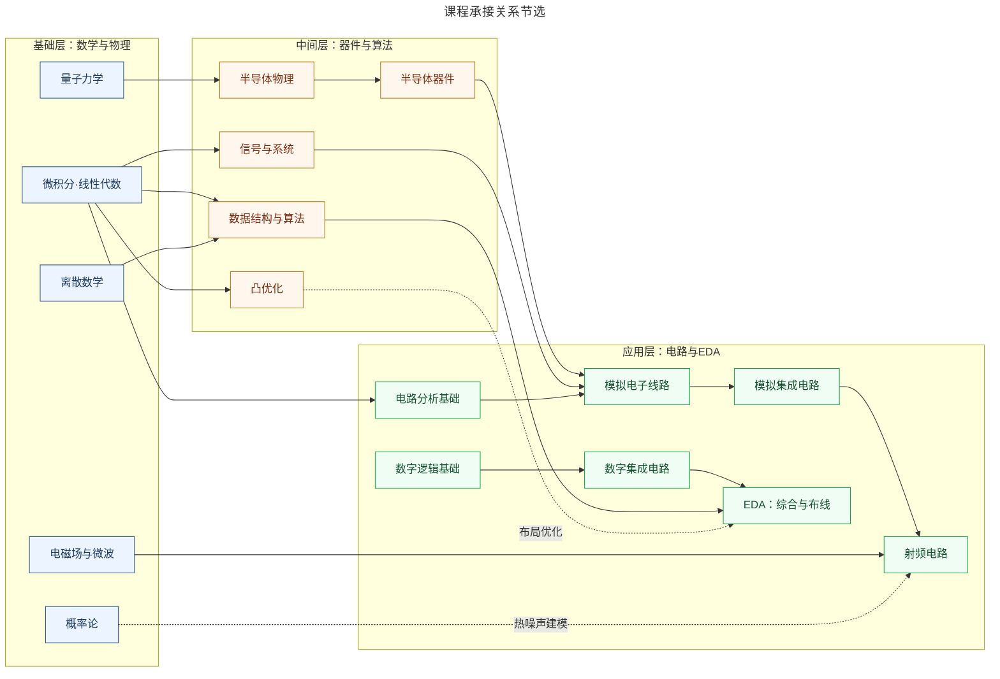
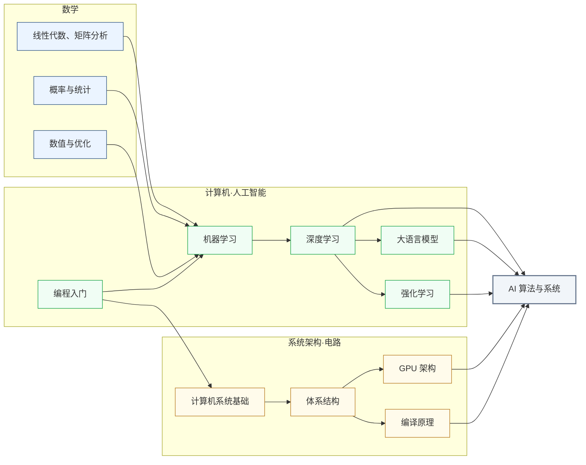

---
hide:
  - navigation
---
<!-- ══════════════ DAY MODE HERO (default only) ══════════════ -->

IC 自学指南 · by 复旦 & 清华

<h1 class="df-lhl">让知识 回归连续</h1>

“可上九天揽月，可下五洋捉鳖。”覆盖 17 个前沿科研方向与 200 余门精选课程，集成电路/微电子专业自学指南。

<a href="科研方向/" class="df-lbp">探索科研方向 →</a>
<a href="学习地图/" class="df-lbg-btn">学习地图</a>

<nav class="df-lnav">

<a href="工程工具/" class="df-lnc">01工程工具Git · LaTeX · Docker</a>
<a href="专题社区/" class="df-lnc">02专题社区一生一芯 · 香山 · iEDA</a>
<a href="https://github.com/Crys-Chen/ic-guide" class="df-lnc" target="_blank" rel="noopener">03参与建设Make IC Great Again</a>
<a href="后记/" class="df-lnc">04后记这人还想叨叨两句</a>

</nav>

<a class="df-scroll" href="#_1">序言↓</a>

## 前言

这是一份集成电路/微电子自学指南，它适合以下朋友：

- 集成电路等硬件相关专业的同学
- 想做架构与系统研究，需要补充硬件底层知识的计算机同学
- 计划进组做科研或准备申请，但不知道有哪些方向与课题组的同学
- 需要查漏补缺的高年级科研人员
- 做行业研究、想摸清硬件行业脉络的经管同学
- 留学与升学辅导从业者

以下是本网站的介绍。

### 微电子是一种处境

当初选择就读复旦微电子时，我并不知道微电子到底在学什么。这几年来在围城里爱过、恨过、挣扎过、出走过，如今竟与它和解了。

 

微电子科学与工程（Microelectronics, ME），或称集成电路（Integrated Circuits, IC），是一门理工结合、多学科交叉的专业，它横跨材料、物理、化学、计算机等多个领域，是工科里难度系数最高的专业之一。在大多数欧美高校，它并非一个独立的院系或专业，而只是电子工程（EE）或电子与计算机工程（ECE）底下的一个小分支。近十年，内地高校为响应国家号召，才相继把它立成一级学科，向本科生敞开。

我们就是在这样的背景下选择了该专业。本科上来就学这种交叉学科，好处是节省时间，不必学相关学科中不相关的内容；坏处是容易什么都学，但什么都不精。诚然，本科应当追求广度而非深度。但现实中微电子培养方案里各门课程相距太远，每门课都是一个孤立的结点，给人一种“**碎而不广**”的感觉。以复旦微电子 2021 级的培养方案为例，除了编程以外，我们从计算机那边就只摘了一门《数据结构与算法》过来，但这门课和集成电路主干之间隔着《操作系统》《编译原理》两门课。此外，现有培养方案往往只涉及各领域的几门高阶课，对基础课缺乏提炼，让它们成了**空中楼阁**。以《集成电路工艺》为例，它涉及的化学知识非常多，可惜化学这门学科我们高考后就再没碰过，上课像听天书。

不仅是课程设置存在断层，师资的调配也加剧了这种脱节。不同课程由不同教授独立开设，学院很难将这些以科研为重心的老师们聚到一起来打磨课程间的衔接。这就导致不同课程之间要么叠床架屋，要么留着巨大的 gap 让学生自行跨越。在复旦微电上课，有点像刷短视频，一会上这个，一会上那个，一会又把同样的东西刷一遍，这导致通过线下上课学知识这件事情的性价比变得很低。

所幸，我们的学院一直在努力改善大家的上课体验。对比21级和25级的培养方案，我们可以发现改革的趋势非常明朗。作为地基的核心必修基本保留，而进阶课程的整体风格则从原本零碎的按工序拼凑，变成了以前沿需求为导向。这种改革方向，和本网站的初衷不谋而合。

|  | [2021 级](学习地图/复旦微电子课程表.md) | [2025 级](学习地图/复旦集成电路课程表.md) |
|---|---|---|
| 进阶路径 | 按工序分 工艺器件 设计方法 芯片集成测试 | 按前沿模块分 新算力 新制造 芯粒集成 |
| 课程总数 | 70 余门 | 90 余门 |
| AI 相关课 | 几乎没有 | 增设诸多 AI 课程 |

然而，理想与现实之间依然存在着落差。我们的培养方案里存在许多“假课”——它们要么在现实中根本不开设，要么隔几个学期诈尸一下。这点相信复旦微电这几届同学都深有同感。我本科四年一直想选修《存储器电路设计导论》，但这门课两年才开一次，开课时又恰好与我的核心必修课时间冲突，导致我最终也未能如愿。根据学弟学妹反映，这种“阴阳课表”的现象至今依然严重。想学的知识学不到，这是一件挺难受的事情。只能说学校和学院的出发点是好的，就是不知道出发了没有。改革总是“文件先行”，这可以理解。相信我们学院未来一定会逐步落实。只不过对于身处系统之中的个体而言，与其守株待兔，不如主动出击。所以我们有了这样一个网站。

这个网站要回应的核心问题是：面对集成电路这样一门浩如烟海的学科，和当前这套相对碎片化、缺乏有机衔接的培养体系，我们到底应该如何搭建起自己的知识体系呢？我想无外乎两条路径：一是**自底向上**，理清各领域知识的具体内容和承接关系，将零散的课程连点成线，从而构筑出清晰的知识谱系；二是**自顶向下**，从最前沿的科研与产业方向出发，倒推所需的知识路径。

这个网站在做的，便是两端架桥。以「[学习地图](学习地图/index.md)」作为自底向上的阶梯，用「[科研方向](科研方向/index.md)」作为自顶向下的灯塔。希望这两者的结合，能够帮助大家更快地走出迷茫，定制自己的学习路径。

### 让知识回归连续

集成电路包罗万象，皓首穷经地把所有知识全盘吸收，既不可能也没必要。比起盲目追求知识的覆盖率，我们首先要保证的，是**知识的连续性**。选定一个小领域，以点带面地织网，建立核心壁垒；对边缘的知识领域则“但当涉猎，见往事耳”。这样既能轻松地具备专业纵深，又能保证本科阶段应有的全局视野。

「[学习地图](学习地图/index.md)」首先要解决的问题，便是同学们感受到的那种“碎而不广”的断裂感。

培养方案提供的只是孤立的节点，有哪些课，每门课几个学分。但节点之间的承接关系是隐形的。这门课需要哪些前置的知识储备？学完又能解锁哪些更高阶的课程？这些往往需要我们自己去苦苦思索，或者依靠一届届学生的口口相传。「[学习地图](学习地图/index.md)」则力图打破这种孤立，将散落在各处的知识领域按承接关系组织起来，把本专业的相关知识编织成一张细密的网，构建一个完备的知识体系。高年级同学可以按图索骥、查漏补缺；低年级同学也可以将其作为选课参考。

其次，「[学习地图](学习地图/index.md)」致力于填补“想学却学不到”的资源空白。

在优质网课与 LLM 蔚然成风的当下，这早已不再是不可逾越的鸿沟。尽管内地几百所高校或许凑不出一门令人满意的线性代数，但 MIT 早就将 [Gilbert Strang 教授的经典神课](学习地图/数学/代数/线性代数/MIT_18.06.md)公之于众；尽管集成电路的开源论坛远不如计算机领域活跃，但有了 AI 的加持，什么傻瓜问题都能得到耐心的解答。如今，绝大部分知识链都可以用公开资源拼出来。

因此，除了复旦培养方案内的课程，「[学习地图](学习地图/index.md)」还力求系统性地收录全球优质的公开网课与其他学习资源，横跨微电子相关的七大板块，覆盖了 200 余门课程。这些学习资源来自许多同学的提供和推荐，因此在某种意义上，<u>这是我们学生自主创办、用爱发电的一所“赛博大学”。</u>

### 让信息回归透明

刚入学时，一位学长对我说：”微电子，本科打基础，硕士算入门，博士顶多叫略懂。”对口工作机会少，大多数人都要读研深造。本科升学之前想清楚自己是否适合做科研、对哪个方向感兴趣，就显得格外重要。现在不少同学大一大二就涌进了实验室，这当然不是坏事。但要做出可靠的判断，前提还是得先看清大盘：<u>集成电路一共有哪些细分方向？每个方向具体在干什么？是否有更适合我的方向？</u>但这恰恰是本科生最难获取的信息。原因有三：

1. **“只见树木，不见森林”**：这门学科本身太过艰深，本科生刚入门就一头扎进某个细分课题，容易要么在一棵树上吊死，钻进死胡同出不来；要么浅尝辄止，误把一个狭窄方向的体验当成了整个学术界的全貌。

2. **“欲济无舟楫”**：课题组的老师未必有时间精力将一个本科生真正领进门，而负责带教的学长学姐，有时甚至也未必清楚自己在干嘛。

3. **”独学而无友”**：微电子圈没有计算机圈那种浓厚的开源与分享氛围，网络上的干货信息极其匮乏。整个学术圈对本科生来说就像一座密不透风的堡垒，大家始终是门外汉，连门朝哪开都不知道。

这个网站所能做的，就是努力在这座堡垒的墙上凿开一个透光的口子。我自己梳理了一下，微电子相关的科研方向大约有 17 个。这几年我东一榔头西一棒槌地摸了一圈，总算积累了一点系统性的认知。比起教学相长，我更喜欢用写作来巩固自己的认知，所以积累了很多笔记。如今我本科即将毕业，我将这些笔记系统整理后放在了「[科研方向](科研方向/index.md)」这个版块中，尽力勾勒出一个较为完整的学术谱系，希望能帮大家拨开迷雾。

如果屏幕前的你还是一名科研小白，那可以直接阅读《[科研方向巡礼](科研方向/index.md#巡礼)》这一篇，它对这 17 个科研方向做了提纲挈领式的综述。找到感兴趣的方向后，再点击进入细分页面，你就能看到该方向的具体研究内容、有哪些课题组和企业、以及最重要的“自顶向下”——需要哪些知识储备。

以 **[AI 算法与系统](科研方向/AI算法与系统.md)** 为例，这个方向需要的知识前置大致如上图所示。有了它以后，想往这个方向发展的同学，就可以在日常学习中有所侧重。

我当年探索时，没有这样一份地图。希望现在这个网站可以让大家不必再走太多弯路，也可以减少一些低效内卷。

我走到哪，就把路铺到哪。

### 倘若我不想学微电了

我不希望这个网站让大家陷入 FOMO（错失恐惧），但可能类似的问题还是会被问出来：

<u>在最终 settle down 之前，到底探索多少个方向比较合适？</u>

人生道路的选择，永远是"不完全信息决策"。就像我们没法把天底下所有符合性取向的人都见一遍再拍拖，我们不可能把集成电路的十几个方向全试个遍再选一个托付终身，自当是“弱水三千，只取一瓢”。也许这一个最好，也许下一个更好。这其实不是什么值得纠结的事情。人如果真的遇到了命定的人和事，会有感召的。它需要的不是广撒网，而是一点机遇，一点火花，一点耐心，以及关键时刻那"信仰的一跃"。

真正重要的问题是，<u>如果一直没有机遇，没有火花，那是不是说明微电并不适合我？</u>

我必须承认，作为“IC 自学指南”，这个网站的宗旨，是提供在这个专业行稳致远的必要信息，以及帮助大家在选定一个方向后"眼观六路，耳听八方"。它所缺失的，是为大家指明一条退出路径。

所以接下来这段话，专门留给想要离开微电的同学。

致离开微电的你

也许你的感受是对的。

微电子/集成电路这个专业，其实也就那样。对我来说，它在微观上就像打一场游戏，边界清晰，规则明确，给一个目标，让我在设计空间里辗转腾挪，就能找到最优解。在论文提交的那一刻会有“须臾收卷复把酒，如见万里烟尘清”的感觉，但这一切从宏观来看，不过尔尔。“自细视大者不尽，自大视细者甚微。”这世上还有很多硅片无法承载，算力无法丈量的事物。星穹的边界，生命的幽微，人心的浮动，兴衰的规律......随便哪一个，都可能比微电更值得你托付一生。

这个专业只是你高考后误打误撞掉入的一个坑，外面的还有很大的一个世界。

但我也不想只是端鸡汤。当你刚跳出这个圈子时，或许会顿觉天地宽广；也有可能折腾一圈后发现，自己不过是在泰坦尼克号上从一个座位换到了另一个座位。可话说回来，当年把你放进微电的，又何尝是什么深思熟虑的选择？若非大洋彼岸的大统领在 2018 年突然挥起贸易大棒，若非大模型的兴起引发了全社会的算力焦虑，这个专业可能至今仍鲜有人烟，你我也不会被这波扩招的浪潮所裹挟。我们都像高尔顿板里的小球，落进哪个槽，多半取决于时代的扰动与个体的随机碰撞。活在当下，谁人不是“身世浮沉雨打萍”？

当初怎么进来，由不得你；但这一次怎么离开，可以全由你自己。

由于定位原因，这个网站给不了你太多，但兴许还能给你一种知情后的释然。

你走了之后，某一天回头，也许会有一个放不下的念想：“倘若当年再坚持一下，会不会不一样？”

现在完整的地图就在这里。当你浏览一遍后，能平静地说：“这里确实没有让我感兴趣的东西。”

那么相信此时你的转身，是不留遗憾的；你关上门的样子，一定很潇洒。

你不用再纠结路怎么选了，你走在哪，哪里就是路。

### Let's Make IC Great Again

最后，要特别致敬北京大学的 [CS 自学指南](https://github.com/pkuflyingpig/cs-self-learning/)。这个网站最初的灵感和底层框架都源自这个开源仓库。其中部分课程页也直接沿用了原仓库的优质内容。某种程度上，「IC 自学指南」就是在它的开源精神感召下诞生的“硬件孪生版”。

我做这个网站时，得到了很多同学的支持和响应。正如刚刚前文所说，<u>这个网站，在某种意义上是我们学生自主创办、用爱发电的一所“赛博大学”。</u>

如今，这所大学还远没有达到完备。

我本人做体系结构方向，相关领域的介绍最有把握。部分方向则是为了追求初期的完整性，只是结合一些讲座和调研的笔记，在 AI 辅助下，经多轮核实后写就的，有滥竽充数之嫌，权当抛砖引玉。教授信息同理，部分经 AI 检索生成，未必全面可靠。「[学习地图](学习地图/index.md)」里也还有不少空缺，毕竟我充其量只是对前沿科研方向有所涉猎，不可能把所有课程都上一遍。

所以，如果你恰好在这个浩瀚学科的某个角落里深耕，如果你也认同这份开源的诚意，欢迎点击导航栏的「[参与建设](参与建设.md)」，在这个网站留下你的一份智慧。

Let's make IC great again!

---

喜欢请给个 [Star](https://github.com/Crys-Chen/ic-guide)，更多资讯请关注微信公众号和小红书：

 <small>微信公众号</small>

 <small>小红书</small>

