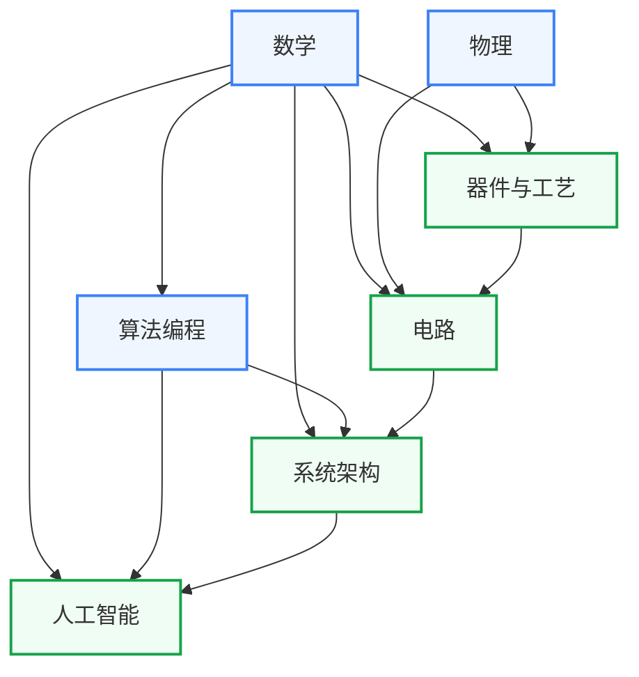
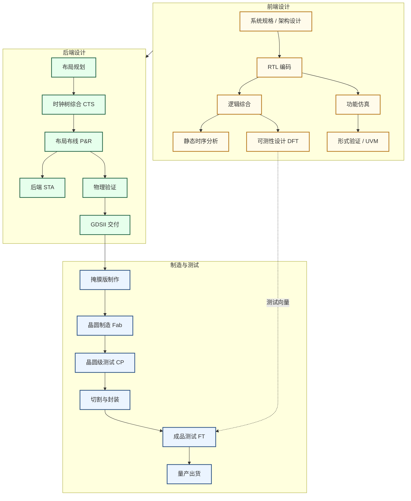

# 学习地图

学习地图从培养方案出发，按知识领域分为七个板块，每个板块给出可自学的课程直链。与「科研方向」配合使用。科研方向页说明做某个方向需要哪些知识，这里给出对应的课程和学习顺序。

## 七大板块

| 板块 | 定位 |
|---|---|
| [数学](数学/index.md) | 微积分到凸优化，信号处理、机器学习、EDA算法的数学基础 |
| [物理](物理/index.md) | 量子力学到半导体物理，器件研究和模拟电路的物理前置 |
| [器件与工艺](器件与工艺/index.md) | 晶体管原理与IC制造工艺，IC设计物理约束的来源 |
| [电路](电路/index.md) | 数字设计、模拟与射频、信号处理三条路线，从逻辑门到射频集成电路 |
| [系统架构](系统架构/index.md) | 体系结构、操作系统、编译原理，AI系统和处理器设计研究的软件侧知识 |
| [算法编程](算法编程/index.md) | 程序设计、数据结构与算法，EDA工具开发和AI框架的编程基础 |
| [人工智能](人工智能/index.md) | 机器学习到大模型系统，AI算法与AI芯片协同设计的知识库 |

复旦课表参考：[2021年课程表](复旦微电子课程表.md) · [2026年课程表](复旦集成电路课程表.md)

!!! note "说明"

    这个仓库尽量为每门课程都提供了中英文版本的课程，但以我个人的力量，难以做到尽善尽美，难免有所疏漏。欢迎大家批评指正。

    另外，如你所见，现在这份学习地图里面有很多复旦的课程，而且很多课程仅对复旦校内开放（都怪复旦的信息化建设不好）。这主要是因为这个仓库最开始由复旦的同学维护，在初期主要服务复旦的同学，所以在这里开设了一个第三方的评教与笔记分享平台。但这只是暂时的，期待后面有更多学校的同学加入分享。

    注：请各位同学尊重老师的知识产权，如若老师没有主动分享课程资源到公网，那大家在分享前请先征得老师同意。至于往年试题......还是私下流传吧。

## 板块间的依赖关系

箭头从前置板块指向后置板块，表示学习后者通常需要先有前者的基础。

数学是除物理以外所有板块的共同基础。物理→器件与工艺→电路构成器件和模拟方向的纵向路径。算法编程→系统架构→人工智能构成数字和AI方向的纵向路径。电路也是系统架构的前置，理解时序、总线、存储层次需要有数字电路的基础。

## 芯片生产流程

下图展示数字 IC 从 RTL 设计到晶圆量产的完整链条，供理解各板块知识在工业流程中的位置参考。模拟/射频 IC 走原理图→版图→后仿路线，流程不同。

## 待补充版块

欢迎补充！推荐方式详见「[参与建设](../参与建设.md)」。

### 完全空白的分区

- 电路 → [控制与机器人](电路/控制与机器人/index.md)
- 电路 → [生物电子](电路/生物电子/index.md)
- 电路 → [数字验证](电路/数字设计/数字验证/index.md)
- 电路 → [功率电子](电路/模拟与射频/功率电子/index.md)
- 人工智能 → [类脑与 SNN](人工智能/类脑与SNN/index.md)

### 骨架课程页

目前有 80 余个课程页只有占位骨架，没有简介、难度评价和学习资源。修过这些课的同学欢迎补全。

器件与工艺（24 个）

- 材料：[复旦：半导体材料](器件与工艺/材料/FDU_ICSE20003.md)
- 材料：[复旦：有机微电子技术](器件与工艺/材料/FDU_ICSE40011.md)
- 材料：[复旦：电子材料薄膜测试表征方法](器件与工艺/材料/FDU_ICSE40017.md)
- 材料：[复旦：材料科学导论](器件与工艺/材料/FDU_MASE20002.md)
- 材料：[复旦：电子材料分析](器件与工艺/材料/FDU_MASE30015.md)
- 材料：[复旦：薄膜技术](器件与工艺/材料/FDU_MASE30019.md)
- 材料：[复旦：材料分析](器件与工艺/材料/FDU_MASE30023.md)
- 集成电路工艺：[复旦：集成电路制造仿真模拟原理和应用](器件与工艺/集成电路工艺/FDU_ICSE30014.md)
- 集成电路工艺：[复旦：现代集成电路光刻技术导论](器件与工艺/集成电路工艺/FDU_ICSE30032.md)
- 集成电路工艺：[复旦：集成电路纳米技术](器件与工艺/集成电路工艺/FDU_ICSE40003.md)
- 集成电路工艺：[复旦：先进集成电路工艺技术](器件与工艺/集成电路工艺/FDU_ICSE40016.md)
- 存储器：[复旦：存储器技术](器件与工艺/存储器/FDU_ICSE30005.md)
- 存储器：[复旦：闪存（FLASH）存储器技术与设计实现](器件与工艺/存储器/FDU_ICSE30024.md)
- 存储器：[复旦：存储器电路设计导论](器件与工艺/存储器/FDU_ICSE30025.md)
- 前沿器件：[复旦：新型微纳器件概论](器件与工艺/前沿器件/FDU_ICSE30012.md)
- 前沿器件：[复旦：半导体表面与界面](器件与工艺/前沿器件/FDU_ICSE30029.md)
- 前沿器件：[复旦：超低功耗半导体器件](器件与工艺/前沿器件/FDU_ICSE30031.md)
- 先进封装：[复旦：微电子封装材料及工艺](器件与工艺/先进封装/FDU_ICSE30013.md)
- 先进封装：[复旦：集成电路封装与测试](器件与工艺/先进封装/FDU_ICSE40004.md)
- 先进封装：[复旦：先进封装](器件与工艺/先进封装/FDU_ICSE40006.md)
- 半导体器件：[复旦：半导体器件原理](器件与工艺/半导体器件/FDU_MICR130006.md)
- 功率半导体器件：[复旦：特色工艺与功率半导体技术](器件与工艺/功率半导体器件/FDU_ICSE20012.md)
- MEMS：[复旦：传感器原理及应用](器件与工艺/MEMS/FDU_ICSE30023.md)
- MEMS：[复旦：微机电系统应用](器件与工艺/MEMS/FDU_ICSE40015.md)

电路（24 个）

- EDA：[复旦：器件模型与SPICE仿真](电路/EDA/FDU_ICSE30002.md)
- EDA：[复旦：模拟集成电路设计自动化基础](电路/EDA/FDU_ICSE30018.md)
- EDA：[复旦：数字集成电路设计自动化基础](电路/EDA/FDU_ICSE30019.md)
- EDA：[复旦：超大规模集成电路物理设计中的数学方法](电路/EDA/FDU_ICSE30026.md)
- EDA：[复旦：EDA系统软件分析和设计方法学](电路/EDA/FDU_ICSE30028.md)
- 电路实验：[复旦：模拟与数字电路实验](电路/电路实验/FDU_EST40012.md)
- 电路实验：[复旦：集成电路实验(上)](电路/电路实验/FDU_ICSE40008.md)
- 电路实验：[复旦：集成电路实验(下)](电路/电路实验/FDU_ICSE40009.md)
- 电路实验：[复旦：集成电路设计实验](电路/电路实验/FDU_ICSE40014.md)
- 测试与可靠性：[复旦：模拟电路测试原理](电路/测试与可靠性/FDU_ICSE30003.md)
- 测试与可靠性：[复旦：模拟测试原理与电路设计](电路/测试与可靠性/FDU_ICSE30033.md)
- 测试与可靠性：[复旦：射频微波测试基础](电路/测试与可靠性/FDU_ICSE40010.md)
- 测试与可靠性：[复旦：器件可靠性原理与测试](电路/测试与可靠性/FDU_ICSE50008.md)
- 信号处理：[复旦：模拟信号处理](电路/信号处理/FDU_ICSE30030.md)
- 模拟与射频/射频电路：[复旦：高频电子线路A](电路/模拟与射频/射频电路/FDU_ICSE20001.md)
- 模拟与射频/版图设计：[复旦：集成电路版图设计基础](电路/模拟与射频/版图设计/FDU_ICSE20015.md)
- 模拟与射频/模拟电子线路：[Razavi Electronics 2（UCLA）](电路/模拟与射频/模拟电子线路/razavi_e2.md)
- 数字设计/ASIC与数字后端：[复旦：数字电路逻辑综合及描述方法概论](电路/数字设计/ASIC与数字后端/FDU_ICSE20016.md)
- 数字设计/ASIC与数字后端：[NPTEL：Synthesis of Digital Systems](电路/数字设计/ASIC与数字后端/NPTEL_synthesis.md)
- 数字设计/HDL：[复旦：集成电路高级硬件描述语言](电路/数字设计/HDL/FDU_ICSE30027.md)
- 数字设计/HDL/HLS：[高亚军：跟 Xilinx SAE 学 HLS](电路/数字设计/HDL/HLS/gaoyajun_hls.md)
- 数字设计/HDL/HLS：[HLS Programming with FPGAs（Lehigh）](电路/数字设计/HDL/HLS/Lehigh_hls.md)
- 数字设计/低功耗设计：[复旦：超低功耗集成电路设计](电路/数字设计/低功耗设计/FDU_ICSE40005.md)

人工智能（11 个）

- AI交叉应用：[复旦：自动驾驶人工智能原理与实践](人工智能/AI交叉应用/FDU_AIT410017.md)
- AI交叉应用：[复旦：人工智能的计算机软件基础](人工智能/AI交叉应用/FDU_EST30001.md)
- AI交叉应用：[复旦：AI半导体制造工艺](人工智能/AI交叉应用/FDU_ICSE30035.md)
- AI交叉应用：[复旦：人工智能算法在EDA的应用](人工智能/AI交叉应用/FDU_ICSE40019.md)
- 机器学习理论：[CMU 10-708: Probabilistic Graphical Models](人工智能/机器学习理论/CMU_10-708.md)
- 机器学习理论：[Stanford CS229M: Machine Learning Theory](人工智能/机器学习理论/Stanford_CS229M.md)
- 入门速成：[复旦：人工智能导论](人工智能/入门速成/FDU_EST10001.md)
- 入门速成：[浙大 吴飞：人工智能：模型与算法](人工智能/入门速成/ZJU_wufei_AI.md)
- 深度学习：[李沐：动手学深度学习 v2](人工智能/深度学习/limu_d2l.md)
- 机器学习：[复旦：机器学习算法](人工智能/机器学习/FDU_ICSE30001.md)
- 大语言模型：[复旦：自然语言处理与大语言模型算法](人工智能/大语言模型/FDU_EST20001.md)

系统架构（7 个）

- AI加速器：[复旦：AI专用芯片设计](系统架构/AI加速器/FDU_ICSE30036.md)
- AI加速器：[复旦：AI专用处理器架构设计方法](系统架构/AI加速器/FDU_ICSE40002.md)
- AI加速器：[复旦：基于FPGA的人工智能算法加速及应用](系统架构/AI加速器/FDU_ICSE40018.md)
- GPU体系结构：[NPTEL：GPU Architectures and Programming](系统架构/GPU体系结构/NPTEL_GPU.md)
- GPU体系结构：[ZOMI 酱：GPU 架构原理系列](系统架构/GPU体系结构/ZOMI_GPU.md)
- 并行与分布式系统：[双笙子佯谬：高性能并行编程与优化](系统架构/并行与分布式系统/parallel101.md)
- 并行与分布式系统：[中科大：并行计算（国家精品）](系统架构/并行与分布式系统/USTC_parallel.md)

算法编程（8 个）

- 编程入门：[复旦：程序设计](算法编程/编程入门/FDU_CS10004.md)
- 编程入门：[复旦：Perl语言入门和提高](算法编程/编程入门/FDU_ICSE20002.md)
- 编程入门：[复旦：计算机软件基础](算法编程/编程入门/FDU_ICSE20014.md)
- 编程入门/C：[北大 郭炜：程序设计与算法（一）C语言](算法编程/编程入门/C/PKU_guowei_C.md)
- 编程入门/C：[浙大 翁恺：C语言程序设计](算法编程/编程入门/C/ZJU_wengkai.md)
- 编程入门/Python：[北大 陈斌：数据结构与算法 Python 版](算法编程/编程入门/Python/PKU_chenbin_python.md)
- 编程入门/Rust：[令狐壹冲：Rust 编程视频教程](算法编程/编程入门/Rust/linghu_rust.md)
- 编程入门/Rust：[杨旭：Rust 编程语言入门教程](算法编程/编程入门/Rust/yangxu_rust.md)

物理（8 个）

- 光学：[复旦：光电子器件与集成](物理/光学/FDU_ICSE30004.md)
- 光学：[复旦：半导体光电子器件](物理/光学/FDU_ICSE30008.md)
- 半导体物理：[复旦：半导体物理](物理/半导体物理/FDU_MICR130005.md)
- 物理实验：[复旦：基础物理实验](物理/物理实验/FDU_PHYS120015.md)
- 热力学与统计物理：[复旦：热力学与统计物理I](物理/热力学与统计物理/FDU_PHYS20013.md)
- 固体物理：[复旦：固体物理（物理系）](物理/固体物理/FDU_PHYS30011.md)
- 电磁场与微波：[复旦：电磁场与电磁波](物理/电磁场与微波/FDU_ICE50009.md)
- 量子计算：[北大 李彤阳：量子计算](物理/量子计算/PKU_li_quantum.md)

数学（4 个）

- 代数/线性代数：[复旦：线性代数](数学/代数/线性代数/FDU_COMP120004.md)
- 分析/数学分析：[复旦：高等数学A（上/下）](数学/分析/数学分析/FDU_MATH10015-16.md)
- 数值与优化/数值分析：[复旦：计算物理基础](数学/数值与优化/数值分析/FDU_PHYS20009.md)
- 入门速成：[复旦：工程数学及概率方法](数学/入门速成/FDU_MICR130008.md)

