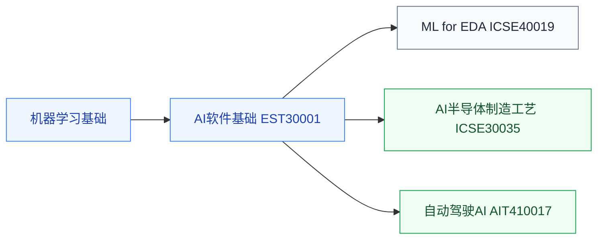

# AI交叉应用

把 AI 用到芯片产业链各环节的课程，与 [AI加速器](../../系统架构/AI加速器/index.md)（为 AI 造芯片）方向相反。前置是[机器学习](../机器学习/index.md)基础加各自领域的本体知识。

## 复旦校内课程（2025 培养方案）

以下课程页为占位骨架，欢迎修过的同学通过[参与建设](../../../参与建设.md)补全：

- **[人工智能算法在EDA的应用](FDU_ICSE40019.md)** — ML for EDA，先修 [EDA](../../电路/EDA/index.md)
- **[AI半导体制造工艺](FDU_ICSE30035.md)** — AI 用于制造良率与工艺控制，先修[集成电路工艺](../../器件与工艺/集成电路工艺/FDU_MICR130007.md)
- **[自动驾驶人工智能原理与实践](FDU_AIT410017.md)** — 感知/规划/控制的 AI 方法
- **[人工智能的计算机软件基础](FDU_EST30001.md)** — AI 开发的软件工程基础

## 相关科研方向

- [EDA 与设计自动化](../../../科研方向/EDA与设计自动化.md)
- [具身智能](../../../科研方向/具身智能.md)

