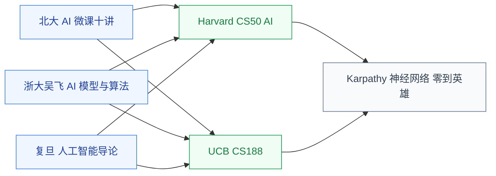

# 人工智能 - 入门速成

入门速成面向**完全零基础或想快速建立 AI 全图景**的同学。这里 3 门课都能在几天到几周时间内建立“AI 是什么、能做什么、怎么入门”的认知。

```mermaid
graph LR
    classDef beginner fill:#EFF6FF,stroke:#3B82F6,color:#1E40AF
    classDef intermediate fill:#F0FDF4,stroke:#16A34A,color:#15803D
    classDef advanced fill:#F8FAFC,stroke:#64748B,color:#334155
    A["北大 AI 微课十讲"]:::beginner
    B["浙大吴飞 AI 模型与算法"]:::beginner
    C["复旦 人工智能导论"]:::beginner
    D["Harvard CS50 AI"]:::intermediate
    E["UCB CS188"]:::intermediate
    F["Karpathy 神经网络 零到英雄"]:::advanced
    A --> D
    A --> E
    B --> D
    B --> E
    C --> D
    C --> E
    D --> F
    E --> F
```

## 相关科研方向

入门级前置,适合所有想做 AI 相关研究的同学。
