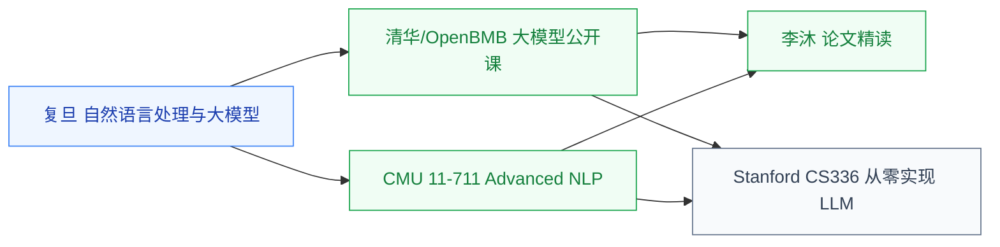

# 大语言模型

LLM 是当前 AI 系统研究的主要工作负载,训练和推理的算力规律直接决定加速器设计,因此从深度生成模型目录独立成组。

## 相关科研方向

- [AI 算法与系统](../../../科研方向/AI算法与系统.md)
- [处理器架构与编译系统](../../../科研方向/处理器架构与编译系统.md)
- [存算一体与近存计算](../../../科研方向/存算一体与近存计算.md)

