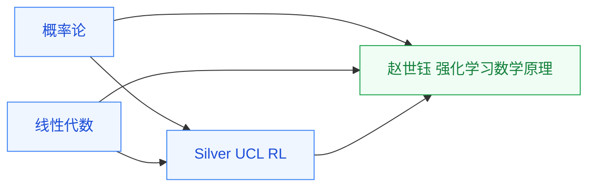

# 强化学习

智能体在交互中学策略的一支,具身智能的控制核心,也用于 EDA 布局布线等决策问题。

```mermaid
graph LR
    classDef prereq fill:#EFF6FF,stroke:#3B82F6,color:#1D4ED8
    classDef beginner fill:#EFF6FF,stroke:#3B82F6,color:#1D4ED8
    classDef advanced fill:#F0FDF4,stroke:#16A34A,color:#15803D
    P1[概率论]:::prereq
    P2[线性代数]:::prereq
    A["Silver UCL RL"]:::beginner
    B["赵世钰 强化学习数学原理"]:::advanced
    P1 --> A
    P2 --> A
    P1 --> B
    P2 --> B
    A --> B
```

## 相关科研方向

- [具身智能](../../../科研方向/具身智能.md)
- [EDA 与设计自动化](../../../科研方向/EDA与设计自动化.md)

