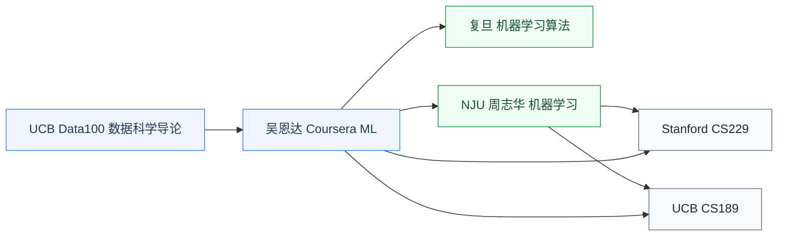

# 机器学习

机器学习是现代 AI 的核心范式:**让计算机从数据中学习规律**,而不是手工编写规则。监督学习、非监督学习、概率模型、优化、泛化理论是这门课的主轴。

对硬件研究者来说,机器学习是**做 AI 硬件协同设计的数学基础**——设计加速器要先理解算子(矩阵乘、卷积、attention)是什么,数据流如何,怎么量化才不损失精度。

## 相关科研方向

- [AI 算法与系统](../../../科研方向/AI算法与系统.md)
- [类脑芯片](../../../科研方向/类脑芯片.md)
- [EDA 与设计自动化](../../../科研方向/EDA与设计自动化.md)

