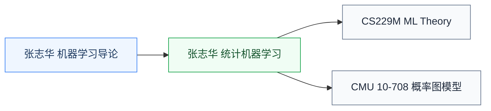

# 机器学习理论

机器学习理论研究**机器学习算法的数学基础**——概率图模型、统计学习理论、PAC 学习、泛化界、贝叶斯推断。它回答“为什么这些算法 work、什么时候不 work、需要多少样本”等基础问题。

对工程实践来说,这层理论不是必需;但**做 ML 理论研究、博士生写理论论文**就绕不开。学这板块的同学应该已经对算法和深度学习的工程实现有了基础。

## 相关科研方向

[AI 算法与系统](../../../科研方向/AI算法与系统.md)

