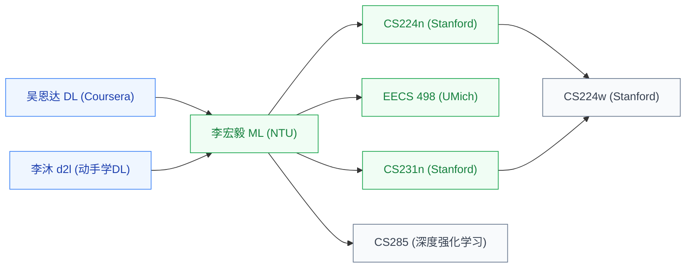

# 深度学习

深度学习是**当前 AI 的主流范式**——用大规模神经网络(CNN、RNN、Transformer)从海量数据中学习,在视觉、语言、语音、推荐等几乎所有 AI 任务上达到 SOTA。

对硬件研究者来说,理解 CNN 的卷积、Transformer 的 attention 是**设计 AI 加速器的前提**——需要先知道工作负载长什么样,才能设计对应的硬件。

## 相关科研方向

- [AI 算法与系统](../../../科研方向/AI算法与系统.md)
- [类脑芯片](../../../科研方向/类脑芯片.md)
- [具身智能](../../../科研方向/具身智能.md)

