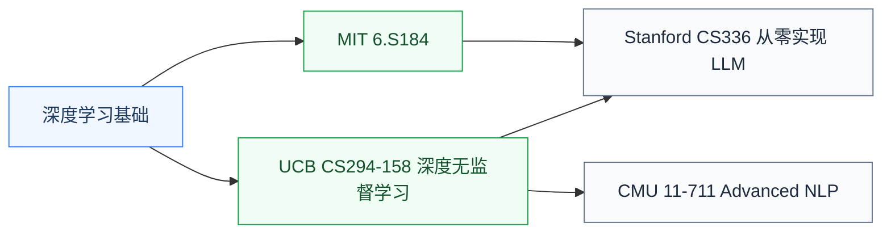

# 深度生成模型

深度生成模型研究**让 AI 能“生成”内容**——文本(LLM)、图像(扩散模型)、3D、音频、视频。这是 2020 年代 AI 革命的核心:ChatGPT、Sora、Stable Diffusion、Midjourney 全部是生成模型。

对硬件研究者来说,生成模型的**算力消耗规律**是设计大规模 AI 系统的关键参考——LLM 训练 / 推理的 memory bandwidth、计算密度、稀疏性都直接决定加速器设计。

## 相关科研方向

- [AI 算法与系统](../../../科研方向/AI算法与系统.md)
- [处理器架构与编译系统](../../../科研方向/处理器架构与编译系统.md)
- [存算一体与近存计算](../../../科研方向/存算一体与近存计算.md)

