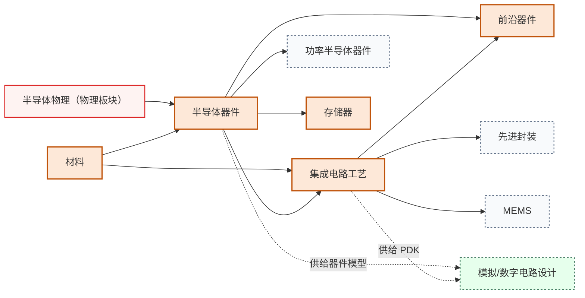

# 器件与工艺

从半导体物理到芯片制造，这个板块回答“芯片是怎么做出来的”。先理解材料中的电子行为，再掌握单个器件的工作原理，最后学习把亿万个器件集成到一块硅片上的工艺流程。

## 课程关系

实线箭头表示先修关系，虚线表示知识供给关系。

主链只有一条，半导体物理 → 半导体器件 → 集成电路工艺，三门课严格递进。功率半导体器件、存储器、前沿器件、先进封装、MEMS 都从这条主链上分出去。这条链的产出（器件模型和 PDK）是电路板块全部设计工作的物理输入。

---

**[半导体器件](半导体器件/)** — MOSFET、BJT、PN 结的工作原理；器件物理是所有电路设计的物理基础。

**[集成电路工艺](集成电路工艺/)** — 光刻、刻蚀、薄膜沉积、离子注入等微纳加工技术；解释芯片是如何从设计图纸变成硅片的。

**[前沿器件](前沿器件/index.md)** — 超低功耗器件、新型微纳器件、表面与界面；器件物理的研究前沿专题。

**[存储器](存储器/index.md)** — 存储器技术、闪存、存储器电路；存算一体方向的本体知识。

**[材料](材料/index.md)** — 半导体材料与表征；器件与工艺研究的材料学支撑。

## 相关科研方向

| 对应科研方向 | 推荐子板块 | 为什么 |
|---|---|---|
| [半导体器件与先进工艺](../../科研方向/半导体器件与先进工艺.md) | 全部两个 | 这是该方向的本体课程链 |
| [功率半导体与宽禁带器件](../../科研方向/功率半导体与宽禁带器件.md) | 半导体器件 | SiC/GaN 高压器件的物理基础 |
| [光电子与硅光集成](../../科研方向/光电子与硅光集成.md) | 半导体器件 + 集成电路工艺 | 调制器/探测器都是异质结器件,需要工艺集成 |
| [MEMS 与微纳传感器](../../科研方向/MEMS与微纳传感器.md) | 集成电路工艺 | MEMS 共享 CMOS 微纳加工技术 |
| [先进封装与异构集成](../../科研方向/先进封装与异构集成.md) | 集成电路工艺 | 2.5D/3D 封装、TSV、CoWoS 都建立在工艺基础上 |
| [模拟与混合信号 IC](../../科研方向/模拟与混合信号IC.md) | 半导体器件 | 没有器件物理就看不懂 SPICE 模型参数 |
| [存算一体与近存计算](../../科研方向/存算一体与近存计算.md) | 半导体器件 | RRAM/PCM/MRAM 等新型存储器件 |

> 想做器件方向的同学,**强烈推荐**先打牢[物理板块](../物理/index.md)中的量子力学和固体物理——直接学半导体物理像听天书。

## 待建的槽位

以下子领域已规划进知识框架，但还没有经过验证的课程推荐。欢迎熟悉这些领域的同学通过[参与建设](../../参与建设.md)补全：

- [功率半导体器件（SiC/GaN）](功率半导体器件/index.md)（待建）
- [MEMS 器件与微纳加工](MEMS/index.md)（待建）
- [先进封装与异构集成](先进封装/index.md)（待建）
