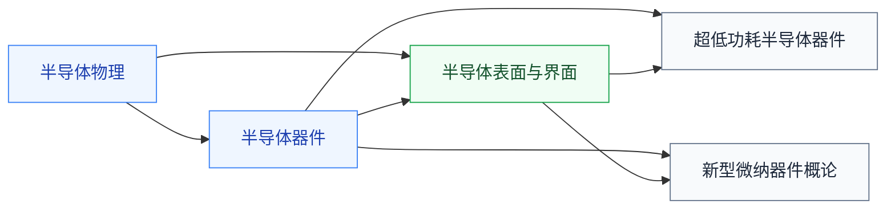

# 前沿器件

器件物理的研究前沿专题。[半导体器件](../半导体器件/index.md)主线讲 PN 结、MOSFET、BJT 的经典原理，这里收前沿分支，适合学完主线、准备进课题组的人。

## 复旦校内课程（2025 培养方案）

以下课程页为占位骨架，欢迎修过的同学通过[参与建设](../../../参与建设.md)补全：

- **[超低功耗半导体器件](FDU_ICSE30031.md)** — 隧穿晶体管、亚阈值器件等低功耗器件
- **[新型微纳器件概论](FDU_ICSE30012.md)** — 二维材料、纳米线等新器件概览
- **[半导体表面与界面](FDU_ICSE30029.md)** — 表面态、界面物理，先修[半导体物理](../../物理/半导体物理/index.md)

## 相关科研方向

- [半导体器件与先进工艺](../../../科研方向/半导体器件与先进工艺.md)
- [存算一体与近存计算](../../../科研方向/存算一体与近存计算.md)

