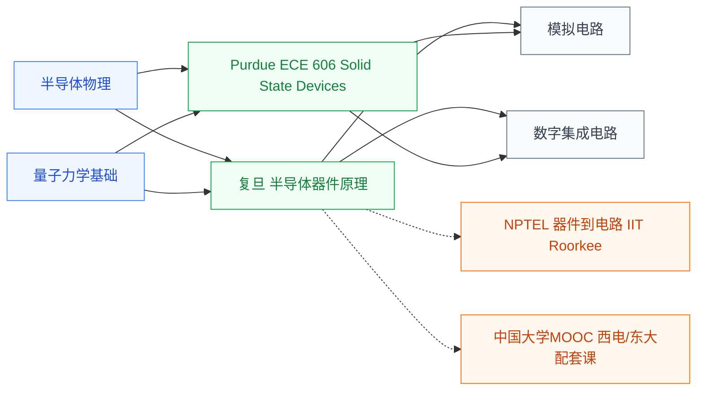

# 半导体器件

半导体器件研究**由半导体材料(主要是硅)制成的电子元件的工作原理**——PN 结、双极结型晶体管(BJT)、金属-氧化物-半导体场效应晶体管(MOSFET)。这些器件是构成所有集成电路的最基本积木:**一颗手机芯片含上百亿个 MOSFET**,每一个的工作原理都来自这门课。

它是连接[半导体物理](../../物理/半导体物理/index.md)与[电路设计](../../电路/index.md)的桥梁——半物给你“载流子和能带”,这门课说明“如何用 PN 结+栅氧化层做出一个有用的开关”。

## 相关科研方向

- [半导体器件与先进工艺](../../../科研方向/半导体器件与先进工艺.md)
- [模拟与混合信号 IC](../../../科研方向/模拟与混合信号IC.md)
- [功率半导体与宽禁带器件](../../../科研方向/功率半导体与宽禁带器件.md)
- [光电子与硅光集成](../../../科研方向/光电子与硅光集成.md)

