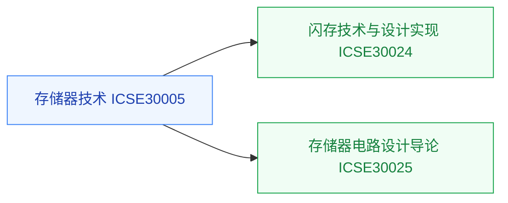

# 存储器

存储器是器件、工艺、电路三层交汇的领域，也是[存算一体与近存计算](../../../科研方向/存算一体与近存计算.md)方向的本体知识。本目录从器件技术到电路设计覆盖一条线。

## 复旦校内课程（2025 培养方案）

以下课程页为占位骨架，欢迎修过的同学通过[参与建设](../../../参与建设.md)补全：

- **[存储器技术](FDU_ICSE30005.md)** — DRAM/NAND/新型存储的器件与工艺
- **[闪存（FLASH）存储器技术与设计实现](FDU_ICSE30024.md)** — 闪存器件到设计实现
- **[存储器电路设计导论](FDU_ICSE30025.md)** — SRAM/DRAM 外围电路设计

## 公开课程（待补充）

存储器方向的公开视频课程稀缺，欢迎推荐（要求：完整公开视频，附主页与直链，注明学校、教师、讲数）。

## 相关科研方向

- [存算一体与近存计算](../../../科研方向/存算一体与近存计算.md)
- [半导体器件与先进工艺](../../../科研方向/半导体器件与先进工艺.md)

