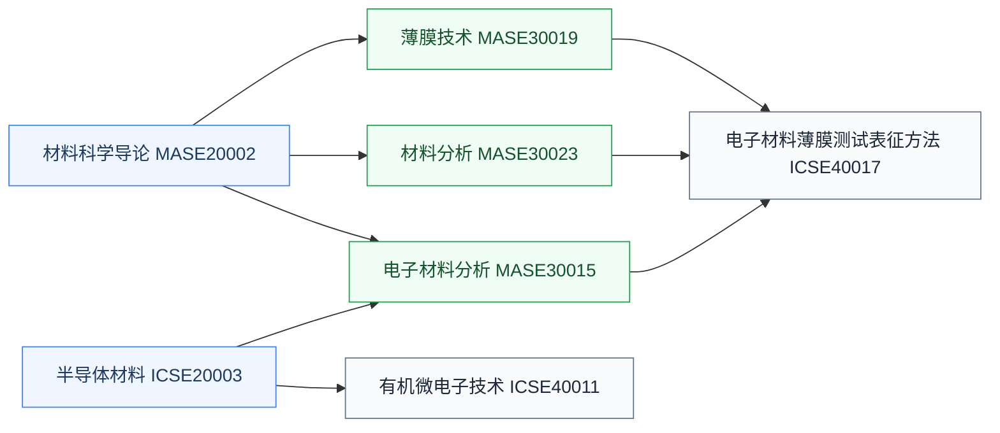

# 材料

半导体材料与材料表征课程，器件与工艺研究的材料学支撑。做器件、工艺、封装方向会反复用到这里的知识。

## 复旦校内课程（2025 培养方案）

以下课程页为占位骨架，欢迎修过的同学通过[参与建设](../../../参与建设.md)补全：

- **[半导体材料](FDU_ICSE20003.md)** — 硅、化合物半导体与新材料体系
- **[材料科学导论](FDU_MASE20002.md)** — 材料系导论课
- **[薄膜技术](FDU_MASE30019.md)** — 薄膜生长与制备工艺
- **[材料分析](FDU_MASE30023.md)** — 材料表征方法
- **[电子材料分析](FDU_MASE30015.md)** — 面向电子材料的分析手段
- **[电子材料薄膜测试表征方法](FDU_ICSE40017.md)** — 薄膜的测试与表征
- **[有机微电子技术](FDU_ICSE40011.md)** — 有机半导体器件与工艺

## 公开课程（待补充）

材料类公开视频课程欢迎推荐（要求：完整公开视频，附主页与直链，注明学校、教师、讲数）。

## 相关科研方向

- [半导体器件与先进工艺](../../../科研方向/半导体器件与先进工艺.md)
- [先进封装与异构集成](../../../科研方向/先进封装与异构集成.md)

