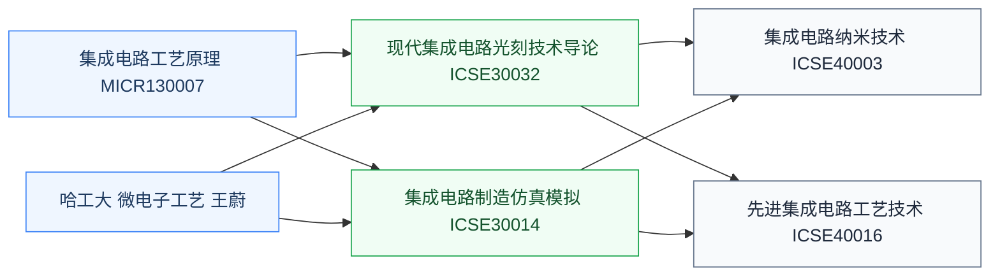

# 集成电路工艺

集成电路工艺研究**把芯片从设计图纸做成硅片的全过程**——光刻、刻蚀、薄膜沉积、离子注入、CMP(化学机械抛光)等微纳加工技术。它是器件设计与电路设计的物理桥梁:工艺决定了器件的尺寸/参数,器件决定了电路的行为。

学好这门课,才能看懂 PDK(Process Design Kit)里的工艺规则文档,理解为什么数字 IC 设计有 DRC(Design Rule Check),以及为什么“7nm/5nm 节点”在工艺界是大事。

## 相关科研方向

- [半导体器件与先进工艺](../../../科研方向/半导体器件与先进工艺.md)
- [先进封装与异构集成](../../../科研方向/先进封装与异构集成.md)
- [MEMS 与微纳传感器](../../../科研方向/MEMS与微纳传感器.md)

