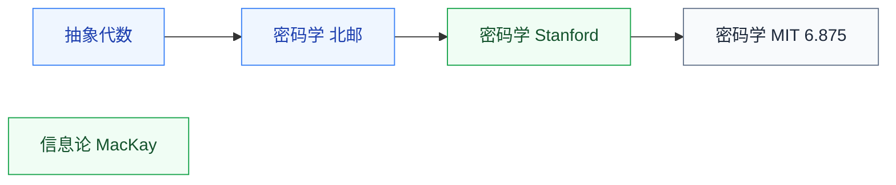

# 专题

服务特定方向的两门专题数学,按需选学。

## 子目录

- **[信息论](信息论/MacKay_infotheory.md)** — MacKay;数据压缩、信道容量;通信、ML、安全的交叉基础
- **[密码学](密码学/BUPT_crypto.md)** — 北邮、MIT 6.875、Stanford(Boneh);硬件安全方向直接相关,先修[抽象代数](../代数/抽象代数/NJU_sunzhiwei.md)

## 相关科研方向

- [硬件安全与可信计算](../../../科研方向/硬件安全与可信计算.md)
- [AI 算法与系统](../../../科研方向/AI算法与系统.md)

