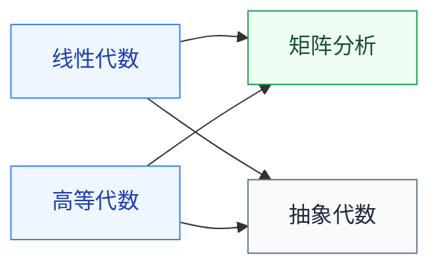

# 代数

线性代数是 ML、EDA、信号处理的共同语言,必学。其余三门按方向选学。

## 子目录

- **[线性代数](线性代数/MIT_18.06.md)** — 复旦、MIT 18.06(Gilbert Strang);向量空间、特征值、SVD
- **[高等代数](高等代数/PKU_qiuweisheng.md)** — 北大丘维声、Axler 官方视频;比线代严谨,适合理论路线
- **[矩阵分析](矩阵分析/MIT_18.065.md)** — MIT 18.065、哈工大严质彬;矩阵求导与分解,深度学习反向传播会用到
- **[抽象代数](抽象代数/NJU_sunzhiwei.md)** — 南大孙智伟、Harvard(Gross);密码学的前置

## 相关科研方向

- [AI 算法与系统](../../../科研方向/AI算法与系统.md)
- [EDA 与设计自动化](../../../科研方向/EDA与设计自动化.md)
- [硬件安全与可信计算](../../../科研方向/硬件安全与可信计算.md)

