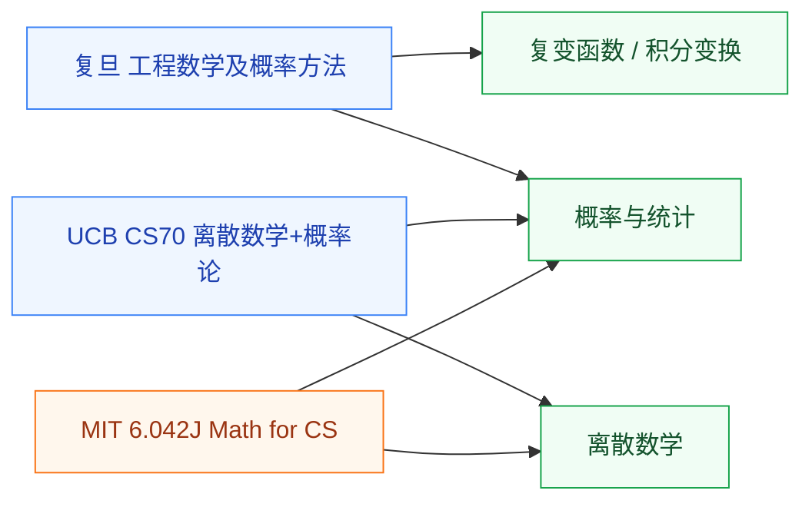

# 入门速成

这里的课是多主题压缩课。学校开给工科生,目标是快速掌握公式和结论到能用的程度,而不是逐个主题从头建体系。把它们塞进任何单主题目录都只对一半,所以单独成组,放在数学板块的入口位置。先用速成课把要用的数学过一遍,之后哪一块不够,再去对应的主题目录深入。

## 课程与覆盖范围

- **[工程数学及概率方法(复旦)](FDU_MICR130008.md)** — 复变函数、积分变换、概率论的工程子集;深入对应[分析/复变函数](../分析/复变函数/XJTU_complex.md)和[概率与统计](../概率与统计/ZJU_probability.md)
- **[UCB CS70: Discrete Math and Probability Theory](UCB_CS70.md)** — 离散数学 + 概率论,每个模块都对应实际算法;深入对应[离散数学](../离散数学/PKU_discrete.md)和[概率与统计](../概率与统计/ZJU_probability.md)
- **[MIT 6.042J: Mathematics for Computer Science](MIT_6.042J.md)** — 同样是离散 + 概率的“math for CS”路线,与 CS70 二选一

## 怎么选

- 在复旦按培养方案走,工程数学及概率方法是必经的一门,这里给出配套资料。
- 偏算法/EDA/体系结构方向,想快速补离散和概率,CS70 与 6.042J 二选一。
- 不赶进度、想把某一块学透,直接去对应主题目录,不必先过速成课。
