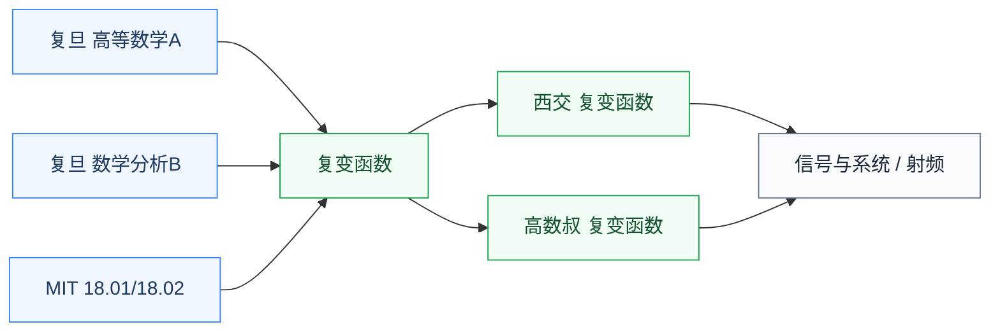

# 分析

分析线处理连续量。数学分析是全部理工课程的地基,复变函数把分析延伸到复平面,是频域方法的数学来源。

## 子目录

- **[数学分析](数学分析/FDU_MATH120016-17.md)** — 复旦(谢锡麟/陈纪修任选)、MIT 18.01/18.02;所有后续课程的起点
- **[复变函数](复变函数/XJTU_complex.md)** — 西交、高数叔;拉普拉斯变换和频域分析的数学基础,信号与系统、射频的前置

## 相关科研方向

- [模拟与混合信号 IC](../../../科研方向/模拟与混合信号IC.md)
- [射频与毫米波 IC](../../../科研方向/射频与毫米波IC.md)

