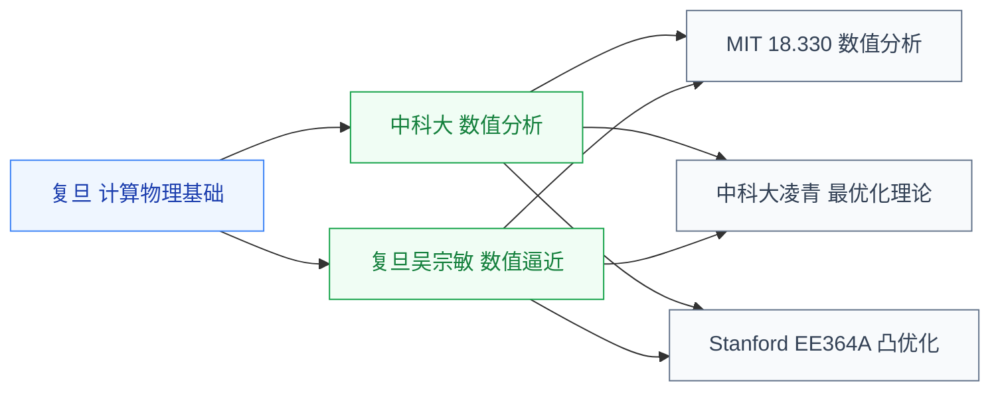

# 数值与优化

计算机里“解数学”的两门课。数值分析管算得准、算得稳,凸优化管找最优。

## 子目录

- **[数值分析](数值分析/USTC_numerical.md)** — 复旦吴宗敏、中科大、MIT 18.330;EDA 求解器与 SPICE 仿真的算法基础
- **[凸优化](凸优化/Stanford_EE364A.md)** — 中科大凌青、Stanford EE364A(Boyd);ML 与 EDA 布局优化的核心工具

## 相关科研方向

- [EDA 与设计自动化](../../../科研方向/EDA与设计自动化.md)
- [AI 算法与系统](../../../科研方向/AI算法与系统.md)

