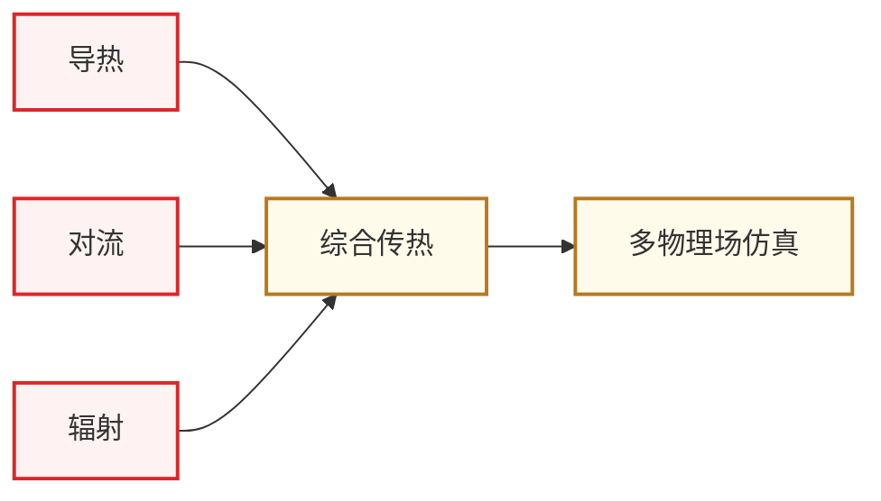

# 传热学

传热学(Heat Transfer)研究**热量在材料中的传递规律**——导热、对流、辐射三种方式。对 IC 学生来说,它服务于两个具体方向:

- **[先进封装与异构集成](../../../科研方向/先进封装与异构集成.md)** — 2.5D/3D 集成芯片的热流分析、热阻设计、热岛问题
- **[功率半导体与宽禁带器件](../../../科研方向/功率半导体与宽禁带器件.md)** — SiC/GaN 功率器件的散热设计、热-电协同仿真

随着芯片功率密度逼近物理极限,**“热”已经成为继性能、功耗后的第三个一阶设计约束**。Chiplet/HBM 堆叠之后,芯片热设计与电气设计的耦合越来越深,做这两个方向的同学绕不开传热学。

## 知识谱系

主链 **三种传热模式 → 综合工程问题 → 多物理场仿真**。前面是物理基础,后面是 IC 工程应用。

## 相关科研方向

- [先进封装与异构集成](../../../科研方向/先进封装与异构集成.md)
- [功率半导体与宽禁带器件](../../../科研方向/功率半导体与宽禁带器件.md)
- [MEMS 与微纳传感器](../../../科研方向/MEMS与微纳传感器.md)

