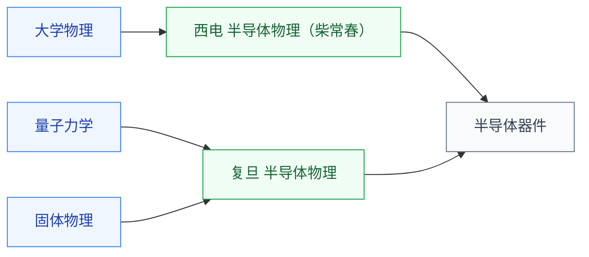

# 半导体物理

半导体物理把**固体物理的能带理论应用在半导体材料(主要是硅)上**,并引入“载流子统计、漂移与扩散、PN 结、欧姆与肖特基接触”等核心概念。这是**所有半导体器件设计的物理基础**——不懂半导体物理,就读不懂晶体管的 SPICE 模型参数,也理解不了为什么 FinFET 比平面 MOSFET 漏电更小。

对 IC 学生来说,半导体物理是从“通识物理”过渡到“工程器件物理”的最后一步,接下来就直接进入 [半导体器件](../../器件与工艺/半导体器件/index.md) 课程链。

## 相关科研方向

- [器件与工艺](../../器件与工艺/index.md)
- [半导体器件与先进工艺](../../../科研方向/半导体器件与先进工艺.md)
- [功率半导体与宽禁带器件](../../../科研方向/功率半导体与宽禁带器件.md)
- [光电子与硅光集成](../../../科研方向/光电子与硅光集成.md)
- [模拟与混合信号 IC](../../../科研方向/模拟与混合信号IC.md)

