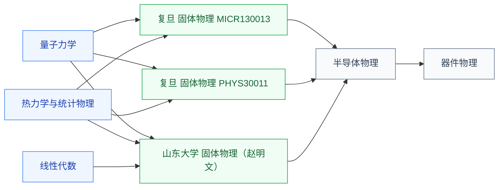

# 固体物理

固体物理研究**晶体中电子和声子的行为**——晶格振动、电子能带、布里渊区、输运现象。它在物理知识链上**承上启下**:上承量子力学(把单电子薛定谔方程推广到周期势阱中的多体系统),下启半导体物理(直接给出“能带”这一半导体器件的核心概念)。

IC 学生如果想做器件、工艺、光电子方向,**绕不开固体物理**——看到的 N 型/P 型掺杂、PN 结、肖特基势垒,本质都是固体物理在半导体材料上的具体应用。

## 相关科研方向

- [半导体器件与先进工艺](../../../科研方向/半导体器件与先进工艺.md)
- [功率半导体与宽禁带器件](../../../科研方向/功率半导体与宽禁带器件.md)
- [光电子与硅光集成](../../../科研方向/光电子与硅光集成.md)

