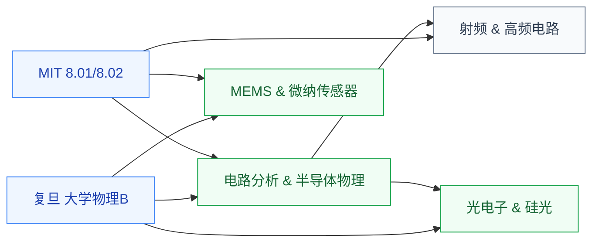

# 大学物理

大学物理(力学 + 电磁学 + 光学 + 热力学)是所有理工科本科生的共同物理基础。对 IC 学生来说,大物的**电磁学章节**最直接相关——它是后续学习电路分析、信号传输、射频天线、半导体物理的物理底子;**光学章节**则是进入光电子/硅光方向的入门。

## 相关科研方向

- [具身智能](../../../科研方向/具身智能.md)
- [MEMS 与微纳传感器](../../../科研方向/MEMS与微纳传感器.md)
- [射频与毫米波 IC](../../../科研方向/射频与毫米波IC.md)
- [光电子与硅光集成](../../../科研方向/光电子与硅光集成.md)
- [先进封装与异构集成](../../../科研方向/先进封装与异构集成.md)

