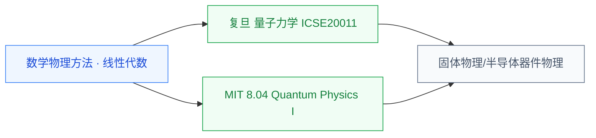

# 量子力学

量子力学是 20 世纪物理学的两大支柱之一(另一个是相对论),研究微观粒子(电子、原子、分子)的运动规律。对 IC 学生来说,**没有量子力学就读不懂半导体物理**——能带、隧穿、激子、自旋等概念全部建立在量子力学之上。如果有意做器件、量子计算或硅光方向,量子力学是必须啃下的物理基础。

## 相关科研方向

- [半导体器件与先进工艺](../../../科研方向/半导体器件与先进工艺.md)
- [功率半导体与宽禁带器件](../../../科研方向/功率半导体与宽禁带器件.md)
- [量子计算与量子芯片](../../../科研方向/量子计算与量子芯片.md)
- [光电子与硅光集成](../../../科研方向/光电子与硅光集成.md)

