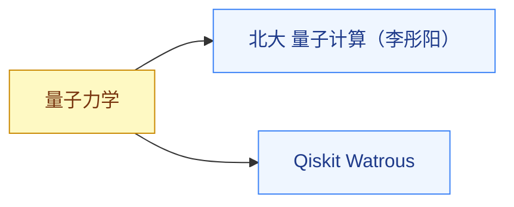

# 量子计算

前置是[量子力学](../量子力学/index.md),至少学到会用 Dirac 记号做计算。两门课一中一英,一个建算法框架,一个带代码实操。

```mermaid
graph LR
    QM["量子力学"]:::prereq
    PKU["北大 量子计算（李彤阳）"]:::main
    QK["Qiskit Watrous"]:::main
    QM --> PKU
    QM --> QK
    classDef prereq fill:#FEF9C3,stroke:#CA8A04,color:#78350F
    classDef main fill:#EFF6FF,stroke:#3B82F6,color:#1E3A8A
```

## 相关科研方向

[量子计算与量子芯片](../../../科研方向/量子计算与量子芯片.md)

