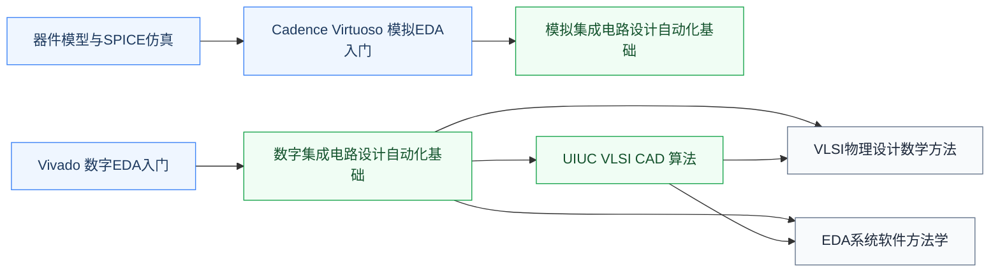

# EDA 工具

EDA(Electronic Design Automation)指**用于设计、仿真、验证、流片芯片的软件工具**。从 RTL 综合到布局布线、从模拟仿真到版图设计,所有 IC 设计的“工程产出”都借助 EDA 工具完成。Cadence、Synopsys、Siemens EDA 三家垄断了商业 EDA 市场,合称“EDA 三巨头”。

## 课程与工具

- **复旦 2025 培养方案课程**（占位骨架,欢迎补全）:[数字EDA基础](FDU_ICSE30019.md) · [模拟EDA基础](FDU_ICSE30018.md) · [VLSI物理设计数学方法](FDU_ICSE30026.md) · [EDA系统软件方法学](FDU_ICSE30028.md)；AI for EDA 课程见[人工智能/AI交叉应用](../../人工智能/AI交叉应用/FDU_ICSE40019.md)
- **[Vivado 入门](vivado.md)** — AMD/Xilinx FPGA EDA 工具入口
- **[Cadence Virtuoso 入门](cadence.md)** — 模拟 IC 设计工业标准
- **[UIUC VLSI CAD (Coursera)](UIUC_VLSI_CAD.md)** — 讲 EDA 工具背后的算法:逻辑综合、布局布线、时序分析

!!! note "算法前置说明"
    学习 UIUC VLSI CAD 前，建议先掌握基本图算法。EDA 中的静态时序分析（STA）本质是 DAG 最长路问题，布线依赖最短路与最大流/最小割，布局则涉及图划分。这些内容在[数据结构与算法](../../算法编程/数据结构与算法/index.md)板块均有覆盖，重点见 CS170 和 MIT 6.006。

## 相关科研方向

[EDA 与设计自动化](../../../科研方向/EDA与设计自动化.md)

