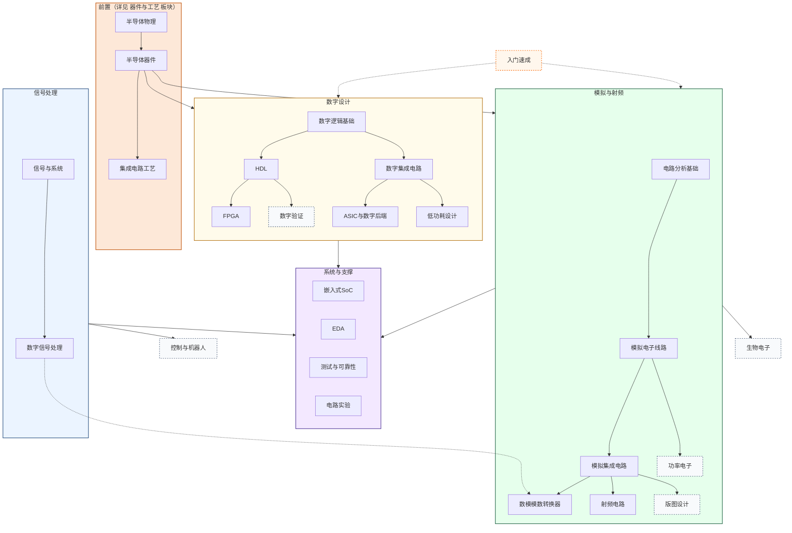

# 电路

电路是 IC 设计的核心板块——几乎所有[科研方向](../../科研方向/)在某种程度上都依赖它。从数字逻辑到模拟集成电路，从信号处理到 ASIC/SoC 集成，这里覆盖了从课程理论到流片工程的完整训练链。

## 知识谱系

以复旦微电子培养方案为参考整理。**器件与工艺**是它的物理前置，**EDA 工具**是它的工程支撑。

可以看出这份谱系有两个特点：

- **以设计为主**——设计方向是复旦微电的强项，略有侧重不足为奇
- **每个方向走马观花地过一遍**——重在打基础，为日后科研方向充实工具箱

> 完整的“芯片生产流程图”(IC 设计 → Tape-out → Fab → 封测)请见[学习地图导言](../index.md)。

## 板块介绍

### 数字设计

- **[数字逻辑基础](数字设计/数字逻辑基础/FDU_MICR130003.md)** — 逻辑门、组合/时序电路、有限状态机；CPU 与 FPGA 的最底层基础
- **[硬件描述语言](数字设计/HDL/Verilog/ZJU_digital_system.md)** — Verilog（事实标准）、Chisel（参数化更强）、HLS（用 C++ 描述算法）；能像写代码一样“描述”硬件
- **[FPGA](数字设计/FPGA/FDU_MICR130024.md)** — 半定制可编程芯片；既是数字电路最常见的实战平台，也是研究方向
- **[数字集成电路](数字设计/数字集成电路/FDU_MICR130029.md)** — 在 CMOS 工艺层面实现数字逻辑，关心晶体管级延时/功耗/面积
- **[数字验证](数字设计/数字验证/index.md)** — testbench、断言、UVM；数字 IC 最大的就业岗位类别（待建）
- **[ASIC 与数字后端](数字设计/ASIC与数字后端/FDU_INFO130094.md)** — 综合、布局布线、时序收敛，从 RTL 走到 GDSII

### 模拟与射频

- **[电路分析基础](模拟与射频/电路分析基础/FDU_yiting.md)** — 欧姆/基尔霍夫定律，RLC 网络
- **[模拟电子线路](模拟与射频/模拟电子线路/FDU_MICR130002.md)** — 用晶体管搭放大器/滤波器/振荡器
- **[模拟集成电路](模拟与射频/模拟集成电路/FDU_MICR130030.md)** — 在硅片上实现高性能模拟模块（运放、比较器、PLL）
- **[ADC / DAC](模拟与射频/数模模数转换器/FDU_INFO130270.md)** — 连接模拟世界与数字世界的桥梁，是混合信号 IC 的核心
- **[射频电路](模拟与射频/射频电路/XDU_high_freq.md)** — 从板级高频电路到片上 LNA、PA、混频器、VCO；无线通信的核心

### 信号处理

- **[信号与系统](信号处理/信号与系统/FDU_MICR130004.md)** — 傅里叶/拉普拉斯/Z 变换；通信和信号处理的数学基础
- **[数字信号处理 (DSP)](信号处理/数字信号处理/FDU_INFO130010.md)** — 数字滤波、变换、识别；从手机降噪到通信编码

MATLAB 是信号处理算法的快速原型工具，相关课程见[工程工具 / MATLAB 与科学计算](../../工程工具/科学计算.md)。

### EDA

- **[EDA 工具](EDA/index.md)** — Vivado / Quartus（数字）、Cadence Virtuoso / HSPICE（模拟）；综合、布局布线、时序分析、版图与仿真
- **[EDA 算法](EDA/UIUC_VLSI_CAD.md)** — UIUC VLSI CAD 讲布局布线/逻辑综合背后的算法；开发 EDA 工具本身的研究详见[科研方向 / EDA 与设计自动化](../../科研方向/EDA与设计自动化.md)

### 测试与可靠性

- **[测试与可靠性](测试与可靠性/index.md)** — 模拟/射频测试、器件可靠性；量产环节的知识与岗位所在(数字侧验证见数字验证槽位)

### 电路实验

- **[电路实验](电路实验/index.md)** — 复旦培养方案的板级与 IC 实验课

### 系统集成

- **[嵌入式 SoC](嵌入式SoC/index.md)** — 把 CPU/内存/外设/加速器集成到一颗芯片上

### 速通路径

不打算深入电路设计但又想理解硬件原理的同学，建议看[入门速成](入门速成/index.md)板块——EE16A&B 是把电路 + 信号系统压缩成一学期的高质量“通识”课；信号侧还可配合[信号与系统](信号处理/信号与系统/MIT_6.003.md)目录下的 UCB EE120 和 MIT 6.007。

## 相关科研方向

| 电路子分支 | 主要服务的科研方向 |
|---|---|
| 数字逻辑 + HDL + 数字 IC | [处理器架构与编译系统](../../科研方向/处理器架构与编译系统.md)、[可重构计算与FPGA](../../科研方向/可重构计算与FPGA.md)、[EDA 与设计自动化](../../科研方向/EDA与设计自动化.md) |
| 模拟电子 + 模拟 IC + 射频电路 | [模拟与混合信号 IC](../../科研方向/模拟与混合信号IC.md)、[射频与毫米波 IC](../../科研方向/射频与毫米波IC.md)、[生物电子与脑机接口](../../科研方向/生物电子与脑机接口.md) |
| 信号与系统 + DSP + ADC/DAC | [模拟与混合信号 IC](../../科研方向/模拟与混合信号IC.md)（数据转换器子方向）、[生物电子与脑机接口](../../科研方向/生物电子与脑机接口.md) |
| FPGA + ASIC | [可重构计算与FPGA](../../科研方向/可重构计算与FPGA.md)；所有数字 IC 设计方向的实战平台 |
| EDA 工具 | [EDA 与设计自动化](../../科研方向/EDA与设计自动化.md)；做研究时“流片”环节都要用 |
| 嵌入式 SoC | [处理器架构与编译系统](../../科研方向/处理器架构与编译系统.md)、[硬件安全与可信计算](../../科研方向/硬件安全与可信计算.md) |

> 这一板块**最贴近 IC 工程师的日常**：写 RTL、跑仿真、看波形、查时序——这些技能是从课程到工业界最直接的过渡。建议至少把“**数字逻辑 → 一门 HDL → 一个 EDA 工具**”完整链条走完，无论最终选择哪个方向。

## 待建的槽位

以下子领域已规划进知识框架，但还没有经过验证的课程推荐。欢迎熟悉这些领域的同学通过[参与建设](../../参与建设.md)补全：

- [数字验证（SV/UVM）](数字设计/数字验证/index.md)（待建）
- [数字后端](数字设计/ASIC与数字后端/数字后端.md)（待建）
- [功率电子](模拟与射频/功率电子/index.md)（待建）
- [模拟版图设计](模拟与射频/版图设计/index.md)（待建）
- [生物电子接口电路](生物电子/index.md)（待建）
- [控制与机器人](控制与机器人/index.md)（待建）
