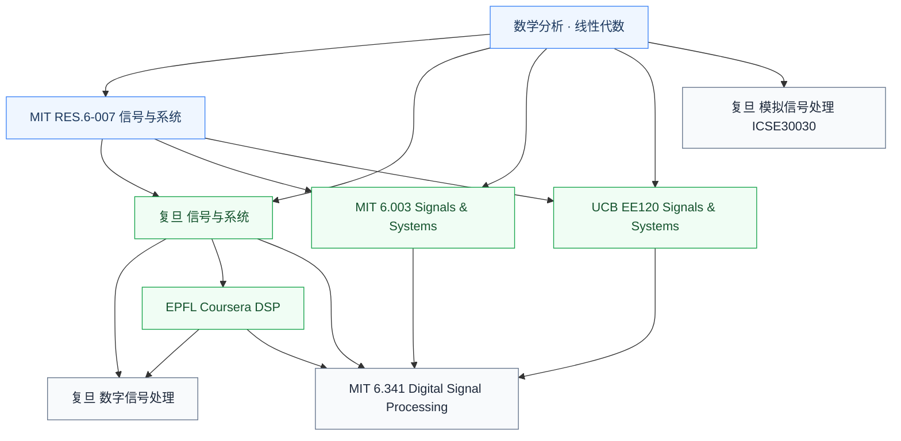

# 信号处理

信号处理研究**信号的数学表示和系统对其响应**——傅里叶变换、拉普拉斯变换、Z 变换、滤波、采样定理。它是通信、雷达、生物医学、音频/图像处理的共同数学基础,也是 ADC/DAC、DSP 等具体模块的理论支撑。

## 子目录

- **[信号与系统](信号与系统/FDU_MICR130004.md)** — 数学基础:连续/离散信号、卷积、各种变换
- **[数字信号处理 (DSP)](数字信号处理/FDU_INFO130010.md)** — 用计算机或专用硬件做实际信号处理

ADC/DAC 数据转换器先修是模拟集成电路,已归入[模拟与射频](../模拟与射频/数模模数转换器/FDU_INFO130270.md);MATLAB 是工具而非课程主线,已归入[工程工具](../../../工程工具/科学计算.md)。

## 相关科研方向

- [模拟与混合信号 IC](../../../科研方向/模拟与混合信号IC.md)
- [生物电子与脑机接口](../../../科研方向/生物电子与脑机接口.md)
- [射频与毫米波 IC](../../../科研方向/射频与毫米波IC.md)

