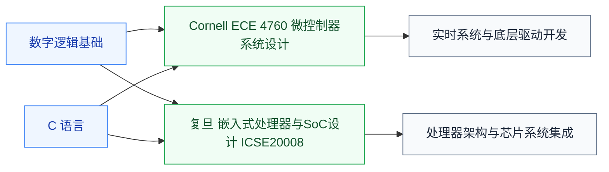

# 嵌入式 SoC

嵌入式 SoC(Embedded System on a Chip)指**把 CPU、内存、外设、加速器集成到单一芯片上,嵌入到特定设备执行专门任务**。智能手机的主处理器、路由器的控制芯片、汽车 ECU、IoT 设备都依赖嵌入式 SoC。

这是连接“芯片设计”与“系统应用”的桥梁——仅会写 RTL 不够,还需要懂操作系统、外设驱动、实时性、低功耗设计,才能设计真正能用的 SoC。

## 相关科研方向

- [处理器架构与编译系统](../../../科研方向/处理器架构与编译系统.md)
- [硬件安全与可信计算](../../../科研方向/硬件安全与可信计算.md)

