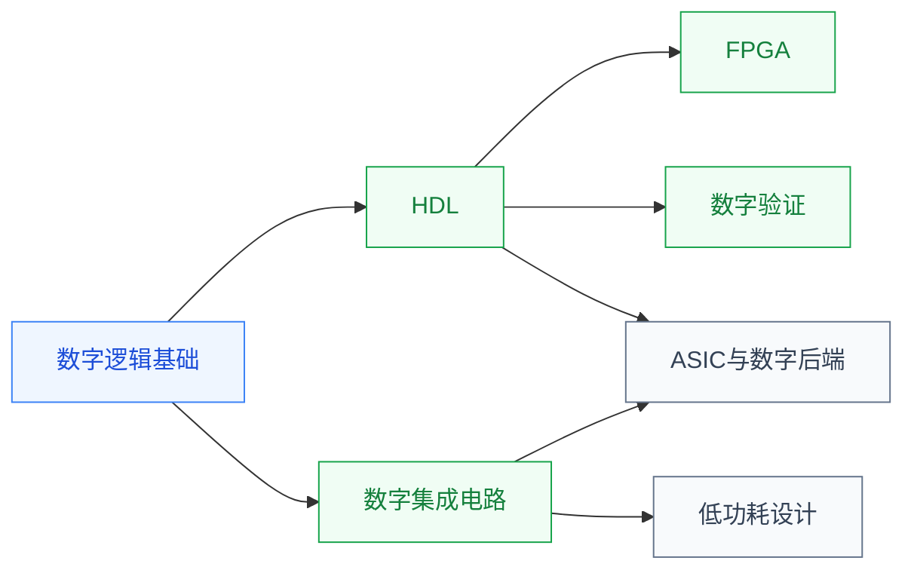

# 数字设计

数字电路处理**离散二进制信号(0 和 1)**:从最基础的逻辑门(与/或/非)、组合逻辑(加法器),到时序逻辑(触发器、状态机),再到把这些组合起来形成处理器、存储器、加速器等大型数字系统。它是所有数字芯片(CPU/GPU/FPGA/ASIC)的基础。本目录覆盖数字设计的完整链条,从逻辑门一路走到 GDSII。

## 子目录

- **[数字逻辑基础](数字逻辑基础/FDU_MICR130003.md)** — 数电入门:逻辑门、布尔代数、组合/时序电路、状态机
- **[硬件描述语言 (HDL)](HDL/Verilog/ZJU_digital_system.md)** — Verilog / Chisel / HLS;像写代码一样描述硬件
- **[FPGA](FPGA/FDU_MICR130024.md)** — 半定制可编程数字芯片;既是教学平台也是研究方向
- **[数字集成电路](数字集成电路/FDU_MICR130029.md)** — 在 CMOS 工艺层面把数字逻辑落到晶体管;关注延时/功耗/面积
- **[数字验证](数字验证/index.md)** — testbench、断言、UVM(待建)
- **[低功耗设计](低功耗设计/FDU_ICSE40005.md)** — 超低功耗 IC 设计专题(复旦 2025 选修)
- **[ASIC 与数字后端](ASIC与数字后端/FDU_INFO130094.md)** — 综合、布局布线、时序收敛,从 RTL 走到 GDSII;NPTEL 两门分别讲物理设计和综合的算法

## 相关科研方向

- [处理器架构与编译系统](../../../科研方向/处理器架构与编译系统.md)
- [可重构计算与FPGA](../../../科研方向/可重构计算与FPGA.md)
- [EDA 与设计自动化](../../../科研方向/EDA与设计自动化.md)

