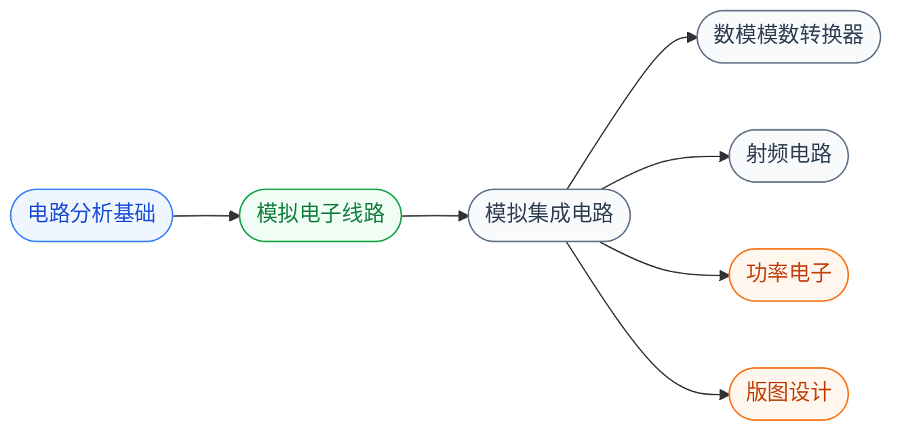

# 模拟与射频

模拟电路处理**连续变化的真实世界信号**(电压、电流、温度、压力):用晶体管搭放大器、滤波器、振荡器,在硅片上做运放、PLL、ADC、DAC、PA、LNA 等模拟模块。

模拟电路是 IC 设计中**最依赖经验和直觉**的领域——一个有 10 年经验的模拟工程师设计的运放可能比刚毕业生快 10 倍且性能更好。这是因为模拟设计的反馈、稳定性、噪声、失配等问题没有“标准流程”,更多依靠对器件物理的深刻理解 + 大量电路 topology 的积累。

## 子目录

- **[电路分析基础](电路分析基础/FDU_yiting.md)** — 欧姆/基尔霍夫定律,RLC 网络分析
- **[模拟电子线路](模拟电子线路/FDU_MICR130002.md)** — 用晶体管搭基本模块(放大器、滤波器、振荡器)
- **[模拟集成电路](模拟集成电路/FDU_MICR130030.md)** — 在芯片上实现高性能模拟模块
- **[ADC / DAC](数模模数转换器/FDU_INFO130270.md)** — 数据转换器,模拟与数字世界的桥梁,先修是模拟集成电路
- **[射频电路](射频电路/XDU_high_freq.md)** — 从板级高频电路(传输线、S 参数)到片上射频 IC(LNA、PA、混频器、VCO)

## 相关科研方向

- [模拟与混合信号 IC](../../../科研方向/模拟与混合信号IC.md)
- [射频与毫米波 IC](../../../科研方向/射频与毫米波IC.md)
- [生物电子与脑机接口](../../../科研方向/生物电子与脑机接口.md)

