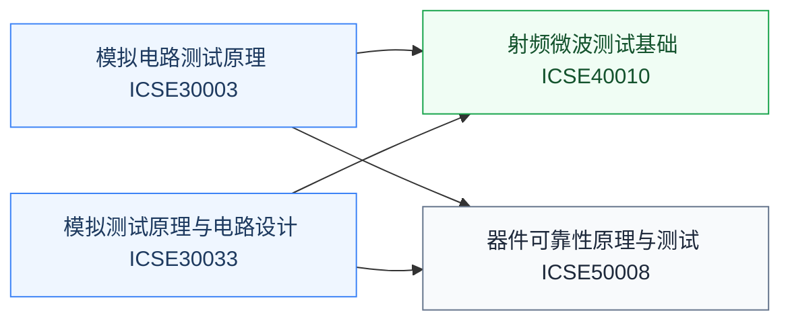

# 测试与可靠性

芯片造出来要证明它能用、能一直用。测试覆盖从晶圆级 CP 到成品 FT 的量产环节，可靠性研究器件和电路的退化机制。这是数字验证之外另一大就业岗位类别，模拟/射频岗位尤其看重。数字侧的功能验证（SV/UVM）见[数字验证](../数字设计/数字验证/index.md)槽位。

## 复旦校内课程（2025 培养方案）

以下课程页为占位骨架，欢迎修过的同学通过[参与建设](../../../参与建设.md)补全：

- **[模拟电路测试原理](FDU_ICSE30003.md)** — 模拟量测试方法
- **[模拟测试原理与电路设计](FDU_ICSE30033.md)** — IV 测试与可测性设计
- **[射频微波测试基础](FDU_ICSE40010.md)** — S 参数、噪声系数等射频量测
- **[器件可靠性原理与测试](FDU_ICSE50008.md)** — HCI/BTI/TDDB 等退化机制与表征

## 公开课程（待补充）

测试与可靠性的公开视频课程稀缺，欢迎推荐（要求：完整公开视频，附主页与直链，注明学校、教师、讲数）。

## 相关科研方向

- [模拟与混合信号 IC](../../../科研方向/模拟与混合信号IC.md)
- [射频与毫米波 IC](../../../科研方向/射频与毫米波IC.md)
- [半导体器件与先进工艺](../../../科研方向/半导体器件与先进工艺.md)

