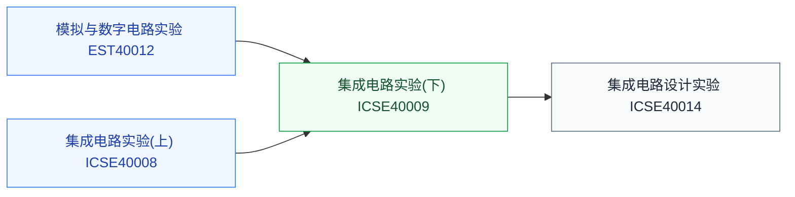

# 电路实验

复旦培养方案里的动手实验课。实验课与培养方案高度耦合，各高校自办，通常没有公开的国外等价课程，这里仅收录复旦本校课程。

## 复旦校内课程（2025 培养方案）

以下课程页为占位骨架，欢迎修过的同学通过[参与建设](../../../参与建设.md)补全：

- **[模拟与数字电路实验](FDU_EST40012.md)** — 模电与数电的板级实验（选修）
- **[集成电路设计实验](FDU_ICSE40014.md)** — IC 设计流程实操（选修）
- **[集成电路实验(上)](FDU_ICSE40008.md)** — 融合创新必修
- **[集成电路实验(下)](FDU_ICSE40009.md)** — 融合创新必修
