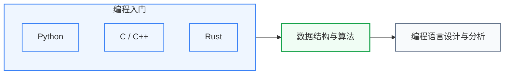

# 算法编程

写代码和设计算法是所有工程研究的基础工具。这个板块从编程语言入门到算法分析，覆盖做硬件研究也需要掌握的软件能力。

## 课程关系

三个子板块构成一条直线，编程入门 → 数据结构与算法 → 编程语言设计与分析，依次递进。编程入门内部的几门语言（Python、C/C++、Rust）相互独立，选一门主修即可。

---

**[编程入门](编程入门/)** — Python、C/C++、Rust；选一门语言打扎实基础。对微电子研究者来说 Python（数据处理、ML 框架）和 C++（硬件仿真器、EDA 工具开发）最常用。

**[数据结构与算法](数据结构与算法/)** — CS61B、MIT 6.006、Algorithms I&II；图算法、动态规划、复杂度分析；EDA 算法研究的直接前置，也是系统类研究的通用工具。

**[编程语言设计与分析](编程语言设计与分析/)** — 类型系统、程序分析、形式验证；与编译原理和硬件验证研究有交叉。

## 相关科研方向

| 对应科研方向 | 推荐子板块 | 为什么 |
|---|---|---|
| [EDA 与设计自动化](../../科研方向/EDA与设计自动化.md) | 数据结构与算法 | EDA 本质是图算法 + 大型 C++ 工程,Yosys/OpenROAD 都是百万行级代码 |
| [处理器架构与编译系统](../../科研方向/处理器架构与编译系统.md) | 编程语言设计与分析 | LLVM/MLIR/TVM 的本体就是程序分析 |
| [硬件安全与可信计算](../../科研方向/硬件安全与可信计算.md) | 编程语言设计与分析 | 侧信道分析与形式验证依赖类型系统、抽象解释 |
| [AI 算法与系统](../../科研方向/AI算法与系统.md) | 编程入门 (Python) + 数据结构 | PyTorch 生态全部 Python,算法功底决定上限 |
| 任何方向 | 编程入门 | 写得清楚的代码是合作和可复现性的基础——所有方向都需要 |

