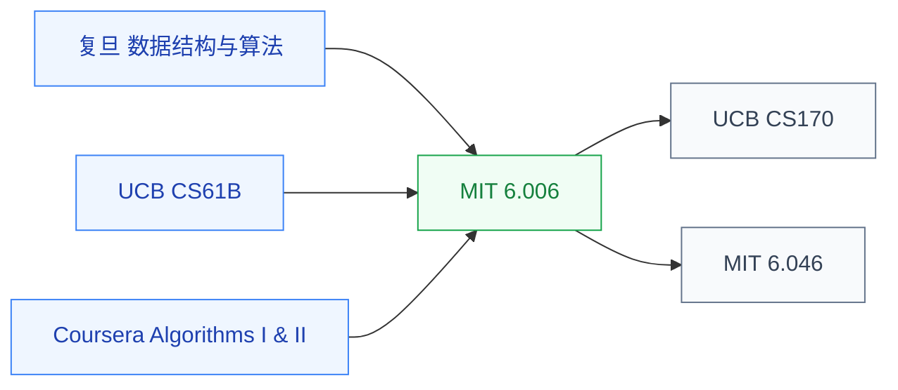

# 数据结构与算法

数据结构与算法是**所有计算机科学和工程的通用工具**。从图算法、动态规划、复杂度分析,到具体的树/堆/哈希实现——这些是 EDA 算法研究、系统类研究、AI 系统优化的共同语言。

对 IC 学生来说,这门课比“刷题面试”重要得多:做 EDA 时会遇到 NP-hard 问题(布局布线、逻辑综合)需要近似算法;做体系结构时会用图算法分析数据流图;做 AI 系统时需要理解算子调度的图算法。

## 相关科研方向

- [EDA 与设计自动化](../../../科研方向/EDA与设计自动化.md)
- [处理器架构与编译系统](../../../科研方向/处理器架构与编译系统.md)
- [AI 算法与系统](../../../科研方向/AI算法与系统.md)

