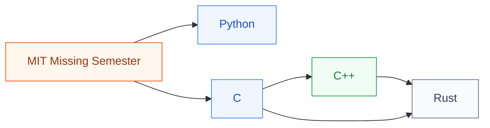

# 编程入门

编程入门面向**没有编程基础或想换语言的同学**:Python(数据处理 / ML 框架 / 脚本)、C/C++(硬件仿真器 / EDA 工具 / 系统编程)、Rust(现代系统编程)。

对 IC 学生来说,**Python 和 C++ 是最高优先级**:Python 几乎是所有 ML/数据处理工作的默认语言;C++ 是大型 EDA 工具(Yosys、OpenROAD)、体系结构仿真器(Gem5、GPGPU-Sim)的实现语言。

## 子目录

- **[Python 语言](Python/)** — UCB CS61A、Harvard CS50P、MIT 6.100L
- **[C 语言](C/)** — Harvard CS50、Duke C Programming
- **[C++ 语言](cpp/Stanford_CS106L.md)** — Stanford CS106L/B/X、侯捷系列
- **[Rust 语言](Rust/Stanford_CS110L.md)** — Stanford CS110L、令狐/杨旭中文系列

## 相关科研方向

任何方向都需要的基础。具体偏好:
- AI / 算法研究 → Python(PyTorch / JAX 生态)
- EDA 工具 / 硬件仿真器 → C++
- 系统 / 区块链 / 高性能 → Rust
