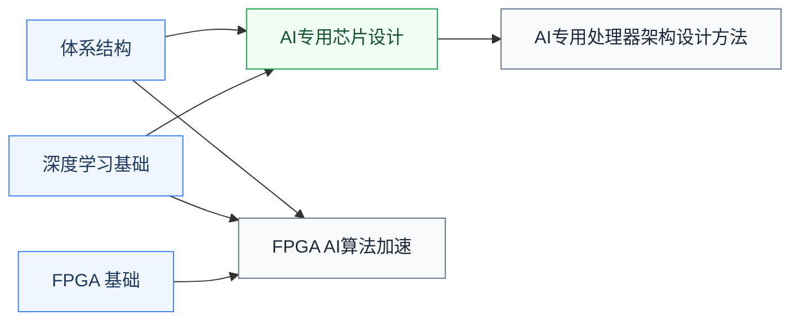

# AI加速器

为 AI 工作负载设计专用计算芯片这条线，与 [GPU体系结构](../GPU体系结构/index.md)并列。前置是[体系结构](../体系结构/index.md)，算法侧搭配[人工智能板块](../../人工智能/index.md)的深度学习基础。

## 复旦校内课程（2025 培养方案）

以下课程页为占位骨架，欢迎修过的同学通过[参与建设](../../../参与建设.md)补全：

- **[AI专用处理器架构设计方法](FDU_ICSE40002.md)** — DSA 架构设计方法
- **[AI专用芯片设计](FDU_ICSE30036.md)** — AI 芯片设计实践
- **[基于FPGA的人工智能算法加速及应用](FDU_ICSE40018.md)** — 用 FPGA 实现 AI 加速，先修 [FPGA](../../电路/数字设计/FPGA/FDU_MICR130024.md)

## 公开课程（待补充）

加速器设计的公开课欢迎推荐；软件侧的模型压缩与部署见[人工智能/AI系统](../../人工智能/AI系统/index.md)（MIT 6.5940、CMU 10-414）。

## 相关科研方向

- [AI 算法与系统](../../../科研方向/AI算法与系统.md)
- [处理器架构与编译系统](../../../科研方向/处理器架构与编译系统.md)
- [存算一体与近存计算](../../../科研方向/存算一体与近存计算.md)
- [可重构计算与FPGA](../../../科研方向/可重构计算与FPGA.md)

