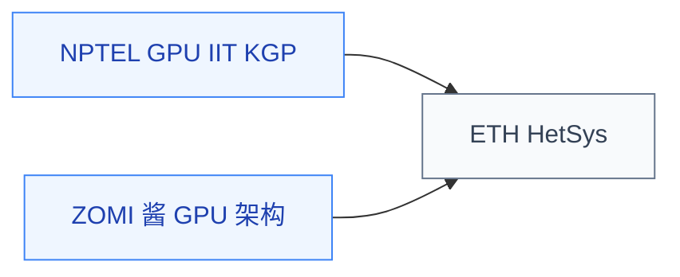

# GPU 体系结构

GPU 是现代 AI 训练、图形渲染、科学计算的核心硬件。GPU 体系结构研究 **warp 调度、访存合并、缓存层次、Tensor Core 微架构、HBM 内存接口** 等问题——这些是 AI 芯片设计、GPU 微架构研究、系统级性能优化的基础。

与并行编程（CS149 等）不同，GPU 体系结构关注的是**硬件内部如何运作**，而非如何写并行程序。

## 相关科研方向

- [AI 算法与系统](../../../科研方向/AI算法与系统.md)
- [处理器架构与编译系统](../../../科研方向/处理器架构与编译系统.md)

