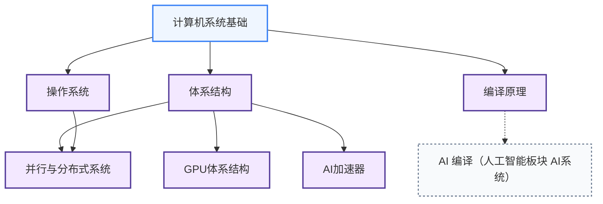

# 系统架构

从计算机如何执行一条指令，到 GPU 如何并行调度上万个线程，这个板块覆盖“软件如何在硬件上运行”这条完整的知识链。对做硬件研究的人来说，体系结构和编译原理是最直接相关的两个子方向。

## 课程关系

箭头从前置课程指向后置课程，虚线表示通向其他板块的去向。

计算机系统基础是全板块的公共入口。往上分三条路：体系结构通向 GPU 体系结构、AI 加速器和并行与分布式系统，是做硬件的主线；操作系统和并行与分布式系统是做系统软件的主线；编译原理自成一条线，通向人工智能板块的 AI 编译。

---

**[计算机系统基础](计算机系统基础/index.md)** — 计算机组成原理、CSAPP；从头建立“程序在硬件上怎么跑”的系统性图景，是所有后续内容的前置。

**[体系结构](体系结构/)** — 处理器微架构、流水线、缓存层次、内存系统；研究处理器和加速器设计的核心知识。

**[操作系统](操作系统/)** — 进程、内存管理、文件系统；系统栈的另一主干层次，做架构与编译方向建议选修。

**[编译原理](编译原理/)** — 词法分析、中间表示、代码优化；理解编译器如何把高级语言映射到硬件指令，是研究 LLVM/MLIR/TVM 的前置基础。

**[并行与分布式系统](并行与分布式系统/)** — MPI、CUDA 编程模型、cache coherence；做 AI 系统和大规模计算的必备背景。

**[GPU体系结构](GPU体系结构/)** — warp 调度、访存合并、Tensor Core、HBM；GPU 硬件内部如何运作，区别于并行编程。

**[AI加速器](AI加速器/index.md)** — AI 专用处理器与芯片设计、FPGA 加速；复旦 2025 培养方案的特色课程线。

## 相关科研方向

| 对应科研方向 | 推荐子板块 | 为什么 |
|---|---|---|
| [处理器架构与编译系统](../../科研方向/处理器架构与编译系统.md) | 体系结构 + 编译原理 + 计算机系统基础 | 这是该方向的本体课程链——ISCA/MICRO/CGO/PLDI 论文的全部前置 |
| [可重构计算与FPGA](../../科研方向/可重构计算与FPGA.md) | 体系结构 + 编译原理 | HLS、Overlay、FPGA 软核都依赖这两个领域 |
| [存算一体与近存计算](../../科研方向/存算一体与近存计算.md) | 体系结构 (内存层次) | 近存计算的根问题是 memory wall——CSAPP/CS61C 的内存章节 |
| [AI 算法与系统](../../科研方向/AI算法与系统.md) | 并行与分布式 + 编译原理 | vLLM/Megatron 内部就是分布式系统 + 编译优化 |
| [硬件安全与可信计算](../../科研方向/硬件安全与可信计算.md) | 体系结构 | 侧信道攻击的本质是微架构状态泄露,缓存与推测执行是攻击面 |
| [EDA 与设计自动化](../../科研方向/EDA与设计自动化.md) | 编译原理 | 数字 EDA 综合本质是编译,只是目标语言换成硬件 |

> 做硬件研究的同学,推荐顺序:**计算机系统基础 → 体系结构 → 编译原理**——这三门是与芯片设计交叉最深的子板块,操作系统选修即可。

