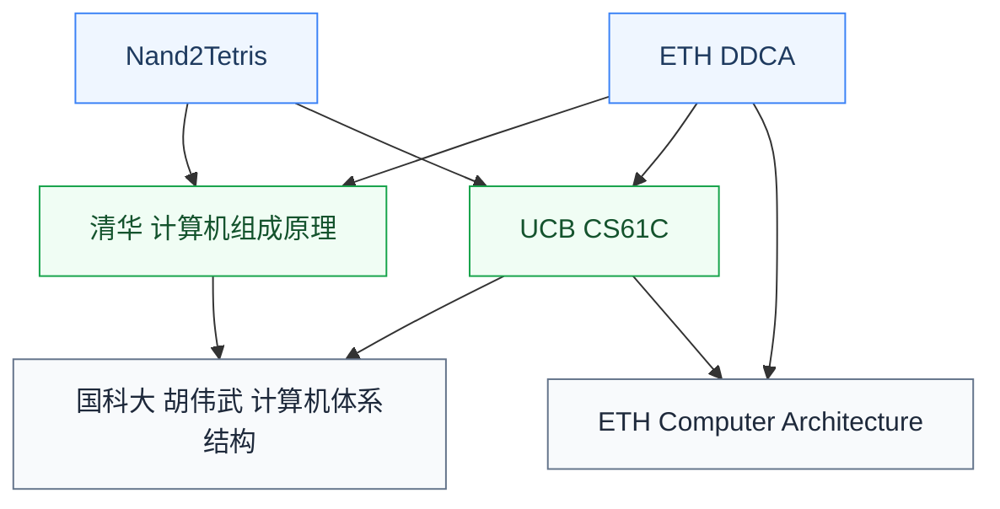

# 计算机体系结构

体系结构(Computer Architecture)研究**处理器及计算系统的设计**:指令集架构(ISA)、流水线、超标量、缓存层次、内存系统、多核、加速器、GPU 等。这是与硬件设计交叉最深的 CS 子方向,也是 IC 研究生最常选择的“软硬交叉”方向之一。

## 相关科研方向

- [处理器架构与编译系统](../../../科研方向/处理器架构与编译系统.md)
- [可重构计算与FPGA](../../../科研方向/可重构计算与FPGA.md)
- [存算一体与近存计算](../../../科研方向/存算一体与近存计算.md)

