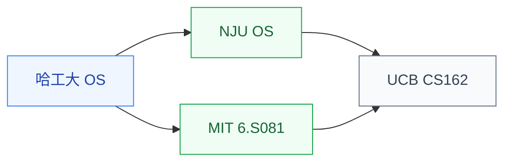

# 操作系统

操作系统研究**软件如何管理硬件资源**:进程调度、内存管理、文件系统、I/O 子系统、虚拟化、中断处理。它是系统类研究的“中间层”:上接编译/应用,下连体系结构。

对硬件方向的同学来说,操作系统是**理解软硬件协同**的关键——设计的硬件特性(缓存替换策略、虚拟内存、加速器接口)最终都需要 OS 适配才能被应用使用。

## 相关科研方向

- [处理器架构与编译系统](../../../科研方向/处理器架构与编译系统.md)
- [硬件安全与可信计算](../../../科研方向/硬件安全与可信计算.md)
- [AI 算法与系统](../../../科研方向/AI算法与系统.md)

