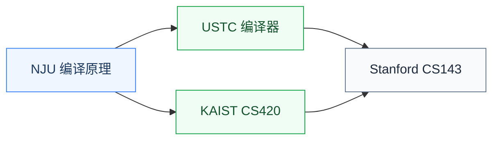

# 编译原理

编译原理研究**如何把高级语言翻译成可执行代码**:词法分析、语法分析、中间表示(IR)、代码优化、目标代码生成。它是连接编程语言与硬件指令的桥梁。

对硬件研究者来说,编译原理是 **AI 编译器(TVM/MLIR)、EDA 综合工具、硬件描述语言研究** 的直接前置。当今最热的领域如 AI 系统、领域特定语言(DSL)、加速器编译都依赖这门课的核心技能。

## 相关科研方向

- [处理器架构与编译系统](../../../科研方向/处理器架构与编译系统.md)
- [AI 算法与系统](../../../科研方向/AI算法与系统.md)
- [EDA 与设计自动化](../../../科研方向/EDA与设计自动化.md)

