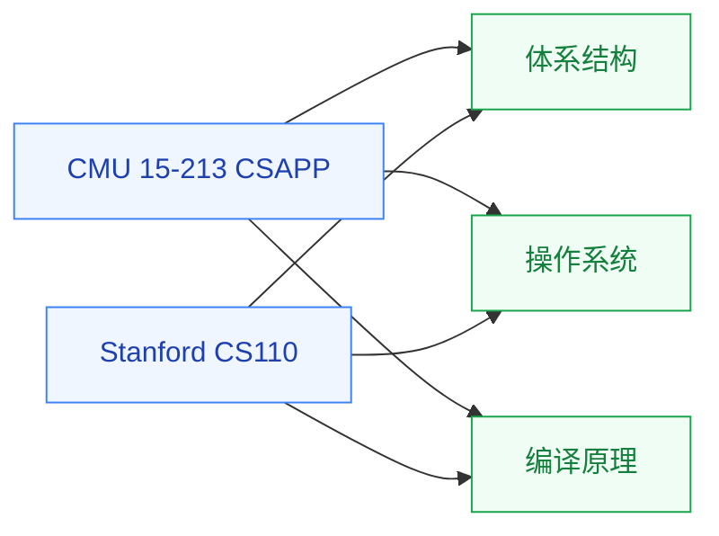

# 计算机系统基础

计算机系统基础是**所有“系统类”研究的入口**——它把“程序如何在硬件上运行”这件事讲清楚,涵盖汇编语言、内存模型、缓存层次、进程与线程、链接与加载、I/O 系统等核心概念。这是 [体系结构](../体系结构/)、[操作系统](../操作系统/)、[编译原理](../编译原理/) 的共同前置。

## 相关科研方向

- [处理器架构与编译系统](../../../科研方向/处理器架构与编译系统.md)
- [存算一体与近存计算](../../../科研方向/存算一体与近存计算.md)
- [硬件安全与可信计算](../../../科研方向/硬件安全与可信计算.md)

