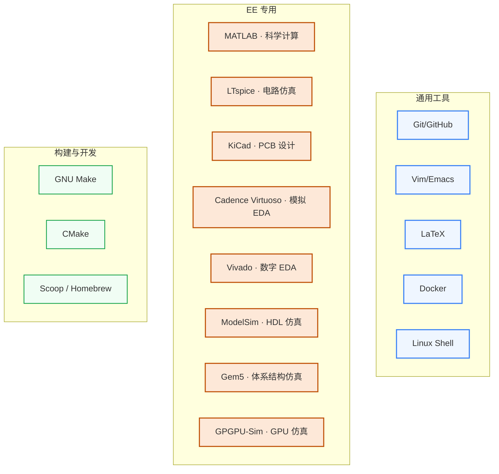

# 工程工具

工具不是用来“学完”的,而是**学到顺手**就够。这一板块覆盖做研究的常用工具,从代码协作(Git/GitHub)到论文撰写(LaTeX),从 EE 仿真(LTspice/Cadence)到体系结构仿真(Gem5/GPGPU-Sim)。

## 知识谱系

## [通用工具](Git.md)

任何方向都需要的工具:版本控制、文本编辑、论文写作、容器化、信息检索。不熟练这些会显著影响科研效率。

- **[Git](Git.md) / [GitHub](GitHub.md)** — 代码版本控制 + 协作的事实标准
- **[Vim](Vim.md)** — 高效文本编辑;远程服务器上没 IDE 时必备
- **[LaTeX](LaTeX.md)** — 论文/简历/PPT 排版,IEEE/ACM 等顶会模板都用 LaTeX
- **[Docker](Docker.md)** — 跑别人的代码再也不用配环境(尤其重要于 ML/EDA 工具复现)
- **[日常学习工作流](workflow.md)** / **[实用工具箱](tools.md)** / **[信息检索](信息检索.md)** / **[毕业论文](thesis.md)** — 软技能合集

## [EE 专用工具](科学计算.md)

只有做 IC/EE 才会接触的专业工具:

- **[MATLAB / 科学计算](科学计算.md)** — 信号处理、控制、仿真原型
- **[LTspice](LTspice.md)** — 模拟电路仿真,免费且工业级
- **[KiCad](KiCad.md)** — PCB 设计开源神器
- **[Cadence Virtuoso](../学习地图/电路/EDA/cadence.md)** — 模拟 IC 设计工业标准
- **[Vivado](../学习地图/电路/EDA/vivado.md)** — Xilinx FPGA 综合 + 实现
- **[ModelSim](ModelSim.md)** — HDL 仿真器(数字验证入门)
- **[Gem5](Gem5.md)** — 体系结构研究的“国民仿真器”,ISCA/MICRO 标配
- **[GPGPU-Sim](GPGPUSIM.md)** — GPU 仿真,做 GPU 架构研究必备

## [构建与开发](GNU_Make.md)

写大项目时绕不开的构建系统:

- **[GNU Make](GNU_Make.md)** — 经典构建工具,所有 EDA 项目都还在用
- **[CMake](CMake.md)** — 现代 C++ 项目标配
- **[Scoop](Scoop.md)** — Windows 包管理(类似 Mac 的 Homebrew)
- **[Emacs](Emacs.md)** — 与 Vim 二选一的资深编辑器

## 对科研方向的作用

| 方向 | 必备工具 |
|---|---|
| [处理器架构与编译系统](../科研方向/处理器架构与编译系统.md) | Gem5 + GPGPU-Sim + Linux Shell |
| [模拟与混合信号 IC](../科研方向/模拟与混合信号IC.md) | Cadence Virtuoso + LTspice + MATLAB |
| [可重构计算与FPGA](../科研方向/可重构计算与FPGA.md) | Vivado + ModelSim + Verilog/Chisel |
| [EDA 与设计自动化](../科研方向/EDA与设计自动化.md) | Cadence/Synopsys + Python + C++ + Make/CMake |
| [AI 算法与系统](../科研方向/AI算法与系统.md) | Docker + Git + Python 生态 |
| 任何方向 | Git + LaTeX + Linux Shell |
