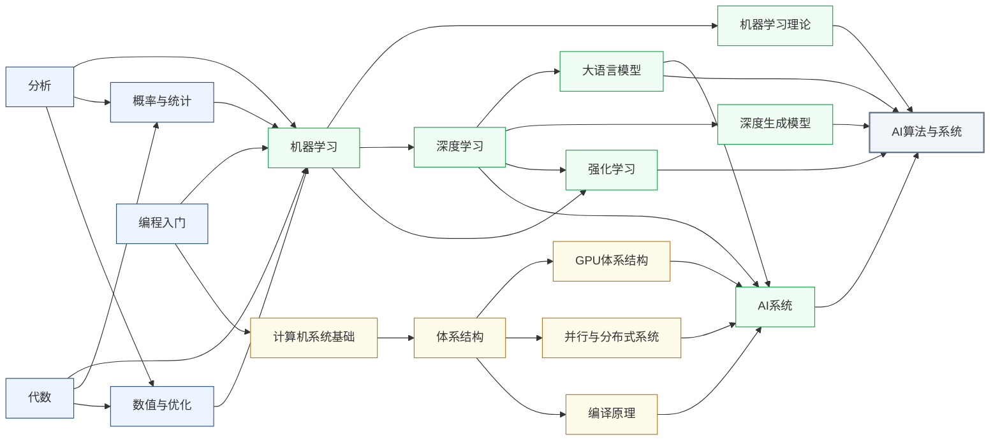

---
hide:
  - navigation
---
研究让机器更聪明的算法与系统基础，包括强化学习、大语言模型、AI Agent，以及让这些算法在真实系统上高效运行的软硬件基础设施。

<svg viewBox="0 0 1140 532" xmlns="http://www.w3.org/2000/svg" style="width:100%;max-width:1140px;display:block;margin:1.5rem auto;font-family:system-ui,-apple-system,sans-serif;">
  <rect width="1140" height="532" rx="10" fill="#FFFFFF" stroke="#CBD5E1" stroke-width="1.5"/>
  <text x="570" y="26" text-anchor="middle" font-size="17" font-weight="bold" fill="#1E293B">集成电路科研方向全景图</text>
  <text x="250" y="54" text-anchor="middle" font-size="13.5" font-weight="bold" fill="#0E7490">← 计算媒介更奇异</text>
  <text x="1000" y="54" text-anchor="middle" font-size="13.5" font-weight="bold" fill="#16A34A">更贴近物理世界 →</text>
  <defs><filter id="loc-b" x="-5%" y="-5%" width="110%" height="110%"><feGaussianBlur stdDeviation="1.4"/></filter></defs>
  <rect x="88" y="88" width="147" height="298" rx="6" fill="#ECFEFF"/>
  <rect x="239" y="88" width="147" height="298" rx="6" fill="#F8FAFC"/>
  <rect x="390" y="88" width="147" height="298" rx="6" fill="#FEF2F2"/>
  <rect x="541" y="88" width="289" height="298" rx="6" fill="#EFF6FF"/>
  <rect x="834" y="88" width="76" height="298" rx="6" fill="#FFFBEB"/>
  <rect x="914" y="88" width="218" height="298" rx="6" fill="#F0FDF4"/>
  <text x="161" y="82" text-anchor="middle" font-size="12" font-weight="bold" fill="#0E7490">量子 · 光子</text>
  <text x="312" y="82" text-anchor="middle" font-size="12" font-weight="bold" fill="#64748B">存算 · 类脑</text>
  <text x="463" y="82" text-anchor="middle" font-size="12" font-weight="bold" fill="#DC2626">模拟 · 射频</text>
  <text x="685" y="82" text-anchor="middle" font-size="13" font-weight="bold" fill="#1D4ED8">数字计算</text>
  <text x="872" y="82" text-anchor="middle" font-size="12" font-weight="bold" fill="#D97706">功率电子</text>
  <text x="1023" y="82" text-anchor="middle" font-size="12" font-weight="bold" fill="#16A34A">传感 · 生物 · 机械</text>
  <line x1="86" y1="92" x2="1132" y2="92" stroke="#E2E8F0" stroke-width="1"/>
  <line x1="86" y1="150" x2="1132" y2="150" stroke="#EEF2F6" stroke-width="1"/>
  <line x1="86" y1="208" x2="1132" y2="208" stroke="#EEF2F6" stroke-width="1"/>
  <line x1="86" y1="266" x2="1132" y2="266" stroke="#EEF2F6" stroke-width="1"/>
  <line x1="86" y1="324" x2="1132" y2="324" stroke="#EEF2F6" stroke-width="1"/>
  <line x1="86" y1="382" x2="1132" y2="382" stroke="#E2E8F0" stroke-width="1"/>
  <line x1="86" y1="92" x2="86" y2="382" stroke="#CBD5E1" stroke-width="1"/>
  <text x="81" y="124" text-anchor="end" font-size="10.5" fill="#475569">算法 / 应用</text>
  <text x="81" y="182" text-anchor="end" font-size="10.5" fill="#475569">系统 / 软件</text>
  <text x="81" y="240" text-anchor="end" font-size="10.5" fill="#475569">体系结构</text>
  <text x="81" y="298" text-anchor="end" font-size="10.5" fill="#475569">电路</text>
  <text x="81" y="356" text-anchor="end" font-size="10.5" fill="#475569">器件</text>
  <g filter="url(#loc-b)" opacity="0.42">
  <rect x="92" y="92" width="68" height="290" rx="5" fill="#CFFAFE" stroke="#0E7490" stroke-width="1.2"/>
  <text x="126" y="231" text-anchor="middle" font-size="10.5" font-weight="bold" fill="#0E7490">量子计算</text>
  <text x="126" y="246" text-anchor="middle" font-size="10.5" font-weight="bold" fill="#0E7490">与量子芯片</text>
  <rect x="163" y="92" width="68" height="290" rx="5" fill="#CFFAFE" stroke="#0E7490" stroke-width="1.2"/>
  <text x="197" y="231" text-anchor="middle" font-size="10.5" font-weight="bold" fill="#0E7490">光电子</text>
  <text x="197" y="246" text-anchor="middle" font-size="10.5" font-weight="bold" fill="#0E7490">与硅光集成</text>
  <rect x="394" y="266" width="68" height="116" rx="5" fill="#FEE2E2" stroke="#DC2626" stroke-width="1.2"/>
  <text x="428" y="317" text-anchor="middle" font-size="10.5" font-weight="bold" fill="#DC2626">模拟与</text>
  <text x="428" y="332" text-anchor="middle" font-size="10.5" font-weight="bold" fill="#DC2626">混合信号IC</text>
  <rect x="465" y="266" width="68" height="116" rx="5" fill="#FEE2E2" stroke="#DC2626" stroke-width="1.2"/>
  <text x="499" y="317" text-anchor="middle" font-size="10.5" font-weight="bold" fill="#DC2626">射频与</text>
  <text x="499" y="332" text-anchor="middle" font-size="10.5" font-weight="bold" fill="#DC2626">毫米波IC</text>
  <rect x="243" y="92" width="68" height="290" rx="5" fill="#FEE2E2" stroke="#DC2626" stroke-width="1.2"/>
  <text x="277" y="239" text-anchor="middle" font-size="11.5" font-weight="bold" fill="#DC2626">类脑芯片</text>
  <rect x="314" y="92" width="68" height="290" rx="5" fill="#EDE9FE" stroke="#7C3AED" stroke-width="1.2"/>
  <text x="348" y="231" text-anchor="middle" font-size="10.5" font-weight="bold" fill="#7C3AED">存算一体</text>
  <text x="348" y="246" text-anchor="middle" font-size="10.5" font-weight="bold" fill="#7C3AED">与近存计算</text>
  <rect x="545" y="92" width="68" height="290" rx="5" fill="#EDE9FE" stroke="#7C3AED" stroke-width="1.2"/>
  <text x="579" y="231" text-anchor="middle" font-size="10.5" font-weight="bold" fill="#7C3AED">硬件安全</text>
  <text x="579" y="246" text-anchor="middle" font-size="10.5" font-weight="bold" fill="#7C3AED">与可信计算</text>
  <rect x="616" y="92" width="68" height="174" rx="5" fill="#DBEAFE" stroke="#1D4ED8" stroke-width="1.2"/>
  <text x="650" y="172" text-anchor="middle" font-size="10.5" font-weight="bold" fill="#1D4ED8">AI 算法</text>
  <text x="650" y="187" text-anchor="middle" font-size="10.5" font-weight="bold" fill="#1D4ED8">与系统</text>
  <rect x="687" y="150" width="68" height="116" rx="5" fill="#DBEAFE" stroke="#1D4ED8" stroke-width="1.2"/>
  <text x="721" y="201" text-anchor="middle" font-size="10.5" font-weight="bold" fill="#1D4ED8">处理器架构</text>
  <text x="721" y="216" text-anchor="middle" font-size="10.5" font-weight="bold" fill="#1D4ED8">与编译系统</text>
  <rect x="758" y="208" width="68" height="116" rx="5" fill="#DBEAFE" stroke="#1D4ED8" stroke-width="1.2"/>
  <text x="792" y="259" text-anchor="middle" font-size="10.5" font-weight="bold" fill="#1D4ED8">可重构计算</text>
  <text x="792" y="274" text-anchor="middle" font-size="10.5" font-weight="bold" fill="#1D4ED8">与 FPGA</text>
  <rect x="838" y="266" width="68" height="116" rx="5" fill="#FEF3C7" stroke="#D97706" stroke-width="1.2"/>
  <text x="872" y="317" text-anchor="middle" font-size="10.5" font-weight="bold" fill="#B45309">功率半导体</text>
  <text x="872" y="332" text-anchor="middle" font-size="10" font-weight="bold" fill="#B45309">与宽禁带器件</text>
  <rect x="918" y="92" width="68" height="290" rx="5" fill="#ECFCCB" stroke="#65A30D" stroke-width="1.2"/>
  <text x="952" y="239" text-anchor="middle" font-size="11.5" font-weight="bold" fill="#4D7C0F">具身智能</text>
  <rect x="989" y="266" width="68" height="116" rx="5" fill="#D1FAE5" stroke="#059669" stroke-width="1.2"/>
  <text x="1023" y="317" text-anchor="middle" font-size="10.5" font-weight="bold" fill="#047857">生物电子</text>
  <text x="1023" y="332" text-anchor="middle" font-size="10.5" font-weight="bold" fill="#047857">与脑机接口</text>
  <rect x="1060" y="266" width="68" height="116" rx="5" fill="#DCFCE7" stroke="#16A34A" stroke-width="1.2"/>
  <text x="1094" y="317" text-anchor="middle" font-size="10.5" font-weight="bold" fill="#15803D">MEMS 与</text>
  <text x="1094" y="332" text-anchor="middle" font-size="10.5" font-weight="bold" fill="#15803D">微纳传感器</text>
  </g>
  <text x="81" y="450" text-anchor="end" font-size="10.5" fill="#475569">各方向通用</text>
  <g filter="url(#loc-b)" opacity="0.42">
  <rect x="92" y="408" width="1040" height="28" rx="5" fill="#F1F5F9" stroke="#64748B" stroke-width="1.1"/>
  <text x="612" y="426" text-anchor="middle" font-size="12" font-weight="bold" fill="#475569">EDA 与设计自动化</text>
  <rect x="92" y="440" width="1040" height="28" rx="5" fill="#EEF2F6" stroke="#64748B" stroke-width="1.1"/>
  <text x="612" y="458" text-anchor="middle" font-size="12" font-weight="bold" fill="#475569">先进封装与系统集成</text>
  <rect x="92" y="472" width="1040" height="30" rx="5" fill="#E2E8F0" stroke="#475569" stroke-width="1.2"/>
  <text x="612" y="491" text-anchor="middle" font-size="12" font-weight="bold" fill="#334155">半导体器件与先进工艺</text>
  </g>
  <rect x="92" y="512" width="13" height="13" rx="2" fill="#DBEAFE" stroke="#1D4ED8" stroke-width="1.1"/>
  <text x="110" y="522" text-anchor="start" font-size="10.5" fill="#475569">数字</text>
  <rect x="160" y="512" width="13" height="13" rx="2" fill="#FEE2E2" stroke="#DC2626" stroke-width="1.1"/>
  <text x="178" y="522" text-anchor="start" font-size="10.5" fill="#475569">模拟</text>
  <rect x="228" y="512" width="13" height="13" rx="2" fill="#EDE9FE" stroke="#7C3AED" stroke-width="1.1"/>
  <text x="246" y="522" text-anchor="start" font-size="10.5" fill="#475569">数字 / 模拟 交叉</text>
  <rect x="600" y="95" width="104" height="174" rx="9" fill="#1E293B" opacity="0.16"/>
  <rect x="598" y="92" width="104" height="174" rx="9" fill="#DBEAFE" stroke="#1D4ED8" stroke-width="2.6"/>
  <text x="650" y="172" text-anchor="middle" font-size="13" font-weight="bold" fill="#1D4ED8">AI 算法</text>
  <text x="650" y="187" text-anchor="middle" font-size="13" font-weight="bold" fill="#1D4ED8">与系统</text>
</svg>

## 这个方向在研究什么

2024 年 7 月，OpenAI 披露了一份内部 AGI 路线图，把 AI 的发展分成五级：

- **L1：对话型**(自然语言交互)
- **L2：推理型**(解博士级问题)
- **L3：行动型**(自主完成几小时到几天的多步任务)
- **L4：创新型**(协助发明)
- **L5：组织型**(替代整个组织)

思维链(Chain-of-Thought)让模型学会一步步推理，**L2 如今已稳稳实现**。最近一年，Claude Code 和 Codex 迅猛发展，如今的 AI 不仅能写出稳健的代码，还能轻松管理大型项目。**L3 也基本实现**。至于 L4，AI for Science 已经在蛋白质结构(AlphaFold)、新材料发现上大放异彩。从 2022 年至今，AI 的每一步跨越，都不是靠某个单点的高歌猛进。模型能力、系统效率、训练数据三者相互制约，需要同步推进。

<svg viewBox="0 0 880 305" xmlns="http://www.w3.org/2000/svg" style="width:100%;max-width:880px;display:block;margin:1.5rem auto;font-family:system-ui,-apple-system,sans-serif">
  <text x="440.0" y="28" text-anchor="middle" font-size="15" font-weight="700" fill="#1E293B">OpenAI 2024 年 7 月披露的 AGI 5 级路线图</text>
  <text x="440.0" y="46" text-anchor="middle" font-size="12" fill="#64748B">每跨一级,需要算法、系统、数据三方面同步突破</text>
  <rect x="10.0" y="60" width="164.0" height="6" rx="2" fill="#3B82F6"/>
  <rect x="10.0" y="66" width="164.0" height="224" rx="0" fill="#DBEAFE" stroke="#1E40AF" stroke-width="1.2"/>
  <text x="92.0" y="98" text-anchor="middle" font-size="22" font-weight="800" fill="#1E40AF">L1</text>
  <text x="92.0" y="124" text-anchor="middle" font-size="15" font-weight="700" fill="#1E293B">对话型</text>
  <text x="92.0" y="140" text-anchor="middle" font-size="10" fill="#64748B" font-style="italic">Chatbots</text>
  <line x1="24.0" y1="152" x2="160.0" y2="152" stroke="#1E40AF" stroke-width="0.6" opacity="0.4"/>
  <text x="92.0" y="168" text-anchor="middle" font-size="11" fill="#475569">对话能力 / 自然语言交互</text>
  <text x="92.0" y="197" text-anchor="middle" font-size="10" fill="#94A3B8">代表产品</text>
  <text x="92.0" y="211" text-anchor="middle" font-size="10" font-weight="600" fill="#1E40AF">ChatGPT</text>
  <text x="92.0" y="223" text-anchor="middle" font-size="10" font-weight="600" fill="#1E40AF">Claude</text>
  <text x="92.0" y="235" text-anchor="middle" font-size="10" font-weight="600" fill="#1E40AF">Gemini</text>
  <rect x="52.0" y="268" width="80" height="16" rx="3" fill="#1E40AF"/>
  <text x="92.0" y="279" text-anchor="middle" font-size="9" font-weight="700" fill="#FFFFFF">已稳定</text>
  <rect x="184.0" y="60" width="164.0" height="6" rx="2" fill="#06B6D4"/>
  <rect x="184.0" y="66" width="164.0" height="224" rx="0" fill="#CFFAFE" stroke="#0E7490" stroke-width="1.2"/>
  <text x="266.0" y="98" text-anchor="middle" font-size="22" font-weight="800" fill="#0E7490">L2</text>
  <text x="266.0" y="124" text-anchor="middle" font-size="15" font-weight="700" fill="#1E293B">推理型</text>
  <text x="266.0" y="140" text-anchor="middle" font-size="10" fill="#64748B" font-style="italic">Reasoners</text>
  <line x1="198.0" y1="152" x2="334.0" y2="152" stroke="#0E7490" stroke-width="0.6" opacity="0.4"/>
  <text x="266.0" y="168" text-anchor="middle" font-size="11" fill="#475569">博士级问题求解</text>
  <text x="266.0" y="197" text-anchor="middle" font-size="10" fill="#94A3B8">代表产品</text>
  <text x="266.0" y="211" text-anchor="middle" font-size="10" font-weight="600" fill="#0E7490">o1 / o3</text>
  <text x="266.0" y="223" text-anchor="middle" font-size="10" font-weight="600" fill="#0E7490">DeepSeek-R1</text>
  <text x="266.0" y="235" text-anchor="middle" font-size="10" font-weight="600" fill="#0E7490">Claude thinking</text>
  <rect x="226.0" y="268" width="80" height="16" rx="3" fill="#0E7490"/>
  <text x="266.0" y="279" text-anchor="middle" font-size="9" font-weight="700" fill="#FFFFFF">已实现 (2024)</text>
  <rect x="358.0" y="60" width="164.0" height="6" rx="2" fill="#F59E0B"/>
  <rect x="358.0" y="66" width="164.0" height="224" rx="0" fill="#FEF3C7" stroke="#B45309" stroke-width="1.2"/>
  <text x="440.0" y="98" text-anchor="middle" font-size="22" font-weight="800" fill="#B45309">L3</text>
  <text x="440.0" y="124" text-anchor="middle" font-size="15" font-weight="700" fill="#1E293B">行动型</text>
  <text x="440.0" y="140" text-anchor="middle" font-size="10" fill="#64748B" font-style="italic">Agents</text>
  <line x1="372.0" y1="152" x2="508.0" y2="152" stroke="#B45309" stroke-width="0.6" opacity="0.4"/>
  <text x="440.0" y="168" text-anchor="middle" font-size="11" fill="#475569">自主完成长任务</text>
  <text x="440.0" y="181" text-anchor="middle" font-size="11" fill="#475569">(数小时-数天)</text>
  <text x="440.0" y="210" text-anchor="middle" font-size="10" fill="#94A3B8">代表产品</text>
  <text x="440.0" y="224" text-anchor="middle" font-size="10" font-weight="600" fill="#B45309">Claude Code</text>
  <text x="440.0" y="236" text-anchor="middle" font-size="10" font-weight="600" fill="#B45309">Devin</text>
  <text x="440.0" y="248" text-anchor="middle" font-size="10" font-weight="600" fill="#B45309">ChatGPT Operator</text>
  <rect x="400.0" y="268" width="80" height="16" rx="3" fill="#B45309"/>
  <text x="440.0" y="279" text-anchor="middle" font-size="9" font-weight="700" fill="#FFFFFF">加速中</text>
  <rect x="532.0" y="60" width="164.0" height="6" rx="2" fill="#94A3B8"/>
  <rect x="532.0" y="66" width="164.0" height="224" rx="0" fill="#F1F5F9" stroke="#64748B" stroke-width="1.2"/>
  <text x="614.0" y="98" text-anchor="middle" font-size="22" font-weight="800" fill="#64748B">L4</text>
  <text x="614.0" y="124" text-anchor="middle" font-size="15" font-weight="700" fill="#1E293B">创新型</text>
  <text x="614.0" y="140" text-anchor="middle" font-size="10" fill="#64748B" font-style="italic">Innovators</text>
  <line x1="546.0" y1="152" x2="682.0" y2="152" stroke="#64748B" stroke-width="0.6" opacity="0.4"/>
  <text x="614.0" y="168" text-anchor="middle" font-size="11" fill="#475569">协助科学发明 / 提出新想法</text>
  <text x="614.0" y="197" text-anchor="middle" font-size="10" fill="#94A3B8">代表产品</text>
  <text x="614.0" y="211" text-anchor="middle" font-size="10" font-weight="600" fill="#64748B">—</text>
  <rect x="574.0" y="268" width="80" height="16" rx="3" fill="#64748B"/>
  <text x="614.0" y="279" text-anchor="middle" font-size="9" font-weight="700" fill="#FFFFFF">远期</text>
  <rect x="706.0" y="60" width="164.0" height="6" rx="2" fill="#94A3B8"/>
  <rect x="706.0" y="66" width="164.0" height="224" rx="0" fill="#F1F5F9" stroke="#64748B" stroke-width="1.2"/>
  <text x="788.0" y="98" text-anchor="middle" font-size="22" font-weight="800" fill="#64748B">L5</text>
  <text x="788.0" y="124" text-anchor="middle" font-size="15" font-weight="700" fill="#1E293B">组织型</text>
  <text x="788.0" y="140" text-anchor="middle" font-size="10" fill="#64748B" font-style="italic">Organizations</text>
  <line x1="720.0" y1="152" x2="856.0" y2="152" stroke="#64748B" stroke-width="0.6" opacity="0.4"/>
  <text x="788.0" y="168" text-anchor="middle" font-size="11" fill="#475569">替代整个组织运作</text>
  <text x="788.0" y="197" text-anchor="middle" font-size="10" fill="#94A3B8">代表产品</text>
  <text x="788.0" y="211" text-anchor="middle" font-size="10" font-weight="600" fill="#64748B">—</text>
  <rect x="748.0" y="268" width="80" height="16" rx="3" fill="#64748B"/>
  <text x="788.0" y="279" text-anchor="middle" font-size="9" font-weight="700" fill="#FFFFFF">远期</text>
</svg>

早期，大家都信奉一个朴素真理——模型越大越聪明，这就是**Scaling Law**。ChatGPT 刚发布那段时间，参数规模、数据量、算力同步增加，模型能力持续提升。直到 Llama 3 的 4050 亿参数版本，Meta 动用 1.6 万张 H100 训了 54 天，继续扩大规模，提升越来越小。研究重心随之转向提高训练效率。**MoE**（Mixture of Experts，混合专家；如 DeepSeek-V3）把模型拆成一群”专家”，每次只激活一两个，让参数规模和计算成本脱钩。**强化学习**的作用同样关键。R1-Zero 只用少量”冷启动”数据引导模型写推理过程，其余由 RL 自主探索，思维链由此趋于稳定，也支撑了 L2 的实现。模型输入也从纯文本扩展到图像和视频，即**多模态**（multimodal；如 GPT-4V、Sora）。

<svg viewBox="0 0 760 340" xmlns="http://www.w3.org/2000/svg" style="width:100%;max-width:760px;display:block;margin:1.5rem auto;font-family:system-ui,-apple-system,sans-serif;">
  <defs>
    <marker id="aiAx" markerWidth="9" markerHeight="9" refX="6" refY="3" orient="auto"><path d="M0,0 L0,6 L8,3 z" fill="#475569"/></marker>
    <marker id="aiTurn" markerWidth="9" markerHeight="9" refX="6" refY="3" orient="auto"><path d="M0,0 L0,6 L8,3 z" fill="#C2410C"/></marker>
  </defs>
  <rect width="760" height="340" rx="10" fill="#F8FAFC" stroke="#CBD5E1" stroke-width="1.5"/>
  <text x="380" y="30" text-anchor="middle" font-size="15" font-weight="bold" fill="#1E293B">规模扩展的边际收益递减</text>
  <line x1="90" y1="250" x2="660" y2="250" stroke="#475569" stroke-width="1.6" marker-end="url(#aiAx)"/>
  <line x1="90" y1="250" x2="90" y2="55" stroke="#475569" stroke-width="1.6" marker-end="url(#aiAx)"/>
  <text x="660" y="270" text-anchor="end" font-size="12" fill="#64748B">算力 / 参数规模 →</text>
  <text x="84" y="62" text-anchor="end" font-size="12" fill="#64748B">能力</text>
  <path d="M 100,244 C 180,150 250,112 360,102 C 470,93 560,91 620,90" fill="none" stroke="#2563EB" stroke-width="2.6"/>
  <line x1="560" y1="80" x2="560" y2="250" stroke="#DC2626" stroke-width="1.4" stroke-dasharray="5 4"/>
  <text x="560" y="74" text-anchor="middle" font-size="12" font-weight="bold" fill="#B91C1C">瓶颈</text>
  <text x="560" y="241" text-anchor="middle" font-size="11" fill="#9A3412">继续扩大规模，提升有限</text>
  <circle cx="560" cy="91" r="4.5" fill="#1D4ED8"/>
  <text x="548" y="118" text-anchor="end" font-size="11" fill="#1E40AF">Llama 3 · 4050 亿参数</text>
  <text x="548" y="131" text-anchor="end" font-size="11" fill="#1E40AF">1.6 万张 H100 · 54 天</text>
  <path d="M 620,98 C 672,165 668,250 562,282" fill="none" stroke="#C2410C" stroke-width="1.8" marker-end="url(#aiTurn)"/>
  <rect x="360" y="288" width="360" height="42" rx="7" fill="#FFF7ED" stroke="#C2410C" stroke-width="1.3"/>
  <text x="540" y="306" text-anchor="middle" font-size="12" font-weight="bold" fill="#9A3412">转向更高效的训练方法</text>
  <text x="540" y="321" text-anchor="middle" font-size="10.5" fill="#C2410C">MoE · 强化学习(R1-Zero) · 多模态</text>
</svg>

实际部署中，LLM 遇到的主要瓶颈在系统的显存和带宽。注意力（Attention）机制需要序列内每个词两两交互，过程中产生大量中间矩阵，在显存（HBM）和计算核心之间反复传输，带宽消耗很大。上下文越长，需要缓存的 **KV Cache**（Key-Value Cache，键值缓存）越大，显存压力越重。**Flash Attention** 把注意力计算分块，数据从 HBM 取出后在片上完成计算再写回，大幅减少访存次数。**vLLM 的 PagedAttention**（分页注意力）借鉴虚拟内存的分页机制管理 KV Cache，提高显存利用率。**量化**针对另一类冗余。神经网络权重的数值分布集中在窄区间，从 32 位浮点压到 8 位甚至 4 位整数，精度损失极小。这条线最贴近硬件，微电子背景在这里有直接优势。在模型外套一层 **Agent**（智能体），通过控制框架引导模型调用工具、分步完成任务，模型的行动能力从单次推理扩展到多步操作，即 L3。Claude Code 等都属于这类工程实践。

<svg viewBox="0 0 820 400" xmlns="http://www.w3.org/2000/svg" style="width:100%;max-width:820px;display:block;margin:1.5rem auto;font-family:system-ui,-apple-system,sans-serif;">
  <defs>
    <marker id="aiRW" markerWidth="8" markerHeight="8" refX="4" refY="3" orient="auto"><path d="M0,0 L0,6 L7,3 z" fill="#DC2626"/></marker>
    <marker id="aiFA" markerWidth="8" markerHeight="8" refX="6" refY="3" orient="auto"><path d="M0,0 L0,6 L7,3 z" fill="#16A34A"/></marker>
  </defs>
  <rect width="820" height="400" rx="10" fill="#F8FAFC" stroke="#CBD5E1" stroke-width="1.5"/>
  <text x="410" y="26" text-anchor="middle" font-size="15" font-weight="bold" fill="#1E293B">内存墙：注意力的瓶颈在于频繁访存</text>
  <text x="410" y="44" text-anchor="middle" font-size="12" fill="#64748B">Flash Attention 通过分块将计算保持在片上，减少 HBM 访问</text>
  <rect x="24" y="60" width="372" height="272" rx="10" fill="#FEF2F2" stroke="#FCA5A5" stroke-width="1.4"/>
  <text x="210" y="84" text-anchor="middle" font-size="13" font-weight="bold" fill="#B91C1C">朴素注意力</text>
  <rect x="64" y="100" width="292" height="44" rx="6" fill="#FFE4E6" stroke="#F43F5E" stroke-width="1.2"/>
  <text x="210" y="127" text-anchor="middle" font-size="12" fill="#9F1239">计算核心 · 片上 SRAM</text>
  <rect x="64" y="248" width="292" height="44" rx="6" fill="#FECACA" stroke="#EF4444" stroke-width="1.2"/>
  <text x="210" y="275" text-anchor="middle" font-size="12" fill="#7F1D1D">片外显存 HBM</text>
  <line x1="110" y1="146" x2="110" y2="246" stroke="#DC2626" stroke-width="1.6" marker-start="url(#aiRW)" marker-end="url(#aiRW)"/>
  <line x1="160" y1="146" x2="160" y2="246" stroke="#DC2626" stroke-width="1.6" marker-start="url(#aiRW)" marker-end="url(#aiRW)"/>
  <line x1="260" y1="146" x2="260" y2="246" stroke="#DC2626" stroke-width="1.6" marker-start="url(#aiRW)" marker-end="url(#aiRW)"/>
  <line x1="310" y1="146" x2="310" y2="246" stroke="#DC2626" stroke-width="1.6" marker-start="url(#aiRW)" marker-end="url(#aiRW)"/>
  <text x="210" y="201" text-anchor="middle" font-size="11" font-weight="bold" fill="#B91C1C">中间结果反复读写</text>
  <rect x="424" y="60" width="372" height="272" rx="10" fill="#F0FDF4" stroke="#86EFAC" stroke-width="1.4"/>
  <text x="610" y="84" text-anchor="middle" font-size="13" font-weight="bold" fill="#15803D">Flash Attention（分块）</text>
  <rect x="464" y="100" width="292" height="44" rx="6" fill="#DCFCE7" stroke="#22C55E" stroke-width="1.2"/>
  <rect x="486" y="112" width="20" height="20" rx="2" fill="#86EFAC" stroke="#16A34A" stroke-width="0.8"/>
  <rect x="512" y="112" width="20" height="20" rx="2" fill="#86EFAC" stroke="#16A34A" stroke-width="0.8"/>
  <rect x="538" y="112" width="20" height="20" rx="2" fill="#86EFAC" stroke="#16A34A" stroke-width="0.8"/>
  <text x="660" y="126" text-anchor="middle" font-size="11" fill="#166534">分块在片上完成</text>
  <rect x="464" y="248" width="292" height="44" rx="6" fill="#BBF7D0" stroke="#16A34A" stroke-width="1.2"/>
  <text x="610" y="275" text-anchor="middle" font-size="12" fill="#14532D">显存 HBM</text>
  <line x1="540" y1="146" x2="540" y2="246" stroke="#16A34A" stroke-width="1.8" marker-end="url(#aiFA)"/>
  <text x="516" y="201" text-anchor="end" font-size="11" fill="#15803D">读入分块</text>
  <line x1="680" y1="246" x2="680" y2="146" stroke="#16A34A" stroke-width="1.8" marker-end="url(#aiFA)"/>
  <text x="704" y="201" text-anchor="start" font-size="11" fill="#15803D">写回结果</text>
  <text x="210" y="356" text-anchor="middle" font-size="12" font-weight="bold" fill="#B91C1C">频繁访存，带宽受限</text>
  <text x="610" y="356" text-anchor="middle" font-size="12" font-weight="bold" fill="#15803D">访存大幅减少，带宽友好</text>
  <text x="410" y="384" text-anchor="middle" font-size="11" fill="#64748B">量化：权重集中于窄区间，由 32 位浮点降至 4 位整数，精度损失很小</text>
</svg>

算法和系统之外，训练数据的规模和质量同样决定模型上限。GPT-4、Llama 3 这个量级，训练数据在 10 到 15 万亿词（token），几乎覆盖了开放互联网上的高质量内容。公开数据目前已接近上限，新增来源主要有两类。一类是**合成数据**，用已有强模型生成新数据训练下一代，比如 Tesla 的 FSD 通过仿真生成暴雨夜驾、行人突然横穿等极端场景。另一类是**专家精选数据**，包括科学论文、专业推理过程标注，或专门为模型设计的高难度题库。

以上方向都还在 LLM 这条路上。LLM 的基本范式是否正确，本身存在争议。Yann LeCun 长期批评逐词预测的训练方式，认为模型学不到物理世界的规律。他主推的 **JEPA**（Joint-Embedding Predictive Architecture，联合嵌入预测架构）让模型预测视频中被遮住部分的高层语义（”这是个球，正在落地”），而不是逐像素还原。**神经符号**（Neuro-symbolic）则尝试把神经网络的感知能力和符号系统的严格推理结合起来。这些方向目前都在发展，尚无明显定论。

把越来越多的决策交给模型，前提是能解释它的行为，也能约束它的边界。2026 年 2 月的中东战事里，Claude 把伊朗的一所小学误标成军火库，导致美军误炸，156 条无辜生命遇难。同类的还有越狱攻击、ChatGPT 写法律文书时引用根本不存在的判例被法庭处罚。**AI 安全**就是给模型划定可控的行为边界，比如 Anthropic 的**宪法 AI**（Constitutional AI）让模型按一组原则边生成边自检。**可解释性**的目标是弄清楚模型内部在做什么。LLM 的工作原理对人类来说至今基本不透明，权重矩阵的每次运算背后的语义尚不清楚。稀疏自编码器（Sparse Autoencoder, SAE）能从大模型的中间表征中识别出”概念神经元”，某个神经元的激活恰好对应”金门大桥”或”代码里的 bug”，是目前可解释性研究中少数有具体发现的方向。

前沿大模型的训练目前集中在少数大厂。成本是门槛之一，单次训练在 1 亿美元量级，但更难复制的壁垒是私有数据和算力。开放互联网的数据大家都能用，而 Google 的搜索行为、Meta 的社交内容、字节的视频互动这类私有数据只有大厂自己有，直接决定模型在真实任务上的能力上限。算力也一样，顶级大模型需要万卡级数据中心，背后是电力、液冷、高速互联，高校难以独立建设。但学术界并没有被完全排除在外，在大厂开源模型底座（Llama、DeepSeek）后，学术界可以在后训练、推理优化、可解释性等方向深入，产出的成果再被工业界采用。像Flash Attention 出自 Stanford，vLLM 出自 UC Berkeley，AWQ 出自 MIT，这些工作后来都被大厂的推理引擎采用。

### 核心研究问题

- **模型架构与数据效率**：纯扩大参数规模已遇到边际递减，MoE 把参数规模和算力解耦但路由与稀疏激活尚未解决，公开高质量语料接近耗尽、合成数据存在退化风险，新架构和数据工程需要同步推进。
- **强化学习与后训练**：R1-Zero 式 RL 撑起了思维链推理，但奖励设计、训练稳定性、对齐和样本效率都不成熟。
- **Agent 与多智能体**：agent 把推理变成对外界的多步操作，长任务里错误一路累积，多个角色怎么分工、错误怎么发现和回滚，方法还不成型。
- **训练与 serving 系统**：万卡集群上的并行训练、低成本 LLM serving、端边云推理调度，要在带宽、显存、通信之间反复权衡。
- **高效推理与量化**：上下文越长 KV Cache 越吃显存，Flash Attention 靠片上分块减少访存、量化把权重压到 4 位精度损失极小，但哪些权重该保精度、加速器和编译器如何充分利用这部分加速效果，是软硬协同的难题。
- **多模态**：从纯文本走向理解图像视频，视觉-语言基础模型怎么对齐不同模态、又不丢失各自的信息。
- **可解释性与 AI 安全**：把更多决策交给模型，得靠稀疏自编码器这类工具看清内部在做什么，再用宪法 AI 一类机制划出可控的行为边界。
- **LLM 之外的范式**：LeCun 的 JEPA 和 Neuro-symbolic 质疑 token 级预测学不到世界规律，世界模型与符号推理的融合是另一条在走的路。

### 知识路径

数学三件套（线性代数 + 微积分/分析 + 概率统计）是算法线入口，优化理论贯穿整个训练流程；系统线（体系结构 + 并行 + 编译）和算法线在 AI 系统汇合。节点对应[学习地图](../学习地图/index.md)里的目录：

- 数学：[代数](../学习地图/数学/代数/index.md)（线性代数、矩阵分析） · [分析](../学习地图/数学/分析/index.md)（微积分、实分析） · [概率与统计](../学习地图/数学/概率与统计/index.md) · [数值与优化](../学习地图/数学/数值与优化/index.md)（梯度下降、凸优化）
- 算法编程：[编程入门](../学习地图/算法编程/编程入门/index.md)（Python）
- 人工智能：[机器学习](../学习地图/人工智能/机器学习/index.md) · [机器学习理论](../学习地图/人工智能/机器学习理论/index.md) · [深度学习](../学习地图/人工智能/深度学习/index.md) · [大语言模型](../学习地图/人工智能/大语言模型/index.md) · [深度生成模型](../学习地图/人工智能/深度生成模型/index.md) · [强化学习](../学习地图/人工智能/强化学习/index.md) · [AI系统](../学习地图/人工智能/AI系统/index.md)
- 系统架构：[计算机系统基础](../学习地图/系统架构/计算机系统基础/index.md) · [体系结构](../学习地图/系统架构/体系结构/index.md) · [GPU体系结构](../学习地图/系统架构/GPU体系结构/index.md) · [并行与分布式系统](../学习地图/系统架构/并行与分布式系统/index.md) · [编译原理](../学习地图/系统架构/编译原理/index.md)

## 这个方向适合谁

适合真心对“让模型更聪明、更高效”有热情的人。在集成电路各方向里，这个方向与 AI 的距离最近。如果做纯算法，那迭代节奏极快，成果挂 arXiv，论文周期短、迭代快，今天的 SOTA 三个月后就被超越，跟得上会兴奋，跟不上会焦虑。日常就是写 PyTorch、改模型、在 GPU 集群上排队跑实验。如果结合系统和硬件架构，则属于 AI Infra，非常适合微电子出身的同学。系统侧，量化、推理优化这些贴近硬件的工作，微电子背景能从访存带宽理解其节省的来源，纯软件出身的人未必有这个直觉；越往纯算法和理论走，数学要求越重，需要专门投入时间补足，难以靠硬件直觉弥补。

## 学术界

### 课题组

**境内**

-   **[马恺声](http://group.iiis.tsinghua.edu.cn/~maks/)** 清华

    LLM 高效推理 | 算法架构协同设计 | Chiplet 大模型加速器

-   **[高鸣宇](https://people.iiis.tsinghua.edu.cn/~gaomy/)** 清华

    稀疏注意力优化 | 私有推理架构 | 稀疏张量加速器

-   **[朱军](https://ml.cs.tsinghua.edu.cn/~jun/index.shtml)** 清华

    生成模型 | 扩散模型加速 | 低精度推理

-   **[唐杰](https://keg.cs.tsinghua.edu.cn/jietang/)** 清华

    大模型预训练 | 高效微调 | 分布式训练

-   **[刘知远](https://nlp.csai.tsinghua.edu.cn/~lzy/)** 清华

    大语言模型 | 模型压缩蒸馏 | 高效推理

-   **[陈键飞](https://ml.cs.tsinghua.edu.cn/~jianfei/)** 清华

    模型量化训练 | 稀疏剪枝 | 低比特大模型

-   **[曹婷](https://air.tsinghua.edu.cn/en/info/1046/1941.htm)** 清华 

    端侧 LLM 推理 | 量化压缩 | AI 加速器

-   **[邱锡鹏](https://xpqiu.github.io/)** 复旦

    大模型高效训练 | 长上下文推理 | 稀疏化与压缩

-   **[陈涛](https://eetchen.github.io/)** 复旦

    视觉大模型压缩 | 量化与剪枝加速 | 边缘高效推理

-   **[崔斌](https://cuibinpku.github.io/)** 北大

    分布式大模型训练 | 异构集群并行策略 | LLM 推理加速

-   **[杨耀东](https://yangyaodong.com/)** 北大

    大模型对齐训练 | 强化学习后训练 | 多智能体系统

-   **[谢洪](https://faculty.ustc.edu.cn/xiehong1/zh_CN/index.htm)** 中科大

    大模型强化微调 | 智能体规划与世界模型 | 科学智能

-   **[康奇宇](https://faculty.ustc.edu.cn/kangqiyu/zh_CN/index.htm)** 中科大

    大模型量化与高效推理 | 物理信息神经网络 | 多模态大模型

-   **[陈云霁](https://novel.ict.ac.cn/ychen_cn/)** 中科院

    神经网络专用处理器 | AI 编译器与算子生成 | 芯片设计自动化

-   **[陈全](https://www.cs.sjtu.edu.cn/~chen-quan/)** 交大

    DNN 推理系统 | 异构硬件调度 | AI 编译与加速

-   **[蒋力](https://cs.sjtu.edu.cn/~jiangli/)** 交大

    AI 专用处理器与编译器 | 神经网络压缩量化 | 存内计算架构

-   **[张伟楠](https://wnzhang.net/)** 交大

    大模型强化学习对齐 | 多智能体协作 | 具身与 GUI Agent

-   **[温颖](https://yingwen.io/)** 交大

    多智能体强化学习 | LLM Agent 决策 | 长时序信用分配

-   **[刘鹏飞](https://www.cs.sjtu.edu.cn/jiaoshiml/liupengfei.html)** 交大

    大模型复杂推理（o1 复现）· 预训练数据工程 | 多模态生成大模型

-   **[张拳石](https://faculty.sjtu.edu.cn/zhangquanshi/zh_CN/index.htm)** 交大

    神经网络可解释性（XAI 理论）· LLM 推理机制分析 | 深度学习泛化理论

-   **[高阳](https://cs.nju.edu.cn/gaoyang/)** 南大

    强化学习 | 多智能体学习 | 大模型推理与 Agent

-   **[周志华](https://cs.nju.edu.cn/zhouzh/)** 南大

    机器学习理论 | 集成学习 | 弱监督学习

-   **[吴飞](https://person.zju.edu.cn/wufei)** 浙大

    大模型指令微调 | 多模态大模型 | AI 系统与开放平台

-   **[周军](https://www.sice.uestc.edu.cn/info/1089/6303.htm)** 电子科大

    超低功耗 AI 芯片 | 算法-芯片协同设计 | 智能感知终端

-   **[刘洋](https://icse.uestc.edu.cn/info/1205/7310.htm)** 电子科大

    AI 芯片 | 忆阻器和神经网络 | 集成电路设计

<button class="prof-show-all">显示全部 ↓</button>

**境外**

-   **[Tao Yu（余涛）](https://taoyds.github.io/)** 港大

    LLM Agent | 代码生成（Spider/SWE）· 计算机使用智能体（OSWorld）

-   **[Kai Chen（陈凯）](https://cse.hkust.edu.hk/~kaichen/)** 港科大

    分布式训练网络 | AI 集群调度 | 高性能互联

-   **[James Tin Yau Kwok（郭天佑）](https://www.cse.ust.hk/~jamesk/)** 港科大

    模型压缩与量化 | 高效深度学习 | 联邦学习

-   **[Xiaowen Chu（褚晓文）](https://sites.google.com/view/chuxiaowen)** 港科大

    稀疏 LLM 推理系统 | KV 缓存压缩 | MoE 分布式训练

-   **[Tianqi Chen（陈天奇）](https://tqchen.com/)** CMU

    AI 编译器（TVM/Apache MXNet）· LLM 全平台部署（MLC-LLM）· ML 系统全栈

-   **[Zhihao Jia（贾志豪）](https://www.cs.cmu.edu/~zhihaoj2/)** CMU

    LLM 推理加速 | GPU 算子编译优化 | 分布式训练并行化

-   **[Graham Neubig](https://www.phontron.com/)** CMU

    LLM Agent 系统 | 代码生成与软件工程 | 多语言 NLP

-   **[Beidi Chen（陈贝迪）](https://www.andrew.cmu.edu/user/beidic/)** CMU 

    高效 LLM 推理 | 上下文稀疏性（Deja Vu） | 单卡推理（FlexGen）

-   **[Vijay Janapa Reddi](https://scholar.harvard.edu/vijay-janapa-reddi)** Harvard

    边缘 AI 推理 | TinyML 系统 | MLPerf 基准测试

-   **[Song Han（韩松）](https://hanlab.mit.edu/songhan)** MIT

    LLM 量化与压缩（AWQ/SmoothQuant）· 高效推理与稀疏注意力 | 端侧大模型部署

-   **[Vivienne Sze（施）](https://eems.mit.edu/)** MIT 

    神经网络加速器设计 | 稀疏计算加速（Eyeriss/HighLight）· 硬件-算法协同优化

-   **[Danqi Chen（陈丹琦）](https://www.cs.princeton.edu/~danqic/)** Princeton 

    大语言模型训练 | 长上下文推理 | 对齐与强化学习

-   **[Karthik Narasimhan](https://karthikncode.github.io/)** Princeton

    LLM Agent | 推理框架（ReAct/ToT） | 代码自动化（SWE-agent）

-   **[Percy Liang（梁）](https://cs.stanford.edu/~pliang/)** Stanford

    大模型从头训练 | 基础模型评测（HELM）· AI 系统基础设施

-   **[Fei-Fei Li（李飞飞）](https://profiles.stanford.edu/fei-fei-li)** Stanford 

    视觉语言基础模型 | 空间智能与 3D 理解 | 具身 AI 系统

-   **[Emma Brunskill](https://cs.stanford.edu/people/ebrun/)** Stanford 

    强化学习 | RL 调优 LLM | 教育医疗决策

-   **[Ion Stoica](https://people.eecs.berkeley.edu/~istoica/)** UC Berkeley

    LLM 推理服务（vLLM）· 多云分布式 AI 调度 | 开放评测平台

-   **[Matei Zaharia](https://people.eecs.berkeley.edu/~matei/)** UC Berkeley

    LLM 程序优化（DSPy）· 稀疏 MoE 训练 | 分布式数据与 ML 运行时

-   **[Joseph Gonzalez](https://people.eecs.berkeley.edu/~jegonzal/)** UC Berkeley

    LLM serving（SGLang/vLLM）· LLM Agent 与 API 调用 | 边缘端模型部署

-   **[Pieter Abbeel](https://people.eecs.berkeley.edu/~pabbeel/)** UC Berkeley

    视觉语言模型操控 | 机器人世界模型 | 从视频学习策略

-   **[Sergey Levine](https://people.eecs.berkeley.edu/~svlevine/)** UC Berkeley

    大模型机器人策略 | 离线强化学习 | 语言条件控制

-   **[Yi Ma（马毅）](https://people.eecs.berkeley.edu/~yima/)** UC Berkeley

    白盒 Transformer 理论 | 稀疏率压缩表示 | 可解释深度学习

-   **[Yuandong Tian（田渊栋）](https://yuandong-tian.com/)** Meta FAIR

    训练内存优化（GaLore） | LLM 量化与推理加速 | 隐空间推理（Coconut）

-   **[Deming Chen（陈德铭）](https://dchen.ece.illinois.edu/)** UIUC

    LLM 加速器设计 | AI 编译器（HLS） | FPGA 推理加速

<button class="prof-show-all">显示全部 ↓</button>

### 学术会议与期刊

  
会议
    NeurIPS
    ICML
    ICLR
    CVPR
    ICCV
    ACL
    EMNLP
    AAAI
    MLSys
    OSDI
  

  
期刊
    JMLR
    TPAMI
    Nature Machine Intelligence
  

## 毕业去向

### 企业

  
国内
    <a href="https://www.zhipuai.cn">智谱 AI（Z.ai）</a>
    <a href="https://www.minimaxi.com">MiniMax（稀宇科技）</a>
    <a href="https://tongyi.aliyun.com">阿里巴巴 · 通义千问</a>
    <a href="https://hunyuan.tencent.com">腾讯 · 混元</a>
    <a href="https://yiyan.baidu.com">百度 · 文心</a>
    <a class="dm-chip" href="https://www.doubao.com">字节跳动 · 豆包</a>
    <a class="dm-chip" href="https://www.deepseek.com">深度求索 DeepSeek</a>
    <a class="dm-chip" href="https://www.moonshot.cn">月之暗面 Kimi</a>
  

  
国外
    <a href="https://www.nvidia.com">NVIDIA</a>
    <a href="https://deepmind.google">Google DeepMind</a>
    <a href="https://ai.meta.com">Meta AI</a>
    <a class="dm-chip" href="https://openai.com">OpenAI</a>
    <a class="dm-chip" href="https://www.anthropic.com">Anthropic</a>
    <a class="dm-chip" href="https://cognition.ai">Cognition</a>
    <a class="dm-chip" href="https://www.together.ai">Together AI</a>
    <a class="dm-chip" href="https://scale.com">Scale AI</a>
    <a class="dm-chip" href="https://www.worldlabs.ai">World Labs</a>
    <a class="dm-chip" href="https://mistral.ai">Mistral AI</a>
  

### 科研院所

  
国内
    <a class="dm-chip" href="https://www.shlab.org.cn">上海人工智能实验室</a>
    <a class="dm-chip" href="https://www.baai.ac.cn">北京智源人工智能研究院（BAAI）</a>
    <a class="dm-chip" href="https://www.zhejianglab.org">之江实验室</a>
    <a class="dm-chip" href="https://www.ia.cas.cn">中科院自动化研究所</a>
  

  
国外
    <a class="dm-chip" href="https://www.csail.mit.edu">MIT CSAIL</a>
    <a class="dm-chip" href="https://hai.stanford.edu">Stanford HAI</a>
    <a class="dm-chip" href="https://allenai.org">Allen Institute for AI（Ai2）</a>
  

## 相关科普

  <a class="vc-card" href="https://www.bilibili.com/video/BV1vuoCBsEeb" target="_blank" rel="noopener">
    
      
      B站
    
    
      AI芯片不只是英伟达！我研究了5大架构，发现一个很离谱的事
      小Lin说
    
  </a>
  <a class="vc-card" href="https://www.bilibili.com/video/BV1xE421j7Uv" target="_blank" rel="noopener">
    
      
      B站
    
    
      【硬核科普】从零开始认识显卡
      硬件茶谈 · 514万播放
    
  </a>
  <a class="vc-card" href="https://www.youtube.com/watch?v=aircAruvnKk" target="_blank" rel="noopener">
    
      
      YouTube
    
    
      But what is a neural network?
      3Blue1Brown
    
  </a>

## 论文推荐

!!! note "待补充"
    欢迎推荐该方向的入门综述或经典论文，[参与建设 →](../参与建设.md)
