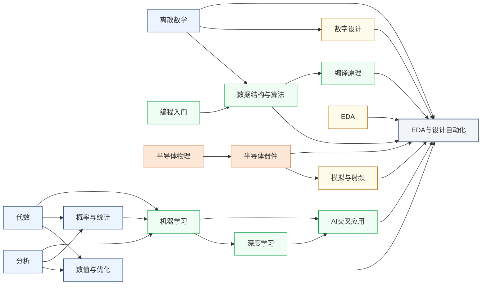

---
hide:
  - navigation
---
用算法和软件让芯片设计本身自动化，涵盖从逻辑综合、布局布线到用机器学习和大语言模型辅助设计决策的全流程。

<svg viewBox="0 0 1140 532" xmlns="http://www.w3.org/2000/svg" style="width:100%;max-width:1140px;display:block;margin:1.5rem auto;font-family:system-ui,-apple-system,sans-serif;">
  <rect width="1140" height="532" rx="10" fill="#FFFFFF" stroke="#CBD5E1" stroke-width="1.5"/>
  <text x="570" y="26" text-anchor="middle" font-size="17" font-weight="bold" fill="#1E293B">集成电路科研方向全景图</text>
  <text x="250" y="54" text-anchor="middle" font-size="13.5" font-weight="bold" fill="#0E7490">← 计算媒介更奇异</text>
  <text x="1000" y="54" text-anchor="middle" font-size="13.5" font-weight="bold" fill="#16A34A">更贴近物理世界 →</text>
  <defs><filter id="loc-b" x="-5%" y="-5%" width="110%" height="110%"><feGaussianBlur stdDeviation="1.4"/></filter></defs>
  <rect x="88" y="88" width="147" height="298" rx="6" fill="#ECFEFF"/>
  <rect x="239" y="88" width="147" height="298" rx="6" fill="#F8FAFC"/>
  <rect x="390" y="88" width="147" height="298" rx="6" fill="#FEF2F2"/>
  <rect x="541" y="88" width="289" height="298" rx="6" fill="#EFF6FF"/>
  <rect x="834" y="88" width="76" height="298" rx="6" fill="#FFFBEB"/>
  <rect x="914" y="88" width="218" height="298" rx="6" fill="#F0FDF4"/>
  <text x="161" y="82" text-anchor="middle" font-size="12" font-weight="bold" fill="#0E7490">量子 · 光子</text>
  <text x="312" y="82" text-anchor="middle" font-size="12" font-weight="bold" fill="#64748B">存算 · 类脑</text>
  <text x="463" y="82" text-anchor="middle" font-size="12" font-weight="bold" fill="#DC2626">模拟 · 射频</text>
  <text x="685" y="82" text-anchor="middle" font-size="13" font-weight="bold" fill="#1D4ED8">数字计算</text>
  <text x="872" y="82" text-anchor="middle" font-size="12" font-weight="bold" fill="#D97706">功率电子</text>
  <text x="1023" y="82" text-anchor="middle" font-size="12" font-weight="bold" fill="#16A34A">传感 · 生物 · 机械</text>
  <line x1="86" y1="92" x2="1132" y2="92" stroke="#E2E8F0" stroke-width="1"/>
  <line x1="86" y1="150" x2="1132" y2="150" stroke="#EEF2F6" stroke-width="1"/>
  <line x1="86" y1="208" x2="1132" y2="208" stroke="#EEF2F6" stroke-width="1"/>
  <line x1="86" y1="266" x2="1132" y2="266" stroke="#EEF2F6" stroke-width="1"/>
  <line x1="86" y1="324" x2="1132" y2="324" stroke="#EEF2F6" stroke-width="1"/>
  <line x1="86" y1="382" x2="1132" y2="382" stroke="#E2E8F0" stroke-width="1"/>
  <line x1="86" y1="92" x2="86" y2="382" stroke="#CBD5E1" stroke-width="1"/>
  <text x="81" y="124" text-anchor="end" font-size="10.5" fill="#475569">算法 / 应用</text>
  <text x="81" y="182" text-anchor="end" font-size="10.5" fill="#475569">系统 / 软件</text>
  <text x="81" y="240" text-anchor="end" font-size="10.5" fill="#475569">体系结构</text>
  <text x="81" y="298" text-anchor="end" font-size="10.5" fill="#475569">电路</text>
  <text x="81" y="356" text-anchor="end" font-size="10.5" fill="#475569">器件</text>
  <g filter="url(#loc-b)" opacity="0.42">
  <rect x="92" y="92" width="68" height="290" rx="5" fill="#CFFAFE" stroke="#0E7490" stroke-width="1.2"/>
  <text x="126" y="231" text-anchor="middle" font-size="10.5" font-weight="bold" fill="#0E7490">量子计算</text>
  <text x="126" y="246" text-anchor="middle" font-size="10.5" font-weight="bold" fill="#0E7490">与量子芯片</text>
  <rect x="163" y="92" width="68" height="290" rx="5" fill="#CFFAFE" stroke="#0E7490" stroke-width="1.2"/>
  <text x="197" y="231" text-anchor="middle" font-size="10.5" font-weight="bold" fill="#0E7490">光电子</text>
  <text x="197" y="246" text-anchor="middle" font-size="10.5" font-weight="bold" fill="#0E7490">与硅光集成</text>
  <rect x="394" y="266" width="68" height="116" rx="5" fill="#FEE2E2" stroke="#DC2626" stroke-width="1.2"/>
  <text x="428" y="317" text-anchor="middle" font-size="10.5" font-weight="bold" fill="#DC2626">模拟与</text>
  <text x="428" y="332" text-anchor="middle" font-size="10.5" font-weight="bold" fill="#DC2626">混合信号IC</text>
  <rect x="465" y="266" width="68" height="116" rx="5" fill="#FEE2E2" stroke="#DC2626" stroke-width="1.2"/>
  <text x="499" y="317" text-anchor="middle" font-size="10.5" font-weight="bold" fill="#DC2626">射频与</text>
  <text x="499" y="332" text-anchor="middle" font-size="10.5" font-weight="bold" fill="#DC2626">毫米波IC</text>
  <rect x="243" y="92" width="68" height="290" rx="5" fill="#FEE2E2" stroke="#DC2626" stroke-width="1.2"/>
  <text x="277" y="239" text-anchor="middle" font-size="11.5" font-weight="bold" fill="#DC2626">类脑芯片</text>
  <rect x="314" y="92" width="68" height="290" rx="5" fill="#EDE9FE" stroke="#7C3AED" stroke-width="1.2"/>
  <text x="348" y="231" text-anchor="middle" font-size="10.5" font-weight="bold" fill="#7C3AED">存算一体</text>
  <text x="348" y="246" text-anchor="middle" font-size="10.5" font-weight="bold" fill="#7C3AED">与近存计算</text>
  <rect x="545" y="92" width="68" height="290" rx="5" fill="#EDE9FE" stroke="#7C3AED" stroke-width="1.2"/>
  <text x="579" y="231" text-anchor="middle" font-size="10.5" font-weight="bold" fill="#7C3AED">硬件安全</text>
  <text x="579" y="246" text-anchor="middle" font-size="10.5" font-weight="bold" fill="#7C3AED">与可信计算</text>
  <rect x="616" y="92" width="68" height="174" rx="5" fill="#DBEAFE" stroke="#1D4ED8" stroke-width="1.2"/>
  <text x="650" y="172" text-anchor="middle" font-size="10.5" font-weight="bold" fill="#1D4ED8">AI 算法</text>
  <text x="650" y="187" text-anchor="middle" font-size="10.5" font-weight="bold" fill="#1D4ED8">与系统</text>
  <rect x="687" y="150" width="68" height="116" rx="5" fill="#DBEAFE" stroke="#1D4ED8" stroke-width="1.2"/>
  <text x="721" y="201" text-anchor="middle" font-size="10.5" font-weight="bold" fill="#1D4ED8">处理器架构</text>
  <text x="721" y="216" text-anchor="middle" font-size="10.5" font-weight="bold" fill="#1D4ED8">与编译系统</text>
  <rect x="758" y="208" width="68" height="116" rx="5" fill="#DBEAFE" stroke="#1D4ED8" stroke-width="1.2"/>
  <text x="792" y="259" text-anchor="middle" font-size="10.5" font-weight="bold" fill="#1D4ED8">可重构计算</text>
  <text x="792" y="274" text-anchor="middle" font-size="10.5" font-weight="bold" fill="#1D4ED8">与 FPGA</text>
  <rect x="838" y="266" width="68" height="116" rx="5" fill="#FEF3C7" stroke="#D97706" stroke-width="1.2"/>
  <text x="872" y="317" text-anchor="middle" font-size="10.5" font-weight="bold" fill="#B45309">功率半导体</text>
  <text x="872" y="332" text-anchor="middle" font-size="10" font-weight="bold" fill="#B45309">与宽禁带器件</text>
  <rect x="918" y="92" width="68" height="290" rx="5" fill="#ECFCCB" stroke="#65A30D" stroke-width="1.2"/>
  <text x="952" y="239" text-anchor="middle" font-size="11.5" font-weight="bold" fill="#4D7C0F">具身智能</text>
  <rect x="989" y="266" width="68" height="116" rx="5" fill="#D1FAE5" stroke="#059669" stroke-width="1.2"/>
  <text x="1023" y="317" text-anchor="middle" font-size="10.5" font-weight="bold" fill="#047857">生物电子</text>
  <text x="1023" y="332" text-anchor="middle" font-size="10.5" font-weight="bold" fill="#047857">与脑机接口</text>
  <rect x="1060" y="266" width="68" height="116" rx="5" fill="#DCFCE7" stroke="#16A34A" stroke-width="1.2"/>
  <text x="1094" y="317" text-anchor="middle" font-size="10.5" font-weight="bold" fill="#15803D">MEMS 与</text>
  <text x="1094" y="332" text-anchor="middle" font-size="10.5" font-weight="bold" fill="#15803D">微纳传感器</text>
  </g>
  <text x="81" y="450" text-anchor="end" font-size="10.5" fill="#475569">各方向通用</text>
  <g filter="url(#loc-b)" opacity="0.42">
  <rect x="92" y="408" width="1040" height="28" rx="5" fill="#F1F5F9" stroke="#64748B" stroke-width="1.1"/>
  <text x="612" y="426" text-anchor="middle" font-size="12" font-weight="bold" fill="#475569">EDA 与设计自动化</text>
  <rect x="92" y="440" width="1040" height="28" rx="5" fill="#EEF2F6" stroke="#64748B" stroke-width="1.1"/>
  <text x="612" y="458" text-anchor="middle" font-size="12" font-weight="bold" fill="#475569">先进封装与系统集成</text>
  <rect x="92" y="472" width="1040" height="30" rx="5" fill="#E2E8F0" stroke="#475569" stroke-width="1.2"/>
  <text x="612" y="491" text-anchor="middle" font-size="12" font-weight="bold" fill="#334155">半导体器件与先进工艺</text>
  </g>
  <rect x="92" y="512" width="13" height="13" rx="2" fill="#DBEAFE" stroke="#1D4ED8" stroke-width="1.1"/>
  <text x="110" y="522" text-anchor="start" font-size="10.5" fill="#475569">数字</text>
  <rect x="160" y="512" width="13" height="13" rx="2" fill="#FEE2E2" stroke="#DC2626" stroke-width="1.1"/>
  <text x="178" y="522" text-anchor="start" font-size="10.5" fill="#475569">模拟</text>
  <rect x="228" y="512" width="13" height="13" rx="2" fill="#EDE9FE" stroke="#7C3AED" stroke-width="1.1"/>
  <text x="246" y="522" text-anchor="start" font-size="10.5" fill="#475569">数字 / 模拟 交叉</text>
  <rect x="92" y="406" width="1040" height="40" rx="6" fill="#0F172A" opacity="0.12"/>
  <rect x="92" y="402" width="1040" height="40" rx="6" fill="#F8FAFC" stroke="#334155" stroke-width="2.6"/>
  <text x="612" y="427" text-anchor="middle" font-size="14.5" font-weight="bold" fill="#1E293B">EDA 与设计自动化</text>
</svg>

## 这个方向在研究什么

芯片设计的规模，大到没法用直觉去想象。一块 Apple M4 大约有 280 亿颗晶体管，挤在约 165 平方毫米的硅片上，等于要在指甲盖大的地方把几百亿个零件摆好、连对。这么大的东西，没人能一个晶体管一个晶体管地画。工程师能做的，是用**硬件描述语言**（Hardware Description Language, HDL），如 Verilog、Chisel、HLS 等，在高层描述"我要什么逻辑"，至于怎么把这份意图变成能送进晶圆厂的版图，全部交给软件。从 HDL 到版图，中间要走逻辑综合、布局、时钟树、布线、寄生提取、静态时序分析等数十步，每一步都在求解亿级规模的图或几何优化。这整套自动化流程就是 **EDA**（Electronic Design Automation，电子设计自动化），<u>没有它，现代芯片根本造不出来</u>。

EDA的工作，本质是在求解一连串 **NP-hard 甚至更难的优化问题**，而且远不止“布局布线”这一块。往前有逻辑综合、功能验证，往后有布局、布线、时序收敛、寄生提取、热分析、可制造性，每一步都是自成一体的难题。就拿最经典的布局来说。把几亿个逻辑单元摆到芯片平面上，既要让关键路径上的连线短、布线不拥塞，还要电源压降均匀，这几个目标彼此打架，而可行解的数量是个天文数字。几十年来，工具靠人想出来的启发式（模拟退火、力导向）在合理时间里凑个“够好”的解，可设计越做越大、工艺越来越严，这些老办法越来越吃力。时序收敛尤其磨人。布完线发现一条路径超时，就得局部重布，可改完又牵动别处，改布局、跑时序、再改布局，这么一个循环常常要耗上几周。

<svg viewBox="0 0 860 220" xmlns="http://www.w3.org/2000/svg" style="width:100%;max-width:860px;display:block;margin:1.2em auto;">
  <!-- Background panel -->
  <rect x="6" y="10" width="848" height="200" rx="10" fill="#F8FAFC" stroke="#CBD5E1" stroke-width="1.5"/>
  <!-- Flow boxes (blue) -->
  <!-- Box 1: RTL代码 -->
  <rect x="20" y="50" width="120" height="52" rx="7" fill="#DBEAFE" stroke="#3B82F6" stroke-width="1.8"/>
  <text x="80" y="72" text-anchor="middle" font-size="13" font-weight="bold" fill="#1D4ED8" font-family="sans-serif">RTL 代码</text>
  <text x="80" y="90" text-anchor="middle" font-size="11" fill="#3B82F6" font-family="sans-serif">Verilog / VHDL</text>
  <!-- Arrow 1→2 -->
  <line x1="140" y1="76" x2="164" y2="76" stroke="#64748B" stroke-width="2"/>
  <polygon points="164,72 176,76 164,80" fill="#64748B"/>
  <!-- Box 2: 逻辑综合 -->
  <rect x="176" y="50" width="120" height="52" rx="7" fill="#DBEAFE" stroke="#3B82F6" stroke-width="1.8"/>
  <text x="236" y="72" text-anchor="middle" font-size="13" font-weight="bold" fill="#1D4ED8" font-family="sans-serif">逻辑综合</text>
  <text x="236" y="90" text-anchor="middle" font-size="11" fill="#3B82F6" font-family="sans-serif">门级网表</text>
  <!-- Arrow 2→3 -->
  <line x1="296" y1="76" x2="320" y2="76" stroke="#64748B" stroke-width="2"/>
  <polygon points="320,72 332,76 320,80" fill="#64748B"/>
  <!-- Box 3: 布局布线 -->
  <rect x="332" y="50" width="120" height="52" rx="7" fill="#DBEAFE" stroke="#3B82F6" stroke-width="1.8"/>
  <text x="392" y="72" text-anchor="middle" font-size="13" font-weight="bold" fill="#1D4ED8" font-family="sans-serif">布局布线</text>
  <text x="392" y="90" text-anchor="middle" font-size="11" fill="#3B82F6" font-family="sans-serif">P&amp;R</text>
  <!-- Arrow 3→4 -->
  <line x1="452" y1="76" x2="476" y2="76" stroke="#64748B" stroke-width="2"/>
  <polygon points="476,72 488,76 476,80" fill="#64748B"/>
  <!-- Box 4: 时序验证 -->
  <rect x="488" y="50" width="120" height="52" rx="7" fill="#DBEAFE" stroke="#3B82F6" stroke-width="1.8"/>
  <text x="548" y="72" text-anchor="middle" font-size="13" font-weight="bold" fill="#1D4ED8" font-family="sans-serif">时序验证</text>
  <text x="548" y="90" text-anchor="middle" font-size="11" fill="#3B82F6" font-family="sans-serif">STA</text>
  <!-- Arrow 4→5 -->
  <line x1="608" y1="76" x2="632" y2="76" stroke="#64748B" stroke-width="2"/>
  <polygon points="632,72 644,76 632,80" fill="#64748B"/>
  <!-- Box 5: GDSII -->
  <rect x="644" y="50" width="120" height="52" rx="7" fill="#DBEAFE" stroke="#3B82F6" stroke-width="1.8"/>
  <text x="704" y="72" text-anchor="middle" font-size="13" font-weight="bold" fill="#1D4ED8" font-family="sans-serif">GDSII 版图</text>
  <text x="704" y="90" text-anchor="middle" font-size="11" fill="#3B82F6" font-family="sans-serif">送厂流片</text>
  <!-- Problem annotation under Box 3 -->
  <rect x="308" y="114" width="168" height="38" rx="5" fill="#FEF9C3" stroke="#D97706" stroke-width="1.2"/>
  <text x="392" y="129" text-anchor="middle" font-size="11" fill="#92400E" font-family="sans-serif">NP-难 | 数十亿单元</text>
  <text x="392" y="145" text-anchor="middle" font-size="11" fill="#92400E" font-family="sans-serif">可能迭代数周</text>
  <line x1="392" y1="102" x2="392" y2="114" stroke="#D97706" stroke-width="1.2" stroke-dasharray="4,3"/>
  <!-- AI/ML acceleration box (amber) -->
  <rect x="174" y="158" width="132" height="40" rx="6" fill="#FEF3C7" stroke="#D97706" stroke-width="1.8"/>
  <text x="240" y="175" text-anchor="middle" font-size="12" font-weight="bold" fill="#92400E" font-family="sans-serif">ML 模型</text>
  <text x="240" y="192" text-anchor="middle" font-size="11" fill="#D97706" font-family="sans-serif">AI / ML 加速</text>
  <!-- Arrow from ML box to Box 2 -->
  <line x1="236" y1="158" x2="236" y2="108" stroke="#D97706" stroke-width="1.5" stroke-dasharray="5,3"/>
  <polygon points="232,108 236,96 240,108" fill="#D97706"/>
  <!-- Arrow from ML box to Box 3 -->
  <line x1="280" y1="178" x2="360" y2="110" stroke="#D97706" stroke-width="1.5" stroke-dasharray="5,3"/>
  <polygon points="356,103 364,112 352,113" fill="#D97706"/>
</svg>

现在先进的 EDA 都会借助 AI 来优化流程。2021 年 Google 在 *Nature* 上发表了后来被命名为 **AlphaChip** 的强化学习布局方法，把“哪个模块摆哪里”建模成一盘棋，让智能体在反复试错中找到摆放策略。在 TPU 的实际设计里，它几个小时给出的布局胜过人类工程师几周的手工优化，而且已经用在量产芯片上。 AI 对EDA 的优化远不止于布局布线，**图神经网络**（Graph Neural Network, GNN）能提前预测哪里会拥塞、哪条路径会超时，让工程师早早就改，不必等到最后返工；**LLM**（Large Language Model，大语言模型）现在也已经逐渐学会写 RTL（Register-Transfer Level，寄存器传输级）代码，或许不久的未来，数字电路工程师们也可以 Vibe Coding，直接把自然语言需求直接写成可综合的 RTL。

AI 能够用于 EDA ,主要源于两点。一是 EDA 的核心对象天生就是图和搜索。网表是图、布局是图、时序路径是图，正对图神经网络和强化学习的胃口。二是有了 **CircuitNet**（北大林亦波团队）这类开源数据集，模型才头一次有了足够多、足够规整的样本可学。不过，像AlphaChip 那样真进量产的还是少数，大量 AI for EDA 仍停在论文和实验阶段，距离实际替换传统工具还差得远。

以上的 AI for EDA，主要 for 数字电路的 EDA。模拟电路的 EDA，目前对 AI 的抗性还比较强。数字 EDA 之所以能让 AI 学明白，是因为它有“满足时序”这么一把清晰、可量化的尺。好不好，一个数说了算。模拟没有这把尺。它的指标是一整张相互牵制的清单，增益、带宽、噪声、线性度、摆幅、功耗、稳定性，改好一个往往牺牲另几个，根本没有单一目标可优化。更糟的是，模拟极度依赖工艺仿真模型（SPICE），而它在高频下误差不小，仿真和真实流片对不上，机器连个可信的“标准答案”都拿不到，自然学不出规律。这就是为什么数字 EDA 已相当成熟，模拟 EDA 至今大半靠工程师手工调参。

<svg viewBox="0 0 820 320" xmlns="http://www.w3.org/2000/svg" style="width:100%;max-width:820px;display:block;margin:1.5rem auto;">
  <defs>
    <marker id="edaArr" markerWidth="8" markerHeight="8" refX="6" refY="3" orient="auto"><path d="M0,0 L0,6 L8,3 z" fill="#475569"/></marker>
  </defs>
  <rect width="820" height="320" rx="10" fill="#F8FAFC" stroke="#CBD5E1" stroke-width="1.5"/>
  <text x="410" y="30" text-anchor="middle" font-size="15" font-weight="bold" fill="#1E293B">为什么 AI 适配数字 EDA、难适配模拟 EDA</text>
  <line x1="410" y1="50" x2="410" y2="292" stroke="#CBD5E1" stroke-width="1.2" stroke-dasharray="4,4"/>
  <text x="205" y="74" text-anchor="middle" font-size="13" font-weight="bold" fill="#15803D">数字 EDA：一把清晰的尺</text>
  <path d="M120,210 A85,85 0 0,1 205,125" fill="none" stroke="#DC2626" stroke-width="10" stroke-linecap="round"/>
  <path d="M205,125 A85,85 0 0,1 290,210" fill="none" stroke="#16A34A" stroke-width="10" stroke-linecap="round"/>
  <line x1="205" y1="210" x2="246" y2="160" stroke="#334155" stroke-width="3" marker-end="url(#edaArr)"/>
  <circle cx="205" cy="210" r="5" fill="#334155"/>
  <text x="138" y="232" text-anchor="middle" font-size="11" fill="#B91C1C">✗ 超时</text>
  <text x="272" y="232" text-anchor="middle" font-size="11" fill="#15803D">✓ 达标</text>
  <text x="205" y="262" text-anchor="middle" font-size="11.5" fill="#334155">满足时序？好坏一个数说了算</text>
  <text x="205" y="282" text-anchor="middle" font-size="12" fill="#15803D">→ 学习信号明确，模型可学</text>
  <text x="615" y="74" text-anchor="middle" font-size="13" font-weight="bold" fill="#9A3412">模拟 EDA：相互牵制的清单</text>
  <polygon points="615,107 556,141 556,209 615,243 674,209 674,141" fill="none" stroke="#CBD5E1" stroke-width="1.2"/>
  <line x1="615" y1="175" x2="615" y2="107" stroke="#E2E8F0" stroke-width="1"/>
  <line x1="615" y1="175" x2="556" y2="141" stroke="#E2E8F0" stroke-width="1"/>
  <line x1="615" y1="175" x2="556" y2="209" stroke="#E2E8F0" stroke-width="1"/>
  <line x1="615" y1="175" x2="615" y2="243" stroke="#E2E8F0" stroke-width="1"/>
  <line x1="615" y1="175" x2="674" y2="209" stroke="#E2E8F0" stroke-width="1"/>
  <line x1="615" y1="175" x2="674" y2="141" stroke="#E2E8F0" stroke-width="1"/>
  <polygon points="615,124 570,149 567,201 615,226 659,197 656,151" fill="#FED7AA" stroke="#D97706" stroke-width="1.6" opacity="0.85"/>
  <text x="615" y="100" text-anchor="middle" font-size="11" fill="#9A3412">增益</text>
  <text x="549" y="138" text-anchor="end" font-size="11" fill="#9A3412">带宽</text>
  <text x="549" y="216" text-anchor="end" font-size="11" fill="#9A3412">噪声</text>
  <text x="615" y="258" text-anchor="middle" font-size="11" fill="#9A3412">功耗</text>
  <text x="681" y="216" text-anchor="start" font-size="11" fill="#9A3412">稳定性</text>
  <text x="681" y="138" text-anchor="start" font-size="11" fill="#9A3412">线性度</text>
  <text x="615" y="284" text-anchor="middle" font-size="11" fill="#9A3412">改好一个常牺牲另几个，没有单一目标 → 拿不到可学信号</text>
</svg>

还有一类新难题，跟 AI 学不学得动无关，而是芯片结构发生了变化。摩尔定律放缓，单层硅片上塞不下更多东西，工程师就把芯片往上叠。多颗裸片靠 TSV、混合键合堆成三维，或者拆成一块块小芯片（chiplet）再拼到一起。芯片一立起来，EDA 的设计空间也从二维变成三维。布局布线不再是一块平面上的事，得跨着好几层裸片协同，版图还要管好上下层的对齐和垂直互连。最难解决的问题是散热。几层裸片紧贴着叠在一起，夹在中间那层的热量几乎跑不出去，温度一上来，时序和可靠性就全乱了套。过去只是配角的热仿真，如今成了三维芯片绕不开的头等大事。

<svg viewBox="0 0 820 300" xmlns="http://www.w3.org/2000/svg" style="width:100%;max-width:820px;display:block;margin:1.5rem auto;">
  <defs>
    <marker id="heatUp" markerWidth="8" markerHeight="8" refX="4" refY="1" orient="auto"><path d="M0,7 L4,0 L8,7 z" fill="#EA580C"/></marker>
  </defs>
  <rect width="820" height="300" rx="10" fill="#F8FAFC" stroke="#CBD5E1" stroke-width="1.5"/>
  <text x="410" y="30" text-anchor="middle" font-size="15" font-weight="bold" fill="#1E293B">芯片从平铺走向堆叠：热成了一等问题</text>
  <line x1="410" y1="50" x2="410" y2="270" stroke="#CBD5E1" stroke-width="1.2" stroke-dasharray="4,4"/>
  <text x="205" y="76" text-anchor="middle" font-size="13" font-weight="bold" fill="#1E40AF">2D · 平铺</text>
  <rect x="90" y="200" width="230" height="20" rx="3" fill="#E2E8F0" stroke="#94A3B8" stroke-width="1"/>
  <text x="205" y="214" text-anchor="middle" font-size="11" fill="#475569">封装基板</text>
  <rect x="120" y="172" width="170" height="28" rx="3" fill="#DBEAFE" stroke="#3B82F6" stroke-width="1.4"/>
  <text x="205" y="190" text-anchor="middle" font-size="11" fill="#1E40AF">单层裸片</text>
  <line x1="150" y1="172" x2="150" y2="144" stroke="#EA580C" stroke-width="2" marker-end="url(#heatUp)"/>
  <line x1="205" y1="172" x2="205" y2="140" stroke="#EA580C" stroke-width="2" marker-end="url(#heatUp)"/>
  <line x1="260" y1="172" x2="260" y2="144" stroke="#EA580C" stroke-width="2" marker-end="url(#heatUp)"/>
  <text x="205" y="250" text-anchor="middle" font-size="11" fill="#475569">热往上自由散掉</text>
  <text x="615" y="76" text-anchor="middle" font-size="13" font-weight="bold" fill="#9A3412">3D · 堆叠</text>
  <rect x="510" y="200" width="210" height="18" rx="3" fill="#E2E8F0" stroke="#94A3B8" stroke-width="1"/>
  <rect x="530" y="178" width="170" height="20" rx="2" fill="#DBEAFE" stroke="#3B82F6" stroke-width="1.3"/>
  <rect x="530" y="156" width="170" height="20" rx="2" fill="#FCA5A5" stroke="#DC2626" stroke-width="1.6"/>
  <rect x="530" y="134" width="170" height="20" rx="2" fill="#DBEAFE" stroke="#3B82F6" stroke-width="1.3"/>
  <line x1="560" y1="134" x2="560" y2="198" stroke="#64748B" stroke-width="2"/>
  <line x1="615" y1="134" x2="615" y2="198" stroke="#64748B" stroke-width="2"/>
  <line x1="670" y1="134" x2="670" y2="198" stroke="#64748B" stroke-width="2"/>
  <text x="712" y="148" text-anchor="start" font-size="11" fill="#475569">TSV 跨die</text>
  <text x="712" y="169" text-anchor="start" font-size="11" fill="#B91C1C">热困中层</text>
  <line x1="585" y1="156" x2="585" y2="140" stroke="#EA580C" stroke-width="2"/>
  <line x1="645" y1="156" x2="645" y2="140" stroke="#EA580C" stroke-width="2"/>
  <line x1="553" y1="132" x2="677" y2="132" stroke="#B91C1C" stroke-width="2" stroke-dasharray="3,2"/>
  <text x="615" y="250" text-anchor="middle" font-size="11" fill="#9A3412">中间层的热无处可逃 → 热仿真 / 热感知设计</text>
</svg>

EDA 是整条芯片产业链里最典型的卡脖子环节。Synopsys、Cadence、Siemens 三家美国公司握着全球八成以上的市场，2019 年那道对华为的禁令，几乎一夜之间让海思失去了推进先进制程的工具。但反过来看，这也意味着一个更好的算法真能撬动整个行业。<u>EDA 是少数一项突破就能影响整条产业链的基础设施级方向。</u>

### 核心研究问题

- **AI for EDA**：网表、布局、时序路径天生是图，正对强化学习和图神经网络的胃口，CircuitNet 这类开源数据集也让模型有了可学的样本。但模拟电路没有“满足时序”这样的单一标尺，增益带宽噪声功耗相互牵制，SPICE 在高频下又不准，机器拿不到可信标签，至今大半靠工程师手调。
- **器件建模与电路仿真求解器**：寄生参数提取、互连电磁场求解、SPICE 仿真要在巨型稀疏矩阵上又快又准，器件模型一到宽禁带或先进节点就要重标定，这是 EDA 里最贴硬件的一层。
- **高层次综合与领域专用加速**：HLS 让人写 C/C++ 自动出 RTL，可工具在循环展开、流水线、片上存储这些决策上仍然笨拙，难在自动逼近手写质量、把算法直接综合成专用加速器。
- **3D 集成的设计自动化与热仿真**：芯片走向 3D 堆叠后，布局布线要跨 die 协同，chiplet 与先进封装的流程要重做；夹在中层的热无处可逃，精确的热仿真模型和热感知布局成了绕不开的一环。

### 知识路径

数学（离散 + 数值优化）和算法是内核，分析与代数是数值优化的前置，数字/模拟设计提供应用对象，器件模型支撑 SPICE 类仿真器，编译原理提供综合/HLS 理论，机器学习经 AI 交叉应用进场。节点对应[学习地图](../学习地图/index.md)里的目录：

- 数学：[分析](../学习地图/数学/分析/index.md) · [代数](../学习地图/数学/代数/index.md)（线性代数，矩阵求解器的基础） · [离散数学](../学习地图/数学/离散数学/index.md)（图论、布尔代数） · [数值与优化](../学习地图/数学/数值与优化/index.md)（布局布线的优化内核） · [概率与统计](../学习地图/数学/概率与统计/index.md)
- 算法编程：[编程入门](../学习地图/算法编程/编程入门/index.md)（C++） · [数据结构与算法](../学习地图/算法编程/数据结构与算法/index.md)
- 物理：[半导体物理](../学习地图/物理/半导体物理/index.md)
- 器件与工艺：[半导体器件](../学习地图/器件与工艺/半导体器件/index.md)（SPICE 模型的物理来源）
- 电路：[数字设计](../学习地图/电路/数字设计/index.md) · [模拟与射频](../学习地图/电路/模拟与射频/index.md)（模拟 EDA 的应用对象） · [EDA](../学习地图/电路/EDA/index.md)（先会用工具，再研究工具）
- 系统架构：[编译原理](../学习地图/系统架构/编译原理/index.md)（综合/HLS 理论基础）
- 人工智能：[机器学习](../学习地图/人工智能/机器学习/index.md) · [深度学习](../学习地图/人工智能/深度学习/index.md) · [AI交叉应用](../学习地图/人工智能/AI交叉应用/index.md)（ML for EDA）

## 这个方向适合谁

适合喜欢写程序、又想留在芯片行业的人。这个方向不进实验室也不画版图，日常就是写代码、跑实验，解的却全是源自真实芯片流程的 NP 难问题，布局、布线、时序收敛个个如此。课程上要学数据结构与算法、图论和机器学习，微电子出身的优势在领域直觉，我们知道时序为什么难收敛、模拟为什么没有单一标尺，这是纯算法出身一时补不上的。一个好算法能直接进工具链，作用于后续每个设计流程。

## 学术界

### 课题组

**境内**

-   **[苏菲](https://www.ime.tsinghua.edu.cn/info/1014/2266.htm)** 清华

    可测性设计 | Chiplet测试与诊断 | 硅生命周期管理

-   **[喻文健](http://numbda.cs.tsinghua.edu.cn/~yuwj/)** 清华

    IC 互连参数提取 | 电磁场快速求解 | 3D IC 热仿真

-   **[叶佐昌](https://www.sic.tsinghua.edu.cn/en/info/1085/1414.htm)** 清华

    VLSI 电磁仿真算法 | 混合信号电路仿真 | EDA 数值方法

-   **[王彦](https://www.sic.tsinghua.edu.cn/en/info/1094/1421.htm)** 清华 

    器件建模与 EDA | 宽禁带半导体器件 | 毫米波电路自动设计

-   **[陈建利](https://sme.fudan.edu.cn/5f/c6/c31141a352198/page.htm)** 复旦

    芯片单元布局合法化 | 全局布线算法 | 光刻热点检测

-   **[曾璇](https://asic-skl.fudan.edu.cn/d2/0c/c29516a315916/page.htm)** 复旦 

    模拟电路仿真 | 高速互连建模 | 制造工艺协同设计

-   **[杨帆](https://faculty.fudan.edu.cn/yangfan/zh_CN/index.htm)** 复旦

    电路分析与仿真 | 互连建模优化 | 模型降阶方法

-   **[严昌浩](https://icmne.fudan.edu.cn/2d/4e/c48925a732494/page.htm)** 复旦

    模拟电路智能综合 | 良率与变差优化 | AI 驱动版图自动化

-   **[朱可人](https://icmne.fudan.edu.cn/2d/64/c48925a732516/page.htm)** 复旦

    物理设计与布局布线 | 模拟电路设计自动化 | 逻辑综合优化

-   **[毕朝日](https://icmne.fudan.edu.cn/17/48/c48925a726856/page.htm)** 复旦

    模拟电路设计自动化 | 强化学习辅助优化

-   **[陶俊](https://icmne.fudan.edu.cn/2d/3a/c48925a732474/page.htm)** 复旦

    统计建模与良率优化 | AI 辅助设计 | 混合信号仿真

-   **[陆叶](https://icmne.fudan.edu.cn/2d/2e/c48925a732462/page.htm)** 复旦

    先进晶体管建模 | 机器学习辅助设计

-   **[陆振海](https://icmne.fudan.edu.cn/2d/2f/c48925a732463/page.htm)** 复旦

    半导体器件建模 | AI 辅助 EDA

-   **[王志昂](https://icmne.fudan.edu.cn/97/b8/c48925a759736/page.htm)** 复旦

    数字芯片物理设计 | 工艺-设计协同优化

-   **[梁云](https://ericlyun.me/)** 北大

    硬件综合与 EDA | FPGA 可重构计算 | AI 芯片硬件软件协同

-   **[罗国杰](http://ceca.pku.edu.cn/en/people_/faculty_/guojie_luo/)** 北大

    芯片物理设计自动化 | FPGA 布局布线 | AI 驱动 EDA

-   **[林亦波](https://ic.pku.edu.cn/szdw/zzjs/sjzdhyjsxtx1/lyb_ae03bbb7dd1548659c1ffe83edd4a047/index.htm)** 北大

    芯片布局 | 布线与时序优化 | AI 辅助物理设计

-   **[李萌](https://mengli.me/)** 北大

    算法硬件协同设计 | 神经网络加速器优化 | 隐私保护 AI 推理

-   **[陈松](https://faculty.ustc.edu.cn/chensong/zh_CN/index.htm)** 中科大

    高层次综合 | 神经网络加速器架构 | 物理设计时序预测

-   **[王杰](https://miralab.ai/publication/)** 中科大

    AI 辅助芯片布局 | 神经逻辑综合 | 强化学习优化

-   **[郭新飞](https://sites.gc.sjtu.edu.cn/xinfei-guo/)** 交大

    AI 辅助 EDA | 低功耗设计 | FPGA 加速器

-   **[蒋力](https://www.cs.sjtu.edu.cn/jiaoshiml/jiangli.html)** 交大

    ML 辅助芯片设计 | 存算一体架构 | AI 加速器物理实现

-   **[严骏驰](https://thinklab.sjtu.edu.cn/)** 交大

    ML for EDA | 组合优化求解器与逻辑综合 | 图学习驱动布局布线/时序预测

-   **[钱超](http://www.lamda.nju.edu.cn/qianc/)** 南大

    演化计算与黑盒优化 | AI 驱动芯片布局 | 时序驱动物理设计

-   **[杜源](https://ese.nju.edu.cn/dy/list.htm)** 南大

    LLM 辅助模拟电路设计 | 晶体管级版图自动生成 | 电路图转网表

-   **[金洲](https://person.zju.edu.cn/person/0025054)** 浙大 

    SPICE 电路仿真加速 | 寄生参数快速提取 | 信号完整性分析

-   **[卓成](https://person.zju.edu.cn/chengzhuo)** 浙大

    LLM 辅助设计综合 | 智能体 EDA 流程 | 低功耗芯片自动化

-   **[孙奇](https://qisunchn.top/)** 浙大

    ML for EDA | LLM 辅助设计与 DTCO | 设计空间探索

-   **[郑飞君](https://person.zju.edu.cn/frank_zheng)** 浙大

    数模混合电路 EDA | 设计制造一体化 | AI 辅助 EDA 算法

<button class="prof-show-all">显示全部 ↓</button>

**境外**

-   **[Bei Yu（余备）](https://www.cse.cuhk.edu.hk/~byu/)** 港中大

    光刻掩模优化 | 布局布线物理设计 | ML 驱动 EDA

-   **[Tsung-Yi Ho（何宗易）](https://www.cse.cuhk.edu.hk/people/faculty/tsung-yi-ho/)** 港中大

    Chiplet 封装协同设计 | 3D IC 全局布线 | 微流控芯片自动化

-   **[Qiang Xu（徐强）](https://www.cse.cuhk.edu.hk/~qxu/)** 港中大

    电路结构学习 | 形式验证与 SAT | 硬件测试与安全

-   **[Zhiyao Xie（谢知遥）](https://zhiyaoxie.com/)** 港科大

    LLM 生成 RTL 代码 | 功耗与时序分析 | 芯片基础模型

-   **[Larry Pileggi](https://users.ece.cmu.edu/~pileggi/)** CMU

    电路仿真与时序分析 | 互连建模 | 逻辑加锁与芯片安全

-   **[Azalia Mirhoseini](https://profiles.stanford.edu/azalia-mirhoseini)** Stanford 

    强化学习芯片布图 | AI 硬件协同设计 | ML 系统优化

-   **[Jason Cong（丛京生）](https://vast.cs.ucla.edu/people/faculty/jason-cong)** UCLA

    FPGA 综合与自动化 | 高层次综合 HLS | 专用加速器设计

-   **[Andrew Kahng](https://vlsicad.ucsd.edu/~abk/)** UCSD

    物理设计与布局布线 | 设计制造协同 | OpenROAD 开源 EDA

-   **[Deming Chen（陈德铭）](https://ece.illinois.edu/about/directory/faculty/dchen)** UIUC

    高层次综合（HLS） | LLM 辅助 RTL 生成 | 形式验证自动化

-   **[David Z. Pan（潘志刚）](https://users.ece.utexas.edu/~dpan/)** UT Austin

    AI 驱动物理设计 | LLM 辅助 RTL 生成 | 模拟与射频 EDA

-   **[Diana Marculescu](https://www.ece.utexas.edu/people/faculty/diana-marculescu)** UT Austin 

    硬件感知神经网络设计 | AI 模型到芯片映射 | FPGA 稀疏加速

<button class="prof-show-all">显示全部 ↓</button>

### 学术会议与期刊

  
会议
    DAC
    ICCAD
    DATE
    ASP-DAC
    ISPD
  

  
期刊
    IEEE TCAD
    IEEE TVLSI
    ACM TODAES
    IEEE TC
  

## 毕业去向

### 企业

  
国内
    <a href="https://www.empyrean.com.cn/">华大九天 Empyrean</a>
    <a href="https://www.primarius-tech.com/">概伦电子 Primarius</a>
    <a href="https://www.semitronix.com/">广立微 Semitronix</a>
    <a class="dm-chip" href="https://www.x-epic.com/">芯华章 X-EPIC</a>
    <a class="dm-chip" href="https://www.xpeedic.com/">芯和半导体 Xpeedic</a>
  

  
国外
    <a href="https://www.synopsys.com/">Synopsys</a>
    <a href="https://www.cadence.com/">Cadence</a>
    <a href="https://www.siemens.com/en-us/company/electronic-design-automation/">Siemens EDA（原 Mentor）</a>
  

### 科研院所

  
国内
    <a class="dm-chip" href="https://www.ime.ac.cn/eda/">中科院微电子所 EDA 中心</a>
    <a class="dm-chip" href="https://www.pcl.ac.cn/">鹏城实验室</a>
  

  
国外
    <a class="dm-chip" href="https://theopenroadproject.org/">OpenROAD（UCSD VLSI CAD 实验室主导）</a>
    <a class="dm-chip" href="https://www.imec-int.com/en">imec</a>
  

## 相关科普

  <a class="vc-card" href="https://www.bilibili.com/video/BV1krMBz7EMy" target="_blank" rel="noopener">
    
      
      B站
    
    
      【阳阳你好ORZ】美国EDA断供，对中国影响有多大？
      阳阳你好ORZ · 9.8万播放
    
  </a>

## 论文推荐

!!! note "待补充"
    欢迎推荐该方向的入门综述或经典论文，[参与建设 →](../参与建设.md)
