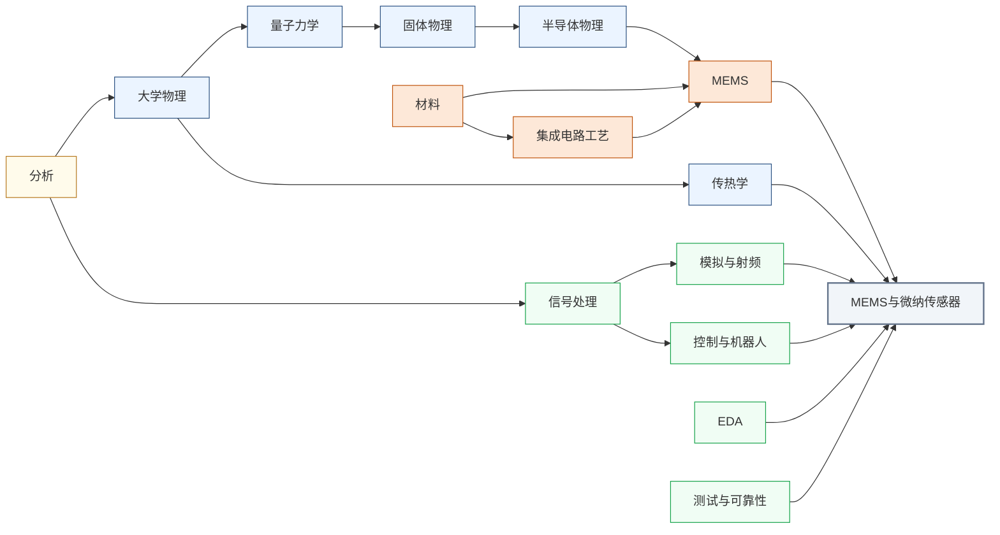

---
hide:
  - navigation
---
用半导体微加工工艺制造出与力学、热、声、化学等多物理场交互的微纳尺度器件，从手机里的加速度计到超声医学成像探头，MEMS 是 IC 工艺向传感世界延伸的核心技术。

<svg viewBox="0 0 1140 532" xmlns="http://www.w3.org/2000/svg" style="width:100%;max-width:1140px;display:block;margin:1.5rem auto;font-family:system-ui,-apple-system,sans-serif;">
  <rect width="1140" height="532" rx="10" fill="#FFFFFF" stroke="#CBD5E1" stroke-width="1.5"/>
  <text x="570" y="26" text-anchor="middle" font-size="17" font-weight="bold" fill="#1E293B">集成电路科研方向全景图</text>
  <text x="250" y="54" text-anchor="middle" font-size="13.5" font-weight="bold" fill="#0E7490">← 计算媒介更奇异</text>
  <text x="1000" y="54" text-anchor="middle" font-size="13.5" font-weight="bold" fill="#16A34A">更贴近物理世界 →</text>
  <defs><filter id="loc-b" x="-5%" y="-5%" width="110%" height="110%"><feGaussianBlur stdDeviation="1.4"/></filter></defs>
  <rect x="88" y="88" width="147" height="298" rx="6" fill="#ECFEFF"/>
  <rect x="239" y="88" width="147" height="298" rx="6" fill="#F8FAFC"/>
  <rect x="390" y="88" width="147" height="298" rx="6" fill="#FEF2F2"/>
  <rect x="541" y="88" width="289" height="298" rx="6" fill="#EFF6FF"/>
  <rect x="834" y="88" width="76" height="298" rx="6" fill="#FFFBEB"/>
  <rect x="914" y="88" width="218" height="298" rx="6" fill="#F0FDF4"/>
  <text x="161" y="82" text-anchor="middle" font-size="12" font-weight="bold" fill="#0E7490">量子 · 光子</text>
  <text x="312" y="82" text-anchor="middle" font-size="12" font-weight="bold" fill="#64748B">存算 · 类脑</text>
  <text x="463" y="82" text-anchor="middle" font-size="12" font-weight="bold" fill="#DC2626">模拟 · 射频</text>
  <text x="685" y="82" text-anchor="middle" font-size="13" font-weight="bold" fill="#1D4ED8">数字计算</text>
  <text x="872" y="82" text-anchor="middle" font-size="12" font-weight="bold" fill="#D97706">功率电子</text>
  <text x="1023" y="82" text-anchor="middle" font-size="12" font-weight="bold" fill="#16A34A">传感 · 生物 · 机械</text>
  <line x1="86" y1="92" x2="1132" y2="92" stroke="#E2E8F0" stroke-width="1"/>
  <line x1="86" y1="150" x2="1132" y2="150" stroke="#EEF2F6" stroke-width="1"/>
  <line x1="86" y1="208" x2="1132" y2="208" stroke="#EEF2F6" stroke-width="1"/>
  <line x1="86" y1="266" x2="1132" y2="266" stroke="#EEF2F6" stroke-width="1"/>
  <line x1="86" y1="324" x2="1132" y2="324" stroke="#EEF2F6" stroke-width="1"/>
  <line x1="86" y1="382" x2="1132" y2="382" stroke="#E2E8F0" stroke-width="1"/>
  <line x1="86" y1="92" x2="86" y2="382" stroke="#CBD5E1" stroke-width="1"/>
  <text x="81" y="124" text-anchor="end" font-size="10.5" fill="#475569">算法 / 应用</text>
  <text x="81" y="182" text-anchor="end" font-size="10.5" fill="#475569">系统 / 软件</text>
  <text x="81" y="240" text-anchor="end" font-size="10.5" fill="#475569">体系结构</text>
  <text x="81" y="298" text-anchor="end" font-size="10.5" fill="#475569">电路</text>
  <text x="81" y="356" text-anchor="end" font-size="10.5" fill="#475569">器件</text>
  <g filter="url(#loc-b)" opacity="0.42">
  <rect x="92" y="92" width="68" height="290" rx="5" fill="#CFFAFE" stroke="#0E7490" stroke-width="1.2"/>
  <text x="126" y="231" text-anchor="middle" font-size="10.5" font-weight="bold" fill="#0E7490">量子计算</text>
  <text x="126" y="246" text-anchor="middle" font-size="10.5" font-weight="bold" fill="#0E7490">与量子芯片</text>
  <rect x="163" y="92" width="68" height="290" rx="5" fill="#CFFAFE" stroke="#0E7490" stroke-width="1.2"/>
  <text x="197" y="231" text-anchor="middle" font-size="10.5" font-weight="bold" fill="#0E7490">光电子</text>
  <text x="197" y="246" text-anchor="middle" font-size="10.5" font-weight="bold" fill="#0E7490">与硅光集成</text>
  <rect x="394" y="266" width="68" height="116" rx="5" fill="#FEE2E2" stroke="#DC2626" stroke-width="1.2"/>
  <text x="428" y="317" text-anchor="middle" font-size="10.5" font-weight="bold" fill="#DC2626">模拟与</text>
  <text x="428" y="332" text-anchor="middle" font-size="10.5" font-weight="bold" fill="#DC2626">混合信号IC</text>
  <rect x="465" y="266" width="68" height="116" rx="5" fill="#FEE2E2" stroke="#DC2626" stroke-width="1.2"/>
  <text x="499" y="317" text-anchor="middle" font-size="10.5" font-weight="bold" fill="#DC2626">射频与</text>
  <text x="499" y="332" text-anchor="middle" font-size="10.5" font-weight="bold" fill="#DC2626">毫米波IC</text>
  <rect x="243" y="92" width="68" height="290" rx="5" fill="#FEE2E2" stroke="#DC2626" stroke-width="1.2"/>
  <text x="277" y="239" text-anchor="middle" font-size="11.5" font-weight="bold" fill="#DC2626">类脑芯片</text>
  <rect x="314" y="92" width="68" height="290" rx="5" fill="#EDE9FE" stroke="#7C3AED" stroke-width="1.2"/>
  <text x="348" y="231" text-anchor="middle" font-size="10.5" font-weight="bold" fill="#7C3AED">存算一体</text>
  <text x="348" y="246" text-anchor="middle" font-size="10.5" font-weight="bold" fill="#7C3AED">与近存计算</text>
  <rect x="545" y="92" width="68" height="290" rx="5" fill="#EDE9FE" stroke="#7C3AED" stroke-width="1.2"/>
  <text x="579" y="231" text-anchor="middle" font-size="10.5" font-weight="bold" fill="#7C3AED">硬件安全</text>
  <text x="579" y="246" text-anchor="middle" font-size="10.5" font-weight="bold" fill="#7C3AED">与可信计算</text>
  <rect x="616" y="92" width="68" height="174" rx="5" fill="#DBEAFE" stroke="#1D4ED8" stroke-width="1.2"/>
  <text x="650" y="172" text-anchor="middle" font-size="10.5" font-weight="bold" fill="#1D4ED8">AI 算法</text>
  <text x="650" y="187" text-anchor="middle" font-size="10.5" font-weight="bold" fill="#1D4ED8">与系统</text>
  <rect x="687" y="150" width="68" height="116" rx="5" fill="#DBEAFE" stroke="#1D4ED8" stroke-width="1.2"/>
  <text x="721" y="201" text-anchor="middle" font-size="10.5" font-weight="bold" fill="#1D4ED8">处理器架构</text>
  <text x="721" y="216" text-anchor="middle" font-size="10.5" font-weight="bold" fill="#1D4ED8">与编译系统</text>
  <rect x="758" y="208" width="68" height="116" rx="5" fill="#DBEAFE" stroke="#1D4ED8" stroke-width="1.2"/>
  <text x="792" y="259" text-anchor="middle" font-size="10.5" font-weight="bold" fill="#1D4ED8">可重构计算</text>
  <text x="792" y="274" text-anchor="middle" font-size="10.5" font-weight="bold" fill="#1D4ED8">与 FPGA</text>
  <rect x="838" y="266" width="68" height="116" rx="5" fill="#FEF3C7" stroke="#D97706" stroke-width="1.2"/>
  <text x="872" y="317" text-anchor="middle" font-size="10.5" font-weight="bold" fill="#B45309">功率半导体</text>
  <text x="872" y="332" text-anchor="middle" font-size="10" font-weight="bold" fill="#B45309">与宽禁带器件</text>
  <rect x="918" y="92" width="68" height="290" rx="5" fill="#ECFCCB" stroke="#65A30D" stroke-width="1.2"/>
  <text x="952" y="239" text-anchor="middle" font-size="11.5" font-weight="bold" fill="#4D7C0F">具身智能</text>
  <rect x="989" y="266" width="68" height="116" rx="5" fill="#D1FAE5" stroke="#059669" stroke-width="1.2"/>
  <text x="1023" y="317" text-anchor="middle" font-size="10.5" font-weight="bold" fill="#047857">生物电子</text>
  <text x="1023" y="332" text-anchor="middle" font-size="10.5" font-weight="bold" fill="#047857">与脑机接口</text>
  <rect x="1060" y="266" width="68" height="116" rx="5" fill="#DCFCE7" stroke="#16A34A" stroke-width="1.2"/>
  <text x="1094" y="317" text-anchor="middle" font-size="10.5" font-weight="bold" fill="#15803D">MEMS 与</text>
  <text x="1094" y="332" text-anchor="middle" font-size="10.5" font-weight="bold" fill="#15803D">微纳传感器</text>
  </g>
  <text x="81" y="450" text-anchor="end" font-size="10.5" fill="#475569">各方向通用</text>
  <g filter="url(#loc-b)" opacity="0.42">
  <rect x="92" y="408" width="1040" height="28" rx="5" fill="#F1F5F9" stroke="#64748B" stroke-width="1.1"/>
  <text x="612" y="426" text-anchor="middle" font-size="12" font-weight="bold" fill="#475569">EDA 与设计自动化</text>
  <rect x="92" y="440" width="1040" height="28" rx="5" fill="#EEF2F6" stroke="#64748B" stroke-width="1.1"/>
  <text x="612" y="458" text-anchor="middle" font-size="12" font-weight="bold" fill="#475569">先进封装与系统集成</text>
  <rect x="92" y="472" width="1040" height="30" rx="5" fill="#E2E8F0" stroke="#475569" stroke-width="1.2"/>
  <text x="612" y="491" text-anchor="middle" font-size="12" font-weight="bold" fill="#334155">半导体器件与先进工艺</text>
  </g>
  <rect x="92" y="512" width="13" height="13" rx="2" fill="#DBEAFE" stroke="#1D4ED8" stroke-width="1.1"/>
  <text x="110" y="522" text-anchor="start" font-size="10.5" fill="#475569">数字</text>
  <rect x="160" y="512" width="13" height="13" rx="2" fill="#FEE2E2" stroke="#DC2626" stroke-width="1.1"/>
  <text x="178" y="522" text-anchor="start" font-size="10.5" fill="#475569">模拟</text>
  <rect x="228" y="512" width="13" height="13" rx="2" fill="#EDE9FE" stroke="#7C3AED" stroke-width="1.1"/>
  <text x="246" y="522" text-anchor="start" font-size="10.5" fill="#475569">数字 / 模拟 交叉</text>
  <rect x="1028" y="269" width="104" height="116" rx="9" fill="#1E293B" opacity="0.16"/>
  <rect x="1026" y="266" width="104" height="116" rx="9" fill="#DCFCE7" stroke="#16A34A" stroke-width="2.6"/>
  <text x="1078" y="317" text-anchor="middle" font-size="13" font-weight="bold" fill="#15803D">MEMS 与</text>
  <text x="1078" y="332" text-anchor="middle" font-size="13" font-weight="bold" fill="#15803D">微纳传感器</text>
</svg>

## 这个方向在研究什么

汽车以 60 公里时速撞上护栏，车身开始形变的那一刻，气囊必须在 20 毫秒内充气。再晚一点，驾驶员的头就撞上方向盘了。触发这整个过程的，是一块芯片上一根几十微米的硅弹簧。碰撞产生的减速度让弹簧末端的质量块偏移，两侧梳齿间电容变化，信号送出，点火。这根弹簧不是机床加工的，而是用光刻胶和刻蚀液从硅晶圆上直接雕出来的，和做处理器用的是同一套工艺。今天每部 iPhone 里至少有五个这样的器件：加速度计感知方向让画面随握持旋转，陀螺仪让 AR 防抖成为可能，气压传感器辅助室内定位，好几颗 **MEMS**（Micro-Electro-Mechanical Systems，微机电系统）麦克风把声波转成电信号、协同降噪。它们物理原理各不相同，却都建立在同一套半导体工艺平台上，单颗几分钱，一片晶圆同时出几千颗。<u>MEMS 的核心，是用 IC 工艺把某种物理现象转换为电信号。</u>

<svg viewBox="0 0 880 220" style="width:100%;max-width:860px;display:block;margin:1.5em auto;font-family:system-ui,-apple-system,sans-serif">
  <defs>
    <marker id="arr3" markerWidth="8" markerHeight="8" refX="6" refY="3" orient="auto">
      <path d="M0,0 L0,6 L8,3 z" fill="#1E40AF"/>
    </marker>
  </defs>
  <!-- Panel 1: MEMS 加速度计 弹簧-质量系统 -->
  <rect x="10" y="10" width="420" height="200" rx="8" fill="#F8FAFC" stroke="#CBD5E1" stroke-width="1.5"/>
  <text x="220" y="30" text-anchor="middle" font-size="16" font-weight="700" fill="#1E293B">MEMS 加速度计（弹簧-质量系统）</text>
  <!-- Left anchor -->
  <rect x="30" y="88" width="30" height="44" rx="3" fill="#94A3B8" stroke="#64748B" stroke-width="1.5"/>
  <text x="45" y="114" text-anchor="middle" font-size="11" fill="#F8FAFC">锚</text>
  <!-- Left spring (zigzag) -->
  <polyline points="60,110 70,96 80,124 90,96 100,124 110,96 120,110" fill="none" stroke="#D97706" stroke-width="2.5" stroke-linejoin="round"/>
  <!-- Central mass -->
  <rect x="120" y="72" width="160" height="76" rx="5" fill="#BFDBFE" stroke="#3B82F6" stroke-width="2"/>
  <text x="200" y="110" text-anchor="middle" font-size="14" font-weight="600" fill="#1E40AF">质量块</text>
  <text x="200" y="126" text-anchor="middle" font-size="11.5" fill="#3B82F6">mass</text>
  <!-- Right spring (zigzag) -->
  <polyline points="280,110 290,96 300,124 310,96 320,124 330,96 340,110" fill="none" stroke="#D97706" stroke-width="2.5" stroke-linejoin="round"/>
  <!-- Right anchor -->
  <rect x="340" y="88" width="30" height="44" rx="3" fill="#94A3B8" stroke="#64748B" stroke-width="1.5"/>
  <text x="355" y="114" text-anchor="middle" font-size="11" fill="#F8FAFC">锚</text>
  <!-- Top sense electrode -->
  <rect x="148" y="52" width="104" height="16" rx="3" fill="#DCFCE7" stroke="#16A34A" stroke-width="1.5"/>
  <text x="200" y="63" text-anchor="middle" font-size="10.5" fill="#166534">固定感应极板</text>
  <!-- Bottom sense electrode -->
  <rect x="148" y="152" width="104" height="16" rx="3" fill="#DCFCE7" stroke="#16A34A" stroke-width="1.5"/>
  <text x="200" y="163" text-anchor="middle" font-size="10.5" fill="#166534">固定感应极板</text>
  <!-- External force arrow -->
  <line x1="15" y1="110" x2="55" y2="110" stroke="#1E40AF" stroke-width="2" marker-end="url(#arr3)"/>
  <text x="12" y="103" font-size="11.5" fill="#1E40AF">外力 a</text>
  <!-- Caption -->
  <text x="220" y="184" text-anchor="middle" font-size="11.5" fill="#475569">质量块在外力下位移 → 改变电容 → 测量加速度</text>
  <text x="220" y="198" text-anchor="middle" font-size="11.5" fill="#94A3B8">手机 IMU · 汽车 ABS · 无人机飞控</text>
  <!-- Panel 2: CMUT 超声换能器 -->
  <rect x="450" y="10" width="420" height="200" rx="8" fill="#F8FAFC" stroke="#CBD5E1" stroke-width="1.5"/>
  <text x="660" y="30" text-anchor="middle" font-size="16" font-weight="700" fill="#1E293B">CMUT 超声换能器</text>
  <!-- Bottom electrode (substrate) -->
  <rect x="510" y="140" width="300" height="22" rx="3" fill="#E2E8F0" stroke="#94A3B8" stroke-width="1.5"/>
  <text x="660" y="154" text-anchor="middle" font-size="12" fill="#475569">底部电极（衬底）</text>
  <!-- Gap cavity -->
  <rect x="510" y="118" width="300" height="22" rx="2" fill="#EFF6FF" stroke="#BFDBFE" stroke-width="1" stroke-dasharray="4,2"/>
  <text x="660" y="132" text-anchor="middle" font-size="11" fill="#93C5FD">气隙（gap）</text>
  <!-- Membrane (deflected) -->
  <path d="M510,118 Q570,100 660,96 Q750,100 810,118" fill="none" stroke="#D97706" stroke-width="3"/>
  <text x="660" y="92" text-anchor="middle" font-size="11.5" fill="#92400E">振动薄膜（deflected）</text>
  <!-- Voltage label -->
  <text x="480" y="130" text-anchor="middle" font-size="14" font-weight="700" fill="#7C3AED">V</text>
  <line x1="488" y1="118" x2="510" y2="118" stroke="#7C3AED" stroke-width="1.5"/>
  <line x1="488" y1="140" x2="510" y2="140" stroke="#7C3AED" stroke-width="1.5"/>
  <!-- Ultrasound waves -->
  <path d="M620,70 Q640,55 660,50 Q680,55 700,70" fill="none" stroke="#16A34A" stroke-width="1.5"/>
  <path d="M610,58 Q635,38 660,32 Q685,38 710,58" fill="none" stroke="#16A34A" stroke-width="1.5" opacity="0.7"/>
  <path d="M600,46 Q630,22 660,15 Q690,22 720,46" fill="none" stroke="#16A34A" stroke-width="1.5" opacity="0.4"/>
  <text x="660" y="80" text-anchor="middle" font-size="10.5" fill="#166534">超声波辐射</text>
  <!-- Caption -->
  <text x="660" y="178" text-anchor="middle" font-size="12" fill="#475569">施加交流电压 → 薄膜振动 → 发射/接收超声</text>
  <text x="660" y="195" text-anchor="middle" font-size="12" fill="#94A3B8">超声指纹识别 · 便携医疗成像</text>
</svg>

加速度计翻译的是惯性力，难点不在工作原理，而在具体的结构参数设计。质量块面积、弹簧刚度、梳齿间距、气膜阻尼互相牵制，力学、电学、热噪声三头都要顾，改一个参数就动全局。超声 MEMS 翻译的是声压。**CMUT**（Capacitive Micromachined Ultrasonic Transducer，电容式微机械超声换能器）靠振膜下悬空的气隙电容收发超声，**PMUT**（Piezoelectric Micromachined Ultrasonic Transducer，压电式微机械超声换能器）换成压电薄膜，灵敏度更高，高通的屏下超声指纹走的就是这条路线。两条路线都已量产。把结构继续往下做小，量子力学就进场了。

把结构从微米压到纳米，力学发生质变。在微米尺度，热涨落是背景噪声；到了纳米尺度，<u>热涨落的量级和器件本身的运动相当，成为测量的极限</u>。SiN 纳米谐振鼓的 Q（quality factor，品质因数）从微米器件的 10⁵ 做到了 10⁸，谐振器能感知的最小质量精细到单个分子。一个蛋白质落在薄膜上，频率偏移就能被读出，每次只测一个分子，是经典方法根本做不到的分辨率。再往极限走，量子 **NEMS**（Nano-Electro-Mechanical Systems，纳米机电系统） 把振子冷却到量子基态，与光场耦合，振子的运动态本身进入量子叠加，开出量子传感和引力波探测的空间。**芯片级原子钟**（Chip-Scale Atomic Clock, CSAC）走的是另一条极致化的路。传统铷钟是机柜级设备，GPS 拒止的场景下用不了。MEMS 工艺把原子蒸气封进微米尺度的玻璃气室，VCSEL（Vertical-Cavity Surface-Emitting Laser，垂直腔面发射激光器）激光锁定原子跃迁频率，微加热线圈和磁补偿线圈全部集成，整颗钟缩到米粒大小，频率稳定度达到 10⁻¹¹，在 GPS 信号到达不了的地方自主计时。

<svg viewBox="0 0 880 230" style="width:100%;max-width:860px;display:block;margin:1.5em auto;font-family:system-ui,-apple-system,sans-serif">
  <defs>
    <marker id="arr4" markerWidth="8" markerHeight="8" refX="6" refY="3" orient="auto">
      <path d="M0,0 L0,6 L8,3 z" fill="#64748B"/>
    </marker>
  </defs>
  <!-- Panel 1: 从微米到纳米 -->
  <rect x="10" y="10" width="520" height="210" rx="8" fill="#F8FAFC" stroke="#CBD5E1" stroke-width="1.5"/>
  <text x="270" y="32" text-anchor="middle" font-size="16" font-weight="700" fill="#1E293B">从微米到纳米，力学的质变</text>
  <!-- station 1: 微米 MEMS -->
  <polyline points="48,95 56,87 64,103 72,87 80,103 88,95" fill="none" stroke="#D97706" stroke-width="2" stroke-linejoin="round"/>
  <rect x="88" y="80" width="44" height="30" rx="3" fill="#BFDBFE" stroke="#3B82F6" stroke-width="1.5"/>
  <text x="92" y="134" text-anchor="middle" font-size="12" fill="#475569">热涨落只是背景噪声</text>
  <text x="92" y="149" text-anchor="middle" font-size="12" fill="#94A3B8">Q≈10⁵</text>
  <!-- station 2: SiN 纳米鼓 -->
  <circle cx="265" cy="98" r="22" fill="#EFF6FF" stroke="#3B82F6" stroke-width="2"/>
  <circle cx="265" cy="98" r="12" fill="none" stroke="#93C5FD" stroke-width="1" stroke-dasharray="3,2"/>
  <circle cx="265" cy="55" r="4" fill="#16A34A"/>
  <line x1="265" y1="60" x2="265" y2="68" stroke="#16A34A" stroke-width="1.5"/>
  <path d="M262,68 L268,68 L265,74 z" fill="#16A34A"/>
  <text x="273" y="53" font-size="11" fill="#166534">蛋白质落上</text>
  <line x1="305" y1="70" x2="305" y2="100" stroke="#CBD5E1" stroke-width="1"/>
  <line x1="305" y1="100" x2="368" y2="100" stroke="#CBD5E1" stroke-width="1"/>
  <polyline points="308,80 332,80 332,93 364,93" fill="none" stroke="#D97706" stroke-width="2"/>
  <text x="297" y="76" font-size="9.5" fill="#94A3B8">f</text>
  <text x="368" y="110" font-size="9.5" fill="#94A3B8">t</text>
  <text x="300" y="134" text-anchor="middle" font-size="12" fill="#475569">SiN 纳米鼓，单分子称重</text>
  <text x="300" y="149" text-anchor="middle" font-size="12" fill="#94A3B8">Q≈10⁸</text>
  <!-- station 3: 量子 NEMS -->
  <path d="M420,95 Q437,65 455,95 Q473,125 490,95" fill="none" stroke="#7C3AED" stroke-width="2"/>
  <path d="M420,95 Q437,125 455,95 Q473,65 490,95" fill="none" stroke="#7C3AED" stroke-width="2" stroke-dasharray="4,3" opacity="0.45"/>
  <text x="455" y="134" text-anchor="middle" font-size="12" fill="#475569">量子 NEMS，冷却到基态</text>
  <text x="455" y="149" text-anchor="middle" font-size="12" fill="#94A3B8">量子传感 · 引力波探测</text>
  <!-- axis -->
  <line x1="35" y1="172" x2="505" y2="172" stroke="#64748B" stroke-width="2" marker-end="url(#arr4)"/>
  <text x="92" y="190" text-anchor="middle" font-size="12" fill="#475569">微米</text>
  <text x="300" y="190" text-anchor="middle" font-size="12" fill="#475569">纳米</text>
  <text x="465" y="190" text-anchor="middle" font-size="12" fill="#475569">量子极限</text>
  <text x="270" y="210" text-anchor="middle" font-size="12" fill="#94A3B8">尺度每降一级，热涨落从背景噪声变成测量极限</text>
  <!-- Panel 2: 芯片级原子钟 -->
  <rect x="540" y="10" width="330" height="210" rx="8" fill="#F8FAFC" stroke="#CBD5E1" stroke-width="1.5"/>
  <text x="705" y="32" text-anchor="middle" font-size="16" font-weight="700" fill="#1E293B">芯片级原子钟</text>
  <rect x="565" y="48" width="130" height="24" rx="3" fill="#DCFCE7" stroke="#16A34A" stroke-width="1.5"/>
  <text x="630" y="64" text-anchor="middle" font-size="12" fill="#166534">光电探测</text>
  <rect x="565" y="76" width="130" height="44" rx="3" fill="#EFF6FF" stroke="#3B82F6" stroke-width="1.5"/>
  <text x="630" y="94" text-anchor="middle" font-size="12" fill="#1E40AF">原子气室</text>
  <text x="630" y="108" text-anchor="middle" font-size="11" fill="#3B82F6">Rb 蒸气</text>
  <rect x="565" y="124" width="130" height="24" rx="3" fill="#FEF3C7" stroke="#D97706" stroke-width="1.5"/>
  <text x="630" y="140" text-anchor="middle" font-size="12" fill="#92400E">VCSEL 激光</text>
  <line x1="585" y1="124" x2="585" y2="72" stroke="#7C3AED" stroke-width="1.5" stroke-dasharray="3,2"/>
  <text x="702" y="94" font-size="11" fill="#475569">← 微加热线圈</text>
  <text x="702" y="110" font-size="11" fill="#475569">← 磁补偿线圈</text>
  <rect x="790" y="52" width="30" height="84" rx="2" fill="#E2E8F0" stroke="#94A3B8" stroke-width="1.5"/>
  <text x="805" y="150" text-anchor="middle" font-size="11" fill="#475569">机柜铷钟</text>
  <ellipse cx="805" cy="166" rx="5" ry="3" fill="#D97706"/>
  <text x="805" y="182" text-anchor="middle" font-size="11" fill="#92400E">米粒大小</text>
  <text x="705" y="196" text-anchor="middle" font-size="12" fill="#475569">激光锁定原子跃迁，加热与磁补偿线圈全集成</text>
  <text x="705" y="212" text-anchor="middle" font-size="12" fill="#94A3B8">稳定度 10⁻¹¹ · GPS 拒止环境自主计时</text>
</svg>

另一道边界来自材料本身。硅不兼容生命体，也不会弯曲，这两个限制把 MEMS 挡在人体和曲面之外。BioMEMS 把结构材料换成 PDMS（聚二甲基硅氧烷）、水凝胶和可降解聚合物，这些材料柔软，能和组织长期共存，最终被人体吸收。比如植入式闭环神经接口读取脊髓信号、驱动肌肉电刺激，让截瘫患者重新控制肢体。柔性 MEMS 像石墨烯（约 0.34 nm）和 MoS₂（约 0.65 nm）制成的 NEMS 薄膜只有原子级厚度，能感知单个原子吸附引起的质量变化，也能共形贴附在曲面上。
### 核心研究问题

- **惯性与物理量传感器**：加速度计、陀螺、压力、声矢量都要把质量块面积、弹簧刚度、梳齿间距、气膜阻尼放在一起算，力学、电学、热噪声互相牵制，改一个参数就要全局重算。
- **超声与射频声学换能器**：CMUT 靠气隙电容收发超声，PMUT 沉积压电材料、灵敏度更高、撑起了屏下指纹，FBAR（薄膜体声波谐振器）、SAW（声表面波）、AlN 谐振器又把这套压电平台搬进射频滤波，换一种机制就换一套设计逻辑。
- **生物 MEMS 与柔性可穿戴**：硅不兼容生命体也不会弯曲，得换成 PDMS、水凝胶或可降解聚合物，让植入式神经接口、器官芯片和贴皮电子皮肤能与组织长期共存。
- **气体传感与谐振探测**：氧化物半导体气敏薄膜要在低功耗下识别痕量气体，微纳谐振器则要把 Q 从 10⁵ 推到 10⁸，才能在频率偏移里分辨出单个分子量级的质量变化。
- **微纳能量采集与自供能微系统**：压电、摩擦纳米发电机和振动能量采集要从环境里抠出微瓦级电力，再配上无源无线读出，组成不靠电池自己运转的微系统。
- **微纳加工工艺与微执行器**：硅基与非硅工艺、光刻刻蚀释放每一步的应力和兼容性都左右成品率，MEMS 继电器、微执行器、微机器人这些会动的结构更要工艺扛得住反复驱动。
- **CMOS-MEMS 集成与读出电路**：微弱的电容差被寄生和热噪声淹没，要把读出 ASIC 和 MEMS 结构单片或近距集成，封装、应力、工艺兼容每一处都决定器件能不能量产。

### 知识路径

大学物理的力学在这个方向比别处更重要，物理线（量子力学→固体物理→半导体物理）提供纳米尺度认知，材料和工艺线决定传感器能用什么结构，传热学贯穿热型传感器，电路线（信号处理→模拟接口）实现读出和驱动，控制理论串联传感与执行。节点对应[学习地图](../学习地图/index.md)里的目录：

- 数学：[分析](../学习地图/数学/分析/index.md)（微积分、微分方程，力学建模的语言）
- 物理：[大学物理](../学习地图/物理/大学物理/index.md)（力学是梁、振动、阻尼分析的基础） · [量子力学](../学习地图/物理/量子力学/index.md) · [固体物理](../学习地图/物理/固体物理/index.md) · [半导体物理](../学习地图/物理/半导体物理/index.md) · [传热学](../学习地图/物理/传热学/index.md)
- 器件与工艺：[材料](../学习地图/器件与工艺/材料/index.md) · [集成电路工艺](../学习地图/器件与工艺/集成电路工艺/index.md) · [MEMS](../学习地图/器件与工艺/MEMS/index.md)（待建）
- 电路：[信号处理](../学习地图/电路/信号处理/index.md) · [模拟与射频](../学习地图/电路/模拟与射频/index.md)（读出与驱动电路） · [控制与机器人](../学习地图/电路/控制与机器人/index.md)（待建，闭环 MEMS 如陀螺仪） · [EDA](../学习地图/电路/EDA/index.md) · [测试与可靠性](../学习地图/电路/测试与可靠性/index.md)

## 这个方向适合谁

适合喜欢动手做实物的人。这个方向横跨力学和电学，梁的刚度、振动、阻尼这套力学，加上模拟电路的噪声分析，是别处用不上、这里天天要用的能力。日常从仿真、超净间工艺到探针台测试走全流程，结构是悬空的，粘连和应力随时让一批片子报废，一圈下来常要几个月。这一行认的是真器件量出来的曲线，仿真图没有说服力，所以得耐得住长闭环；回报是亲手让一个微米级的机械结构真的动起来。

## 学术界

### 课题组

**境内**

-   **[王晓红](https://www.ime.tsinghua.edu.cn/info/1015/1794.htm)** 清华

    MEMS振动能量收集 | 微型超级电容器 | 功率MEMS系统

-   **[伍晓明](https://www.ime.tsinghua.edu.cn/info/1013/1785.htm)** 清华

    集成智能传感器 | MEMS能量收集 | 碳基纳电子器件

-   **[杨轶](https://www.ime.tsinghua.edu.cn/info/1013/1779.htm)** 清华

    二维材料纳电子器件 | 柔性可穿戴传感 | 纳声学谐振器

-   **[任天令](https://www.sic.tsinghua.edu.cn/info/1033/1545.htm)** 清华

    石墨烯声学器件（人工喉） | 柔性压力/应变传感器 | 可穿戴健康监测

-   **[阮勇](https://faculty.dpi.tsinghua.edu.cn/ruanyong/zh_CN/index/13066/list/index.htm)** 清华

    谐振式压力传感器与加速度计 | 高温薄膜传感器 | MEMS 封装与键合

-   **[金晓冬](https://sme.fudan.edu.cn/83/6c/c31146a689004/page.htm)** 复旦

    MEMS 传感器与执行器 | MEMS 接口 ASIC | MEMS 可靠性

-   **[卢红亮](https://sme.fudan.edu.cn/60/ba/c31133a352442/page.htm)** 复旦

    MEMS 气体传感器 | ALD 功能薄膜 | 柔性触觉与生物传感

-   **[袁凯平](https://icmne.fudan.edu.cn/2d/57/c48925a732503/page.htm)** 复旦

    微纳气体传感器 | 光谱感知集成

-   **[吴广健](https://icmne.fudan.edu.cn/2d/4a/c48925a732490/page.htm)** 复旦

    铁电增强光电探测 | 感存算融合器件

-   **[张大成](https://ic.pku.edu.cn/szdw/zzjs/Z1/zdc/index.htm)** 北大

    CMOS-MEMS 单片集成 | 气体与压力传感器 | MEMS 工艺表征

-   **[杨振川](https://ic.pku.edu.cn/szdw/zzjs/jcwnxtx1/yzc/index.htm)** 北大

    声矢量传感器与水听器 | 电化学振动传感器 | 非制冷红外探测器

-   **[张海霞](https://ic.pku.edu.cn/szdw/zzjs/Z1/zhx/index.htm)** 北大 

    摩擦纳米发电机（TENG） | 振动能量采集 | 自供能可穿戴传感

-   **[李志宏](https://ic.pku.edu.cn/szdw/zzjs/L1/lzh/index.htm)** 北大

    植入式神经电极 | 微针生物电极 | 微流控系统

-   **[卢奕鹏](https://ic.pku.edu.cn/szdw/zzjs/jcwnxtx1/lyp/index.htm)** 北大

    压电超声换能器（PMUT） | 超声指纹识别 | 光声血压检测

-   **[左成杰](https://sme.ustc.edu.cn/2022/0601/c30996a556916/page.htm)** 中科大

    FBAR/SAW 射频滤波器 | 压电超声换能器（PMUT） | 声光调制器件

-   **[许磊](http://leinao.ustc.edu.cn/2021/0430/c25925a483537/page.htm)** 中科大

    MEMS 气体传感器与电子鼻 | 低功耗微加热板 | 热式流量传感器

-   **[潘挺睿](https://faculty.ustc.edu.cn/pantingrui/zh_CN/)** 中科大

    柔性离电触觉传感 | 可穿戴健康监测 | 离电材料与微结构

-   **[刘景全](https://icisee.sjtu.edu.cn/jiaoshiml/782.html)** 交大

    植入式神经电极与脑机接口 | 极端环境 MEMS 传感器 | 微纳加工

-   **[丁桂甫](https://gpmems.sjtu.edu.cn/Web/Show/1014)** 交大

    非硅微加工与电铸 | MEMS 微执行器/继电器 | 柔性应变传感器

-   **[杨卓青](https://faculty.sjtu.edu.cn/yangzhuoqing)** 交大

    MEMS 惯性开关 | 柔性电子皮肤 | 微能源（PowerMEMS）

-   **[张文明](https://me.sjtu.edu.cn/teacher_directory1/zhangwenming)** 交大

    MEMS 谐振器动力学 | 谐振式传感器 | 声流控生物制造

-   **[王晓林](https://imr.sjtu.edu.cn/sz_teachers/3303.html)** 交大

    微流控器官芯片 | 微纳机器人 | 生物 MEMS

-   **[谢金](https://person.zju.edu.cn/xiejin)** 浙大

    谐振式惯性传感器 | 压电谐振器与 PMUT | 声学传感器

-   **[骆季奎](https://person.zju.edu.cn/en/LuoJikui)** 浙大

    SAW 传感器 | 摩擦纳米发电机（TENG） | 自供能无线传感

-   **[车录锋](https://person.zju.edu.cn/mems)** 浙大

    MEMS 惯性传感器 | 硅麦克风与压力传感器 | 自供能传感

-   **[董树荣](https://person.zju.edu.cn/sean)** 浙大

    FBAR/SAW 谐振器与滤波器 | 无线无源 SAW 传感器 | 植入式柔性电极

<button class="prof-show-all">显示全部 ↓</button>

**境外**

-   **[Norman Tien（田之楠）](https://www.eee.hku.hk/people/nctien/)** 港大

    MEMS 微纳制造 | RF MEMS 与微镜（历史方向）

-   **[Yi-Kuen Lee（李貽昆）](https://seng.hkust.edu.hk/about/people/faculty/yi-kuen-lee)** 港科大

    CMOS-MEMS 流量与惯性传感器 | 微型磁强计 | 微流控生物检测

-   **[Yansong Yang（杨岩松）](https://www.yansongyang.com/)** 港科大

    FBAR/SAW 射频滤波器 | 毫米波声学谐振器 | 高功率器件可靠性

-   **[Gary Fedder](https://www.ece.cmu.edu/directory/bios/fedder-gary.html)** CMU

    CMOS-MEMS 加速度计 | 抗冲击惯性测量 | 单片集成设计

-   **[Butrus Khuri-Yakub](https://kyg.stanford.edu/)** Stanford

    电容式超声换能器（CMUT） | 可穿戴超声贴片 | 超声神经调控

-   **[Clark T.-C. Nguyen](https://people.eecs.berkeley.edu/~ctnguyen/index.html)** UC Berkeley

    金刚石微机械谐振器 | 谐振器温度补偿 | CMUT 阵列

-   **[Kristofer Pister](https://www2.eecs.berkeley.edu/Faculty/Homepages/pister.html)** UC Berkeley

    单芯片微尘节点 | 硅微机器人 | 自供能传感平台

-   **[Khalil Najafi](https://eecs.engin.umich.edu/people/najafi-khalil/)** U Michigan

    微壳谐振陀螺仪 | 高 Q 值谐振器 | 三维微纳加工

-   **[Yogesh Gianchandani](https://gianchandani.engin.umich.edu/)** U Michigan

    微型气相色谱 | 可吞服医疗微系统 | 环境监测微系统

<button class="prof-show-all">显示全部 ↓</button>

### 学术会议与期刊

  
会议
    Transducers
    IEEE MEMS
    IEEE Sensors
    Hilton Head Workshop
    IEDM
  

  
期刊
    JMEMS
    IEEE Sensors Journal
    Sensors and Actuators A/B
    Microsystems & Nanoengineering
    IEEE TED
  

## 毕业去向

### 企业

  
国内
    <a href="https://www.goertek.com/">歌尔股份</a>
    <a href="https://www.aactechnologies.com/">瑞声科技（AAC）</a>
    <a href="https://www.smeiic.com/">赛微电子（Silex/赛莱克斯）</a>
    <a href="https://www.memsensing.com/">敏芯股份（MEMSensing）</a>
    <a class="dm-chip" href="https://www.qstcorp.com/">矽睿科技（QST）</a>
    <a href="http://www.miramems.com/">明皜传感（MiraMEMS）</a>
  

  
国外
    <a class="dm-chip" href="https://www.bosch-sensortec.com/">Bosch Sensortec</a>
    <a href="https://www.st.com/">STMicroelectronics</a>
    <a href="https://invensense.tdk.com/">TDK InvenSense</a>
    <a href="https://www.qualcomm.com/products/features/fingerprint-sensors">Qualcomm</a>
    <a href="https://www.butterflynetwork.com/">Butterfly Network</a>
    <a href="https://www.qorvo.com/">Qorvo</a>
    <a href="https://www.microchip.com/en-us/products/clock-and-timing/components/atomic-clocks">Microchip</a>
    <a href="https://www.honeywell.com/">Honeywell</a>
  

### 科研院所

  
国内
    <a class="dm-chip" href="https://www.sim.cas.cn/">中科院上海微系统与信息技术研究所</a>
    <a class="dm-chip" href="http://sinano.cas.cn/">中科院苏州纳米技术与纳米仿生研究所</a>
    <a class="dm-chip" href="https://www.ime.ac.cn/">中科院微电子研究所</a>
  

  
国外
    <a class="dm-chip" href="https://bsac.berkeley.edu/">Berkeley Sensor & Actuator Center (BSAC)</a>
    <a class="dm-chip" href="https://lnf.umich.edu/">Michigan 集成传感器中心（WIMS²/Lurie Nanofab）</a>
    <a class="dm-chip" href="https://www.imec-int.com/en">imec</a>
    <a class="dm-chip" href="https://www.nist.gov/pml/time-and-frequency-division">NIST 时间频率部</a>
    <a class="dm-chip" href="https://www.isit.fraunhofer.de/">Fraunhofer ISIT</a>
  

## 相关科普

  <a class="vc-card" href="https://www.bilibili.com/video/BV1Ze411372e" target="_blank" rel="noopener">
    
      
      B站
    
    
      半导体科普：MEMS 器件
      半导体产业纵横 · 5.1万播放
    
  </a>

## 论文推荐

!!! note "待补充"
    欢迎推荐该方向的入门综述或经典论文，[参与建设 →](../参与建设.md)
