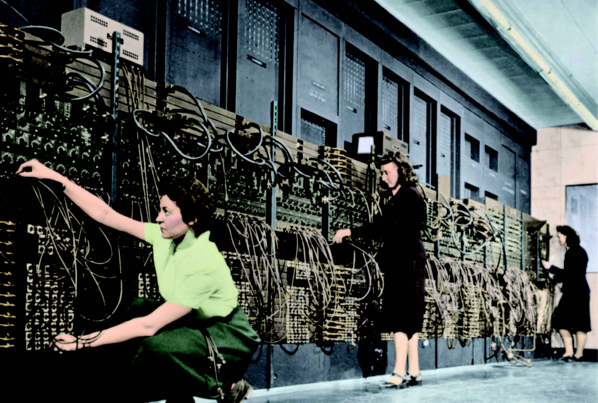
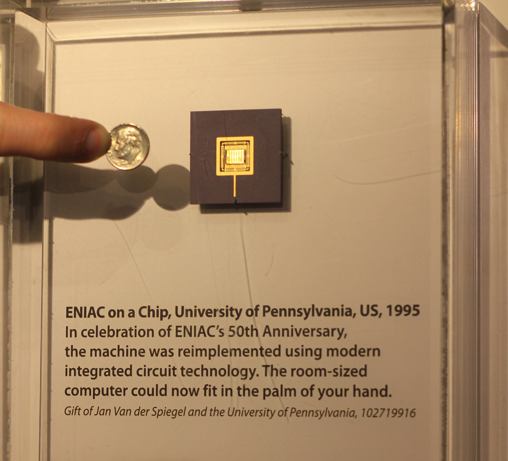
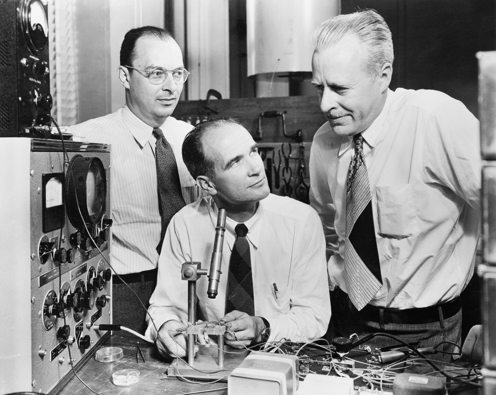
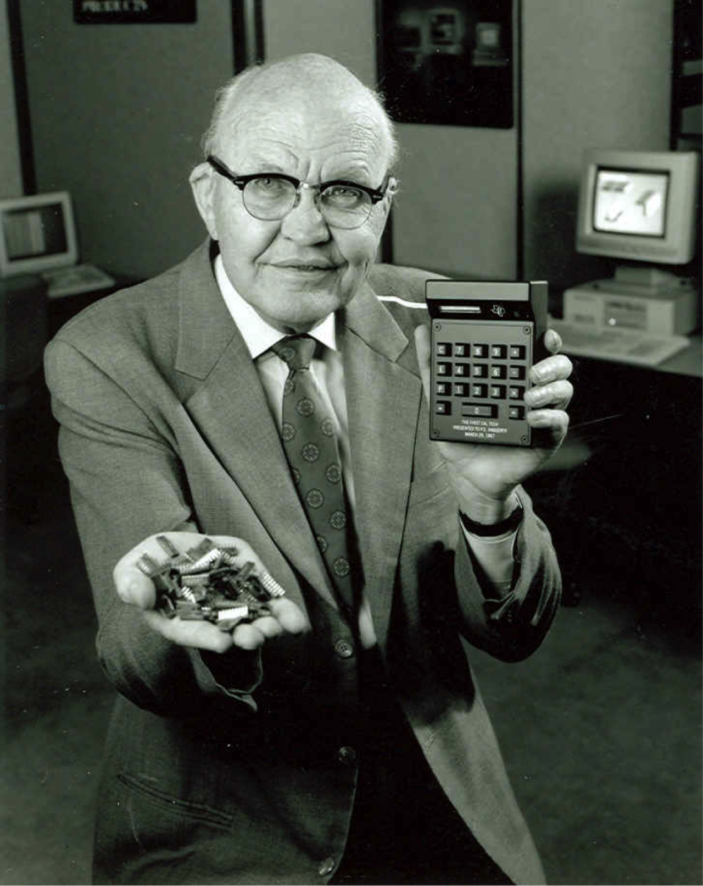
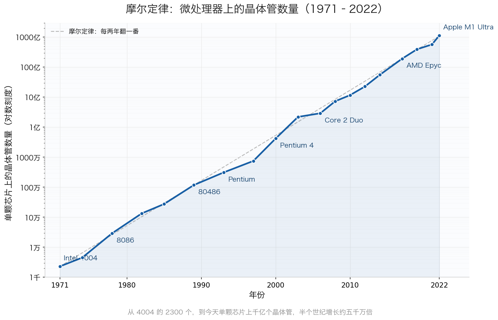

<style>
  /* Hide auto-generated H1 on this galaxy page only */
  .md-content__inner > h1:first-child { display: none !important; }
</style>

<script>
(function () {
  function bindDirLinks() {
    document.querySelectorAll('a[href^="#dir-"]').forEach(function (a) {
      if (a._dirBound) return;
      a._dirBound = true;
      a.addEventListener('click', function (e) {
        var id = this.getAttribute('href').slice(1);
        var target = document.getElementById(id);
        if (!target) return;
        e.preventDefault();
        e.stopPropagation();
        var headerEl = document.querySelector('.md-header');
        var tabsEl   = document.querySelector('.md-tabs');
        var offset   = (headerEl ? headerEl.offsetHeight : 0)
                     + (tabsEl   ? tabsEl.offsetHeight   : 0)
                     + 12;
        var top = target.getBoundingClientRect().top + window.pageYOffset - offset;
        window.scrollTo({ top: top, behavior: 'smooth' });
        history.pushState(null, '', '#' + id);
      });
    });
  }
  if (typeof document$ !== 'undefined') {
    document$.subscribe(bindDirLinks);
  } else {
    document.addEventListener('DOMContentLoaded', bindDirLinks);
  }
})();
</script>

<div id="rg-root" class="rg-root rg-fullscreen">
  <div class="rg-stage" id="rg-stage">
    <div class="rg-rings" id="rg-rings"></div>
    <div class="rg-cards-layer" id="rg-cards-layer"></div>
    <div class="rg-center">
      <div class="rg-center-pulse"></div>
    </div>
  </div>
  <div class="rg-fallback" style="display:none">
<div class="dm-wrap">
<div class="dm-row dm-device"><span class="dm-lbl">器件与制造</span><span class="dm-chips"><a class="dm-chip" href="半导体器件与先进工艺/">半导体器件与先进工艺</a><a class="dm-chip" href="功率半导体与宽禁带器件/">功率半导体与宽禁带器件</a><a class="dm-chip" href="光电子与硅光集成/">光电子与硅光集成</a><a class="dm-chip" href="MEMS与微纳传感器/">MEMS与微纳传感器</a><a class="dm-chip" href="先进封装与异构集成/">先进封装与异构集成</a></span></div>
<div class="dm-conn">↓</div>
<div class="dm-row dm-circuit"><span class="dm-lbl">模拟与射频电路</span><span class="dm-chips"><a class="dm-chip" href="模拟与混合信号IC/">模拟与混合信号IC</a><a class="dm-chip" href="射频与毫米波IC/">射频与毫米波IC</a><a class="dm-chip" href="生物电子与脑机接口/">生物电子与脑机接口</a></span></div>
<div class="dm-conn">↓</div>
<div class="dm-row dm-arch"><span class="dm-lbl">计算架构</span><span class="dm-chips"><a class="dm-chip" href="处理器架构与编译系统/">处理器架构与编译系统</a><a class="dm-chip" href="存算一体与近存计算/">存算一体与近存计算</a><a class="dm-chip" href="可重构计算与FPGA/">可重构计算与FPGA</a></span></div>
<div class="dm-conn">↓</div>
<div class="dm-row dm-infra"><span class="dm-lbl">设计工具与安全</span><span class="dm-chips"><a class="dm-chip" href="EDA与设计自动化/">EDA与设计自动化</a><a class="dm-chip" href="硬件安全与可信计算/">硬件安全与可信计算</a></span></div>
<div class="dm-conn">↓</div>
<div class="dm-row dm-cross"><span class="dm-lbl">交叉前沿</span><span class="dm-chips"><a class="dm-chip" href="AI算法与系统/">AI算法与系统</a><a class="dm-chip" href="具身智能/">具身智能</a><a class="dm-chip" href="量子计算与量子芯片/">量子计算与量子芯片</a><a class="dm-chip" href="类脑芯片/">类脑芯片</a></span></div>
</div>
  </div>
  <a class="rg-scroll" href="#巡礼"><span class="df-scroll-t">计算的本质</span><span class="df-scroll-a">↓</span></a>
</div>

<div class="rg-essay" markdown id="巡礼">


# 科研方向巡礼

*程序员研究如何用计算机做事，我们则研究计算本身*

<p class="pano-hint">← 左右滑动查看全图 · 点按任一方块进入该方向 →</p>

<div class="pano-fig"><svg viewBox="0 0 1140 532" xmlns="http://www.w3.org/2000/svg" style="width:100%;max-width:1140px;display:block;margin:1.5rem auto;font-family:system-ui,-apple-system,sans-serif;">
  <rect width="1140" height="532" rx="10" fill="#FFFFFF" stroke="#CBD5E1" stroke-width="1.5"/>
  <text x="570" y="26" text-anchor="middle" font-size="17" font-weight="bold" fill="#1E293B">集成电路科研方向全景图</text>
  <text x="250" y="54" text-anchor="middle" font-size="13.5" font-weight="bold" fill="#0E7490">← 计算媒介更奇异</text>
  <text x="1000" y="54" text-anchor="middle" font-size="13.5" font-weight="bold" fill="#16A34A">更贴近物理世界 →</text>
  <rect x="88" y="88" width="147" height="298" rx="6" fill="#ECFEFF"/>
  <rect x="239" y="88" width="147" height="298" rx="6" fill="#F8FAFC"/>
  <rect x="390" y="88" width="147" height="298" rx="6" fill="#FEF2F2"/>
  <rect x="541" y="88" width="289" height="298" rx="6" fill="#EFF6FF"/>
  <rect x="834" y="88" width="76" height="298" rx="6" fill="#FFFBEB"/>
  <rect x="914" y="88" width="218" height="298" rx="6" fill="#F0FDF4"/>
  <text x="161" y="82" text-anchor="middle" font-size="12" font-weight="bold" fill="#0E7490">量子 · 光子</text>
  <text x="312" y="82" text-anchor="middle" font-size="12" font-weight="bold" fill="#64748B">存算 · 类脑</text>
  <text x="463" y="82" text-anchor="middle" font-size="12" font-weight="bold" fill="#DC2626">模拟 · 射频</text>
  <text x="685" y="82" text-anchor="middle" font-size="13" font-weight="bold" fill="#1D4ED8">数字计算</text>
  <text x="872" y="82" text-anchor="middle" font-size="12" font-weight="bold" fill="#D97706">功率电子</text>
  <text x="1023" y="82" text-anchor="middle" font-size="12" font-weight="bold" fill="#16A34A">传感 · 生物 · 机械</text>
  <line x1="86" y1="92" x2="1132" y2="92" stroke="#E2E8F0" stroke-width="1"/>
  <line x1="86" y1="150" x2="1132" y2="150" stroke="#EEF2F6" stroke-width="1"/>
  <line x1="86" y1="208" x2="1132" y2="208" stroke="#EEF2F6" stroke-width="1"/>
  <line x1="86" y1="266" x2="1132" y2="266" stroke="#EEF2F6" stroke-width="1"/>
  <line x1="86" y1="324" x2="1132" y2="324" stroke="#EEF2F6" stroke-width="1"/>
  <line x1="86" y1="382" x2="1132" y2="382" stroke="#E2E8F0" stroke-width="1"/>
  <line x1="86" y1="92" x2="86" y2="382" stroke="#CBD5E1" stroke-width="1"/>
  <text x="81" y="124" text-anchor="end" font-size="10.5" fill="#475569">算法 / 应用</text>
  <text x="81" y="182" text-anchor="end" font-size="10.5" fill="#475569">系统 / 软件</text>
  <text x="81" y="240" text-anchor="end" font-size="10.5" fill="#475569">体系结构</text>
  <text x="81" y="298" text-anchor="end" font-size="10.5" fill="#475569">电路</text>
  <text x="81" y="356" text-anchor="end" font-size="10.5" fill="#475569">器件</text>
  <a href="量子计算与量子芯片/"><rect x="92" y="92" width="68" height="290" rx="5" fill="#CFFAFE" stroke="#0E7490" stroke-width="1.2"/>
  <text x="126" y="231" text-anchor="middle" font-size="10.5" font-weight="bold" fill="#0E7490">量子计算</text>
  <text x="126" y="246" text-anchor="middle" font-size="10.5" font-weight="bold" fill="#0E7490">与量子芯片</text></a>
  <a href="光电子与硅光集成/"><rect x="163" y="92" width="68" height="290" rx="5" fill="#CFFAFE" stroke="#0E7490" stroke-width="1.2"/>
  <text x="197" y="231" text-anchor="middle" font-size="10.5" font-weight="bold" fill="#0E7490">光电子</text>
  <text x="197" y="246" text-anchor="middle" font-size="10.5" font-weight="bold" fill="#0E7490">与硅光集成</text></a>
  <a href="模拟与混合信号IC/"><rect x="394" y="266" width="68" height="116" rx="5" fill="#FEE2E2" stroke="#DC2626" stroke-width="1.2"/>
  <text x="428" y="317" text-anchor="middle" font-size="10.5" font-weight="bold" fill="#DC2626">模拟与</text>
  <text x="428" y="332" text-anchor="middle" font-size="10.5" font-weight="bold" fill="#DC2626">混合信号IC</text></a>
  <a href="射频与毫米波IC/"><rect x="465" y="266" width="68" height="116" rx="5" fill="#FEE2E2" stroke="#DC2626" stroke-width="1.2"/>
  <text x="499" y="317" text-anchor="middle" font-size="10.5" font-weight="bold" fill="#DC2626">射频与</text>
  <text x="499" y="332" text-anchor="middle" font-size="10.5" font-weight="bold" fill="#DC2626">毫米波IC</text></a>
  <a href="类脑芯片/"><rect x="243" y="92" width="68" height="290" rx="5" fill="#FEE2E2" stroke="#DC2626" stroke-width="1.2"/>
  <text x="277" y="239" text-anchor="middle" font-size="11.5" font-weight="bold" fill="#DC2626">类脑芯片</text></a>
  <a href="存算一体与近存计算/"><rect x="314" y="92" width="68" height="290" rx="5" fill="#EDE9FE" stroke="#7C3AED" stroke-width="1.2"/>
  <text x="348" y="231" text-anchor="middle" font-size="10.5" font-weight="bold" fill="#7C3AED">存算一体</text>
  <text x="348" y="246" text-anchor="middle" font-size="10.5" font-weight="bold" fill="#7C3AED">与近存计算</text></a>
  <a href="硬件安全与可信计算/"><rect x="545" y="92" width="68" height="290" rx="5" fill="#EDE9FE" stroke="#7C3AED" stroke-width="1.2"/>
  <text x="579" y="231" text-anchor="middle" font-size="10.5" font-weight="bold" fill="#7C3AED">硬件安全</text>
  <text x="579" y="246" text-anchor="middle" font-size="10.5" font-weight="bold" fill="#7C3AED">与可信计算</text></a>
  <a href="AI算法与系统/"><rect x="616" y="92" width="68" height="174" rx="5" fill="#DBEAFE" stroke="#1D4ED8" stroke-width="1.2"/>
  <text x="650" y="172" text-anchor="middle" font-size="10.5" font-weight="bold" fill="#1D4ED8">AI 算法</text>
  <text x="650" y="187" text-anchor="middle" font-size="10.5" font-weight="bold" fill="#1D4ED8">与系统</text></a>
  <a href="处理器架构与编译系统/"><rect x="687" y="150" width="68" height="116" rx="5" fill="#DBEAFE" stroke="#1D4ED8" stroke-width="1.2"/>
  <text x="721" y="201" text-anchor="middle" font-size="10.5" font-weight="bold" fill="#1D4ED8">处理器架构</text>
  <text x="721" y="216" text-anchor="middle" font-size="10.5" font-weight="bold" fill="#1D4ED8">与编译系统</text></a>
  <a href="可重构计算与FPGA/"><rect x="758" y="208" width="68" height="116" rx="5" fill="#DBEAFE" stroke="#1D4ED8" stroke-width="1.2"/>
  <text x="792" y="259" text-anchor="middle" font-size="10.5" font-weight="bold" fill="#1D4ED8">可重构计算</text>
  <text x="792" y="274" text-anchor="middle" font-size="10.5" font-weight="bold" fill="#1D4ED8">与 FPGA</text></a>
  <a href="功率半导体与宽禁带器件/"><rect x="838" y="266" width="68" height="116" rx="5" fill="#FEF3C7" stroke="#D97706" stroke-width="1.2"/>
  <text x="872" y="317" text-anchor="middle" font-size="10.5" font-weight="bold" fill="#B45309">功率半导体</text>
  <text x="872" y="332" text-anchor="middle" font-size="10" font-weight="bold" fill="#B45309">与宽禁带器件</text></a>
  <a href="具身智能/"><rect x="918" y="92" width="68" height="290" rx="5" fill="#ECFCCB" stroke="#65A30D" stroke-width="1.2"/>
  <text x="952" y="239" text-anchor="middle" font-size="11.5" font-weight="bold" fill="#4D7C0F">具身智能</text></a>
  <a href="生物电子与脑机接口/"><rect x="989" y="266" width="68" height="116" rx="5" fill="#D1FAE5" stroke="#059669" stroke-width="1.2"/>
  <text x="1023" y="317" text-anchor="middle" font-size="10.5" font-weight="bold" fill="#047857">生物电子</text>
  <text x="1023" y="332" text-anchor="middle" font-size="10.5" font-weight="bold" fill="#047857">与脑机接口</text></a>
  <a href="MEMS与微纳传感器/"><rect x="1060" y="266" width="68" height="116" rx="5" fill="#DCFCE7" stroke="#16A34A" stroke-width="1.2"/>
  <text x="1094" y="317" text-anchor="middle" font-size="10.5" font-weight="bold" fill="#15803D">MEMS 与</text>
  <text x="1094" y="332" text-anchor="middle" font-size="10.5" font-weight="bold" fill="#15803D">微纳传感器</text></a>
  <text x="81" y="450" text-anchor="end" font-size="10.5" fill="#475569">各方向通用</text>
  <a href="EDA与设计自动化/"><rect x="92" y="408" width="1040" height="28" rx="5" fill="#F1F5F9" stroke="#64748B" stroke-width="1.1"/>
  <text x="612" y="426" text-anchor="middle" font-size="12" font-weight="bold" fill="#475569">EDA 与设计自动化</text></a>
  <a href="先进封装与异构集成/"><rect x="92" y="440" width="1040" height="28" rx="5" fill="#EEF2F6" stroke="#64748B" stroke-width="1.1"/>
  <text x="612" y="458" text-anchor="middle" font-size="12" font-weight="bold" fill="#475569">先进封装与系统集成</text></a>
  <a href="半导体器件与先进工艺/"><rect x="92" y="472" width="1040" height="30" rx="5" fill="#E2E8F0" stroke="#475569" stroke-width="1.2"/>
  <text x="612" y="491" text-anchor="middle" font-size="12" font-weight="bold" fill="#334155">半导体器件与先进工艺</text></a>
  <rect x="92" y="512" width="13" height="13" rx="2" fill="#DBEAFE" stroke="#1D4ED8" stroke-width="1.1"/>
  <text x="110" y="522" text-anchor="start" font-size="10.5" fill="#475569">数字</text>
  <rect x="160" y="512" width="13" height="13" rx="2" fill="#FEE2E2" stroke="#DC2626" stroke-width="1.1"/>
  <text x="178" y="522" text-anchor="start" font-size="10.5" fill="#475569">模拟</text>
  <rect x="228" y="512" width="13" height="13" rx="2" fill="#EDE9FE" stroke="#7C3AED" stroke-width="1.1"/>
  <text x="246" y="522" text-anchor="start" font-size="10.5" fill="#475569">数字 / 模拟 交叉</text>
</svg></div>

<details class=”admonition abstract”><summary class=”admonition-title”>本文涉及的 17 个科研方向（按出现顺序，括注首次介绍的章节）</summary><ol>
<li><a href="#dir-1" target="_self">半导体器件与先进工艺</a>（第 3 章）</li>
<li><a href="#dir-2" target="_self">EDA 与设计自动化</a>（第 3 章）</li>
<li><a href="#dir-3" target="_self">光电子与硅光集成</a>（第 4 章）</li>
<li><a href="#dir-4" target="_self">先进封装与异构集成</a>（第 4 章）</li>
<li><a href="#dir-5" target="_self">处理器架构与编译系统</a>（第 4 章）</li>
<li><a href="#dir-6" target="_self">可重构计算与 FPGA</a>（第 4 章）</li>
<li><a href="#dir-7" target="_self">存算一体与近存计算</a>（第 4 章）</li>
<li><a href="#dir-8" target="_self">MEMS 与微纳传感器</a>（第 5 章）</li>
<li><a href="#dir-9" target="_self">模拟与混合信号 IC</a>（第 5 章）</li>
<li><a href="#dir-10" target="_self">射频与毫米波 IC</a>（第 5 章）</li>
<li><a href="#dir-11" target="_self">功率半导体与宽禁带器件</a>（第 5 章）</li>
<li><a href="#dir-12" target="_self">生物电子与脑机接口</a>（第 5 章）</li>
<li><a href="#dir-13" target="_self">硬件安全与可信计算</a>（第 5 章）</li>
<li><a href="#dir-14" target="_self">AI 算法与系统</a>（第 6 章）</li>
<li><a href="#dir-15" target="_self">具身智能</a>（第 6 章）</li>
<li><a href="#dir-16" target="_self">类脑芯片</a>（第 6 章）</li>
<li><a href="#dir-17" target="_self">量子计算与量子芯片</a>（第 6 章）</li>
</ol></details>

---


## 用计算构建意义


一万年前，一个刚学会种地的人蹲在田埂上，盯着天发愁：明年会旱还是会涝？这头牛换多少粮食才不亏？隔壁那块地到底该归谁？第一次见她应该带多少布匹？

慢慢地，他学会了计算。他数雨水间隔的天数，发现旱涝有迹可循；他在绳子上打结，一个结一头牛，两个结一袋粮，比一比就知道亏不亏；他步测田埂，把边界刻在木桩上，争执就少了；然后，“氓之蚩蚩，抱布贸丝。匪来贸丝，来即我谋。”

慢慢地，大家都学会了计算，并协调出了统一的算法。历法是对时间的计算，货币是对价值的计算，法律是对行为的计算。今天的天气预报、出行导航、基因测序、央行的利率决议，都是试图在巨大的不确定性中，用计算坍缩出一个确定性。

科幻作品里常常将高等文明定义为"低熵体"。因为熵是衡量混乱程度的物理量，熵越低，代表越有序。而高等文明拥有悠久的历史，灿烂的文化，井然的秩序，明确的社会分工，这些都是"低熵"的体现，是意义的富集。而这些意义的构建，都离不开计算。

可计算到底是如何发生的？从绳子上的结到案上的算盘，从“文王拘而演周易”到钦天监"璇玑玉衡，以齐七政"......从古至今，计算的载体很多，却万变不离其宗——把信息编码进物理状态，利用物理过程逼出结果。

回顾这些载体，绳结算得慢，算盘快一些，真正让算力指数爆炸的，是在第三次科技革命中登场的集成电路。自从我们这个专业诞生，人类所掌握的算力经历了半个世纪的指数爆炸，文明的形态也由此发生了翻天覆地的变化。今天手机拍一张照片，背后跑几十亿次运算；高铁调度系统同时协调几千列列车的交汇；天气预报把整个大气层的流动装进方程，就能算出三天后哪片云会变成雨。

如果说计算机的同学研究如何用计算解决问题，我们则是在研究计算本身——信息如何编码，用什么载体计算，如何组织计算过程。接下来要介绍的将近二十个科研方向，无外乎这三个问题。

---

## 用什么来承担计算

**从模拟信号到数字信号**

要计算，先得有个东西来承载信息。

最早的办法是在物理世界里留下痕迹。绳子打个结，一个结代表一头牛；泥板上刻一道楔形印记，代表一笔债；纸上写一个"5"，代表一个数量。从绳结到文字到数字符号，载体在变，但都是在试图把信息固定在某种物理形态上。

到了近代，人类发现了一种更快的载体来承载信息——电。电压的高低可以代表数值，电流的通断可以代表状态。电信号跑得快、传得远，比在纸上写字强太多。然而，自然的电信号是连续的。电压不会只取 1V 或 2V 这样整齐的值，它可以是 3.1415926V，也可以是 1.14514V。我们中学物理所学的电路，就是如此。

像这样用连续变化的物理量来承载信息的信号，叫作"模拟信号（analog signal）"。黑胶唱片就是模拟信号的典型。它用沟槽的形状，精确地记录每一个音符的调值与响度。但像这样的模拟信号有一个绕不开的问题——噪声。黑胶唱片一旦磨损，音质就会不可逆地劣化。这是模拟信号的连续性的导致的，每一个值都是合法的，一个 0.9V 的电压，我们没有办法判断它到底本来就是 0.9V，还是 1V 的电压加上 -0.1V 的噪声。

<svg width="100%" viewBox="0 0 680 260" xmlns="http://www.w3.org/2000/svg" role="img">
<title>数字信号与模拟信号的噪声容限对比</title>
<text font-family="'Noto Sans SC',sans-serif" font-weight="500" font-size="14" x="170" y="24" text-anchor="middle" fill="#1a1a1a">数字信号</text>
<text font-family="'Noto Sans SC',sans-serif" font-weight="500" font-size="14" x="510" y="24" text-anchor="middle" fill="#1a1a1a">模拟信号</text>
<line x1="60" y1="60" x2="60" y2="220" stroke="#1a1a1a" stroke-width="0.5" opacity="0.3"/>
<line x1="60" y1="220" x2="280" y2="220" stroke="#1a1a1a" stroke-width="0.5" opacity="0.3"/>
<line x1="55" y1="70" x2="280" y2="70" stroke="#185FA5" stroke-width="1.5" stroke-dasharray="6 4" opacity="0.3"/>
<text font-family="'Noto Sans SC',sans-serif" font-size="12" x="50" y="74" text-anchor="end" fill="#185FA5">1V</text>
<text font-family="'Noto Sans SC',sans-serif" font-size="12" x="50" y="224" text-anchor="end" fill="#185FA5">0V</text>
<line x1="55" y1="130" x2="280" y2="130" stroke="#854F0B" stroke-width="1" stroke-dasharray="4 3" opacity="0.4"/>
<text font-family="'Noto Sans SC',sans-serif" font-size="12" x="50" y="134" text-anchor="end" fill="#1a1a1a" opacity="0.5">0.5V</text>
<rect x="60" y="70" width="220" height="60" fill="#185FA5" opacity="0.08"/>
<rect x="60" y="130" width="220" height="90" fill="#1D9E75" opacity="0.08"/>
<circle cx="170" cy="106" r="6" fill="#E24B4A"/>
<text font-family="'Noto Sans SC',sans-serif" font-size="12" x="182" y="110" fill="#E24B4A">收到 0.6V</text>
<line x1="170" y1="112" x2="170" y2="74" stroke="#185FA5" stroke-width="1.5" stroke-dasharray="3 3"/>
<text font-family="'Noto Sans SC',sans-serif" font-weight="500" font-size="14" x="170" y="58" text-anchor="middle" fill="#185FA5">→ 判定为 1</text>
<text font-family="'Noto Sans SC',sans-serif" font-size="12" x="170" y="245" text-anchor="middle" fill="#1a1a1a" opacity="0.5">在 1 的区域内，确定是 1</text>
<line x1="400" y1="60" x2="400" y2="220" stroke="#1a1a1a" stroke-width="0.5" opacity="0.3"/>
<line x1="400" y1="220" x2="620" y2="220" stroke="#1a1a1a" stroke-width="0.5" opacity="0.3"/>
<line x1="395" y1="70" x2="620" y2="70" stroke="#1D9E75" stroke-width="1" stroke-dasharray="6 4" opacity="0.2"/>
<text font-family="'Noto Sans SC',sans-serif" font-size="12" x="390" y="74" text-anchor="end" fill="#1D9E75">1V</text>
<text font-family="'Noto Sans SC',sans-serif" font-size="12" x="390" y="224" text-anchor="end" fill="#1D9E75">0V</text>
<circle cx="510" cy="106" r="6" fill="#E24B4A"/>
<text font-family="'Noto Sans SC',sans-serif" font-size="12" x="522" y="110" fill="#E24B4A">收到 0.6V</text>
<line x1="510" y1="100" x2="510" y2="74" stroke="#1a1a1a" stroke-width="0.5" stroke-dasharray="2 2" opacity="0.3"/>
<line x1="510" y1="112" x2="510" y2="216" stroke="#1a1a1a" stroke-width="0.5" stroke-dasharray="2 2" opacity="0.3"/>
<text font-family="'Noto Sans SC',sans-serif" font-size="12" x="440" y="88" fill="#A32D2D">原始是 0.7V？</text>
<text font-family="'Noto Sans SC',sans-serif" font-size="12" x="445" y="140" fill="#A32D2D">原始是 0.4V？</text>
<text font-family="'Noto Sans SC',sans-serif" font-size="12" x="555" y="160" fill="#A32D2D">原始是 0.8V？</text>
<text font-family="'Noto Sans SC',sans-serif" font-weight="500" font-size="14" x="510" y="58" text-anchor="middle" fill="#A32D2D">→ 不知道原始是多少</text>
<text font-family="'Noto Sans SC',sans-serif" font-size="12" x="510" y="245" text-anchor="middle" fill="#1a1a1a" opacity="0.5">任何电压都有意义，无法区分信号和噪声</text>
</svg>

解决这个问题的办法，就是在连续的电信号里预留一些区间来抵御噪声。电路中的电压依然是连续的 0~1V，但我们在接收端只承认两个状态：0V和1V。如果我接收到一个 0.3V 的电压，那我就认为我实际上接收到的是一个 0V 的信号，只不过在传输过程中受到了 +0.3V 的噪声；如果是0.8V，那我就认为是 1V。这样做虽然使得信息密度大大减小：一根导线只能传递2个状态，但却极大提高了可靠性。只要噪声不过分大，我们就不用管了。这就是"数字信号（digital signal）"。

今天我们手机里存的音乐就是这么做的。同一首歌，不再是一条连续的沟槽，而是一长串数字。播放时这串数字被还原成连续的电压，再驱动耳机振膜。

<svg width="100%" viewBox="0 0 680 300" xmlns="http://www.w3.org/2000/svg" role="img">
<title>模拟信号与数字信号的波形对比</title>
<text font-family="'Noto Sans SC',sans-serif" font-weight="600" font-size="13" x="30" y="22" fill="#0F6E56">模拟信号</text>
<text font-family="'Noto Sans SC',sans-serif" font-size="12" x="110" y="22" fill="#888">连续 · 如黑胶唱片沟槽</text>
<line x1="30" y1="85" x2="650" y2="85" stroke="#ccc" stroke-width="0.5"/>
<path d="M30 85 C70 30,110 30,150 85 C190 140,230 140,270 85 C310 30,350 30,390 85 C430 140,470 140,510 85 C550 30,590 30,630 85" fill="none" stroke="#1D9E75" stroke-width="2.5" stroke-linecap="round"/>
<text font-family="'Noto Sans SC',sans-serif" font-size="11" x="640" y="89" fill="#aaa">t</text>
<text font-family="'Noto Sans SC',sans-serif" font-size="10" x="645" y="78" fill="#aaa">···</text>
<text font-family="'Noto Sans SC',sans-serif" font-weight="600" font-size="13" x="30" y="170" fill="#185FA5">数字信号</text>
<text font-family="'Noto Sans SC',sans-serif" font-size="12" x="110" y="170" fill="#888">离散 · 如手机里存储的音乐</text>
<line x1="30" y1="235" x2="650" y2="235" stroke="#ccc" stroke-width="0.5"/>
<path d="M30 235 C70 180,110 180,150 235 C190 290,230 290,270 235 C310 180,350 180,390 235 C430 290,470 290,510 235 C550 180,590 180,630 235" fill="none" stroke="#999" stroke-width="0.8" stroke-dasharray="4 4" opacity="0.35"/>
<line x1="30" y1="235" x2="60" y2="235" stroke="#185FA5" stroke-width="2.2"/>
<line x1="60" y1="235" x2="60" y2="212" stroke="#185FA5" stroke-width="2.2"/>
<line x1="60" y1="212" x2="90" y2="212" stroke="#185FA5" stroke-width="2.2"/>
<line x1="90" y1="212" x2="90" y2="195" stroke="#185FA5" stroke-width="2.2"/>
<line x1="90" y1="195" x2="120" y2="195" stroke="#185FA5" stroke-width="2.2"/>
<line x1="120" y1="195" x2="120" y2="185" stroke="#185FA5" stroke-width="2.2"/>
<line x1="120" y1="185" x2="150" y2="185" stroke="#185FA5" stroke-width="2.2"/>
<line x1="150" y1="185" x2="150" y2="195" stroke="#185FA5" stroke-width="2.2"/>
<line x1="150" y1="195" x2="180" y2="195" stroke="#185FA5" stroke-width="2.2"/>
<line x1="180" y1="195" x2="180" y2="212" stroke="#185FA5" stroke-width="2.2"/>
<line x1="180" y1="212" x2="210" y2="212" stroke="#185FA5" stroke-width="2.2"/>
<line x1="210" y1="212" x2="210" y2="235" stroke="#185FA5" stroke-width="2.2"/>
<line x1="210" y1="235" x2="240" y2="235" stroke="#185FA5" stroke-width="2.2"/>
<line x1="240" y1="235" x2="240" y2="258" stroke="#185FA5" stroke-width="2.2"/>
<line x1="240" y1="258" x2="270" y2="258" stroke="#185FA5" stroke-width="2.2"/>
<line x1="270" y1="258" x2="270" y2="275" stroke="#185FA5" stroke-width="2.2"/>
<line x1="270" y1="275" x2="300" y2="275" stroke="#185FA5" stroke-width="2.2"/>
<line x1="300" y1="275" x2="300" y2="285" stroke="#185FA5" stroke-width="2.2"/>
<line x1="300" y1="285" x2="330" y2="285" stroke="#185FA5" stroke-width="2.2"/>
<line x1="330" y1="285" x2="330" y2="275" stroke="#185FA5" stroke-width="2.2"/>
<line x1="330" y1="275" x2="360" y2="275" stroke="#185FA5" stroke-width="2.2"/>
<line x1="360" y1="275" x2="360" y2="258" stroke="#185FA5" stroke-width="2.2"/>
<line x1="360" y1="258" x2="390" y2="258" stroke="#185FA5" stroke-width="2.2"/>
<line x1="390" y1="258" x2="390" y2="235" stroke="#185FA5" stroke-width="2.2"/>
<line x1="390" y1="235" x2="420" y2="235" stroke="#185FA5" stroke-width="2.2"/>
<line x1="420" y1="235" x2="420" y2="212" stroke="#185FA5" stroke-width="2.2"/>
<line x1="420" y1="212" x2="450" y2="212" stroke="#185FA5" stroke-width="2.2"/>
<line x1="450" y1="212" x2="450" y2="195" stroke="#185FA5" stroke-width="2.2"/>
<line x1="450" y1="195" x2="480" y2="195" stroke="#185FA5" stroke-width="2.2"/>
<line x1="480" y1="195" x2="480" y2="185" stroke="#185FA5" stroke-width="2.2"/>
<line x1="480" y1="185" x2="510" y2="185" stroke="#185FA5" stroke-width="2.2"/>
<line x1="510" y1="185" x2="510" y2="195" stroke="#185FA5" stroke-width="2.2"/>
<line x1="510" y1="195" x2="540" y2="195" stroke="#185FA5" stroke-width="2.2"/>
<line x1="540" y1="195" x2="540" y2="212" stroke="#185FA5" stroke-width="2.2"/>
<line x1="540" y1="212" x2="570" y2="212" stroke="#185FA5" stroke-width="2.2"/>
<line x1="570" y1="212" x2="570" y2="235" stroke="#185FA5" stroke-width="2.2"/>
<line x1="570" y1="235" x2="600" y2="235" stroke="#185FA5" stroke-width="2.2"/>
<line x1="600" y1="235" x2="600" y2="246" stroke="#185FA5" stroke-width="2.2"/>
<line x1="600" y1="246" x2="630" y2="246" stroke="#185FA5" stroke-width="2.2"/>
<circle cx="30" cy="235" r="3" fill="#185FA5"/><circle cx="60" cy="212" r="3" fill="#185FA5"/><circle cx="90" cy="195" r="3" fill="#185FA5"/><circle cx="120" cy="185" r="3" fill="#185FA5"/><circle cx="150" cy="195" r="3" fill="#185FA5"/><circle cx="180" cy="212" r="3" fill="#185FA5"/><circle cx="210" cy="235" r="3" fill="#185FA5"/><circle cx="240" cy="258" r="3" fill="#185FA5"/><circle cx="270" cy="275" r="3" fill="#185FA5"/><circle cx="300" cy="285" r="3" fill="#185FA5"/><circle cx="330" cy="275" r="3" fill="#185FA5"/><circle cx="360" cy="258" r="3" fill="#185FA5"/><circle cx="390" cy="235" r="3" fill="#185FA5"/><circle cx="420" cy="212" r="3" fill="#185FA5"/><circle cx="450" cy="195" r="3" fill="#185FA5"/><circle cx="480" cy="185" r="3" fill="#185FA5"/><circle cx="510" cy="195" r="3" fill="#185FA5"/><circle cx="540" cy="212" r="3" fill="#185FA5"/><circle cx="570" cy="235" r="3" fill="#185FA5"/><circle cx="600" cy="246" r="3" fill="#185FA5"/>
<text font-family="'Noto Sans SC',sans-serif" font-size="11" x="640" y="239" fill="#aaa">t</text>
</svg>

**用数字信号进行二进制计算**

从模拟信号到数字信号的转变，不只改变了音乐的存储方式，也改变了计算。

早期的电子计算也是模拟的。运算放大器把电压当数值，电路本身就是算式——两个电压叠加（V₁ + V₂）就是加法；一个电阻（V = I × R）完成一次乘法；电容上的电压随时间积累（V = ∫I dt / C），自然完成积分。但模拟计算面临和黑胶唱片同样的困境：噪声会累积。每经过一级电路就叠一层误差，十级还能忍，一百级就面目全非。所以模拟计算能解微分方程，但造不出复杂的通用计算机。

数字信号的计算思路则完全不同。它只用 0 和 1 来承载信息，而这就是二进制（binary）。数字信号的计算方法，本质上就是二进制的运算。

二进制如何运算呢？1703 年，莱布尼茨（Leibniz）发明了二进制。一百多年后，布尔（Boole）定义了二进制的计算方法，它为二进制0和1赋予了逻辑意义——1表示命题为真，0表示命题为假。在此基础上，他又定义了"与（AND）""或（OR）"“非（NOT）”三种逻辑运算，这三个运算其实就是高中数学集合运算的"交""并""补"。

<svg width="100%" viewBox="0 0 720 495" xmlns="http://www.w3.org/2000/svg" role="img">
<title>布尔代数：逻辑运算、集合运算、逻辑命题的对应</title>
<text font-family="'Noto Sans SC',sans-serif" font-weight="500" font-size="15" x="360" y="26" text-anchor="middle" fill="#1a1a1a">布尔代数：逻辑、集合，是同一套结构</text>
<rect x="10" y="42" width="220" height="398" rx="10" fill="#E6F1FB" stroke="#185FA5" stroke-width="1" opacity="0.5"/>
<text font-family="'Noto Sans SC',sans-serif" font-weight="600" font-size="15" x="120" y="68" text-anchor="middle" fill="#185FA5">AND（与）</text>
<text font-family="'Noto Sans SC',sans-serif" font-size="12" x="120" y="88" text-anchor="middle" fill="#333">命题：带了钱包 且 带了钥匙</text>
<text font-family="'Noto Sans SC',sans-serif" font-size="12" x="120" y="105" text-anchor="middle" fill="#185FA5" font-weight="500">→ 才能安心出门</text>
<text font-family="'Noto Sans SC',sans-serif" font-size="10" x="120" y="121" text-anchor="middle" fill="#999">两个都为真，结果才为真</text>
<defs><clipPath id="clipA0"><circle cx="103" cy="185" r="30"/></clipPath></defs>
<circle cx="103" cy="185" r="30" fill="none" stroke="#185FA5" stroke-width="1.5"/>
<circle cx="137" cy="185" r="30" fill="none" stroke="#185FA5" stroke-width="1.5"/>
<circle cx="137" cy="185" r="30" fill="#185FA5" opacity="0.4" clip-path="url(#clipA0)"/>
<text font-family="'Noto Sans SC',sans-serif" font-size="13" x="91" y="190" text-anchor="middle" fill="#185FA5">A</text>
<text font-family="'Noto Sans SC',sans-serif" font-size="13" x="149" y="190" text-anchor="middle" fill="#185FA5">B</text>
<text font-family="'Noto Sans SC',sans-serif" font-weight="500" font-size="13" x="120" y="237" text-anchor="middle" fill="#185FA5">交集 ∩</text>
<rect x="66" y="257" width="36" height="24" fill="#185FA5" opacity="0.7"/>
<text font-family="'Courier New',monospace" font-size="12" x="84" y="273" text-anchor="middle" fill="white" font-weight="bold">A</text>
<rect x="102" y="257" width="36" height="24" fill="#185FA5" opacity="0.7"/>
<text font-family="'Courier New',monospace" font-size="12" x="120" y="273" text-anchor="middle" fill="white" font-weight="bold">B</text>
<rect x="138" y="257" width="36" height="24" fill="#185FA5" opacity="0.7"/>
<text font-family="'Courier New',monospace" font-size="12" x="156" y="273" text-anchor="middle" fill="white" font-weight="bold">A·B</text>
<rect x="66" y="283" width="36" height="24" fill="#fff" fill-opacity="1" stroke="#ddd" stroke-width="0.5"/>
<text font-family="'Courier New',monospace" font-size="13" x="84" y="300" text-anchor="middle" fill="#333" font-weight="normal">0</text>
<rect x="102" y="283" width="36" height="24" fill="#fff" fill-opacity="1" stroke="#ddd" stroke-width="0.5"/>
<text font-family="'Courier New',monospace" font-size="13" x="120" y="300" text-anchor="middle" fill="#333" font-weight="normal">0</text>
<rect x="138" y="283" width="36" height="24" fill="#fff" fill-opacity="1" stroke="#ddd" stroke-width="0.5"/>
<text font-family="'Courier New',monospace" font-size="13" x="156" y="300" text-anchor="middle" fill="#185FA5" font-weight="bold">0</text>
<rect x="66" y="309" width="36" height="24" fill="#fff" fill-opacity="1" stroke="#ddd" stroke-width="0.5"/>
<text font-family="'Courier New',monospace" font-size="13" x="84" y="326" text-anchor="middle" fill="#333" font-weight="normal">0</text>
<rect x="102" y="309" width="36" height="24" fill="#fff" fill-opacity="1" stroke="#ddd" stroke-width="0.5"/>
<text font-family="'Courier New',monospace" font-size="13" x="120" y="326" text-anchor="middle" fill="#333" font-weight="normal">1</text>
<rect x="138" y="309" width="36" height="24" fill="#fff" fill-opacity="1" stroke="#ddd" stroke-width="0.5"/>
<text font-family="'Courier New',monospace" font-size="13" x="156" y="326" text-anchor="middle" fill="#185FA5" font-weight="bold">0</text>
<rect x="66" y="335" width="36" height="24" fill="#fff" fill-opacity="1" stroke="#ddd" stroke-width="0.5"/>
<text font-family="'Courier New',monospace" font-size="13" x="84" y="352" text-anchor="middle" fill="#333" font-weight="normal">1</text>
<rect x="102" y="335" width="36" height="24" fill="#fff" fill-opacity="1" stroke="#ddd" stroke-width="0.5"/>
<text font-family="'Courier New',monospace" font-size="13" x="120" y="352" text-anchor="middle" fill="#333" font-weight="normal">0</text>
<rect x="138" y="335" width="36" height="24" fill="#fff" fill-opacity="1" stroke="#ddd" stroke-width="0.5"/>
<text font-family="'Courier New',monospace" font-size="13" x="156" y="352" text-anchor="middle" fill="#185FA5" font-weight="bold">0</text>
<rect x="66" y="361" width="36" height="24" fill="#fff" fill-opacity="1" stroke="#ddd" stroke-width="0.5"/>
<text font-family="'Courier New',monospace" font-size="13" x="84" y="378" text-anchor="middle" fill="#333" font-weight="normal">1</text>
<rect x="102" y="361" width="36" height="24" fill="#fff" fill-opacity="1" stroke="#ddd" stroke-width="0.5"/>
<text font-family="'Courier New',monospace" font-size="13" x="120" y="378" text-anchor="middle" fill="#333" font-weight="normal">1</text>
<rect x="138" y="361" width="36" height="24" fill="#185FA5" fill-opacity="0.2" stroke="#ddd" stroke-width="0.5"/>
<text font-family="'Courier New',monospace" font-size="13" x="156" y="378" text-anchor="middle" fill="#185FA5" font-weight="bold">1</text>
<rect x="250" y="42" width="220" height="398" rx="10" fill="#E1F5EE" stroke="#0F6E56" stroke-width="1" opacity="0.5"/>
<text font-family="'Noto Sans SC',sans-serif" font-weight="600" font-size="15" x="360" y="68" text-anchor="middle" fill="#0F6E56">OR（或）</text>
<text font-family="'Noto Sans SC',sans-serif" font-size="12" x="360" y="88" text-anchor="middle" fill="#333">命题：刷卡 或 付现金</text>
<text font-family="'Noto Sans SC',sans-serif" font-size="12" x="360" y="105" text-anchor="middle" fill="#0F6E56" font-weight="500">→ 都能买单</text>
<text font-family="'Noto Sans SC',sans-serif" font-size="10" x="360" y="121" text-anchor="middle" fill="#999">有一个为真，结果就为真</text>
<circle cx="343" cy="185" r="30" fill="#0F6E56" opacity="0.3" stroke="#0F6E56" stroke-width="1.5"/>
<circle cx="377" cy="185" r="30" fill="#0F6E56" opacity="0.3" stroke="#0F6E56" stroke-width="1.5"/>
<text font-family="'Noto Sans SC',sans-serif" font-size="13" x="331" y="190" text-anchor="middle" fill="#0F6E56">A</text>
<text font-family="'Noto Sans SC',sans-serif" font-size="13" x="389" y="190" text-anchor="middle" fill="#0F6E56">B</text>
<text font-family="'Noto Sans SC',sans-serif" font-weight="500" font-size="13" x="360" y="237" text-anchor="middle" fill="#0F6E56">并集 ∪</text>
<rect x="306" y="257" width="36" height="24" fill="#0F6E56" opacity="0.7"/>
<text font-family="'Courier New',monospace" font-size="12" x="324" y="273" text-anchor="middle" fill="white" font-weight="bold">A</text>
<rect x="342" y="257" width="36" height="24" fill="#0F6E56" opacity="0.7"/>
<text font-family="'Courier New',monospace" font-size="12" x="360" y="273" text-anchor="middle" fill="white" font-weight="bold">B</text>
<rect x="378" y="257" width="36" height="24" fill="#0F6E56" opacity="0.7"/>
<text font-family="'Courier New',monospace" font-size="12" x="396" y="273" text-anchor="middle" fill="white" font-weight="bold">A+B</text>
<rect x="306" y="283" width="36" height="24" fill="#fff" fill-opacity="1" stroke="#ddd" stroke-width="0.5"/>
<text font-family="'Courier New',monospace" font-size="13" x="324" y="300" text-anchor="middle" fill="#333" font-weight="normal">0</text>
<rect x="342" y="283" width="36" height="24" fill="#fff" fill-opacity="1" stroke="#ddd" stroke-width="0.5"/>
<text font-family="'Courier New',monospace" font-size="13" x="360" y="300" text-anchor="middle" fill="#333" font-weight="normal">0</text>
<rect x="378" y="283" width="36" height="24" fill="#fff" fill-opacity="1" stroke="#ddd" stroke-width="0.5"/>
<text font-family="'Courier New',monospace" font-size="13" x="396" y="300" text-anchor="middle" fill="#0F6E56" font-weight="bold">0</text>
<rect x="306" y="309" width="36" height="24" fill="#fff" fill-opacity="1" stroke="#ddd" stroke-width="0.5"/>
<text font-family="'Courier New',monospace" font-size="13" x="324" y="326" text-anchor="middle" fill="#333" font-weight="normal">0</text>
<rect x="342" y="309" width="36" height="24" fill="#fff" fill-opacity="1" stroke="#ddd" stroke-width="0.5"/>
<text font-family="'Courier New',monospace" font-size="13" x="360" y="326" text-anchor="middle" fill="#333" font-weight="normal">1</text>
<rect x="378" y="309" width="36" height="24" fill="#0F6E56" fill-opacity="0.2" stroke="#ddd" stroke-width="0.5"/>
<text font-family="'Courier New',monospace" font-size="13" x="396" y="326" text-anchor="middle" fill="#0F6E56" font-weight="bold">1</text>
<rect x="306" y="335" width="36" height="24" fill="#fff" fill-opacity="1" stroke="#ddd" stroke-width="0.5"/>
<text font-family="'Courier New',monospace" font-size="13" x="324" y="352" text-anchor="middle" fill="#333" font-weight="normal">1</text>
<rect x="342" y="335" width="36" height="24" fill="#fff" fill-opacity="1" stroke="#ddd" stroke-width="0.5"/>
<text font-family="'Courier New',monospace" font-size="13" x="360" y="352" text-anchor="middle" fill="#333" font-weight="normal">0</text>
<rect x="378" y="335" width="36" height="24" fill="#0F6E56" fill-opacity="0.2" stroke="#ddd" stroke-width="0.5"/>
<text font-family="'Courier New',monospace" font-size="13" x="396" y="352" text-anchor="middle" fill="#0F6E56" font-weight="bold">1</text>
<rect x="306" y="361" width="36" height="24" fill="#fff" fill-opacity="1" stroke="#ddd" stroke-width="0.5"/>
<text font-family="'Courier New',monospace" font-size="13" x="324" y="378" text-anchor="middle" fill="#333" font-weight="normal">1</text>
<rect x="342" y="361" width="36" height="24" fill="#fff" fill-opacity="1" stroke="#ddd" stroke-width="0.5"/>
<text font-family="'Courier New',monospace" font-size="13" x="360" y="378" text-anchor="middle" fill="#333" font-weight="normal">1</text>
<rect x="378" y="361" width="36" height="24" fill="#0F6E56" fill-opacity="0.2" stroke="#ddd" stroke-width="0.5"/>
<text font-family="'Courier New',monospace" font-size="13" x="396" y="378" text-anchor="middle" fill="#0F6E56" font-weight="bold">1</text>
<rect x="490" y="42" width="220" height="398" rx="10" fill="#FCEBEB" stroke="#A32D2D" stroke-width="1" opacity="0.5"/>
<text font-family="'Noto Sans SC',sans-serif" font-weight="600" font-size="15" x="600" y="68" text-anchor="middle" fill="#A32D2D">NOT（非）</text>
<text font-family="'Noto Sans SC',sans-serif" font-size="12" x="600" y="88" text-anchor="middle" fill="#333">命题：不是工作日</text>
<text font-family="'Noto Sans SC',sans-serif" font-size="12" x="600" y="105" text-anchor="middle" fill="#A32D2D" font-weight="500">→ 就是休息日</text>
<text font-family="'Noto Sans SC',sans-serif" font-size="10" x="600" y="121" text-anchor="middle" fill="#999">真假对调</text>
<rect x="552" y="147" width="96" height="76" rx="4" fill="#A32D2D" opacity="0.25" stroke="#A32D2D" stroke-width="1"/>
<circle cx="600" cy="185" r="26" fill="white" stroke="#A32D2D" stroke-width="1.5"/>
<text font-family="'Noto Sans SC',sans-serif" font-size="14" x="600" y="190" text-anchor="middle" fill="#A32D2D">A</text>
<text font-family="'Noto Sans SC',sans-serif" font-size="12" x="636" y="159" fill="#A32D2D">Ā</text>
<text font-family="'Noto Sans SC',sans-serif" font-weight="500" font-size="13" x="600" y="237" text-anchor="middle" fill="#A32D2D">补集 ￢</text>
<rect x="564" y="257" width="36" height="24" fill="#A32D2D" opacity="0.7"/>
<text font-family="'Courier New',monospace" font-size="12" x="582" y="273" text-anchor="middle" fill="white" font-weight="bold">A</text>
<rect x="600" y="257" width="36" height="24" fill="#A32D2D" opacity="0.7"/>
<text font-family="'Courier New',monospace" font-size="12" x="618" y="273" text-anchor="middle" fill="white" font-weight="bold">Ā</text>
<rect x="564" y="283" width="36" height="24" fill="#fff" fill-opacity="1" stroke="#ddd" stroke-width="0.5"/>
<text font-family="'Courier New',monospace" font-size="13" x="582" y="300" text-anchor="middle" fill="#333" font-weight="normal">0</text>
<rect x="600" y="283" width="36" height="24" fill="#A32D2D" fill-opacity="0.2" stroke="#ddd" stroke-width="0.5"/>
<text font-family="'Courier New',monospace" font-size="13" x="618" y="300" text-anchor="middle" fill="#A32D2D" font-weight="bold">1</text>
<rect x="564" y="309" width="36" height="24" fill="#fff" fill-opacity="1" stroke="#ddd" stroke-width="0.5"/>
<text font-family="'Courier New',monospace" font-size="13" x="582" y="326" text-anchor="middle" fill="#333" font-weight="normal">1</text>
<rect x="600" y="309" width="36" height="24" fill="#fff" fill-opacity="1" stroke="#ddd" stroke-width="0.5"/>
<text font-family="'Courier New',monospace" font-size="13" x="618" y="326" text-anchor="middle" fill="#A32D2D" font-weight="bold">0</text>
<text font-family="'Noto Sans SC',sans-serif" font-size="12" x="360" y="481" text-anchor="middle" fill="#999">日常的逻辑判断、集合的交并补、电路的 0 和 1——同一套运算的三种面孔</text>
</svg>

如何用二进制的逻辑运算来实现十进制的四则运算呢？首先，已知二进制与十进制可以互相转换；再者，二进制的加法只有四种情况：0+0=0，0+1=1，1+0=1，1+1=10（逢二进一，就像十进制里 9+1=10）。这四条规则，都可以用逐位的与、或、非来表示。减法也一样。有了加法就能做乘法，除法稍微复杂点，但也能做。如此一来，二进制就成为一个完备的数制，可以作为十进制的平替。

<svg width="100%" viewBox="0 0 680 340" xmlns="http://www.w3.org/2000/svg" role="img">
<title>二进制加法与乘法示意</title>
<text font-family="'Noto Sans SC',sans-serif" font-weight="500" font-size="15" x="340" y="26" text-anchor="middle" fill="#1a1a1a">二进制算术：只用 0 和 1 做四则运算</text>
<text font-family="'Noto Sans SC',sans-serif" font-weight="500" font-size="14" x="190" y="60" text-anchor="middle" fill="#185FA5">加法：5 + 3 = 8</text>
<text font-family="'Noto Sans SC',sans-serif" font-size="12" x="110" y="85" fill="#999">十进制</text>
<text font-family="'Noto Sans SC',sans-serif" font-size="12" x="240" y="85" fill="#999">二进制</text>
<text font-family="'Courier New',monospace" font-size="13" x="220" y="100" fill="#E24B4A" text-anchor="end">进位</text>
<text font-family="'Courier New',monospace" font-size="16" x="240" y="100" fill="#E24B4A">1</text>
<text font-family="'Courier New',monospace" font-size="16" x="258" y="100" fill="#E24B4A">1</text>
<text font-family="'Courier New',monospace" font-size="16" x="276" y="100" fill="#E24B4A">1</text>
<text font-family="'Noto Sans SC',sans-serif" font-size="14" x="110" y="128" fill="#333">5</text>
<text font-family="'Courier New',monospace" font-size="20" x="240" y="130" fill="#185FA5">1</text>
<text font-family="'Courier New',monospace" font-size="20" x="258" y="130" fill="#185FA5">0</text>
<text font-family="'Courier New',monospace" font-size="20" x="276" y="130" fill="#185FA5">1</text>
<text font-family="'Noto Sans SC',sans-serif" font-size="14" x="110" y="156" fill="#333">+ 3</text>
<text font-family="'Courier New',monospace" font-size="14" x="222" y="156" fill="#333">+</text>
<text font-family="'Courier New',monospace" font-size="20" x="240" y="158" fill="#185FA5">0</text>
<text font-family="'Courier New',monospace" font-size="20" x="258" y="158" fill="#185FA5">1</text>
<text font-family="'Courier New',monospace" font-size="20" x="276" y="158" fill="#185FA5">1</text>
<line x1="230" y1="164" x2="290" y2="164" stroke="#333" stroke-width="1.5"/>
<text font-family="'Noto Sans SC',sans-serif" font-size="14" x="110" y="188" fill="#333">8</text>
<text font-family="'Courier New',monospace" font-size="20" x="222" y="190" fill="#1D9E75" font-weight="bold">1</text>
<text font-family="'Courier New',monospace" font-size="20" x="240" y="190" fill="#1D9E75" font-weight="bold">0</text>
<text font-family="'Courier New',monospace" font-size="20" x="258" y="190" fill="#1D9E75" font-weight="bold">0</text>
<text font-family="'Courier New',monospace" font-size="20" x="276" y="190" fill="#1D9E75" font-weight="bold">0</text>
<rect x="95" y="215" width="190" height="100" rx="6" fill="#E6F1FB" stroke="#185FA5" stroke-width="0.5"/>
<text font-family="'Noto Sans SC',sans-serif" font-weight="500" font-size="13" x="190" y="235" text-anchor="middle" fill="#185FA5">加法只有四条规则：</text>
<text font-family="'Courier New',monospace" font-size="12" x="190" y="255" text-anchor="middle" fill="#333">0 + 0 = 0</text>
<text font-family="'Courier New',monospace" font-size="12" x="190" y="271" text-anchor="middle" fill="#333">0 + 1 = 1</text>
<text font-family="'Courier New',monospace" font-size="12" x="190" y="287" text-anchor="middle" fill="#333">1 + 0 = 1</text>
<text font-family="'Courier New',monospace" font-size="12" x="190" y="303" text-anchor="middle" fill="#333">1 + 1 = 10（进位）</text>
<text font-family="'Noto Sans SC',sans-serif" font-weight="500" font-size="14" x="510" y="60" text-anchor="middle" fill="#0F6E56">乘法：5 × 3 = 15</text>
<text font-family="'Noto Sans SC',sans-serif" font-size="12" x="430" y="85" fill="#999">十进制</text>
<text font-family="'Noto Sans SC',sans-serif" font-size="12" x="550" y="85" fill="#999">二进制</text>
<text font-family="'Noto Sans SC',sans-serif" font-size="14" x="430" y="128" fill="#333">5</text>
<text font-family="'Courier New',monospace" font-size="20" x="540" y="130" fill="#0F6E56">1</text>
<text font-family="'Courier New',monospace" font-size="20" x="558" y="130" fill="#0F6E56">0</text>
<text font-family="'Courier New',monospace" font-size="20" x="576" y="130" fill="#0F6E56">1</text>
<text font-family="'Noto Sans SC',sans-serif" font-size="14" x="430" y="156" fill="#333">× 3</text>
<text font-family="'Courier New',monospace" font-size="14" x="522" y="156" fill="#333">×</text>
<text font-family="'Courier New',monospace" font-size="20" x="540" y="158" fill="#0F6E56">0</text>
<text font-family="'Courier New',monospace" font-size="20" x="558" y="158" fill="#0F6E56">1</text>
<text font-family="'Courier New',monospace" font-size="20" x="576" y="158" fill="#0F6E56">1</text>
<line x1="530" y1="164" x2="590" y2="164" stroke="#333" stroke-width="1.5"/>
<text font-family="'Courier New',monospace" font-size="14" x="540" y="182" fill="#666">  101</text>
<text font-family="'Noto Sans SC',sans-serif" font-size="10" x="602" y="182" fill="#999">← ×1</text>
<text font-family="'Courier New',monospace" font-size="14" x="540" y="198" fill="#666"> 101·</text>
<text font-family="'Noto Sans SC',sans-serif" font-size="10" x="602" y="198" fill="#999">← ×1, 左移</text>
<text font-family="'Courier New',monospace" font-size="14" x="540" y="214" fill="#666">000··</text>
<text font-family="'Noto Sans SC',sans-serif" font-size="10" x="602" y="214" fill="#999">← ×0, 跳过</text>
<line x1="530" y1="220" x2="590" y2="220" stroke="#333" stroke-width="1"/>
<text font-family="'Noto Sans SC',sans-serif" font-size="14" x="430" y="240" fill="#333">15</text>
<text font-family="'Courier New',monospace" font-size="20" x="522" y="242" fill="#1D9E75" font-weight="bold">1</text>
<text font-family="'Courier New',monospace" font-size="20" x="540" y="242" fill="#1D9E75" font-weight="bold">1</text>
<text font-family="'Courier New',monospace" font-size="20" x="558" y="242" fill="#1D9E75" font-weight="bold">1</text>
<text font-family="'Courier New',monospace" font-size="20" x="576" y="242" fill="#1D9E75" font-weight="bold">1</text>
<rect x="415" y="268" width="190" height="52" rx="6" fill="#E1F5EE" stroke="#0F6E56" stroke-width="0.5"/>
<text font-family="'Noto Sans SC',sans-serif" font-size="12" x="510" y="288" text-anchor="middle" fill="#085041">乘法 = 移位 + 加法</text>
<text font-family="'Noto Sans SC',sans-serif" font-size="12" x="510" y="306" text-anchor="middle" fill="#085041">只要会加法，就会乘法</text>
<text font-family="'Noto Sans SC',sans-serif" font-size="12" x="340" y="330" text-anchor="middle" fill="#999">几个最简单的逻辑门，搭出全部四则运算</text>
</svg>

**把二进制映射到电路上**

现在，我们已经有了信息的载体——数字电信号，有了运算的规则——二进制，离完整的计算系统还缺一样东西——计算的载体。

1937 年，21 岁的香农（Shannon）在他的 MIT 硕士毕业论文补齐了这个空白。他将二进制的布尔代数（Boolean algebra）映射到了电路上。两个开关串联，两个都闭合才通电——与；两个开关并联，任意一个闭合就通电——或；一个常闭开关，通电时断开——非。串联、并联，高中物理最基础的电路结构，就能实现二进制运算。我们只要把现实中的十进制问题转为二进制，再交给电路运算，就能获得答案。

<svg width="100%" viewBox="0 0 680 200" xmlns="http://www.w3.org/2000/svg" role="img">
<title>与、或、非门的电路实现</title>
<text font-family="'Noto Sans SC',sans-serif" font-weight="600" font-size="13" x="113" y="20" text-anchor="middle" fill="#185FA5">AND（与）</text>
<text font-family="'Noto Sans SC',sans-serif" font-size="11" x="113" y="36" text-anchor="middle" fill="#888">串联：都闭合才通</text>
<rect x="18" y="46" width="190" height="100" rx="6" fill="none" stroke="#ddd" stroke-width="0.5"/>
<line x1="38" y1="96" x2="68" y2="96" stroke="#333" stroke-width="1.5"/>
<rect x="68" y="86" width="30" height="20" rx="3" fill="none" stroke="#185FA5" stroke-width="1.5"/>
<text font-family="'Noto Sans SC',sans-serif" font-size="9" x="83" y="100" text-anchor="middle" fill="#185FA5">A</text>
<line x1="98" y1="96" x2="118" y2="96" stroke="#333" stroke-width="1.5"/>
<rect x="118" y="86" width="30" height="20" rx="3" fill="none" stroke="#185FA5" stroke-width="1.5"/>
<text font-family="'Noto Sans SC',sans-serif" font-size="9" x="133" y="100" text-anchor="middle" fill="#185FA5">B</text>
<line x1="148" y1="96" x2="178" y2="96" stroke="#333" stroke-width="1.5"/>
<circle cx="185" cy="96" r="6" fill="none" stroke="#E8A735" stroke-width="1.5"/>
<text font-family="'Noto Sans SC',sans-serif" font-size="9" x="113" y="130" text-anchor="middle" fill="#666">A=1 且 B=1 → 通</text>
<text font-family="'Noto Sans SC',sans-serif" font-weight="600" font-size="13" x="340" y="20" text-anchor="middle" fill="#1D9E75">OR（或）</text>
<text font-family="'Noto Sans SC',sans-serif" font-size="11" x="340" y="36" text-anchor="middle" fill="#888">并联：任一闭合就通</text>
<rect x="245" y="46" width="190" height="100" rx="6" fill="none" stroke="#ddd" stroke-width="0.5"/>
<line x1="265" y1="82" x2="295" y2="82" stroke="#333" stroke-width="1.5"/>
<line x1="265" y1="110" x2="295" y2="110" stroke="#333" stroke-width="1.5"/>
<line x1="265" y1="82" x2="265" y2="110" stroke="#333" stroke-width="1.5"/>
<rect x="295" y="72" width="30" height="20" rx="3" fill="none" stroke="#1D9E75" stroke-width="1.5"/>
<text font-family="'Noto Sans SC',sans-serif" font-size="9" x="310" y="86" text-anchor="middle" fill="#1D9E75">A</text>
<rect x="295" y="100" width="30" height="20" rx="3" fill="none" stroke="#1D9E75" stroke-width="1.5"/>
<text font-family="'Noto Sans SC',sans-serif" font-size="9" x="310" y="114" text-anchor="middle" fill="#1D9E75">B</text>
<line x1="325" y1="82" x2="365" y2="82" stroke="#333" stroke-width="1.5"/>
<line x1="325" y1="110" x2="365" y2="110" stroke="#333" stroke-width="1.5"/>
<line x1="365" y1="82" x2="365" y2="110" stroke="#333" stroke-width="1.5"/>
<line x1="365" y1="96" x2="395" y2="96" stroke="#333" stroke-width="1.5"/>
<circle cx="402" cy="96" r="6" fill="none" stroke="#E8A735" stroke-width="1.5"/>
<text font-family="'Noto Sans SC',sans-serif" font-size="9" x="340" y="142" text-anchor="middle" fill="#666">A=1 或 B=1 → 通</text>
<text font-family="'Noto Sans SC',sans-serif" font-weight="600" font-size="13" x="567" y="20" text-anchor="middle" fill="#A32D2D">NOT（非）</text>
<text font-family="'Noto Sans SC',sans-serif" font-size="11" x="567" y="36" text-anchor="middle" fill="#888">常闭：通电时断开</text>
<rect x="472" y="46" width="190" height="100" rx="6" fill="none" stroke="#ddd" stroke-width="0.5"/>
<line x1="502" y1="96" x2="542" y2="96" stroke="#333" stroke-width="1.5"/>
<rect x="542" y="86" width="30" height="20" rx="3" fill="#A32D2D" opacity="0.15" stroke="#A32D2D" stroke-width="1.5"/>
<text font-family="'Noto Sans SC',sans-serif" font-size="9" x="557" y="100" text-anchor="middle" fill="#A32D2D">A</text>
<line x1="572" y1="90" x2="572" y2="102" stroke="#A32D2D" stroke-width="2"/>
<line x1="582" y1="96" x2="622" y2="96" stroke="#333" stroke-width="1.5"/>
<circle cx="629" cy="96" r="6" fill="none" stroke="#E8A735" stroke-width="1.5"/>
<text font-family="'Noto Sans SC',sans-serif" font-size="9" x="567" y="130" text-anchor="middle" fill="#666">A=0 → 通；A=1 → 断</text>
<text font-family="'Noto Sans SC',sans-serif" font-size="10" x="340" y="178" text-anchor="middle" fill="#aaa">○ = 灯泡 &nbsp;&nbsp;□ = 开关</text>
</svg>

同样在那段时间，在德国，康拉德·楚泽（Konrad Zuse）造出了第一台可编程的二进制计算机 Z3。艾伦·图灵（Alan Turing）则从理论上证明：任何可以被明确定义步骤的计算，都可以由一台足够简单的抽象机器完成。

不同的人，在差不多的时间，从不同的方向尝试使用电路来进行自动化的计算。于是，人类三百年的数学和物理发展，在此交汇。

不过，此时距离高效的电路计算，还有一个巨大的gap——成本。从前用来计算的载体是继电器或真空管，继电器太慢，真空管太大太脆弱。科学家剩下的任务，就是找到一种新的材料来制作电路。这个新的材料要求非常苛刻，它要能够把电路做得足够小、足够快、足够省电，且能够大规模集成，以便执行复杂的计算。这个看似不可能的任务，在1947年被贝尔实验室攻破了。

他们给出答案是硅（silicon）。

<svg width="100%" viewBox="0 0 720 520" xmlns="http://www.w3.org/2000/svg" role="img">
<title>从数学到硅：三条线的交汇</title>
<text font-family="'Noto Sans SC',sans-serif" font-weight="500" font-size="15" x="360" y="26" text-anchor="middle" fill="#1a1a1a"></text>
<text font-family="'Noto Sans SC',sans-serif" font-weight="500" font-size="13" x="160" y="58" text-anchor="middle" fill="#534AB7">数学</text>
<rect x="88" y="68" width="144" height="44" rx="7" fill="#EEEDFE" stroke="#534AB7" stroke-width="1"/>
<text font-family="'Noto Sans SC',sans-serif" font-weight="500" font-size="13" x="160" y="88" text-anchor="middle" fill="#3C3489">莱布尼茨 · 1703</text>
<text font-family="'Noto Sans SC',sans-serif" font-size="11" x="160" y="104" text-anchor="middle" fill="#534AB7">二进制</text>
<line x1="160" y1="112" x2="160" y2="132" stroke="#534AB7" stroke-width="1.5"/>
<polygon points="160,137 156,130 164,130" fill="#534AB7"/>
<rect x="88" y="140" width="144" height="44" rx="7" fill="#EEEDFE" stroke="#534AB7" stroke-width="1"/>
<text font-family="'Noto Sans SC',sans-serif" font-weight="500" font-size="13" x="160" y="160" text-anchor="middle" fill="#3C3489">布尔 · 1854</text>
<text font-family="'Noto Sans SC',sans-serif" font-size="11" x="160" y="176" text-anchor="middle" fill="#534AB7">逻辑代数：AND OR NOT</text>
<path d="M160,184 C160,216 340,226 340,248" stroke="#534AB7" stroke-width="1.5" fill="none"/>
<polygon points="340,253 336,246 344,246" fill="#534AB7"/>
<text font-family="'Noto Sans SC',sans-serif" font-weight="500" font-size="13" x="540" y="58" text-anchor="middle" fill="#0F6E56">电路</text>
<rect x="468" y="68" width="144" height="44" rx="7" fill="#E1F5EE" stroke="#0F6E56" stroke-width="1"/>
<text font-family="'Noto Sans SC',sans-serif" font-weight="500" font-size="13" x="540" y="88" text-anchor="middle" fill="#085041">继电器 · 开关</text>
<text font-family="'Noto Sans SC',sans-serif" font-size="11" x="540" y="104" text-anchor="middle" fill="#0F6E56">通断：物理的两态</text>
<line x1="540" y1="112" x2="540" y2="132" stroke="#0F6E56" stroke-width="1.5"/>
<polygon points="540,137 536,130 544,130" fill="#0F6E56"/>
<rect x="468" y="140" width="144" height="44" rx="7" fill="#E1F5EE" stroke="#0F6E56" stroke-width="1"/>
<text font-family="'Noto Sans SC',sans-serif" font-weight="500" font-size="13" x="540" y="160" text-anchor="middle" fill="#085041">串联 · 并联</text>
<text font-family="'Noto Sans SC',sans-serif" font-size="11" x="540" y="176" text-anchor="middle" fill="#0F6E56">高中物理的基础电路</text>
<path d="M540,184 C540,216 380,226 380,248" stroke="#0F6E56" stroke-width="1.5" fill="none"/>
<polygon points="380,253 376,246 384,246" fill="#0F6E56"/>
<rect x="275" y="256" width="170" height="48" rx="10" fill="#FFF3E0" stroke="#E65100" stroke-width="1.5"/>
<text font-family="'Noto Sans SC',sans-serif" font-weight="600" font-size="14" x="360" y="276" text-anchor="middle" fill="#E65100">香农 · 1937</text>
<text font-family="'Noto Sans SC',sans-serif" font-size="12" x="360" y="294" text-anchor="middle" fill="#BF360C">布尔代数 → 开关电路</text>
<line x1="360" y1="304" x2="360" y2="324" stroke="#E65100" stroke-width="1.5"/>
<polygon points="360,329 356,322 364,322" fill="#E65100"/>
<rect x="275" y="332" width="170" height="44" rx="7" fill="#E3F2FD" stroke="#1565C0" stroke-width="1"/>
<text font-family="'Noto Sans SC',sans-serif" font-weight="500" font-size="13" x="360" y="350" text-anchor="middle" fill="#0D47A1">晶体管 · 1947</text>
<text font-family="'Noto Sans SC',sans-serif" font-size="11" x="360" y="366" text-anchor="middle" fill="#1565C0">半导体做的开关</text>
<line x1="360" y1="376" x2="360" y2="392" stroke="#1565C0" stroke-width="1.5"/>
<polygon points="360,397 356,390 364,390" fill="#1565C0"/>
<rect x="275" y="400" width="170" height="44" rx="7" fill="#1565C0" opacity="0.85"/>
<text font-family="'Noto Sans SC',sans-serif" font-weight="500" font-size="13" x="360" y="418" text-anchor="middle" fill="white">集成电路 · 1958</text>
<text font-family="'Noto Sans SC',sans-serif" font-size="11" x="360" y="434" text-anchor="middle" fill="#BBDEFB">一块硅上集成千万个开关</text>
<text font-family="'Noto Sans SC',sans-serif" font-size="12" x="360" y="508" text-anchor="middle" fill="#999">数学提供了语言，电路提供了载体，硅让它们大规模集成</text>
</svg>

---

## 硅的黄金时代

**硅与集成电路**

二战期间，美国宾夕法尼亚大学受到军方的委托，计划研制一台能够快速且精确地计算导弹弹道的机器。研究人员秘密工作了数年，直到战争结束，才在 1946 年 2 月14 日，宣告研发成功。世界第一台通用电子计算机——ENIAC问世。

 

*ENIAC（1946 年）：占地约 170 平方米、重约 30 吨，由近一万八千个真空管构成，图为操作员正在为其重新配置线路。美国陆军照片*

虽然 ENIAC 拥有很强的计算能力，但它的缺陷也相当明显。ENIAC 占地面积 170 平方米，相当于两间教室；重约 30 吨，相当于六头大象。此外，它的建造和运转成本也极其高昂。当时单单把这台机器造出来，就花费了将近五十万美元（相当于如今的六七百万美元），其在正常运转时的耗电量也极高。据传它每次一开机，整个费城西区的电灯都会黯然失色。更要命的是，ENIAC 的运转还非常不稳定，最坏情况下每过十五分钟就会有一个真空管（vacuum tube）因过热而爆掉，导致整台机器宕机。可以说，在当时，没有国家级的力量，不可能造出一台计算机。

然而，到了 1996 年，在 ENIAC 诞生五十周年之际，宾夕法尼亚大学推出了一颗长 7.44 毫米、宽5.29 毫米的芯片。这颗芯片实现了ENIAC 的全部功能，却比一枚一角硬币还小。

 

*1996 年，宾夕法尼亚大学为纪念 ENIAC 五十周年制作的「ENIAC-on-a-Chip」：芯片仅 7.44 × 5.29 毫米，比左侧一枚一角硬币还小，却实现了整台 ENIAC 的全部功能。藏于美国计算机历史博物馆*

五十年的时间，计算机从两间房变成一个指甲盖，发生了什么？

1947 年的圣诞前夕，在美国贝尔实验室中，威廉·肖克利（William Shockley）、约翰·巴丁（John Bardeen）和沃尔特·豪泽·布拉顿（Walter Houser Brattain）三位年轻人成功发明了晶体管（transistor）。它们的功能与当时计算机所使用的真空管类似，这让科学家开始思考是否有可能使用晶体管代替真空管来制造计算机。只不过，当时的晶体管工艺尚不成熟，无论体积、成本还是功耗，相比真空管都没有太大优势。于是科学家们又孜孜不倦地研究了十年，直到集成电路的横空出世。

 

*晶体管的三位发明者——约翰·巴丁、威廉·肖克利、沃尔特·布拉顿（摄于 1948 年贝尔实验室）。三人因发明晶体管共同获得 1956 年诺贝尔物理学奖*

1958 年  9 月 12 日，德州仪器的一个工程师杰克·基尔比（Jack Kilby），成功在一块单一的半导体（semiconductor）材料上成功雕刻了整个电路，称为"集成电路（Integrated Circuit）"，后来它有个更大众化的名称——"芯片（Chip）"。我们高中学的电路，电源、电阻、电容、电感都是一个个分立的器件，需要用导线连起来，这叫"分立器件"。而集成电路的思路，是直接在一块材料上，把所有的电路元器件都雕刻上去，再沉积金属完成互连。这样一来，电路的体积大大缩小。无论是制作成本，还是体积功耗，基于集成电路制作的晶体管都远远小于传统的真空管。

 

*杰克·基尔比与他发明的集成电路：手中一小片半导体上集成了完整电路，身旁是放大后的电路版图。1958 年他在德州仪器造出第一块集成电路，从此开启了「芯片」时代，并因此获得 2000 年诺贝尔物理学奖*

后来，科学家找到了最适合的半导体材料——硅。硅有着独特的掺杂特性，掺什么杂质、掺多少，决定了这块硅是否导电、电阻多少，这使得用硅制作的晶体管开关高度可控。而硅的氧化层（二氧化硅）天然致密，几个纳米厚就能隔绝电流，因此它可以让开关可以做到极小而不漏电。此外，硅是地壳里第二丰富的元素，沙子里到处都是，这让硅的成本低到每个人都用得起。

从此，硅与集成电路强强联手，让计算机的体积大幅缩小，性能突飞猛进。结合之前提到的二进制与电路，我们已经有了一套高效的自动化演算系统。一个现实问题，只要能够数学建模，我们就能将其二进制化，然后交给芯片进行高效计算。

```ad-quote
所谓芯片，其实就是赛博算盘。算盘用算珠来存储和计算，芯片用的是电子。

```

<svg width="100%" viewBox="0 0 720 380" xmlns="http://www.w3.org/2000/svg" role="img">
<title>数字计算如何解决现实问题</title>
<text font-family="'Noto Sans SC',sans-serif" font-weight="500" font-size="15" x="360" y="26" text-anchor="middle" fill="#1a1a1a">数字计算如何解决现实问题</text>
<rect x="30" y="55" width="160" height="56" rx="8" fill="#F5F5F5" stroke="#333" stroke-width="1"/>
<text font-family="'Noto Sans SC',sans-serif" font-weight="500" font-size="14" x="110" y="77" text-anchor="middle" fill="#333">现实问题</text>
<text font-family="'Noto Sans SC',sans-serif" font-size="11" x="110" y="97" text-anchor="middle" fill="#888">明天会不会下雨？</text>
<rect x="30" y="135" width="160" height="56" rx="8" fill="#EEEDFE" stroke="#534AB7" stroke-width="1"/>
<text font-family="'Noto Sans SC',sans-serif" font-weight="500" font-size="14" x="110" y="157" text-anchor="middle" fill="#534AB7">数学建模</text>
<text font-family="'Noto Sans SC',sans-serif" font-size="11" x="110" y="177" text-anchor="middle" fill="#888">大气方程、概率模型</text>
<rect x="30" y="215" width="160" height="56" rx="8" fill="#E6F1FB" stroke="#185FA5" stroke-width="1"/>
<text font-family="'Noto Sans SC',sans-serif" font-weight="500" font-size="14" x="110" y="237" text-anchor="middle" fill="#185FA5">二进制化</text>
<text font-family="'Noto Sans SC',sans-serif" font-size="11" x="110" y="257" text-anchor="middle" fill="#888">所有变量用 0 和 1 表示</text>
<line x1="110" y1="111" x2="110" y2="131" stroke="#999" stroke-width="1.2"/>
<polygon points="110,135 106,129 114,129" fill="#999"/>
<line x1="110" y1="191" x2="110" y2="211" stroke="#999" stroke-width="1.2"/>
<polygon points="110,215 106,209 114,209" fill="#999"/>
<text font-family="'Noto Sans SC',sans-serif" font-size="10" x="135" y="127" fill="#999">抽象</text>
<text font-family="'Noto Sans SC',sans-serif" font-size="10" x="135" y="207" fill="#999">离散化</text>
<line x1="190" y1="230" x2="290" y2="230" stroke="#E65100" stroke-width="2"/>
<polygon points="295,230 288,226 288,234" fill="#E65100"/>
<text font-family="'Noto Sans SC',sans-serif" font-weight="500" font-size="12" x="240" y="220" text-anchor="middle" fill="#E65100">香农映射</text>
<text font-family="'Noto Sans SC',sans-serif" font-size="10" x="240" y="248" text-anchor="middle" fill="#BF360C">布尔代数 → 开关电路</text>
<rect x="340" y="200" width="160" height="56" rx="8" fill="#E1F5EE" stroke="#0F6E56" stroke-width="1"/>
<text font-family="'Noto Sans SC',sans-serif" font-weight="500" font-size="14" x="420" y="222" text-anchor="middle" fill="#0F6E56">数字电路</text>
<text font-family="'Noto Sans SC',sans-serif" font-size="11" x="420" y="242" text-anchor="middle" fill="#888">逻辑门执行二进制运算</text>
<rect x="340" y="290" width="160" height="56" rx="8" fill="#E3F2FD" stroke="#1565C0" stroke-width="1"/>
<text font-family="'Noto Sans SC',sans-serif" font-weight="500" font-size="14" x="420" y="312" text-anchor="middle" fill="#1565C0">集成电路</text>
<text font-family="'Noto Sans SC',sans-serif" font-size="11" x="420" y="332" text-anchor="middle" fill="#888">几十亿个门集成在硅上</text>
<line x1="420" y1="256" x2="420" y2="286" stroke="#999" stroke-width="1.2"/>
<polygon points="420,290 416,284 424,284" fill="#999"/>
<text font-family="'Noto Sans SC',sans-serif" font-size="10" x="445" y="278" fill="#999">集成</text>
<rect x="535" y="100" width="150" height="56" rx="8" fill="#1565C0" opacity="0.85"/>
<text font-family="'Noto Sans SC',sans-serif" font-weight="500" font-size="14" x="610" y="122" text-anchor="middle" fill="white">高效计算</text>
<text font-family="'Noto Sans SC',sans-serif" font-size="11" x="610" y="142" text-anchor="middle" fill="#BBDEFB">算出：明天 70% 会下雨</text>
<path d="M500,318 C560,318 610,180 610,160" stroke="#1565C0" stroke-width="1.5" fill="none"/>
<polygon points="610,156 606,162 614,162" fill="#1565C0"/>
<path d="M535,128 C490,128 250,50 190,70" stroke="#999" stroke-width="1" stroke-dasharray="4 3" fill="none" opacity="0.4"/>
<polygon points="190,70 194,78 186,76" fill="#999" opacity="0.4"/>
<text font-family="'Noto Sans SC',sans-serif" font-size="10" x="350" y="52" text-anchor="middle" fill="#999" opacity="0.6">结果反馈现实</text>
<text font-family="'Noto Sans SC',sans-serif" font-size="12" x="360" y="370" text-anchor="middle" fill="#999">从现实问题到物理电路，每一步都有对应的学科在研究</text>
</svg>

**摩尔定律**

1971 年，英特尔用这种材料做出了第一颗微处理器 4004：2300 个晶体管，指甲盖大小，取代了一整柜子的逻辑板。之后整个行业就坐上了火箭。1981 年，IBM 推出个人电脑，计算从实验室走进了办公室。1989 年的 486 处理器装了 120 万个晶体管，配上 Windows，让不懂编程的人也能用电脑。2007 年初代 iPhone 发布，消费者口袋里的算力超过了 1969 年把人送上月球的整个阿波罗计划。今天一颗手机处理器里超过 100 亿个晶体管。从 ENIAC 到智能手机，"旧时王谢堂前燕，飞入寻常百姓家"。

 

*摩尔定律：单颗微处理器上的晶体管数量（1971–2022），纵轴为对数刻度。从 1971 年 Intel 4004 的 2300 个，到 2022 年 Apple M1 Ultra 的约 1140 亿个，半个世纪增长约五千万倍；虚线为「每两年翻一番」的理论参考线*

<span id="dir-1"></span>从 2300 到 100 亿，这条曲线持续了半个世纪，就是后来人们说的摩尔定律（Moore's Law）。它背后是[**半导体器件与先进工艺**](半导体器件与先进工艺.md)的不断演进。这个方向的核心问题是：怎么把晶体管做得更小、更快、更省电？早期的晶体管是平面结构，栅极从上方控制下面的沟道，像一扇盖在水渠上的闸门。到了十几纳米的尺度，这个结构漏电越来越严重——闸门盖不严了。于是研究者把沟道竖起来，做成一片"鱼鳍"，让栅极从三面包裹住它，控制力更强，这就是 FinFET。现在最前沿的工作是把鱼鳍进一步拆成一圈一圈的纳米片，让栅极从四面包住沟道。每一代新结构都是在跟量子效应较劲。晶体管越小，电子就越不按经典物理的规矩走。每一代光刻机的波长也要缩短一截，从紫外到深紫外再到极紫外，每一轮升级都是材料、光学和精密制造的极限挑战。

晶体管越做越多，设计越来越难。一颗 4004 的版图，一个工程师趴在图纸上画几周就能搞定。到了八十年代，几十万个晶体管的版图要铺满整面墙，画完把图纸裁好贴在胶带上送去制版。这种古早的芯片生产过程就叫 tape-out，今天芯片行业还在用这个词来指代流片。当电路来到几十亿个晶体管级别，靠手画已经完全不可能了。

<span id="dir-2"></span>于是我们有了 [**EDA 与设计自动化**](EDA与设计自动化.md)。EDA，全称 Electronic Design Automation，即电子设计自动化。这个方向做的事是开发算法，让计算机来设计芯片。工程师用硬件描述语言写出想要的功能，EDA 工具负责把这段描述翻译成一个可以送去制造的版图。几十亿个器件放在哪，线怎么走，信号能不能在规定时间内到达，全部由 EDA 完成。没有 EDA，摩尔定律早就停止了，因为电路的规模早就复杂到无法单靠人力来设计。

过去几十年，整个世界的运转方式被摩尔定律这条指数曲线改写了。但指数增长是有尽头的。

---

## Party Is Over?

摩尔定律的思路是几何缩放——把晶体管做小，在同样面积里塞进更多开关。这条路跑了半个世纪，正在逼近原子的极限。硅原子直径约 0.2 纳米，今天的晶体管只有十几个原子宽，尺寸上已经快到同一量级。当绝缘的氧化层薄到几个原子时，电子会直接隧穿过去，开关即使关着，也会发生漏电。此外，每一次制程演进，都伴随着更加高昂的生产成本，带来的性能提升却有限，节点步进的性价比越来越低。

2026 年 5 月，华为在 ISCAS 会议上发布了"韬（τ）定律"，提出了另一个维度：与其继续缩小空间，不如压缩时间。信号在铜线里传播需要时间，数据从内存搬到处理器需要时间，芯粒之间通信需要时间——τ 是时间常数，在计算系统的每一层，都有压缩 τ 的空间。

<span id="dir-3"></span>最直接的瓶颈在芯片之间的连线上。铜线有电阻，我们高中物理学过焦耳定律（Joule's law）：Q = I²Rt，电流越大热量越多。数据量爆炸式增长，铜线上的信号切换越来越频繁，发热越来越严重。频率推到几个 GHz 之后，趋肤效应（skin effect）让铜的有效电阻进一步上升，信号衰减加剧，线与线之间串扰。光子不一样——不带电荷，没有 I²R 的损耗，不发热，带宽天然大。你家里的宽带可能已经用上了光纤，道理一样。[**光电子与硅光集成**](光电子与硅光集成.md)要做的是把光通信搬到芯片的尺度上：在硅片上做出光波导、光调制器、光探测器，让芯片之间的对话从电切换成光。挑战在于光学器件天然比电子器件大得多——光的波长是微米级的，晶体管是纳米级的——怎么做小、做兼容、把每比特能耗压下来，是核心的工程问题。

<svg width="100%" viewBox="0 0 680 300" xmlns="http://www.w3.org/2000/svg" role="img">
<title>铜互连与光互连对比</title>
<text font-family="'Noto Sans SC',sans-serif" font-weight="500" font-size="14" x="340" y="24" text-anchor="middle" fill="#1a1a1a">芯片间互连：铜 vs 光</text>
<rect x="40" y="50" width="100" height="50" rx="4" fill="#F1EFE8" stroke="#888" stroke-width="0.5"/>
<text font-family="'Noto Sans SC',sans-serif" font-weight="500" font-size="13" x="90" y="80" text-anchor="middle" fill="#444">芯片 A</text>
<rect x="540" y="50" width="100" height="50" rx="4" fill="#F1EFE8" stroke="#888" stroke-width="0.5"/>
<text font-family="'Noto Sans SC',sans-serif" font-weight="500" font-size="13" x="590" y="80" text-anchor="middle" fill="#444">芯片 B</text>
<rect x="170" y="62" width="340" height="26" rx="4" fill="#BA7517" opacity="0.15"/>
<ellipse cx="185" cy="75" rx="12" ry="12" fill="#BA7517" opacity="0.35" stroke="#854F0B" stroke-width="0.5"/>
<ellipse cx="185" cy="75" rx="5" ry="5" fill="#BA7517" opacity="0.08" stroke="#854F0B" stroke-width="0.5" stroke-dasharray="2 2"/>
<rect x="205" y="69" width="295" height="12" rx="2" fill="#BA7517" opacity="0.4"/>
<path d="M240,64 Q244,56 248,64" stroke="#E24B4A" stroke-width="0.7" fill="none" opacity="0.5"/>
<path d="M300,64 Q304,54 308,64" stroke="#E24B4A" stroke-width="0.7" fill="none" opacity="0.5"/>
<path d="M360,64 Q364,56 368,64" stroke="#E24B4A" stroke-width="0.7" fill="none" opacity="0.5"/>
<path d="M420,64 Q424,54 428,64" stroke="#E24B4A" stroke-width="0.7" fill="none" opacity="0.5"/>
<path d="M470,64 Q474,56 478,64" stroke="#E24B4A" stroke-width="0.7" fill="none" opacity="0.5"/>
<text font-family="'Noto Sans SC',sans-serif" font-size="12" x="350" y="56" text-anchor="middle" fill="#A32D2D">Q = I²Rt 发热</text>
<line x1="148" y1="75" x2="170" y2="75" stroke="#854F0B" stroke-width="1.5"/>
<line x1="508" y1="75" x2="540" y2="75" stroke="#854F0B" stroke-width="1.5"/>
<text font-family="'Noto Sans SC',sans-serif" font-weight="500" font-size="13" x="90" y="120" fill="#A32D2D">铜线</text>
<text font-family="'Noto Sans SC',sans-serif" font-size="12" x="170" y="120" fill="#A32D2D">有电阻 · 趋肤效应 · 发热 · 串扰</text>
<rect x="40" y="170" width="100" height="50" rx="4" fill="#F1EFE8" stroke="#888" stroke-width="0.5"/>
<text font-family="'Noto Sans SC',sans-serif" font-weight="500" font-size="13" x="90" y="200" text-anchor="middle" fill="#444">芯片 A</text>
<rect x="540" y="170" width="100" height="50" rx="4" fill="#F1EFE8" stroke="#888" stroke-width="0.5"/>
<text font-family="'Noto Sans SC',sans-serif" font-weight="500" font-size="13" x="590" y="200" text-anchor="middle" fill="#444">芯片 B</text>
<rect x="170" y="186" width="340" height="18" rx="9" fill="#185FA5" opacity="0.06" stroke="#185FA5" stroke-width="0.5"/>
<line x1="180" y1="195" x2="500" y2="195" stroke="#378ADD" stroke-width="1.5" stroke-dasharray="8 6" opacity="0.4"/>
<circle cx="220" cy="195" r="2" fill="#378ADD" opacity="0.5"/>
<circle cx="270" cy="195" r="2" fill="#378ADD" opacity="0.5"/>
<circle cx="320" cy="195" r="2" fill="#378ADD" opacity="0.5"/>
<circle cx="370" cy="195" r="2" fill="#378ADD" opacity="0.5"/>
<circle cx="420" cy="195" r="2" fill="#378ADD" opacity="0.5"/>
<circle cx="470" cy="195" r="2" fill="#378ADD" opacity="0.5"/>
<line x1="148" y1="195" x2="170" y2="195" stroke="#185FA5" stroke-width="1.5"/>
<line x1="510" y1="195" x2="540" y2="195" stroke="#185FA5" stroke-width="1.5"/>
<text font-family="'Noto Sans SC',sans-serif" font-weight="500" font-size="13" x="90" y="240" fill="#185FA5">光波导</text>
<text font-family="'Noto Sans SC',sans-serif" font-size="12" x="170" y="240" fill="#185FA5">无电阻 · 不发热 · 不串扰 · 带宽大</text>
<text font-family="'Noto Sans SC',sans-serif" font-size="12" x="340" y="280" text-anchor="middle" fill="#888">光子不带电荷，没有 I²R 损耗</text>
</svg>

<span id="dir-4"></span>信号传得更快了，但芯片本身做不大。一方面是因为光刻机每次曝光的面积有上限（叫光刻场），另一方面是因为芯片越大，越容易碰到缺陷，良率随面积指数下降。如今的[**先进封装与异构集成**](先进封装与异构集成.md)换了一个思路：不再追求把芯片做大，而是做几颗小芯片，然后在封装层拼起来。芯粒（Chiplet）架构把 SoC 拆成计算、IO、存储芯粒，各自用最合适的工艺制造，通过硅中介层以微米级间距互连。三维堆叠更进一步——把存储直接叠在计算上面，数据走几百微米的垂直通孔而不是绕几厘米的平面走线，互连距离缩短几十倍。τ 定律的核心技术"逻辑折叠"就在这一层：把数字、模拟、存储电路分布在垂直堆叠的有源层上，在同一工艺节点下密度提升 55%、能效提升 41%。不靠更先进的光刻机在平面上把电路做小，而靠立体结构压缩信号走过的距离和时间。但芯片叠起来之后散热变难——底层被上层盖住，热往哪走？芯粒间的互连速度怎么逼近片内？这些是这个方向正在攻克的问题。

<svg width="100%" viewBox="0 0 800 380" xmlns="http://www.w3.org/2000/svg" role="img">
<title>二维平铺 vs 三维堆叠（逻辑折叠）：信号路径对比</title>
<text x="400" y="28" text-anchor="middle" font-size="17" font-weight="bold" fill="#1a1a1a" font-family="'Noto Sans SC',sans-serif">二维平铺 vs 三维堆叠：信号路径对比</text>
<g transform="translate(40, 50)">
<text x="160" y="20" text-anchor="middle" font-size="15" font-weight="bold" fill="#555" font-family="'Noto Sans SC',sans-serif">传统二维布局</text>
<rect x="10" y="35" width="300" height="80" rx="4" fill="#E3F2FD" stroke="#1565C0" stroke-width="1.5"/>
<text x="160" y="55" text-anchor="middle" font-size="11" fill="#1565C0" font-family="'Noto Sans SC',sans-serif">单层有源层</text>
<rect x="30" y="65" width="28" height="28" rx="3" fill="#1E88E5"/>
<text x="44" y="84" text-anchor="middle" font-size="9" fill="white" font-weight="bold" font-family="'Noto Sans SC',sans-serif">G1</text>
<rect x="262" y="65" width="28" height="28" rx="3" fill="#1E88E5"/>
<text x="276" y="84" text-anchor="middle" font-size="9" fill="white" font-weight="bold" font-family="'Noto Sans SC',sans-serif">G2</text>
<line x1="58" y1="79" x2="262" y2="79" stroke="#E53935" stroke-width="2.5" stroke-dasharray="5,3"/>
<text x="160" y="74" text-anchor="middle" font-size="11" fill="#E53935" font-weight="bold" font-family="'Noto Sans SC',sans-serif">水平走线 ~5mm</text>
<polygon points="258,79 250,75 250,83" fill="#E53935"/>
<rect x="10" y="130" width="300" height="65" rx="6" fill="#FFEBEE"/>
<text x="25" y="152" font-size="12" fill="#C62828" font-family="'Noto Sans SC',sans-serif">⚠ 线长：~5 mm</text>
<text x="25" y="172" font-size="12" fill="#C62828" font-family="'Noto Sans SC',sans-serif">⚠ RC延时大，频率受限</text>
<text x="25" y="192" font-size="12" fill="#C62828" font-family="'Noto Sans SC',sans-serif">⚠ 功耗高（驱动长线）</text>
</g>
<g transform="translate(380, 120)">
<text x="20" y="0" font-size="30">→</text>
</g>
<g transform="translate(430, 50)">
<text x="170" y="20" text-anchor="middle" font-size="15" font-weight="bold" fill="#555" font-family="'Noto Sans SC',sans-serif">LogicFolding 三维堆叠</text>
<rect x="60" y="35" width="220" height="45" rx="4" fill="#E8F5E9" stroke="#2E7D32" stroke-width="1.5"/>
<text x="170" y="55" text-anchor="middle" font-size="11" fill="#2E7D32" font-family="'Noto Sans SC',sans-serif">上层有源层</text>
<rect x="156" y="62" width="28" height="16" rx="3" fill="#43A047"/>
<text x="170" y="74" text-anchor="middle" font-size="8" fill="white" font-weight="bold" font-family="'Noto Sans SC',sans-serif">G2</text>
<rect x="60" y="100" width="220" height="45" rx="4" fill="#E3F2FD" stroke="#1565C0" stroke-width="1.5"/>
<text x="170" y="120" text-anchor="middle" font-size="11" fill="#1565C0" font-family="'Noto Sans SC',sans-serif">下层有源层</text>
<rect x="156" y="107" width="28" height="16" rx="3" fill="#1E88E5"/>
<text x="170" y="119" text-anchor="middle" font-size="8" fill="white" font-weight="bold" font-family="'Noto Sans SC',sans-serif">G1</text>
<line x1="170" y1="80" x2="170" y2="107" stroke="#FF9800" stroke-width="3"/>
<circle cx="170" cy="80" r="3" fill="#FF9800"/>
<circle cx="170" cy="107" r="3" fill="#FF9800"/>
<text x="215" y="97" font-size="11" fill="#E65100" font-weight="bold" font-family="'Noto Sans SC',sans-serif">垂直通孔 ~5μm</text>
<rect x="60" y="80" width="220" height="20" rx="0" fill="#FFF3E0" stroke="#FF9800" stroke-width="1" stroke-dasharray="3,2"/>
<text x="100" y="93" font-size="9" fill="#E65100" font-family="'Noto Sans SC',sans-serif">混合键合界面</text>
<rect x="10" y="160" width="320" height="65" rx="6" fill="#E8F5E9"/>
<text x="25" y="182" font-size="12" fill="#2E7D32" font-family="'Noto Sans SC',sans-serif">✓ 线长：~5 μm（缩短1000倍）</text>
<text x="25" y="202" font-size="12" fill="#2E7D32" font-family="'Noto Sans SC',sans-serif">✓ RC延时急剧下降，频率提升</text>
<text x="25" y="222" font-size="12" fill="#2E7D32" font-family="'Noto Sans SC',sans-serif">✓ 固定节点上实现代际提升</text>
</g>
</svg>

互连和封装解决的是信号“怎么跑得更快”。但还有一层时间浪费，不在传输上，在计算的组织方式里。从2004 年英特尔取消了 Tejas 的处理器的研发开始，芯片的工作频率就基本没有再往上增长了。原因还是刚刚提到的摩尔定律瓶颈，晶体管越做越小，栅极氧化层薄到只剩几个原子，电子开始发生量子隧穿（quantum tunneling），导致漏电。晶体管即使不工作也在发热，而要提高频率，晶体管就得切换得更快，功耗跟着飙升。漏电的热加上提速的热，超过了芯片能散掉的极限。频率再往上推，芯片就烧了。

<span id="dir-5"></span>因为这个问题的存在，[**处理器架构与编译系统**](处理器架构与编译系统.md)应运而生。不靠更快的时钟，怎么让计算更快？一条路是并行——把一个核拆成多个核，把任务拆开同时跑；但任务怎么拆、数据怎么分、核与核之间怎么同步，都是硬问题。另一条路是专用化——通用处理器什么都能算但什么都不够快，为特定任务定制硬件，以牺牲灵活性的代价把效率拉到极致，谷歌的TPU就是一个例子。此外，编译器的角色也越来越重：指令以什么顺序发射、数据在缓存层级间怎么调度，直接决定了处理器要等多久——同样的芯片，编译器不同，性能可以差好几倍。

<div><svg viewBox="0 0 860 256" xmlns="http://www.w3.org/2000/svg" style="width:100%;max-width:860px;display:block;margin:1.5rem auto;font-family:system-ui,sans-serif;">
  <rect x="8" y="8" width="844" height="240" rx="10" fill="#F8FAFC" stroke="#CBD5E1" stroke-width="1.5"/>
  <text x="148" y="32" text-anchor="middle" font-size="13" font-weight="700" fill="#1D4ED8">CPU</text>
  <text x="148" y="47" text-anchor="middle" font-size="10" fill="#64748B">少数复杂核 · 为低延迟而生</text>
  <rect x="36" y="56" width="100" height="50" rx="5" fill="#DBEAFE" stroke="#3B82F6" stroke-width="1.5"/>
  <text x="86" y="75" text-anchor="middle" font-size="9" fill="#1E40AF">乱序执行引擎</text>
  <text x="86" y="88" text-anchor="middle" font-size="9" fill="#1E40AF">分支预测器</text>
  <text x="86" y="101" text-anchor="middle" font-size="9" fill="#1E40AF">L1/L2 Cache</text>
  <rect x="160" y="56" width="100" height="50" rx="5" fill="#DBEAFE" stroke="#3B82F6" stroke-width="1.5"/>
  <text x="210" y="75" text-anchor="middle" font-size="9" fill="#1E40AF">乱序执行引擎</text>
  <text x="210" y="88" text-anchor="middle" font-size="9" fill="#1E40AF">分支预测器</text>
  <text x="210" y="101" text-anchor="middle" font-size="9" fill="#1E40AF">L1/L2 Cache</text>
  <rect x="36" y="114" width="100" height="50" rx="5" fill="#DBEAFE" stroke="#3B82F6" stroke-width="1.5"/>
  <text x="86" y="133" text-anchor="middle" font-size="9" fill="#1E40AF">乱序执行引擎</text>
  <text x="86" y="146" text-anchor="middle" font-size="9" fill="#1E40AF">分支预测器</text>
  <text x="86" y="159" text-anchor="middle" font-size="9" fill="#1E40AF">L1/L2 Cache</text>
  <rect x="160" y="114" width="100" height="50" rx="5" fill="#DBEAFE" stroke="#3B82F6" stroke-width="1.5"/>
  <text x="210" y="133" text-anchor="middle" font-size="9" fill="#1E40AF">乱序执行引擎</text>
  <text x="210" y="146" text-anchor="middle" font-size="9" fill="#1E40AF">分支预测器</text>
  <text x="210" y="159" text-anchor="middle" font-size="9" fill="#1E40AF">L1/L2 Cache</text>
  <rect x="36" y="172" width="224" height="20" rx="4" fill="#BFDBFE" stroke="#3B82F6" stroke-width="1"/>
  <text x="148" y="186" text-anchor="middle" font-size="10" fill="#1D4ED8">共享 L3 Cache（数十 MB）</text>
  <text x="148" y="220" text-anchor="middle" font-size="11" font-weight="600" fill="#1D4ED8">4–64 核</text>
  <text x="148" y="236" text-anchor="middle" font-size="9" fill="#64748B">通用程序，单线程延迟低</text>
  <line x1="290" y1="18" x2="290" y2="242" stroke="#E2E8F0" stroke-width="1.5"/>
  <text x="438" y="32" text-anchor="middle" font-size="13" font-weight="700" fill="#7C3AED">GPU</text>
  <text x="438" y="47" text-anchor="middle" font-size="10" fill="#64748B">海量简单核 · 靠切换线程隐藏延迟</text>
  <rect x="300" y="56" width="276" height="136" rx="6" fill="#F5F3FF" stroke="#7C3AED" stroke-width="1.5"/>
  <text x="438" y="72" text-anchor="middle" font-size="9" fill="#6D28D9">流式多处理器（SM）× 132</text>
  <rect x="311" y="79" width="17" height="13" rx="2" fill="#C4B5FD"/>
  <rect x="333" y="79" width="17" height="13" rx="2" fill="#C4B5FD"/>
  <rect x="355" y="79" width="17" height="13" rx="2" fill="#C4B5FD"/>
  <rect x="377" y="79" width="17" height="13" rx="2" fill="#C4B5FD"/>
  <rect x="399" y="79" width="17" height="13" rx="2" fill="#C4B5FD"/>
  <rect x="421" y="79" width="17" height="13" rx="2" fill="#C4B5FD"/>
  <rect x="443" y="79" width="17" height="13" rx="2" fill="#C4B5FD"/>
  <rect x="465" y="79" width="17" height="13" rx="2" fill="#C4B5FD"/>
  <rect x="487" y="79" width="17" height="13" rx="2" fill="#C4B5FD"/>
  <rect x="509" y="79" width="17" height="13" rx="2" fill="#C4B5FD"/>
  <rect x="531" y="79" width="17" height="13" rx="2" fill="#C4B5FD"/>
  <rect x="553" y="79" width="17" height="13" rx="2" fill="#C4B5FD"/>
  <rect x="311" y="98" width="17" height="13" rx="2" fill="#C4B5FD"/>
  <rect x="333" y="98" width="17" height="13" rx="2" fill="#C4B5FD"/>
  <rect x="355" y="98" width="17" height="13" rx="2" fill="#C4B5FD"/>
  <rect x="377" y="98" width="17" height="13" rx="2" fill="#C4B5FD"/>
  <rect x="399" y="98" width="17" height="13" rx="2" fill="#C4B5FD"/>
  <rect x="421" y="98" width="17" height="13" rx="2" fill="#C4B5FD"/>
  <rect x="443" y="98" width="17" height="13" rx="2" fill="#C4B5FD"/>
  <rect x="465" y="98" width="17" height="13" rx="2" fill="#C4B5FD"/>
  <rect x="487" y="98" width="17" height="13" rx="2" fill="#C4B5FD"/>
  <rect x="509" y="98" width="17" height="13" rx="2" fill="#C4B5FD"/>
  <rect x="531" y="98" width="17" height="13" rx="2" fill="#C4B5FD"/>
  <rect x="553" y="98" width="17" height="13" rx="2" fill="#C4B5FD"/>
  <rect x="311" y="117" width="17" height="13" rx="2" fill="#A78BFA"/>
  <rect x="333" y="117" width="17" height="13" rx="2" fill="#A78BFA"/>
  <rect x="355" y="117" width="17" height="13" rx="2" fill="#A78BFA"/>
  <rect x="377" y="117" width="17" height="13" rx="2" fill="#A78BFA"/>
  <rect x="399" y="117" width="17" height="13" rx="2" fill="#A78BFA"/>
  <rect x="421" y="117" width="17" height="13" rx="2" fill="#A78BFA"/>
  <rect x="443" y="117" width="17" height="13" rx="2" fill="#A78BFA"/>
  <rect x="465" y="117" width="17" height="13" rx="2" fill="#A78BFA"/>
  <rect x="487" y="117" width="17" height="13" rx="2" fill="#A78BFA"/>
  <rect x="509" y="117" width="17" height="13" rx="2" fill="#A78BFA"/>
  <rect x="531" y="117" width="17" height="13" rx="2" fill="#A78BFA"/>
  <rect x="553" y="117" width="17" height="13" rx="2" fill="#A78BFA"/>
  <rect x="311" y="136" width="17" height="13" rx="2" fill="#A78BFA"/>
  <rect x="333" y="136" width="17" height="13" rx="2" fill="#A78BFA"/>
  <rect x="355" y="136" width="17" height="13" rx="2" fill="#A78BFA"/>
  <rect x="377" y="136" width="17" height="13" rx="2" fill="#A78BFA"/>
  <rect x="399" y="136" width="17" height="13" rx="2" fill="#A78BFA"/>
  <rect x="421" y="136" width="17" height="13" rx="2" fill="#A78BFA"/>
  <rect x="443" y="136" width="17" height="13" rx="2" fill="#A78BFA"/>
  <rect x="465" y="136" width="17" height="13" rx="2" fill="#A78BFA"/>
  <rect x="487" y="136" width="17" height="13" rx="2" fill="#A78BFA"/>
  <rect x="509" y="136" width="17" height="13" rx="2" fill="#A78BFA"/>
  <rect x="531" y="136" width="17" height="13" rx="2" fill="#A78BFA"/>
  <rect x="553" y="136" width="17" height="13" rx="2" fill="#A78BFA"/>
  <rect x="311" y="155" width="17" height="13" rx="2" fill="#8B5CF6"/>
  <rect x="333" y="155" width="17" height="13" rx="2" fill="#8B5CF6"/>
  <rect x="355" y="155" width="17" height="13" rx="2" fill="#8B5CF6"/>
  <rect x="377" y="155" width="17" height="13" rx="2" fill="#8B5CF6"/>
  <rect x="399" y="155" width="17" height="13" rx="2" fill="#8B5CF6"/>
  <rect x="421" y="155" width="17" height="13" rx="2" fill="#8B5CF6"/>
  <rect x="443" y="155" width="17" height="13" rx="2" fill="#8B5CF6"/>
  <rect x="465" y="155" width="17" height="13" rx="2" fill="#8B5CF6"/>
  <rect x="487" y="155" width="17" height="13" rx="2" fill="#8B5CF6"/>
  <rect x="509" y="155" width="17" height="13" rx="2" fill="#8B5CF6"/>
  <rect x="531" y="155" width="17" height="13" rx="2" fill="#8B5CF6"/>
  <rect x="553" y="155" width="17" height="13" rx="2" fill="#8B5CF6"/>
  <text x="438" y="220" text-anchor="middle" font-size="11" font-weight="600" fill="#7C3AED">~17,000 核</text>
  <text x="438" y="236" text-anchor="middle" font-size="9" fill="#64748B">并行规则计算，吞吐量极高</text>
  <line x1="584" y1="18" x2="584" y2="242" stroke="#E2E8F0" stroke-width="1.5"/>
  <text x="722" y="32" text-anchor="middle" font-size="13" font-weight="700" fill="#15803D">DSA（以 TPU 为例）</text>
  <text x="722" y="47" text-anchor="middle" font-size="10" fill="#64748B">脉动阵列 · 权重只搬一次</text>
  <text x="596" y="73" text-anchor="start" font-size="9" fill="#15803D">输入行→</text>
  <rect x="648" y="62" width="26" height="20" rx="3" fill="#BBF7D0" stroke="#16A34A" stroke-width="1.2"/>
  <text x="661" y="76" text-anchor="middle" font-size="8" fill="#166534">MAC</text>
  <rect x="688" y="62" width="26" height="20" rx="3" fill="#BBF7D0" stroke="#16A34A" stroke-width="1.2"/>
  <text x="701" y="76" text-anchor="middle" font-size="8" fill="#166534">MAC</text>
  <rect x="728" y="62" width="26" height="20" rx="3" fill="#BBF7D0" stroke="#16A34A" stroke-width="1.2"/>
  <text x="741" y="76" text-anchor="middle" font-size="8" fill="#166534">MAC</text>
  <rect x="768" y="62" width="26" height="20" rx="3" fill="#BBF7D0" stroke="#16A34A" stroke-width="1.2"/>
  <text x="781" y="76" text-anchor="middle" font-size="8" fill="#166534">MAC</text>
  <text x="596" y="103" text-anchor="start" font-size="9" fill="#15803D">输入行→</text>
  <rect x="648" y="92" width="26" height="20" rx="3" fill="#BBF7D0" stroke="#16A34A" stroke-width="1.2"/>
  <text x="661" y="106" text-anchor="middle" font-size="8" fill="#166534">MAC</text>
  <rect x="688" y="92" width="26" height="20" rx="3" fill="#BBF7D0" stroke="#16A34A" stroke-width="1.2"/>
  <text x="701" y="106" text-anchor="middle" font-size="8" fill="#166534">MAC</text>
  <rect x="728" y="92" width="26" height="20" rx="3" fill="#BBF7D0" stroke="#16A34A" stroke-width="1.2"/>
  <text x="741" y="106" text-anchor="middle" font-size="8" fill="#166534">MAC</text>
  <rect x="768" y="92" width="26" height="20" rx="3" fill="#BBF7D0" stroke="#16A34A" stroke-width="1.2"/>
  <text x="781" y="106" text-anchor="middle" font-size="8" fill="#166534">MAC</text>
  <text x="596" y="133" text-anchor="start" font-size="9" fill="#15803D">输入行→</text>
  <rect x="648" y="122" width="26" height="20" rx="3" fill="#86EFAC" stroke="#16A34A" stroke-width="1.2"/>
  <text x="661" y="136" text-anchor="middle" font-size="8" fill="#166534">MAC</text>
  <rect x="688" y="122" width="26" height="20" rx="3" fill="#86EFAC" stroke="#16A34A" stroke-width="1.2"/>
  <text x="701" y="136" text-anchor="middle" font-size="8" fill="#166534">MAC</text>
  <rect x="728" y="122" width="26" height="20" rx="3" fill="#86EFAC" stroke="#16A34A" stroke-width="1.2"/>
  <text x="741" y="136" text-anchor="middle" font-size="8" fill="#166534">MAC</text>
  <rect x="768" y="122" width="26" height="20" rx="3" fill="#86EFAC" stroke="#16A34A" stroke-width="1.2"/>
  <text x="781" y="136" text-anchor="middle" font-size="8" fill="#166534">MAC</text>
  <text x="596" y="163" text-anchor="start" font-size="9" fill="#15803D">输入行→</text>
  <rect x="648" y="152" width="26" height="20" rx="3" fill="#86EFAC" stroke="#16A34A" stroke-width="1.2"/>
  <text x="661" y="166" text-anchor="middle" font-size="8" fill="#166534">MAC</text>
  <rect x="688" y="152" width="26" height="20" rx="3" fill="#86EFAC" stroke="#16A34A" stroke-width="1.2"/>
  <text x="701" y="166" text-anchor="middle" font-size="8" fill="#166534">MAC</text>
  <rect x="728" y="152" width="26" height="20" rx="3" fill="#86EFAC" stroke="#16A34A" stroke-width="1.2"/>
  <text x="741" y="166" text-anchor="middle" font-size="8" fill="#166534">MAC</text>
  <rect x="768" y="152" width="26" height="20" rx="3" fill="#86EFAC" stroke="#16A34A" stroke-width="1.2"/>
  <text x="781" y="166" text-anchor="middle" font-size="8" fill="#166534">MAC</text>
  <text x="661" y="185" text-anchor="middle" font-size="9" fill="#15803D">↓结果</text>
  <text x="701" y="185" text-anchor="middle" font-size="9" fill="#15803D">↓结果</text>
  <text x="741" y="185" text-anchor="middle" font-size="9" fill="#15803D">↓结果</text>
  <text x="781" y="185" text-anchor="middle" font-size="9" fill="#15803D">↓结果</text>
  <text x="722" y="220" text-anchor="middle" font-size="11" font-weight="600" fill="#15803D">256 × 256 MAC阵列</text>
  <text x="722" y="236" text-anchor="middle" font-size="9" fill="#64748B">只做矩阵乘，能效极高</text>
</svg></div>

<span id="dir-6"></span>在架构设计中，有一条独树一帜的路径——[**可重构计算与 FPGA**](可重构计算与FPGA.md) 。它既不做通用也不做专用，而是做可变的架构。FPGA 的逻辑阵列可以重编程，让电路形状跟着问题走——今天跑图像处理是一种电路结构，明天跑网络协议变成另一种。不像通用处理器那样什么都做但不快，也不像专用芯片那样只做一件事。硬件本身是软的。

<svg width="100%" viewBox="0 0 740 600" xmlns="http://www.w3.org/2000/svg" role="img">
<title>FPGA 的工作原理：查找表与可编程互连</title>
<text font-family="'Noto Sans SC',sans-serif" font-weight="500" font-size="16" x="370" y="26" text-anchor="middle" fill="#1a1a1a">FPGA 为什么能变成任何电路</text>
<text font-family="'Noto Sans SC',sans-serif" font-weight="500" font-size="14" x="370" y="58" text-anchor="middle" fill="#534AB7">核心：查找表（LUT）——把逻辑变成存储的数据</text>
<text font-family="'Noto Sans SC',sans-serif" font-weight="500" font-size="13" x="160" y="82" text-anchor="middle" fill="#185FA5">存入这张表</text>
<text font-family="'Courier New',monospace" font-size="12" x="82" y="120" text-anchor="end" fill="#333">A</text>
<text font-family="'Courier New',monospace" font-size="12" x="82" y="148" text-anchor="end" fill="#333">B</text>
<line x1="85" y1="116" x2="100" y2="116" stroke="#333" stroke-width="1"/>
<line x1="85" y1="144" x2="100" y2="144" stroke="#333" stroke-width="1"/>
<rect x="100" y="90" width="124" height="84" rx="6" fill="#185FA5" opacity="0.08" stroke="#185FA5" stroke-width="1"/>
<text font-family="'Noto Sans SC',sans-serif" font-size="9" x="162" y="103" text-anchor="middle" fill="#185FA5">存储的真值表</text>
<text font-family="'Courier New',monospace" font-size="9" x="121" y="125" text-anchor="middle" fill="#888">00</text>
<rect x="112" y="132" width="18" height="20" rx="3" fill="#fff" fill-opacity="1" stroke="#185FA5" stroke-width="1"/>
<text font-family="'Courier New',monospace" font-size="13" x="121" y="146" text-anchor="middle" fill="#185FA5" font-weight="bold">0</text>
<text font-family="'Courier New',monospace" font-size="9" x="147" y="125" text-anchor="middle" fill="#888">01</text>
<rect x="138" y="132" width="18" height="20" rx="3" fill="#fff" fill-opacity="1" stroke="#185FA5" stroke-width="1"/>
<text font-family="'Courier New',monospace" font-size="13" x="147" y="146" text-anchor="middle" fill="#185FA5" font-weight="bold">0</text>
<text font-family="'Courier New',monospace" font-size="9" x="173" y="125" text-anchor="middle" fill="#888">10</text>
<rect x="164" y="132" width="18" height="20" rx="3" fill="#fff" fill-opacity="1" stroke="#185FA5" stroke-width="1"/>
<text font-family="'Courier New',monospace" font-size="13" x="173" y="146" text-anchor="middle" fill="#185FA5" font-weight="bold">0</text>
<text font-family="'Courier New',monospace" font-size="9" x="199" y="125" text-anchor="middle" fill="#888">11</text>
<rect x="190" y="132" width="18" height="20" rx="3" fill="#185FA5" fill-opacity="0.8" stroke="#185FA5" stroke-width="1"/>
<text font-family="'Courier New',monospace" font-size="13" x="199" y="146" text-anchor="middle" fill="white" font-weight="bold">1</text>
<line x1="224" y1="132" x2="242" y2="132" stroke="#333" stroke-width="1"/>
<text font-family="'Courier New',monospace" font-size="12" x="248" y="136" fill="#333">Y</text>
<text font-family="'Noto Sans SC',sans-serif" font-size="12" x="160" y="198" text-anchor="middle" fill="#185FA5">≡ 与门 AND</text>
<text font-family="'Noto Sans SC',sans-serif" font-weight="500" font-size="13" x="500" y="82" text-anchor="middle" fill="#0F6E56">改存这张表</text>
<text font-family="'Courier New',monospace" font-size="12" x="422" y="120" text-anchor="end" fill="#333">A</text>
<text font-family="'Courier New',monospace" font-size="12" x="422" y="148" text-anchor="end" fill="#333">B</text>
<line x1="425" y1="116" x2="440" y2="116" stroke="#333" stroke-width="1"/>
<line x1="425" y1="144" x2="440" y2="144" stroke="#333" stroke-width="1"/>
<rect x="440" y="90" width="124" height="84" rx="6" fill="#0F6E56" opacity="0.08" stroke="#0F6E56" stroke-width="1"/>
<text font-family="'Noto Sans SC',sans-serif" font-size="9" x="502" y="103" text-anchor="middle" fill="#0F6E56">存储的真值表</text>
<text font-family="'Courier New',monospace" font-size="9" x="461" y="125" text-anchor="middle" fill="#888">00</text>
<rect x="452" y="132" width="18" height="20" rx="3" fill="#fff" fill-opacity="1" stroke="#0F6E56" stroke-width="1"/>
<text font-family="'Courier New',monospace" font-size="13" x="461" y="146" text-anchor="middle" fill="#0F6E56" font-weight="bold">0</text>
<text font-family="'Courier New',monospace" font-size="9" x="487" y="125" text-anchor="middle" fill="#888">01</text>
<rect x="478" y="132" width="18" height="20" rx="3" fill="#0F6E56" fill-opacity="0.8" stroke="#0F6E56" stroke-width="1"/>
<text font-family="'Courier New',monospace" font-size="13" x="487" y="146" text-anchor="middle" fill="white" font-weight="bold">1</text>
<text font-family="'Courier New',monospace" font-size="9" x="513" y="125" text-anchor="middle" fill="#888">10</text>
<rect x="504" y="132" width="18" height="20" rx="3" fill="#0F6E56" fill-opacity="0.8" stroke="#0F6E56" stroke-width="1"/>
<text font-family="'Courier New',monospace" font-size="13" x="513" y="146" text-anchor="middle" fill="white" font-weight="bold">1</text>
<text font-family="'Courier New',monospace" font-size="9" x="539" y="125" text-anchor="middle" fill="#888">11</text>
<rect x="530" y="132" width="18" height="20" rx="3" fill="#fff" fill-opacity="1" stroke="#0F6E56" stroke-width="1"/>
<text font-family="'Courier New',monospace" font-size="13" x="539" y="146" text-anchor="middle" fill="#0F6E56" font-weight="bold">0</text>
<line x1="564" y1="132" x2="582" y2="132" stroke="#333" stroke-width="1"/>
<text font-family="'Courier New',monospace" font-size="12" x="588" y="136" fill="#333">Y</text>
<text font-family="'Noto Sans SC',sans-serif" font-size="12" x="500" y="198" text-anchor="middle" fill="#0F6E56">≡ 异或门 XOR</text>
<text font-family="'Noto Sans SC',sans-serif" font-size="22" x="370" y="135" text-anchor="middle" fill="#E65100">→</text>
<text font-family="'Noto Sans SC',sans-serif" font-size="10" x="370" y="155" text-anchor="middle" fill="#E65100">同一块硬件</text>
<text font-family="'Noto Sans SC',sans-serif" font-size="10" x="370" y="168" text-anchor="middle" fill="#E65100">改存的数据</text>
<line x1="60" y1="225" x2="680" y2="225" stroke="#eee" stroke-width="1"/>
<text font-family="'Noto Sans SC',sans-serif" font-weight="500" font-size="14" x="370" y="255" text-anchor="middle" fill="#1565C0">整片阵列：成千上万个 LUT + 可编程的连线</text>
<rect x="270" y="312" width="8" height="8" fill="#E65100" opacity="0.5"/>
<rect x="326" y="312" width="8" height="8" fill="#E65100" opacity="0.5"/>
<rect x="382" y="312" width="8" height="8" fill="#E65100" opacity="0.5"/>
<rect x="438" y="312" width="8" height="8" fill="#E65100" opacity="0.5"/>
<rect x="270" y="368" width="8" height="8" fill="#E65100" opacity="0.5"/>
<rect x="326" y="368" width="8" height="8" fill="#E65100" opacity="0.5"/>
<rect x="382" y="368" width="8" height="8" fill="#E65100" opacity="0.5"/>
<rect x="438" y="368" width="8" height="8" fill="#E65100" opacity="0.5"/>
<rect x="270" y="424" width="8" height="8" fill="#E65100" opacity="0.5"/>
<rect x="326" y="424" width="8" height="8" fill="#E65100" opacity="0.5"/>
<rect x="382" y="424" width="8" height="8" fill="#E65100" opacity="0.5"/>
<rect x="438" y="424" width="8" height="8" fill="#E65100" opacity="0.5"/>
<rect x="270" y="480" width="8" height="8" fill="#E65100" opacity="0.5"/>
<rect x="326" y="480" width="8" height="8" fill="#E65100" opacity="0.5"/>
<rect x="382" y="480" width="8" height="8" fill="#E65100" opacity="0.5"/>
<rect x="438" y="480" width="8" height="8" fill="#E65100" opacity="0.5"/>
<line x1="262" y1="288" x2="286" y2="288" stroke="#ccc" stroke-width="1"/>
<line x1="246" y1="304" x2="246" y2="328" stroke="#ccc" stroke-width="1"/>
<line x1="318" y1="288" x2="342" y2="288" stroke="#ccc" stroke-width="1"/>
<line x1="302" y1="304" x2="302" y2="328" stroke="#ccc" stroke-width="1"/>
<line x1="374" y1="288" x2="398" y2="288" stroke="#ccc" stroke-width="1"/>
<line x1="358" y1="304" x2="358" y2="328" stroke="#ccc" stroke-width="1"/>
<line x1="414" y1="304" x2="414" y2="328" stroke="#ccc" stroke-width="1"/>
<line x1="262" y1="344" x2="286" y2="344" stroke="#ccc" stroke-width="1"/>
<line x1="246" y1="360" x2="246" y2="384" stroke="#ccc" stroke-width="1"/>
<line x1="318" y1="344" x2="342" y2="344" stroke="#ccc" stroke-width="1"/>
<line x1="302" y1="360" x2="302" y2="384" stroke="#ccc" stroke-width="1"/>
<line x1="374" y1="344" x2="398" y2="344" stroke="#ccc" stroke-width="1"/>
<line x1="358" y1="360" x2="358" y2="384" stroke="#ccc" stroke-width="1"/>
<line x1="414" y1="360" x2="414" y2="384" stroke="#ccc" stroke-width="1"/>
<line x1="262" y1="400" x2="286" y2="400" stroke="#ccc" stroke-width="1"/>
<line x1="246" y1="416" x2="246" y2="440" stroke="#ccc" stroke-width="1"/>
<line x1="318" y1="400" x2="342" y2="400" stroke="#ccc" stroke-width="1"/>
<line x1="302" y1="416" x2="302" y2="440" stroke="#ccc" stroke-width="1"/>
<line x1="374" y1="400" x2="398" y2="400" stroke="#ccc" stroke-width="1"/>
<line x1="358" y1="416" x2="358" y2="440" stroke="#ccc" stroke-width="1"/>
<line x1="414" y1="416" x2="414" y2="440" stroke="#ccc" stroke-width="1"/>
<line x1="262" y1="456" x2="286" y2="456" stroke="#ccc" stroke-width="1"/>
<line x1="318" y1="456" x2="342" y2="456" stroke="#ccc" stroke-width="1"/>
<line x1="374" y1="456" x2="398" y2="456" stroke="#ccc" stroke-width="1"/>
<path d="M246,288 L302,288 L302,344 L358,344 L358,400 L358,456 L414,456" fill="none" stroke="#1565C0" stroke-width="2.5" opacity="0.6" stroke-linejoin="round"/>
<rect x="230" y="272" width="32" height="32" rx="4" fill="#1565C0" opacity="0.85"/>
<text font-family="'Noto Sans SC',sans-serif" font-size="8" x="246" y="291" text-anchor="middle" fill="white">LUT</text>
<rect x="286" y="272" width="32" height="32" rx="4" fill="#1565C0" opacity="0.85"/>
<text font-family="'Noto Sans SC',sans-serif" font-size="8" x="302" y="291" text-anchor="middle" fill="white">LUT</text>
<rect x="342" y="272" width="32" height="32" rx="4" fill="white" stroke="#1565C0" stroke-width="1" opacity="0.4"/>
<text font-family="'Noto Sans SC',sans-serif" font-size="8" x="358" y="291" text-anchor="middle" fill="#1565C0" opacity="0.5">LUT</text>
<rect x="398" y="272" width="32" height="32" rx="4" fill="white" stroke="#1565C0" stroke-width="1" opacity="0.4"/>
<text font-family="'Noto Sans SC',sans-serif" font-size="8" x="414" y="291" text-anchor="middle" fill="#1565C0" opacity="0.5">LUT</text>
<rect x="230" y="328" width="32" height="32" rx="4" fill="white" stroke="#1565C0" stroke-width="1" opacity="0.4"/>
<text font-family="'Noto Sans SC',sans-serif" font-size="8" x="246" y="347" text-anchor="middle" fill="#1565C0" opacity="0.5">LUT</text>
<rect x="286" y="328" width="32" height="32" rx="4" fill="#1565C0" opacity="0.85"/>
<text font-family="'Noto Sans SC',sans-serif" font-size="8" x="302" y="347" text-anchor="middle" fill="white">LUT</text>
<rect x="342" y="328" width="32" height="32" rx="4" fill="#1565C0" opacity="0.85"/>
<text font-family="'Noto Sans SC',sans-serif" font-size="8" x="358" y="347" text-anchor="middle" fill="white">LUT</text>
<rect x="398" y="328" width="32" height="32" rx="4" fill="white" stroke="#1565C0" stroke-width="1" opacity="0.4"/>
<text font-family="'Noto Sans SC',sans-serif" font-size="8" x="414" y="347" text-anchor="middle" fill="#1565C0" opacity="0.5">LUT</text>
<rect x="230" y="384" width="32" height="32" rx="4" fill="white" stroke="#1565C0" stroke-width="1" opacity="0.4"/>
<text font-family="'Noto Sans SC',sans-serif" font-size="8" x="246" y="403" text-anchor="middle" fill="#1565C0" opacity="0.5">LUT</text>
<rect x="286" y="384" width="32" height="32" rx="4" fill="white" stroke="#1565C0" stroke-width="1" opacity="0.4"/>
<text font-family="'Noto Sans SC',sans-serif" font-size="8" x="302" y="403" text-anchor="middle" fill="#1565C0" opacity="0.5">LUT</text>
<rect x="342" y="384" width="32" height="32" rx="4" fill="#1565C0" opacity="0.85"/>
<text font-family="'Noto Sans SC',sans-serif" font-size="8" x="358" y="403" text-anchor="middle" fill="white">LUT</text>
<rect x="398" y="384" width="32" height="32" rx="4" fill="white" stroke="#1565C0" stroke-width="1" opacity="0.4"/>
<text font-family="'Noto Sans SC',sans-serif" font-size="8" x="414" y="403" text-anchor="middle" fill="#1565C0" opacity="0.5">LUT</text>
<rect x="230" y="440" width="32" height="32" rx="4" fill="white" stroke="#1565C0" stroke-width="1" opacity="0.4"/>
<text font-family="'Noto Sans SC',sans-serif" font-size="8" x="246" y="459" text-anchor="middle" fill="#1565C0" opacity="0.5">LUT</text>
<rect x="286" y="440" width="32" height="32" rx="4" fill="white" stroke="#1565C0" stroke-width="1" opacity="0.4"/>
<text font-family="'Noto Sans SC',sans-serif" font-size="8" x="302" y="459" text-anchor="middle" fill="#1565C0" opacity="0.5">LUT</text>
<rect x="342" y="440" width="32" height="32" rx="4" fill="#1565C0" opacity="0.85"/>
<text font-family="'Noto Sans SC',sans-serif" font-size="8" x="358" y="459" text-anchor="middle" fill="white">LUT</text>
<rect x="398" y="440" width="32" height="32" rx="4" fill="#1565C0" opacity="0.85"/>
<text font-family="'Noto Sans SC',sans-serif" font-size="8" x="414" y="459" text-anchor="middle" fill="white">LUT</text>
<rect x="474" y="290" width="14" height="14" rx="3" fill="#1565C0" opacity="0.85"/>
<text font-family="'Noto Sans SC',sans-serif" font-size="11" x="494" y="301" fill="#333">逻辑块（含 LUT）</text>
<rect x="474" y="314" width="8" height="8" fill="#E65100" opacity="0.5"/>
<text font-family="'Noto Sans SC',sans-serif" font-size="11" x="494" y="322" fill="#333">可编程开关</text>
<line x1="474" y1="340" x2="488" y2="340" stroke="#1565C0" stroke-width="2.5" opacity="0.6"/>
<text font-family="'Noto Sans SC',sans-serif" font-size="11" x="494" y="344" fill="#333">当前连出的电路</text>
<text font-family="'Noto Sans SC',sans-serif" font-size="11" x="474" y="372" fill="#888">改写 LUT 的内容，</text>
<text font-family="'Noto Sans SC',sans-serif" font-size="11" x="474" y="388" fill="#888">重设开关的通断，</text>
<text font-family="'Noto Sans SC',sans-serif" font-size="11" x="474" y="404" fill="#888">整片阵列就变成</text>
<text font-family="'Noto Sans SC',sans-serif" font-size="11" x="474" y="420" fill="#888">另一种电路。</text>
<text font-family="'Noto Sans SC',sans-serif" font-size="12" x="370" y="555" text-anchor="middle" fill="#888">CPU 改的是跑在固定硬件上的软件；FPGA 改的是硬件电路本身</text>
<text font-family="'Noto Sans SC',sans-serif" font-size="11" x="370" y="576" text-anchor="middle" fill="#aaa">逻辑成了可以改写的数据——这就是"可重构"</text>
</svg>

以上两个方向都只是在让处理器算得更快，却没碰到一个更本质的问题。如今我们主流的芯片架构，无一例外都是“约翰·冯·诺依曼（John von Neumann）架构”。这是祖师爷冯·诺依曼在1945 年提出来的一个经典架构，典型特征就是"存算分离"。数据平时放在存储器，要运算时搬到处理器进行运算。这样做的好处是存储器和处理器可以分开设计，坏处是处理器每做一次运算都要去存储器跑一个来回取数据。这趟旅程不产出任何结果，却实实在在地耗时耗能。训练大语言模型（LLM）时，接近七成能耗花在搬数据上，真正做乘加的只有三成。

<span id="dir-7"></span>于是，在AI时代，[**存算一体与近存计算**](存算一体与近存计算.md)走了一条更具颠覆性的道路。这个方向摒弃冯诺依曼架构，把计算塞进存储器，在存储器里面或附近做计算。一条典型路径就是依靠一种叫忆阻器（memristor）的器件。用该器件的电阻值存权重，输入电压，输出电流，利用欧姆定律（I = VS）直接完成乘法。当然，这只是存算一体的一种实现方式，这个方向还有很多个细分流派。值得注意的是，刚刚介绍的这种方法使用的是模拟运算（欧姆定律），信号编码在连续的电压和电流里。在计算领域被数字电路统治几十年后，模拟电路开始有回归的趋势。

<div>
<svg width="100%" viewBox="0 0 680 380" xmlns="http://www.w3.org/2000/svg" role="img">
<title>冯·诺依曼架构 vs 存算一体</title>
<defs><marker id="arr2" viewBox="0 0 10 10" refX="8" refY="5" markerWidth="6" markerHeight="6" orient="auto-start-reverse"><path d="M2 1L8 5L2 9" fill="none" stroke="context-stroke" stroke-width="1.5" stroke-linecap="round" stroke-linejoin="round"/></marker></defs>
<text font-family="'Noto Sans SC',sans-serif" font-weight="500" font-size="14" x="155" y="22" text-anchor="middle" fill="#1a1a1a">冯·诺依曼架构</text>
<text font-family="'Noto Sans SC',sans-serif" font-weight="500" font-size="14" x="510" y="22" text-anchor="middle" fill="#1a1a1a">存算一体（CIM）</text>
<rect x="30" y="36" width="250" height="310" rx="8" fill="none" stroke="#1a1a1a" stroke-width="0.5" opacity="0.1"/>
<rect x="370" y="36" width="280" height="310" rx="8" fill="none" stroke="#1a1a1a" stroke-width="0.5" opacity="0.1"/>
<rect x="80" y="55" width="150" height="46" rx="6" fill="#EEEDFE" stroke="#534AB7" stroke-width="0.5"/>
<text font-family="'Noto Sans SC',sans-serif" font-weight="500" font-size="14" x="155" y="83" text-anchor="middle" dominant-baseline="central" fill="#3C3489">处理器 (CPU)</text>
<rect x="80" y="200" width="150" height="46" rx="6" fill="#E1F5EE" stroke="#0F6E56" stroke-width="0.5"/>
<text font-family="'Noto Sans SC',sans-serif" font-weight="500" font-size="14" x="155" y="228" text-anchor="middle" dominant-baseline="central" fill="#085041">存储器 (DRAM)</text>
<rect x="125" y="112" width="60" height="76" rx="4" fill="#FCEBEB" stroke="#E24B4A" stroke-width="0.5" opacity="0.5"/>
<line x1="140" y1="101" x2="140" y2="200" stroke="#E24B4A" stroke-width="2" marker-end="url(#arr2)" opacity="0.7"/>
<line x1="170" y1="200" x2="170" y2="101" stroke="#E24B4A" stroke-width="2" marker-end="url(#arr2)" opacity="0.7"/>
<text font-family="'Noto Sans SC',sans-serif" font-size="11" x="155" y="135" text-anchor="middle" fill="#A32D2D">取数据</text>
<text font-family="'Noto Sans SC',sans-serif" font-size="11" x="155" y="150" text-anchor="middle" fill="#A32D2D">写回去</text>
<text font-family="'Noto Sans SC',sans-serif" font-weight="500" font-size="12" x="155" y="170" text-anchor="middle" fill="#A32D2D">~70%能耗</text>
<text font-family="'Noto Sans SC',sans-serif" font-size="11" x="155" y="270" text-anchor="middle" fill="#888">处理和存储分离</text>
<text font-family="'Noto Sans SC',sans-serif" font-size="11" x="155" y="286" text-anchor="middle" fill="#888">数据必须搬运</text>
<!-- CIM: memory array with computation -->
<text font-family="'Noto Sans SC',sans-serif" font-size="11" x="390" y="58" fill="#085041">输入电压 V₁ V₂ V₃</text>
<line x1="412" y1="65" x2="412" y2="82" stroke="#0F6E56" stroke-width="1"/>
<line x1="460" y1="65" x2="460" y2="82" stroke="#0F6E56" stroke-width="1"/>
<line x1="508" y1="65" x2="508" y2="82" stroke="#0F6E56" stroke-width="1"/>
<!-- Memory array grid -->
<rect x="392" y="82" width="136" height="130" rx="4" fill="#E1F5EE" stroke="#0F6E56" stroke-width="0.5"/>
<!-- Row lines -->
<line x1="392" y1="105" x2="528" y2="105" stroke="#0F6E56" stroke-width="0.5" opacity="0.3"/>
<line x1="392" y1="140" x2="528" y2="140" stroke="#0F6E56" stroke-width="0.3" opacity="0.3"/>
<line x1="392" y1="175" x2="528" y2="175" stroke="#0F6E56" stroke-width="0.3" opacity="0.3"/>
<!-- Col lines -->
<line x1="438" y1="82" x2="438" y2="212" stroke="#0F6E56" stroke-width="0.3" opacity="0.3"/>
<line x1="484" y1="82" x2="484" y2="212" stroke="#0F6E56" stroke-width="0.3" opacity="0.3"/>
<!-- Resistance symbols at intersections (dots) -->
<circle cx="412" cy="105" r="4" fill="#1D9E75" opacity="0.6"/><text font-family="'Noto Sans SC',sans-serif" font-size="7" x="412" y="108" text-anchor="middle" fill="white">G</text>
<circle cx="460" cy="105" r="4" fill="#1D9E75" opacity="0.6"/><text font-family="'Noto Sans SC',sans-serif" font-size="7" x="460" y="108" text-anchor="middle" fill="white">G</text>
<circle cx="508" cy="105" r="4" fill="#1D9E75" opacity="0.6"/><text font-family="'Noto Sans SC',sans-serif" font-size="7" x="508" y="108" text-anchor="middle" fill="white">G</text>
<circle cx="412" cy="140" r="4" fill="#1D9E75" opacity="0.5"/>
<circle cx="460" cy="140" r="4" fill="#1D9E75" opacity="0.5"/>
<circle cx="508" cy="140" r="4" fill="#1D9E75" opacity="0.5"/>
<circle cx="412" cy="175" r="4" fill="#1D9E75" opacity="0.4"/>
<circle cx="460" cy="175" r="4" fill="#1D9E75" opacity="0.4"/>
<circle cx="508" cy="175" r="4" fill="#1D9E75" opacity="0.4"/>
<!-- Output currents -->
<line x1="412" y1="212" x2="412" y2="230" stroke="#0F6E56" stroke-width="1" marker-end="url(#arr2)"/>
<line x1="460" y1="212" x2="460" y2="230" stroke="#0F6E56" stroke-width="1" marker-end="url(#arr2)"/>
<line x1="508" y1="212" x2="508" y2="230" stroke="#0F6E56" stroke-width="1" marker-end="url(#arr2)"/>
<text font-family="'Noto Sans SC',sans-serif" font-size="11" x="390" y="248" fill="#085041">输出电流 I₁ I₂ I₃</text>
<!-- Labels -->
<text font-family="'Noto Sans SC',sans-serif" font-size="11" x="545" y="100" fill="#085041">每个交叉点</text>
<text font-family="'Noto Sans SC',sans-serif" font-size="11" x="545" y="116" fill="#085041">存储权重 G</text>
<line x1="530" y1="105" x2="540" y2="105" stroke="#085041" stroke-width="0.5" stroke-dasharray="2 2"/>
<text font-family="'Noto Sans SC',sans-serif" font-size="11" x="545" y="150" fill="#0F6E56">I = V × G</text>
<text font-family="'Noto Sans SC',sans-serif" font-size="11" x="545" y="166" fill="#0F6E56">欧姆定律</text>
<text font-family="'Noto Sans SC',sans-serif" font-size="11" x="545" y="182" fill="#0F6E56">= 乘法</text>
<text font-family="'Noto Sans SC',sans-serif" font-size="11" x="510" y="280" text-anchor="middle" fill="#1D9E75">存储的地方就是计算的地方</text>
<text font-family="'Noto Sans SC',sans-serif" font-size="11" x="510" y="296" text-anchor="middle" fill="#1D9E75">搬运 τ → 0</text>
<text font-family="'Noto Sans SC',sans-serif" font-size="11" x="510" y="325" text-anchor="middle" fill="#888">整个阵列并行完成矩阵乘法</text>
<text font-family="'Noto Sans SC',sans-serif" font-size="11" x="510" y="341" text-anchor="middle" fill="#888">模拟计算回归</text>
</svg>
</div>

摩尔定律放缓之后，进步没有停止，只是从缩小空间转向了压缩时间。但到这里，所有的优化仍然在同一个框架内——经典的、基于 0 和 1 的计算。接下来的方向，则是横向扩展计算的边界，让计算深入到物理世界的方方面面。

---

## 计算触碰世界

我们对着手机说一句话。声波压在一片振膜上，振膜只有几百微米宽，随声压上下起伏，起伏又变成一段微弱的电压波动，供芯片处理。这片振膜属于一个 MEMS 麦克风。和它一起藏在手机里的，还有感受运动的加速度计、感受旋转的陀螺仪、感受气压变化的气压计。

<span id="dir-8"></span>[**MEMS 与微纳传感器**](MEMS与微纳传感器.md)研究的正是怎么在硅片上造出这些微型机械结构，让它们对力、声、压做出响应，再变成电信号。尺寸缩到微米级之后，热噪声和机械噪声会淹没信号本身。怎么在极小的结构上维持足够的信噪比，是这个方向最核心的挑战。

<span id="dir-9"></span>MEMS 输出的是连续变化的模拟电压，而处理器只认 0 和 1 的数字信号。在数字电路统治的几十年间，模拟电路并没有消失，它退到了数字和物理世界之间的接口上，占据了一席之地，这便是[**模拟与混合信号 IC**](模拟与混合信号IC.md) 的研究领域。手机内部的数字内核用 0 和 1 飞快地算，而手机和外界打交道的每一个出入口，你说的话、拍的照片、收发的射频、跟电脑对拷数据的高速总线.....全是连续变化的模拟量。[**模拟与混合信号 IC**](模拟与混合信号IC.md) 就是连接这两个世界的电路。

最典型的是 ADC 和 DAC。ADC 把连续电压切成比特送进数字世界，DAC 把结果还原成扬声器能推动的声波。但这只是冰山一角。手机里管供电的 PMIC、处理声音的音频 Codec、把摄像头每个像素的电荷读出来的电路、以每秒几十 Gb 收发数据的高速串行接口（SerDes）......每一个都是独立的混合信号子系统。它们也是整颗芯片里技术难度最高的部分。

<svg width="100%" viewBox="0 0 800 540" xmlns="http://www.w3.org/2000/svg" role="img">
<title>智能手机与周边设备中的研究方向</title>
<text font-family="'Noto Sans SC',sans-serif" font-weight="500" font-size="16" x="400" y="26" text-anchor="middle" fill="#1a1a1a">你的手机生态里藏着多少款芯片？</text>
<rect x="280" y="55" width="185" height="380" rx="18" fill="#F5F5F5" stroke="#333" stroke-width="2"/>
<rect x="290" y="83" width="165" height="325" rx="5" fill="#E8EDF2" stroke="#AAA" stroke-width="0.5"/>
<circle cx="372" cy="69" r="3.5" fill="#555"/>
<rect x="302" y="383" width="22" height="16" rx="3" fill="#1E88E5" opacity="0.85"/>
<text font-family="'Noto Sans SC',sans-serif" font-size="9" x="313" y="394" text-anchor="middle" fill="white" font-weight="bold">MIC</text>
<line x1="300" y1="391" x2="225" y2="391" stroke="#999" stroke-width="0.5" stroke-dasharray="2 2"/>
<circle cx="300" cy="391" r="1.5" fill="#999"/>
<text font-family="'Noto Sans SC',sans-serif" font-size="13" x="220" y="391" text-anchor="end" fill="#333" font-weight="500">MEMS 麦克风</text>
<text font-family="'Noto Sans SC',sans-serif" font-size="11" x="220" y="406" text-anchor="end" fill="#999">MEMS与微纳传感器</text>
<rect x="417" y="235" width="24" height="18" rx="3" fill="#1E88E5" opacity="0.85"/>
<text font-family="'Noto Sans SC',sans-serif" font-size="9" x="429" y="247" text-anchor="middle" fill="white" font-weight="bold">IMU</text>
<line x1="443" y1="244" x2="520" y2="244" stroke="#999" stroke-width="0.5" stroke-dasharray="2 2"/>
<circle cx="443" cy="244" r="1.5" fill="#999"/>
<text font-family="'Noto Sans SC',sans-serif" font-size="13" x="525" y="244" text-anchor="start" fill="#333" font-weight="500">加速度计 / 陀螺仪</text>
<text font-family="'Noto Sans SC',sans-serif" font-size="11" x="525" y="259" text-anchor="start" fill="#999">MEMS与微纳传感器</text>
<rect x="302" y="353" width="28" height="20" rx="3" fill="#7B1FA2" opacity="0.85"/>
<text font-family="'Noto Sans SC',sans-serif" font-size="8" x="316" y="366" text-anchor="middle" fill="white" font-weight="bold">CODEC</text>
<line x1="300" y1="363" x2="225" y2="363" stroke="#999" stroke-width="0.5" stroke-dasharray="2 2"/>
<circle cx="300" cy="363" r="1.5" fill="#999"/>
<text font-family="'Noto Sans SC',sans-serif" font-size="13" x="220" y="363" text-anchor="end" fill="#333" font-weight="500">ADC / DAC</text>
<text font-family="'Noto Sans SC',sans-serif" font-size="11" x="220" y="378" text-anchor="end" fill="#999">模拟与混合信号IC</text>
<rect x="332" y="183" width="48" height="44" rx="3" fill="#333" opacity="0.85"/>
<text font-family="'Noto Sans SC',sans-serif" font-size="9" x="356" y="208" text-anchor="middle" fill="white" font-weight="bold">AP</text>
<rect x="415" y="157" width="30" height="22" rx="3" fill="#E65100" opacity="0.85"/>
<text font-family="'Noto Sans SC',sans-serif" font-size="9" x="430" y="171" text-anchor="middle" fill="white" font-weight="bold">RF</text>
<line x1="447" y1="168" x2="520" y2="168" stroke="#999" stroke-width="0.5" stroke-dasharray="2 2"/>
<circle cx="447" cy="168" r="1.5" fill="#999"/>
<text font-family="'Noto Sans SC',sans-serif" font-size="13" x="525" y="168" text-anchor="start" fill="#333" font-weight="500">射频收发器</text>
<text font-family="'Noto Sans SC',sans-serif" font-size="11" x="525" y="183" text-anchor="start" fill="#999">射频与毫米波IC</text>
<rect x="451" y="110" width="7" height="55" rx="2" fill="#FF9800" opacity="0.3" stroke="#FF9800" stroke-width="0.5"/>
<line x1="460" y1="137" x2="520" y2="137" stroke="#999" stroke-width="0.5" stroke-dasharray="2 2"/>
<circle cx="460" cy="137" r="1.5" fill="#999"/>
<text font-family="'Noto Sans SC',sans-serif" font-size="13" x="525" y="137" text-anchor="start" fill="#333" font-weight="500">天线</text>
<text font-family="'Noto Sans SC',sans-serif" font-size="11" x="525" y="152" text-anchor="start" fill="#999">射频与毫米波IC</text>
<rect x="302" y="193" width="26" height="20" rx="3" fill="#2E7D32" opacity="0.85"/>
<text font-family="'Noto Sans SC',sans-serif" font-size="8" x="315" y="206" text-anchor="middle" fill="white" font-weight="bold">PMIC</text>
<line x1="300" y1="203" x2="225" y2="203" stroke="#999" stroke-width="0.5" stroke-dasharray="2 2"/>
<circle cx="300" cy="203" r="1.5" fill="#999"/>
<text font-family="'Noto Sans SC',sans-serif" font-size="13" x="220" y="203" text-anchor="end" fill="#333" font-weight="500">电源管理</text>
<rect x="308" y="295" width="125" height="100" rx="3" fill="#E8E8E8" opacity="0.25" stroke="#CCC" stroke-width="0.5"/>
<text font-family="'Noto Sans SC',sans-serif" font-size="11" x="370" y="349" text-anchor="middle" fill="#BBB">电池</text>
<rect x="55" y="365" width="60" height="75" rx="6" fill="#F0F0F0" stroke="#555" stroke-width="1.5"/>
<rect x="71" y="440" width="7" height="16" rx="1" fill="#888"/>
<rect x="92" y="440" width="7" height="16" rx="1" fill="#888"/>
<text font-family="'Noto Sans SC',sans-serif" font-size="13" x="85" y="400" text-anchor="middle" fill="#2E7D32" font-weight="bold">GaN</text>
<text font-family="'Noto Sans SC',sans-serif" font-size="11" x="85" y="416" text-anchor="middle" fill="#666">快充</text>
<path d="M115,387 C160,387 235,420 280,420" fill="none" stroke="#666" stroke-width="1.5"/>
<text font-family="'Noto Sans SC',sans-serif" font-size="13" x="85" y="351" text-anchor="middle" fill="#333" font-weight="500">充电头</text>
<text font-family="'Noto Sans SC',sans-serif" font-size="11" x="85" y="365" text-anchor="middle" fill="#2E7D32">功率半导体与宽禁带器件</text>
<line x1="700" y1="95" x2="700" y2="210" stroke="#777" stroke-width="3.5"/>
<line x1="680" y1="95" x2="720" y2="95" stroke="#E65100" stroke-width="3" stroke-linecap="round"/>
<line x1="680" y1="123" x2="720" y2="123" stroke="#E65100" stroke-width="3" stroke-linecap="round"/>
<line x1="680" y1="151" x2="720" y2="151" stroke="#E65100" stroke-width="3" stroke-linecap="round"/>
<path d="M672,109 A28,28 0 0,1 672,137" fill="none" stroke="#FF9800" stroke-width="1" opacity="0.35"/>
<path d="M655,101 A45,45 0 0,1 655,145" fill="none" stroke="#FF9800" stroke-width="1" opacity="0.24"/>
<path d="M638,92 A62,62 0 0,1 638,154" fill="none" stroke="#FF9800" stroke-width="1" opacity="0.15"/>
<text font-family="'Noto Sans SC',sans-serif" font-size="13" x="700" y="230" text-anchor="middle" fill="#333" font-weight="500">5G 基站</text>
<text font-family="'Noto Sans SC',sans-serif" font-size="11" x="700" y="246" text-anchor="middle" fill="#E65100">GaN 功放</text>
<text font-family="'Noto Sans SC',sans-serif" font-size="11" x="700" y="262" text-anchor="middle" fill="#999">功率半导体与宽禁带器件</text>
<path d="M473,137 Q554,110 635,123" fill="none" stroke="#FF9800" stroke-width="1" stroke-dasharray="6 4" opacity="0.45"/>
<text font-family="'Noto Sans SC',sans-serif" font-size="11" x="554" y="104" text-anchor="middle" fill="#FF9800" opacity="0.7">电磁波</text>
<text font-family="'Noto Sans SC',sans-serif" font-size="12" x="400" y="495" text-anchor="middle" fill="#999">声波 → MEMS → ADC → 数字处理 → DAC → 扬声器</text>
<text font-family="'Noto Sans SC',sans-serif" font-size="12" x="400" y="513" text-anchor="middle" fill="#999">数字比特 → 射频调制 → 天线 → 电磁波 → 基站</text>
</svg>

<span id="dir-10"></span>声音进来了，处理完了，还得传出去。[**射频与毫米波 IC**](射频与毫米波IC.md) 把比特调制到载波上，变成电磁波从天线辐射出去，以光速飞到几百米外的基站。从 2G 的几百 MHz 到 4G 的几个 GHz 再到 5G 的毫米波，频率越高能用的频谱越宽，塞进去的数据越多。但频率高了信号衰减也快，器件的寄生效应更难控制，天线尺寸和波长绑定。每一代通信标准都意味着射频电路要从头设计。

<span id="dir-11"></span>信息跨越了空间。但计算要真正作用于物理世界，光传信号不够，还得有力量。电动车的电机不会自己转。需要电池输出几百伏直流电，逆变器把它变成交流电驱动电机，开关管在高压下每秒切换几千次。硅做这件事力不从心。它的禁带（bandgap）太窄。禁带是电子从"不导电"跳到"导电"要跨过的能量门槛，硅的门槛只有 1.1 电子伏特。电压一大，电子被强行拽过去，开关关不住，能量白白变成热。碳化硅（SiC）的禁带是硅的三倍，氮化镓（GaN）更宽。门槛高了，开关关得严，损耗小，耐高温。电动车从 400V 切到 800V 充电翻倍，靠的就是碳化硅。[**功率半导体与宽禁带器件**](功率半导体与宽禁带器件.md)研究的是怎么把这些新材料做成可靠的量产器件。因为碳化硅晶体生长比硅困难得多，缺陷会导致高压下失效；氮化镓散热是难题。这些器件是计算伸向物理世界的肌肉。数字信号决定什么时候开关，功率器件把这个决定变成几百伏几百安的动作。

<svg width="100%" viewBox="0 0 700 380" xmlns="http://www.w3.org/2000/svg" role="img">
<title>禁带宽度对比：硅 vs 碳化硅</title>
<defs><marker id="arr3" viewBox="0 0 10 10" refX="8" refY="5" markerWidth="5" markerHeight="5" orient="auto"><path d="M2 2L8 5L2 8" fill="none" stroke="#E53935" stroke-width="1.5"/></marker></defs>
<text font-family="'Noto Sans SC',sans-serif" font-weight="500" font-size="15" x="350" y="26" text-anchor="middle" fill="#1a1a1a">禁带：电子要翻过的能量门槛</text>
<text font-family="'Noto Sans SC',sans-serif" font-weight="500" font-size="14" x="185" y="56" text-anchor="middle" fill="#1565C0">硅（Si）</text>
<line x1="75" y1="300" x2="295" y2="300" stroke="#888" stroke-width="0.5"/>
<path d="M95.0,300.0 L96.8,297.6 L98.6,295.3 L100.4,293.0 L102.2,290.8 L104.0,288.6 L105.8,286.5 L107.6,284.4 L109.4,282.3 L111.2,280.3 L113.0,278.4 L114.8,276.5 L116.6,274.7 L118.4,272.9 L120.2,271.1 L122.0,269.4 L123.8,267.7 L125.6,266.1 L127.4,264.6 L129.2,263.1 L131.0,261.6 L132.8,260.2 L134.6,258.8 L136.4,257.5 L138.2,256.2 L140.0,255.0 L141.8,253.8 L143.6,252.7 L145.4,251.6 L147.2,250.6 L149.0,249.6 L150.8,248.7 L152.6,247.8 L154.4,246.9 L156.2,246.1 L158.0,245.4 L159.8,244.7 L161.6,244.1 L163.4,243.5 L165.2,242.9 L167.0,242.4 L168.8,241.9 L170.6,241.5 L172.4,241.2 L174.2,240.9 L176.0,240.6 L177.8,240.4 L179.6,240.2 L181.4,240.1 L183.2,240.0 L185.0,240.0 L186.8,240.0 L188.6,240.1 L190.4,240.2 L192.2,240.4 L194.0,240.6 L195.8,240.9 L197.6,241.2 L199.4,241.5 L201.2,241.9 L203.0,242.4 L204.8,242.9 L206.6,243.5 L208.4,244.1 L210.2,244.7 L212.0,245.4 L213.8,246.1 L215.6,246.9 L217.4,247.8 L219.2,248.7 L221.0,249.6 L222.8,250.6 L224.6,251.6 L226.4,252.7 L228.2,253.8 L230.0,255.0 L231.8,256.2 L233.6,257.5 L235.4,258.8 L237.2,260.2 L239.0,261.6 L240.8,263.1 L242.6,264.6 L244.4,266.1 L246.2,267.7 L248.0,269.4 L249.8,271.1 L251.6,272.9 L253.4,274.7 L255.2,276.5 L257.0,278.4 L258.8,280.3 L260.6,282.3 L262.4,284.4 L264.2,286.5 L266.0,288.6 L267.8,290.8 L269.6,293.0 L271.4,295.3 L273.2,297.6 L275.0,300.0" fill="#E3F2FD" stroke="#1565C0" stroke-width="1.5" fill-opacity="0.5"/>
<line x1="280" y1="300" x2="280" y2="240" stroke="#1565C0" stroke-width="1" stroke-dasharray="3 2"/>
<text font-family="'Noto Sans SC',sans-serif" font-size="12" x="285" y="274" fill="#1565C0">1.1 eV</text>
<circle cx="185" cy="230" r="8" fill="#E53935" opacity="0.75"/>
<text font-family="'Noto Sans SC',sans-serif" font-size="7" x="185" y="233" text-anchor="middle" fill="white" font-weight="bold">e⁻</text>
<path d="M169,234 Q185,214 203,236" fill="none" stroke="#E53935" stroke-width="1.5" marker-end="url(#arr3)"/>
<text font-family="'Noto Sans SC',sans-serif" font-size="12" x="185" y="326" text-anchor="middle" fill="#E53935">门槛低 → 电子容易翻过</text>
<text font-family="'Noto Sans SC',sans-serif" font-size="12" x="185" y="344" text-anchor="middle" fill="#888">高压下漏电、发热</text>
<text font-family="'Noto Sans SC',sans-serif" font-weight="500" font-size="14" x="515" y="56" text-anchor="middle" fill="#2E7D32">碳化硅（SiC）</text>
<line x1="405" y1="300" x2="625" y2="300" stroke="#888" stroke-width="0.5"/>
<path d="M425.0,300.0 L426.8,293.1 L428.6,286.3 L430.4,279.6 L432.2,273.1 L434.0,266.8 L435.8,260.5 L437.6,254.4 L439.4,248.5 L441.2,242.7 L443.0,237.0 L444.8,231.5 L446.6,226.1 L448.4,220.8 L450.2,215.7 L452.0,210.8 L453.8,205.9 L455.6,201.2 L457.4,196.7 L459.2,192.3 L461.0,188.0 L462.8,183.9 L464.6,179.9 L466.4,176.0 L468.2,172.3 L470.0,168.8 L471.8,165.3 L473.6,162.0 L475.4,158.9 L477.2,155.9 L479.0,153.0 L480.8,150.3 L482.6,147.7 L484.4,145.2 L486.2,142.9 L488.0,140.8 L489.8,138.7 L491.6,136.8 L493.4,135.1 L495.2,133.5 L497.0,132.0 L498.8,130.7 L500.6,129.5 L502.4,128.4 L504.2,127.5 L506.0,126.8 L507.8,126.1 L509.6,125.6 L511.4,125.3 L513.2,125.1 L515.0,125.0 L516.8,125.1 L518.6,125.3 L520.4,125.6 L522.2,126.1 L524.0,126.8 L525.8,127.5 L527.6,128.4 L529.4,129.5 L531.2,130.7 L533.0,132.0 L534.8,133.5 L536.6,135.1 L538.4,136.8 L540.2,138.7 L542.0,140.8 L543.8,142.9 L545.6,145.2 L547.4,147.7 L549.2,150.3 L551.0,153.0 L552.8,155.9 L554.6,158.9 L556.4,162.0 L558.2,165.3 L560.0,168.8 L561.8,172.3 L563.6,176.0 L565.4,179.9 L567.2,183.9 L569.0,188.0 L570.8,192.3 L572.6,196.7 L574.4,201.2 L576.2,205.9 L578.0,210.8 L579.8,215.7 L581.6,220.8 L583.4,226.1 L585.2,231.5 L587.0,237.0 L588.8,242.7 L590.6,248.5 L592.4,254.4 L594.2,260.5 L596.0,266.8 L597.8,273.1 L599.6,279.6 L601.4,286.3 L603.2,293.1 L605.0,300.0" fill="#E8F5E9" stroke="#2E7D32" stroke-width="1.5" fill-opacity="0.5"/>
<line x1="610" y1="300" x2="610" y2="125" stroke="#2E7D32" stroke-width="1" stroke-dasharray="3 2"/>
<text font-family="'Noto Sans SC',sans-serif" font-size="12" x="615" y="216" fill="#2E7D32">3.3 eV</text>
<circle cx="483" cy="286" r="8" fill="#2E7D32" opacity="0.55"/>
<text font-family="'Noto Sans SC',sans-serif" font-size="7" x="483" y="289" text-anchor="middle" fill="white" font-weight="bold">e⁻</text>
<text font-family="'Noto Sans SC',sans-serif" font-size="16" x="505" y="245" text-anchor="middle" fill="#C62828" opacity="0.55">✕</text>
<text font-family="'Noto Sans SC',sans-serif" font-size="12" x="515" y="326" text-anchor="middle" fill="#2E7D32">门槛高 → 电子翻不过</text>
<text font-family="'Noto Sans SC',sans-serif" font-size="12" x="515" y="344" text-anchor="middle" fill="#888">高压下不漏电、不发热</text>
<text font-family="'Noto Sans SC',sans-serif" font-size="12" x="350" y="368" text-anchor="middle" fill="#999">禁带越宽，开关在高压下越不容易漏电——电动车 400V→800V 靠的就是碳化硅</text>
</svg>

<span id="dir-12"></span>感知声音、翻译信号、传递信息、驱动电机......这些接口让计算能听、能说、能出力。但还有一个接口，野心更大，试图让芯片与生物连接，这便是[**生物电子与脑机接口**](生物电子与脑机接口.md)。

硅用电子通信。神经元用离子和递质通信。两套完全不同的语言，之间没有现成的词典。**生物电子与脑机接口**要在硅和神经之间搭翻译层：电极要小到不损伤脑组织，要稳定到在体内工作几年不退化，要灵敏到在电化学噪声里分辨出单个神经元的放电，还不能被免疫系统当异物排斥。这并不是在感知外部世界，而是让一个计算系统直接读写另一个计算系统的内部状态。

当芯片成了银行、电网、国防的底层之后，一个新问题冒出来：你凭什么相信一块芯片是可靠的？软件加密做得再好，也假设了底下的硬件可信。可硬件本身会泄密。计算的物理过程，会泄露计算的内容。比如芯片做加密运算时，功耗会随密钥的每一位微微起伏，拿示波器量一量功耗曲线，就能把密钥一位一位推出来。这叫侧信道攻击（side-channel attack）。此外，处理器为了跑得快，会提前猜测、抢先执行后面的指令，猜错了就丢掉；可这些被丢掉的运算在缓存里留下了痕迹，攻击者顺着痕迹就能读到本不该看到的数据。为了快而做的优化，反倒成了漏洞。

<div><svg viewBox="0 0 860 220" xmlns="http://www.w3.org/2000/svg" style="width:100%;max-width:860px;display:block;margin:1.5rem auto;font-family:system-ui,sans-serif;">
  <defs>
    <marker id="hw-arrow" markerWidth="8" markerHeight="8" refX="6" refY="3" orient="auto">
      <path d="M0,0 L0,6 L8,3 z" fill="#64748B"/>
    </marker>
  </defs>
  <!-- Panel 1: 芯片正常运行 -->
  <rect x="20" y="20" width="230" height="180" rx="8" fill="#F8FAFC" stroke="#CBD5E1" stroke-width="1.5"/>
  <text x="135" y="44" text-anchor="middle" font-size="13" font-weight="600" fill="#334155">① 芯片正常运行</text>
  <rect x="55" y="58" width="160" height="90" rx="6" fill="#DBEAFE" stroke="#3B82F6" stroke-width="1.5"/>
  <text x="135" y="82" text-anchor="middle" font-size="12" font-weight="600" fill="#1D4ED8">AES 加密运算</text>
  <text x="135" y="100" text-anchor="middle" font-size="20" fill="#1D4ED8">🔒</text>
  <text x="135" y="124" text-anchor="middle" font-size="11" fill="#1E40AF">密钥安全存储</text>
  <text x="135" y="142" text-anchor="middle" font-size="11" fill="#1E40AF">在芯片内部</text>
  <text x="135" y="185" text-anchor="middle" font-size="11" fill="#64748B">正常功能：加密输出</text>
  <!-- Arrow 1→2 -->
  <line x1="250" y1="110" x2="298" y2="110" stroke="#64748B" stroke-width="1.5" marker-end="url(#hw-arrow)"/>
  <!-- Panel 2: 攻击者测量 -->
  <rect x="300" y="20" width="260" height="180" rx="8" fill="#F8FAFC" stroke="#CBD5E1" stroke-width="1.5"/>
  <text x="430" y="44" text-anchor="middle" font-size="13" font-weight="600" fill="#334155">② 攻击者测量</text>
  <rect x="330" y="58" width="140" height="80" rx="6" fill="#DBEAFE" stroke="#3B82F6" stroke-width="1.5"/>
  <text x="400" y="82" text-anchor="middle" font-size="12" font-weight="600" fill="#1D4ED8">AES 加密运算</text>
  <text x="400" y="100" text-anchor="middle" font-size="20" fill="#1D4ED8">🔒</text>
  <text x="400" y="120" text-anchor="middle" font-size="11" fill="#1E40AF">芯片运行中</text>
  <!-- Red probe wire -->
  <line x1="400" y1="138" x2="400" y2="158" stroke="#EF4444" stroke-width="2.5"/>
  <circle cx="400" cy="138" r="4" fill="#EF4444"/>
  <!-- Oscilloscope waves -->
  <polyline points="420,170 430,155 440,175 450,155 460,170 470,158 480,168 490,158 500,165 510,155 520,165 530,158 540,168" fill="none" stroke="#EF4444" stroke-width="1.5"/>
  <text x="430" y="198" text-anchor="middle" font-size="11" fill="#DC2626">功耗 / 电磁 / 时序测量</text>
  <!-- Arrow 2→3 -->
  <line x1="560" y1="110" x2="608" y2="110" stroke="#64748B" stroke-width="1.5" marker-end="url(#hw-arrow)"/>
  <!-- Panel 3: 密钥泄露 -->
  <rect x="610" y="20" width="230" height="180" rx="8" fill="#F8FAFC" stroke="#CBD5E1" stroke-width="1.5"/>
  <text x="725" y="44" text-anchor="middle" font-size="13" font-weight="600" fill="#334155">③ 密钥泄露</text>
  <rect x="645" y="58" width="160" height="80" rx="6" fill="#FEE2E2" stroke="#EF4444" stroke-width="1.5"/>
  <text x="725" y="80" text-anchor="middle" font-size="12" font-weight="600" fill="#DC2626">密钥暴露</text>
  <text x="725" y="100" text-anchor="middle" font-size="20" fill="#DC2626">🔓</text>
  <text x="725" y="120" text-anchor="middle" font-size="11" fill="#B91C1C">无需密码数学漏洞</text>
  <text x="725" y="160" text-anchor="middle" font-size="11" fill="#64748B">密钥恢复</text>
  <text x="725" y="178" text-anchor="middle" font-size="11" fill="#64748B">无需暴力破解</text>
</svg></div>

<span id="dir-13"></span>[**硬件安全与可信计算**](硬件安全与可信计算.md)研究的就是当攻击者能碰到计算的物理层面，怎么守住计算的保密性与安全性。一个办法是利用制造时的微小偏差，给每块芯片生成一个无法复制的"指纹"，用来证明它的身份；还有一个办法是在芯片里划出一块隔离区，敏感运算只在里面做，外面碰不到；还有从开机第一行代码起逐级验证，确保整条启动链没被篡改。还有一种思路更釜底抽薪。与其费力守住计算的物理层面，不如让数据自己就读不懂。同态加密（homomorphic encryption）让计算可以直接在密文上进行——你把加密后的数据交给一台完全不可信的服务器，它在不解密的情况下算出结果，结果还是密文，只有你能解开。从头到尾，服务器没见过你的原始数据。代价是慢，在密文上算一次可能比明文慢上千上万倍。怎么用专用硬件把它加速到能用，是这个方向最前沿的挑战之一。

---

## 计算的革命

最近十几年，大家可能注意到一件事：电子产品不再像之前那样日新月异了。2016年的电子产品和2006年的相比像是两个时代，而2026年的产品比起2016年却没什么变化。手机、电脑、电视、电器几乎都是如此。

这就是摩尔定律放缓在日常生活里的投影。《三体》里人类的基础科学被"锁死"，现实中芯片的性能被底层物理锁死。算力不再指数增长了，第三次科技革命到此也终于迎来了尾声。

但就在这个“好像要停了”的年代，算力的量变引发了计算范式的质变。一场革命，引发了另一场革命。

2012 年，多伦多大学的亚历克斯·克里热夫斯基（Alex Krizhevsky）提出 AlexNet，一举拿下 ImageNet 图像分类冠军——AI 来了。在此之前，计算是演绎的：人写规则，机器执行。AlexNet 之后，规则从数据里长出来了——没有人告诉它猫长什么样，它自己从一百万张图片里学会了。但这把火真正烧到每个人面前，是十年之后。2022 年，ChatGPT 发布。计算，这个抽象的物理过程，居然能用人话跟用户对答、写代码、改文章、做心理咨询。AI 从实验室里的论文，变成了每个人口袋里的工具。

<svg width="100%" viewBox="0 0 680 280" xmlns="http://www.w3.org/2000/svg" role="img">
<title>演绎 vs 归纳：计算范式的转变</title>
<text font-family="'Noto Sans SC',sans-serif" font-weight="500" font-size="15" x="340" y="24" text-anchor="middle" fill="#1a1a1a">计算范式的转变：从演绎到归纳</text>
<text font-family="'Noto Sans SC',sans-serif" font-weight="500" font-size="14" x="170" y="55" text-anchor="middle" fill="#534AB7">传统计算（演绎）</text>
<rect x="110" y="75" width="120" height="34" rx="6" fill="#EEEDFE" stroke="#534AB7" stroke-width="1"/>
<text font-family="'Noto Sans SC',sans-serif" font-size="12" x="170" y="96" text-anchor="middle" fill="#3C3489">人写规则</text>
<line x1="170" y1="109" x2="170" y2="125" stroke="#534AB7" stroke-width="1.5" marker-end="url(#a4)"/>
<rect x="110" y="128" width="120" height="34" rx="6" fill="#EEEDFE" stroke="#534AB7" stroke-width="1"/>
<text font-family="'Noto Sans SC',sans-serif" font-size="12" x="170" y="149" text-anchor="middle" fill="#3C3489">机器执行</text>
<line x1="170" y1="162" x2="170" y2="178" stroke="#534AB7" stroke-width="1.5" marker-end="url(#a4)"/>
<rect x="110" y="181" width="120" height="34" rx="6" fill="#534AB7" opacity="0.8"/>
<text font-family="'Noto Sans SC',sans-serif" font-size="12" x="170" y="202" text-anchor="middle" fill="white">确定的输出</text>
<text font-family="'Noto Sans SC',sans-serif" font-size="11" x="170" y="240" text-anchor="middle" fill="#888">if 猫耳 and 猫眼 → 猫</text>
<text font-family="'Noto Sans SC',sans-serif" font-size="11" x="170" y="256" text-anchor="middle" fill="#888">规则是人定的</text>
<text font-family="'Noto Sans SC',sans-serif" font-size="28" x="340" y="155" text-anchor="middle" fill="#ccc">→</text>
<text font-family="'Noto Sans SC',sans-serif" font-weight="500" font-size="14" x="510" y="55" text-anchor="middle" fill="#0F6E56">AI（归纳）</text>
<rect x="450" y="75" width="120" height="34" rx="6" fill="#E1F5EE" stroke="#0F6E56" stroke-width="1"/>
<text font-family="'Noto Sans SC',sans-serif" font-size="12" x="510" y="96" text-anchor="middle" fill="#085041">大量数据 + 标注</text>
<line x1="510" y1="109" x2="510" y2="125" stroke="#0F6E56" stroke-width="1.5" marker-end="url(#a5)"/>
<rect x="450" y="128" width="120" height="34" rx="6" fill="#E1F5EE" stroke="#0F6E56" stroke-width="1"/>
<text font-family="'Noto Sans SC',sans-serif" font-size="12" x="510" y="149" text-anchor="middle" fill="#085041">模型自己学规则</text>
<line x1="510" y1="162" x2="510" y2="178" stroke="#0F6E56" stroke-width="1.5" marker-end="url(#a5)"/>
<rect x="450" y="181" width="120" height="34" rx="6" fill="#0F6E56" opacity="0.8"/>
<text font-family="'Noto Sans SC',sans-serif" font-size="12" x="510" y="202" text-anchor="middle" fill="white">概率性判断</text>
<text font-family="'Noto Sans SC',sans-serif" font-size="11" x="510" y="240" text-anchor="middle" fill="#888">看了 100 万张图</text>
<text font-family="'Noto Sans SC',sans-serif" font-size="11" x="510" y="256" text-anchor="middle" fill="#888">自己学会了什么是猫</text>
<defs>
<marker id="a4" viewBox="0 0 10 10" refX="8" refY="5" markerWidth="5" markerHeight="5" orient="auto"><path d="M2 2L8 5L2 8" fill="none" stroke="#534AB7" stroke-width="1.5"/></marker>
<marker id="a5" viewBox="0 0 10 10" refX="8" refY="5" markerWidth="5" markerHeight="5" orient="auto"><path d="M2 2L8 5L2 8" fill="none" stroke="#0F6E56" stroke-width="1.5"/></marker>
</defs>
</svg>

这场AI革命的能量很快溢出了技术本身。2023 年初，很多经济学家预测全球会在一年内迎来一场经济衰退。结果它没有如期到来。不少人把功劳记在 AI 头上。芯片、数据中心、电力的投资狂潮，硬生生把本该到来的衰退往后顶了几年。

<svg width="100%" viewBox="0 0 700 400" xmlns="http://www.w3.org/2000/svg" role="img">
<title>AI浪潮顶住了经济衰退</title>
<defs><marker id="ra" viewBox="0 0 10 10" refX="8" refY="5" markerWidth="6" markerHeight="6" orient="auto"><path d="M2 2L8 5L2 8" fill="none" stroke="#1D9E75" stroke-width="1.5"/></marker></defs>
<text font-family="'Noto Sans SC',sans-serif" font-weight="500" font-size="15" x="350" y="28" text-anchor="middle" fill="#1a1a1a">AI浪潮顶住了经济衰退</text>
<line x1="80" y1="320" x2="640" y2="320" stroke="#888" stroke-width="1"/>
<line x1="80" y1="320" x2="80" y2="70" stroke="#888" stroke-width="1"/>
<text font-family="'Noto Sans SC',sans-serif" font-size="12" x="70" y="80" text-anchor="end" fill="#888">经济</text>
<text font-family="'Noto Sans SC',sans-serif" font-size="12" x="70" y="94" text-anchor="end" fill="#888">活力</text>
<line x1="140" y1="320" x2="140" y2="324" stroke="#888" stroke-width="1"/>
<text font-family="'Noto Sans SC',sans-serif" font-size="11" x="140" y="340" text-anchor="middle" fill="#888">2022</text>
<line x1="260" y1="320" x2="260" y2="324" stroke="#888" stroke-width="1"/>
<text font-family="'Noto Sans SC',sans-serif" font-size="11" x="260" y="340" text-anchor="middle" fill="#888">2023</text>
<line x1="380" y1="320" x2="380" y2="324" stroke="#888" stroke-width="1"/>
<text font-family="'Noto Sans SC',sans-serif" font-size="11" x="380" y="340" text-anchor="middle" fill="#888">2024</text>
<line x1="500" y1="320" x2="500" y2="324" stroke="#888" stroke-width="1"/>
<text font-family="'Noto Sans SC',sans-serif" font-size="11" x="500" y="340" text-anchor="middle" fill="#888">2025</text>
<line x1="620" y1="320" x2="620" y2="324" stroke="#888" stroke-width="1"/>
<text font-family="'Noto Sans SC',sans-serif" font-size="11" x="620" y="340" text-anchor="middle" fill="#888">2026</text>
<circle cx="140" cy="170" r="4" fill="#333"/>
<path d="M140,170 C180,180 210,280 260,290 S340,270 380,275" fill="none" stroke="#E53935" stroke-width="2" stroke-dasharray="6 4" opacity="0.7"/>
<text font-family="'Noto Sans SC',sans-serif" font-size="12" x="270" y="305" text-anchor="middle" fill="#E53935">预测的衰退（没发生）</text>
<path d="M140,170 C190,160 230,155 280,140 S400,100 480,75" fill="none" stroke="#1D9E75" stroke-width="2.5"/>
<text font-family="'Noto Sans SC',sans-serif" font-size="12" x="440" y="80" text-anchor="middle" fill="#1D9E75">实际走势</text>
<path d="M260,290 C300,270 340,270 380,275 L380,125 C340,120 300,130 280,140 Z" fill="#1D9E75" opacity="0.12"/>
<line x1="320" y1="285" x2="320" y2="140" stroke="#1D9E75" stroke-width="2" marker-end="url(#ra)" opacity="0.6"/>
<text font-family="'Noto Sans SC',sans-serif" font-weight="500" font-size="13" x="328" y="212" fill="#1D9E75">AI 投资狂潮</text>
<text font-family="'Noto Sans SC',sans-serif" font-size="11" x="328" y="228" fill="#888">芯片 · 数据中心 · 电力</text>
<path d="M480,75 C510,70 530,85 540,105" fill="none" stroke="#888" stroke-width="1.5" stroke-dasharray="4 3" opacity="0.4"/>
<text font-family="'Noto Sans SC',sans-serif" font-size="10" x="510" y="63" text-anchor="middle" fill="#aaa">泡沫还是新动能？</text>
<text font-family="'Noto Sans SC',sans-serif" font-size="12" x="350" y="388" text-anchor="middle" fill="#999">2023 年那场被普遍预测的衰退没有到来，许多经济学家把原因记在 AI 投资上</text>
</svg>

<span id="dir-14"></span>集成电路学科在AI时代的机会是什么呢？那就是[**AI 算法与系统**](AI算法与系统.md)，或称AI Infrastructure。AI的算法与以前的计算任务大不相同，AI的核心是神经网络（neural network），而神经网络的核心运算是大规模矩阵乘法（matrix multiplication），需要几千个计算单元同时工作，需要带宽极大的内存喂数据，需要多颗芯片高速互连协同训练。传统的CPU擅长处理串行任务，执行AI任务效率很低。所以我们需要根据算法来设计硬件，或者调整算法来适配硬件，这就是软硬件协同设计，一个非常重要的设计理念。什么样的数据流架构最适合注意力机制？稀疏计算能不能跳过无用的零值？训练和推理该不该用不同精度的数值？在算法和硬件之间架起一座又一座桥，就是我们做的事情。

<span id="dir-15"></span>AI 能认出猫的照片，但摸不到猫。它活在屏幕后面，处理的是数据，不是现实。[**具身智能**](具身智能.md)把计算带进了物理世界。自动驾驶车在雨夜的路口判断行人意图，机械臂在流水线上抓取形状不一的零件。环境不可完全建模，信息永远不完整，决策不可撤回。机房里的模型可以跑十遍挑最好的答案；路上的车只有一次机会，然后承受物理后果。怎么在感知有噪声、模型有误差、后果不可逆的条件下快速做出足够可靠的决策？没有哪个数据集能完全覆盖这个问题，也没有哪个仿真器能替代真实世界的复杂性。但研究具身智能的人还是迎难而上。

上层在革命，底下也暗流涌动。

<svg width="100%" viewBox="0 0 780 440" xmlns="http://www.w3.org/2000/svg" role="img">
<title>四种计算范式对比：数字、类脑、量子、光</title>
<text font-family="'Noto Sans SC',sans-serif" font-weight="500" font-size="16" x="390" y="26" text-anchor="middle" fill="#1a1a1a">四种计算范式</text>
<rect x="23" y="48" width="170" height="370" rx="10" fill="#F5F5F5" stroke="#333" stroke-width="1" opacity="0.6"/>
<text font-family="'Noto Sans SC',sans-serif" font-weight="600" font-size="14" x="108" y="72" text-anchor="middle" fill="#333">经典数字</text>
<path d="M86,98 L86,126 L106,126 A14,14 0 0,0 106,98 Z" fill="none" stroke="#333" stroke-width="1.5"/>
<line x1="74" y1="106" x2="86" y2="106" stroke="#333" stroke-width="1.2"/>
<line x1="74" y1="118" x2="86" y2="118" stroke="#333" stroke-width="1.2"/>
<text font-family="'Noto Sans SC',sans-serif" font-size="9" x="72" y="109" text-anchor="end" fill="#333">0</text>
<text font-family="'Noto Sans SC',sans-serif" font-size="9" x="72" y="121" text-anchor="end" fill="#333">1</text>
<line x1="120" y1="112" x2="132" y2="112" stroke="#333" stroke-width="1.2"/>
<text font-family="'Noto Sans SC',sans-serif" font-size="9" x="135" y="115" fill="#333">0</text>
<path d="M83,140 l8,0 l0,-10 l8,0 l0,10 l8,0 l0,-10 l8,0 l0,10 l8,0" stroke="#333" stroke-width="1.2" fill="none" opacity="0.5"/>
<text font-family="'Noto Sans SC',sans-serif" font-size="9" x="133" y="143" fill="#333" opacity="0.5">CLK</text>
<text font-family="'Noto Sans SC',sans-serif" font-weight="500" font-size="13" x="108" y="178" text-anchor="middle" fill="#333">时钟驱动</text>
<text font-family="'Noto Sans SC',sans-serif" font-size="11" x="108" y="195" text-anchor="middle" fill="#888">每周期全部工作</text>
<text font-family="'Noto Sans SC',sans-serif" font-weight="500" font-size="13" x="108" y="233" text-anchor="middle" fill="#333">存算分离</text>
<text font-family="'Noto Sans SC',sans-serif" font-size="11" x="108" y="250" text-anchor="middle" fill="#888">数据来回搬运</text>
<text font-family="'Noto Sans SC',sans-serif" font-weight="500" font-size="13" x="108" y="288" text-anchor="middle" fill="#333">精确 0 / 1</text>
<text font-family="'Noto Sans SC',sans-serif" font-size="11" x="108" y="305" text-anchor="middle" fill="#888">无噪声容忍</text>
<text font-family="'Noto Sans SC',sans-serif" font-weight="500" font-size="13" x="108" y="343" text-anchor="middle" fill="#333">~300 W</text>
<text font-family="'Noto Sans SC',sans-serif" font-size="11" x="108" y="360" text-anchor="middle" fill="#888">需要散热系统</text>
<rect x="211" y="48" width="170" height="370" rx="10" fill="#FFF3E0" stroke="#E65100" stroke-width="1" opacity="0.6"/>
<text font-family="'Noto Sans SC',sans-serif" font-weight="600" font-size="14" x="296" y="72" text-anchor="middle" fill="#E65100">类脑</text>
<circle cx="296" cy="113" r="14" fill="#E65100" opacity="0.15" stroke="#E65100" stroke-width="1.2"/>
<line x1="296" y1="113" x2="272" y2="99" stroke="#E65100" stroke-width="1" opacity="0.4"/>
<line x1="296" y1="113" x2="285" y2="94" stroke="#E65100" stroke-width="1" opacity="0.4"/>
<line x1="296" y1="113" x2="305" y2="89" stroke="#E65100" stroke-width="1" opacity="0.4"/>
<line x1="296" y1="113" x2="311" y2="126" stroke="#E65100" stroke-width="1" opacity="0.4"/>
<line x1="296" y1="113" x2="308" y2="134" stroke="#E65100" stroke-width="1" opacity="0.4"/>
<line x1="296" y1="127" x2="296" y2="148" stroke="#E65100" stroke-width="1.5"/>
<path d="M314,110 l2,-15 l3,22 l2,-7" stroke="#E65100" stroke-width="1.5" fill="none"/>
<text font-family="'Noto Sans SC',sans-serif" font-size="9" x="324" y="107" fill="#E65100">spike</text>
<text font-family="'Noto Sans SC',sans-serif" font-weight="500" font-size="13" x="296" y="178" text-anchor="middle" fill="#E65100">事件驱动</text>
<text font-family="'Noto Sans SC',sans-serif" font-size="11" x="296" y="195" text-anchor="middle" fill="#888">有脉冲才激活</text>
<text font-family="'Noto Sans SC',sans-serif" font-weight="500" font-size="13" x="296" y="233" text-anchor="middle" fill="#E65100">突触存算一体</text>
<text font-family="'Noto Sans SC',sans-serif" font-size="11" x="296" y="250" text-anchor="middle" fill="#888">存储即计算</text>
<text font-family="'Noto Sans SC',sans-serif" font-weight="500" font-size="13" x="296" y="288" text-anchor="middle" fill="#E65100">模拟信号</text>
<text font-family="'Noto Sans SC',sans-serif" font-size="11" x="296" y="305" text-anchor="middle" fill="#888">连续电位编码</text>
<text font-family="'Noto Sans SC',sans-serif" font-weight="500" font-size="13" x="296" y="343" text-anchor="middle" fill="#E65100">~20 W</text>
<text font-family="'Noto Sans SC',sans-serif" font-size="11" x="296" y="360" text-anchor="middle" fill="#888">室温工作</text>
<rect x="399" y="48" width="170" height="370" rx="10" fill="#E3F2FD" stroke="#1565C0" stroke-width="1" opacity="0.6"/>
<text font-family="'Noto Sans SC',sans-serif" font-weight="600" font-size="14" x="484" y="72" text-anchor="middle" fill="#1565C0">量子</text>
<text font-family="'Noto Sans SC',sans-serif" font-size="18" x="462" y="108" text-anchor="middle" fill="#1565C0" opacity="0.6">|0⟩</text>
<text font-family="'Noto Sans SC',sans-serif" font-size="15" x="484" y="108" text-anchor="middle" fill="#1565C0">+</text>
<text font-family="'Noto Sans SC',sans-serif" font-size="18" x="506" y="108" text-anchor="middle" fill="#1565C0" opacity="0.6">|1⟩</text>
<ellipse cx="484" cy="136" rx="18" ry="12" fill="none" stroke="#1565C0" stroke-width="0.8" opacity="0.3"/>
<line x1="484" y1="124" x2="484" y2="148" stroke="#1565C0" stroke-width="0.5" opacity="0.3"/>
<line x1="484" y1="124" x2="494" y2="143" stroke="#1565C0" stroke-width="1.5"/>
<circle cx="494" cy="143" r="3" fill="#1565C0" opacity="0.7"/>
<text font-family="'Noto Sans SC',sans-serif" font-weight="500" font-size="13" x="484" y="178" text-anchor="middle" fill="#1565C0">叠加态</text>
<text font-family="'Noto Sans SC',sans-serif" font-size="11" x="484" y="195" text-anchor="middle" fill="#888">0 和 1 同时存在</text>
<text font-family="'Noto Sans SC',sans-serif" font-weight="500" font-size="13" x="484" y="233" text-anchor="middle" fill="#1565C0">纠缠</text>
<text font-family="'Noto Sans SC',sans-serif" font-size="11" x="484" y="250" text-anchor="middle" fill="#888">比特间量子关联</text>
<text font-family="'Noto Sans SC',sans-serif" font-weight="500" font-size="13" x="484" y="288" text-anchor="middle" fill="#1565C0">干涉</text>
<text font-family="'Noto Sans SC',sans-serif" font-size="11" x="484" y="305" text-anchor="middle" fill="#888">错误路径相消</text>
<text font-family="'Noto Sans SC',sans-serif" font-weight="500" font-size="13" x="484" y="343" text-anchor="middle" fill="#1565C0">~0.01 K</text>
<text font-family="'Noto Sans SC',sans-serif" font-size="11" x="484" y="360" text-anchor="middle" fill="#888">稀释制冷机</text>
<rect x="587" y="48" width="170" height="370" rx="10" fill="#E8F5E9" stroke="#2E7D32" stroke-width="1" opacity="0.6"/>
<text font-family="'Noto Sans SC',sans-serif" font-weight="600" font-size="14" x="672" y="72" text-anchor="middle" fill="#2E7D32">光计算</text>
<line x1="632" y1="110" x2="654" y2="110" stroke="#2E7D32" stroke-width="1.5" opacity="0.4"/>
<line x1="632" y1="118" x2="654" y2="118" stroke="#2E7D32" stroke-width="1.5" opacity="0.4"/>
<line x1="632" y1="126" x2="654" y2="126" stroke="#2E7D32" stroke-width="1.5" opacity="0.4"/>
<rect x="657" y="102" width="9" height="32" rx="2" fill="#2E7D32" opacity="0.2" stroke="#2E7D32" stroke-width="0.5"/>
<text font-family="'Noto Sans SC',sans-serif" font-size="7" x="661" y="121" text-anchor="middle" fill="#2E7D32">G</text>
<rect x="669" y="102" width="9" height="32" rx="2" fill="#2E7D32" opacity="0.2" stroke="#2E7D32" stroke-width="0.5"/>
<text font-family="'Noto Sans SC',sans-serif" font-size="7" x="673" y="121" text-anchor="middle" fill="#2E7D32">G</text>
<rect x="681" y="102" width="9" height="32" rx="2" fill="#2E7D32" opacity="0.2" stroke="#2E7D32" stroke-width="0.5"/>
<text font-family="'Noto Sans SC',sans-serif" font-size="7" x="685" y="121" text-anchor="middle" fill="#2E7D32">G</text>
<line x1="692" y1="110" x2="712" y2="110" stroke="#2E7D32" stroke-width="1.5" opacity="0.4"/>
<line x1="692" y1="118" x2="712" y2="118" stroke="#2E7D32" stroke-width="1.5" opacity="0.4"/>
<line x1="692" y1="126" x2="712" y2="126" stroke="#2E7D32" stroke-width="1.5" opacity="0.4"/>
<polygon points="714,118 710,114 710,122" fill="#2E7D32" opacity="0.4"/>
<text font-family="'Noto Sans SC',sans-serif" font-size="9" x="672" y="150" text-anchor="middle" fill="#2E7D32">I = 光强 × G</text>
<text font-family="'Noto Sans SC',sans-serif" font-weight="500" font-size="13" x="672" y="178" text-anchor="middle" fill="#2E7D32">光子载体</text>
<text font-family="'Noto Sans SC',sans-serif" font-size="11" x="672" y="195" text-anchor="middle" fill="#888">无电荷无电阻</text>
<text font-family="'Noto Sans SC',sans-serif" font-weight="500" font-size="13" x="672" y="233" text-anchor="middle" fill="#2E7D32">调制器阵列</text>
<text font-family="'Noto Sans SC',sans-serif" font-size="11" x="672" y="250" text-anchor="middle" fill="#888">透过率 = 权重</text>
<text font-family="'Noto Sans SC',sans-serif" font-weight="500" font-size="13" x="672" y="288" text-anchor="middle" fill="#2E7D32">光速传播</text>
<text font-family="'Noto Sans SC',sans-serif" font-size="11" x="672" y="305" text-anchor="middle" fill="#888">延迟极低</text>
<text font-family="'Noto Sans SC',sans-serif" font-weight="500" font-size="13" x="672" y="343" text-anchor="middle" fill="#2E7D32">并行乘法</text>
<text font-family="'Noto Sans SC',sans-serif" font-size="11" x="672" y="360" text-anchor="middle" fill="#888">一次通过完成</text>
<text font-family="'Noto Sans SC',sans-serif" font-size="12" x="390" y="432" text-anchor="middle" fill="#999">同一个目标：用更少的物理代价完成更多的计算</text>
</svg>

AI 不仅引爆了应用层的变革，它还打开了一扇之前关着的门。最开始我们讲过，模拟计算输给数字，根子在噪声——精度不够。但神经网络天生对精度不敏感：32 位浮点砍到 8 位甚至 4 位，模型照样能工作。精度要求一降，模拟计算最致命的弱点就不再致命。这也是为什么存算一体里能让模拟运算回归。

<span id="dir-16"></span>然而现在的AI还是差强人意。大脑仅用 20 瓦的功耗就能在室温下完成人类全部的感知、语言、推理和运动控制，AI 用几十亿参数和几百瓦的功耗却还做不到。能不能模仿大脑来设计芯片？这就是[**类脑芯片**](类脑芯片.md)做的事。大脑神经元只在收到脉冲时才激活，其余时间几乎不耗能。信息不编码在电压的高低里，而是在脉冲的时序里。神经突触既存储又计算，且本质上是模拟计算，突触电位连续变化，脉冲时序连续分布。类脑芯片提取这套计算策略，试图用半导体工艺复刻我们的大脑。脉冲神经网络（spiking neural network）、忆阻器突触，都是这一方向的结晶。

如果说，类脑芯片只是在计算架构上做文章，本质上还是用电信号做计算，那么光计算与量子计算则彻底颠覆了芯片的底层物理机制。神经网络推理的核心是矩阵乘法 y = Wx——把输入向量乘以权重矩阵得到输出。光学干涉天然就能完成这件事。把输入向量的各个分量分别编码成不同光路上的光强或相位，让这些光路通过一个由分束器和相移器构成的网格，光在内部干涉叠加，从输出端口出来的每一路光强就对应矩阵乘法的一个结果。光计算的计算功耗低，频率高，且可以用不同频率的光同时计算，并行度高。但问题在于精度低、算子单一、光电转换功耗高、光器件的集成度也差。这是目前光计算研究者在攻坚的瓶颈。

<span id="dir-17"></span>[**量子计算与量子芯片**](量子计算与量子芯片.md)则扎根量子物理。经典比特是 0 或者 1，量子比特（qubit）可以同时处于两者的叠加态（superposition）。多个量子比特纠缠关联，干涉效应让错误的计算路径相消、正确的路径增强。对特定问题——大数分解、分子模拟、组合优化——量子算法需要的步骤数可以指数级少于经典算法。但量子态极其脆弱，环境里任何不受控的扰动都会破坏叠加。研究者面对的核心问题是：用什么物理系统做量子比特最稳（超导、离子、光子还没分出胜负），又怎么用一堆会出错的物理比特纠错出一个可靠的逻辑比特？今天的超导量子芯片要在接近绝对零度里工作，能不能放松这一条件？

<div><svg viewBox="0 0 860 220" xmlns="http://www.w3.org/2000/svg" style="width:100%;max-width:860px;display:block;margin:1.5rem auto;font-family:system-ui,sans-serif;">
  <defs>
    <marker id="qc-arrow" markerWidth="8" markerHeight="8" refX="6" refY="3" orient="auto">
      <path d="M0,0 L0,6 L8,3 z" fill="#64748B"/>
    </marker>
  </defs>
  <!-- Panel 1: 经典比特 -->
  <rect x="10" y="10" width="240" height="200" rx="8" fill="#F8FAFC" stroke="#CBD5E1" stroke-width="1.5"/>
  <text x="130" y="34" text-anchor="middle" font-size="13" font-weight="600" fill="#334155">① 经典比特</text>
  <!-- Switch OFF (0) -->
  <rect x="50" y="55" width="70" height="55" rx="6" fill="#DBEAFE" stroke="#3B82F6" stroke-width="1.5"/>
  <text x="85" y="80" text-anchor="middle" font-size="22" font-weight="bold" fill="#1D4ED8">0</text>
  <text x="85" y="100" text-anchor="middle" font-size="10" fill="#3B82F6">OFF</text>
  <!-- Switch ON (1) -->
  <rect x="140" y="55" width="70" height="55" rx="6" fill="#DBEAFE" stroke="#3B82F6" stroke-width="1.5"/>
  <text x="175" y="80" text-anchor="middle" font-size="22" font-weight="bold" fill="#1D4ED8">1</text>
  <text x="175" y="100" text-anchor="middle" font-size="10" fill="#3B82F6">ON</text>
  <!-- OR label -->
  <text x="130" y="90" text-anchor="middle" font-size="11" fill="#64748B">或</text>
  <text x="130" y="145" text-anchor="middle" font-size="10" fill="#64748B">确定性：每次只能是</text>
  <text x="130" y="162" text-anchor="middle" font-size="10" fill="#64748B">0 或 1 之一</text>
  <text x="130" y="195" text-anchor="middle" font-size="10" fill="#64748B">n位 = 2ⁿ 种状态之一</text>
  <!-- Arrow -->
  <line x1="250" y1="110" x2="290" y2="110" stroke="#64748B" stroke-width="1.5" marker-end="url(#qc-arrow)"/>
  <!-- Panel 2: 量子比特 -->
  <rect x="292" y="10" width="270" height="200" rx="8" fill="#F8FAFC" stroke="#CBD5E1" stroke-width="1.5"/>
  <text x="427" y="34" text-anchor="middle" font-size="13" font-weight="600" fill="#334155">② 量子比特</text>
  <!-- Bloch sphere (simple: circle + arrow) -->
  <circle cx="427" cy="110" r="55" fill="#EDE9FE" stroke="#7C3AED" stroke-width="1.5"/>
  <!-- Equator ellipse (hint of 3D) -->
  <ellipse cx="427" cy="110" rx="55" ry="14" fill="none" stroke="#7C3AED" stroke-width="1" stroke-dasharray="4,3"/>
  <!-- Vertical axis -->
  <line x1="427" y1="55" x2="427" y2="165" stroke="#7C3AED" stroke-width="1" stroke-dasharray="3,3"/>
  <!-- |0⟩ and |1⟩ poles -->
  <text x="427" y="50" text-anchor="middle" font-size="10" font-weight="600" fill="#6D28D9">|0⟩</text>
  <text x="427" y="178" text-anchor="middle" font-size="10" font-weight="600" fill="#6D28D9">|1⟩</text>
  <!-- State arrow (superposition) -->
  <line x1="427" y1="110" x2="468" y2="78" stroke="#7C3AED" stroke-width="2.5" marker-end="url(#qc-arrow)"/>
  <circle cx="427" cy="110" r="3" fill="#7C3AED"/>
  <text x="478" y="74" font-size="10" fill="#6D28D9">|ψ⟩</text>
  <text x="427" y="195" text-anchor="middle" font-size="10" fill="#64748B">叠加态 | n量子比特 = 2ⁿ个状态同时</text>
  <!-- Arrow -->
  <line x1="562" y1="110" x2="598" y2="110" stroke="#64748B" stroke-width="1.5" marker-end="url(#qc-arrow)"/>
  <!-- Panel 3: 应用场景 -->
  <rect x="600" y="10" width="250" height="200" rx="8" fill="#F8FAFC" stroke="#CBD5E1" stroke-width="1.5"/>
  <text x="725" y="34" text-anchor="middle" font-size="13" font-weight="600" fill="#334155">③ 量子擅长的问题</text>
  <rect x="625" y="50" width="200" height="38" rx="5" fill="#DCFCE7" stroke="#16A34A" stroke-width="1.2"/>
  <text x="725" y="68" text-anchor="middle" font-size="11" font-weight="600" fill="#15803D">分子模拟</text>
  <text x="725" y="83" text-anchor="middle" font-size="9" fill="#166534">药物设计·材料发现</text>
  <rect x="625" y="98" width="200" height="38" rx="5" fill="#FEF3C7" stroke="#D97706" stroke-width="1.2"/>
  <text x="725" y="116" text-anchor="middle" font-size="11" font-weight="600" fill="#B45309">大整数分解</text>
  <text x="725" y="131" text-anchor="middle" font-size="9" fill="#92400E">Shor 算法·RSA 威胁</text>
  <rect x="625" y="146" width="200" height="38" rx="5" fill="#EDE9FE" stroke="#7C3AED" stroke-width="1.2"/>
  <text x="725" y="164" text-anchor="middle" font-size="11" font-weight="600" fill="#6D28D9">组合优化</text>
  <text x="725" y="179" text-anchor="middle" font-size="9" fill="#5B21B6">QAOA·物流·金融</text>
  <text x="725" y="200" text-anchor="middle" font-size="9" fill="#64748B">经典计算机难以高效处理</text>
</svg></div>

类脑芯片、光计算芯片、量子芯片，它们都在寻找硅和经典逻辑之外的载体来计算。上层的 AI 革命在重新定义计算能做什么；底层的探索在重新定义计算可以是什么。两层同时发生，互相拉扯，互相加速，是这一轮AI革命最底层的推动力。

---

## 计算的本质

文章开头说过，计算无非是把信息编码进物理状态，再用物理过程逼出结果。它的本质是什么呢？我想是**用物理熵的增加换取信息熵的减少**。计算离不开物理过程，要实现信息熵的减少，增加一份确定性，就必然要消耗能量，产生废热。

1961 年，罗尔夫·兰道尔（Rolf Landauer）把这件事写成了一条精确的定律：每抹去一个比特，至少释放 kT·ln2 J 的热量。数值极小，却是不可逾越的底线。信息，有物理的重量。这笔代价，不同计算载体的支付方式不一样。算盘用机械位移付，大脑用电化学反应付，芯片用电子在掺杂硅里的流动付。而今天的芯片，离兰道尔的理论极限还差着好几个数量级，远没有做到最高效。也就是说，我们还有很长一段路要走。所以我们研究的问题，本质上就是用什么载体、以什么方式，能把计算做得更高效？以上介绍的十七个科研方向在用各自的方式回答这个问题。把开关做小，把信号变成光，把计算塞进存储器，把范式换成大脑，把基底换成量子。每一条路，都是在重新计算物理熵和信息熵之间的汇率。

一万年前田埂上那个农民不会想到这些。但他低头数雨水间隔的那一刻，做的就是同一件事。用一点物理代价，换一点对世界的确定。

</div>
